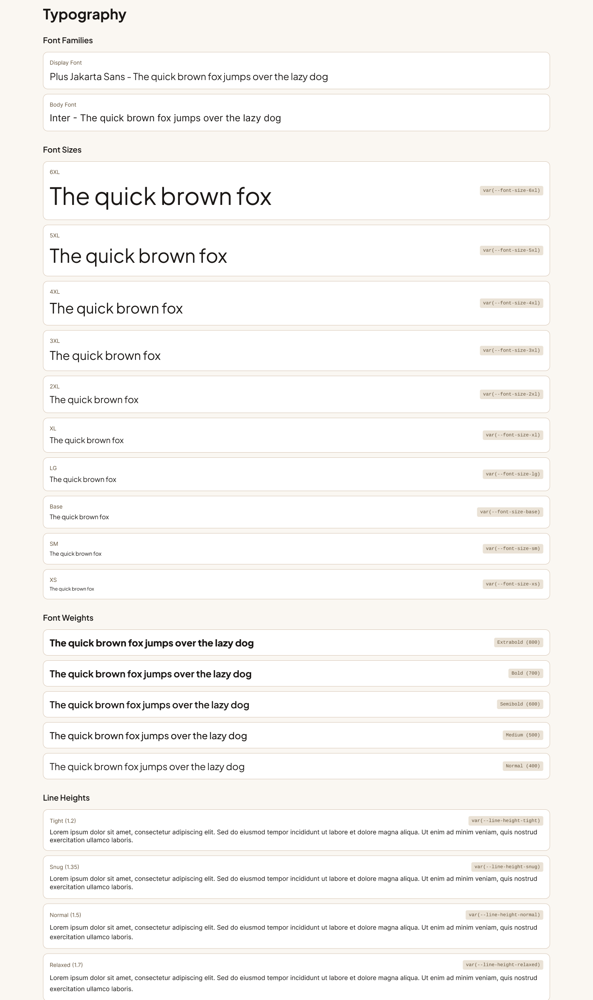
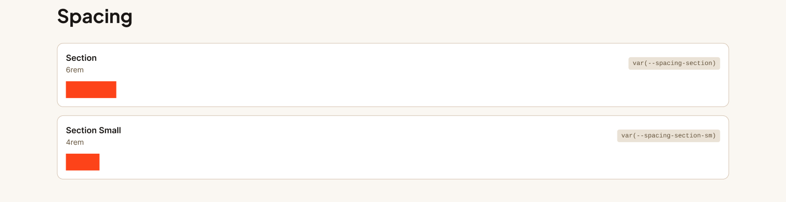
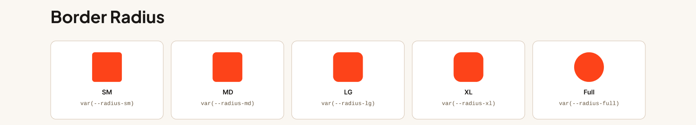
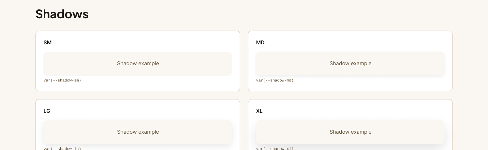
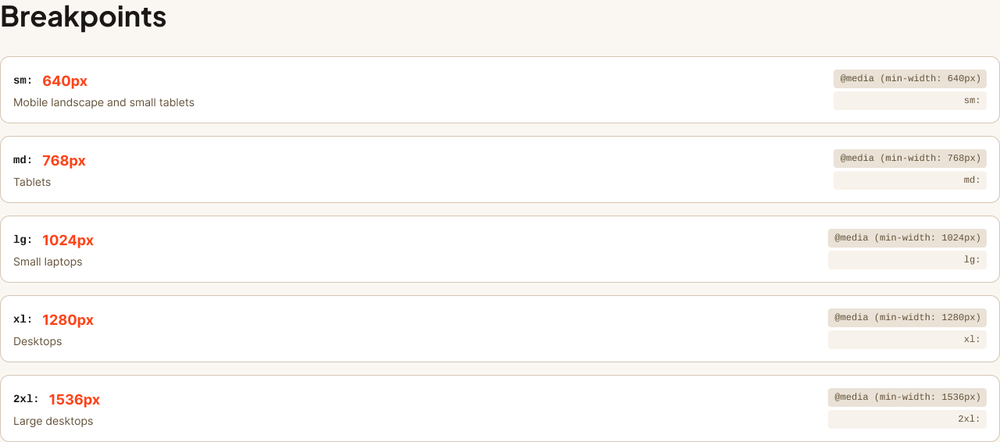
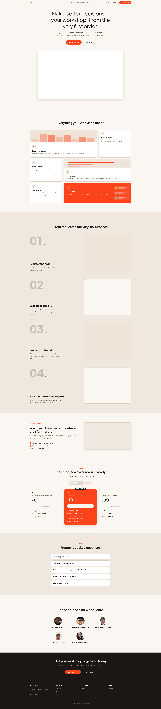

<div class="cover-page">
<div class="cover-top">

<div class="cover-university">Universidad Peruana de Ciencias Aplicadas</div>
<div class="cover-program">Ingeniería de Software</div>
<div class="cover-ciclo">Ciclo 2026-10</div>
<div class="cover-course">1ASI0730 – Aplicaciones Web</div>
<div class="cover-nrc">NRC: 10215</div>
<div class="cover-professor">Docente: Velasquez Nuñez, Angel Augusto</div>
</div>
<div class="cover-middle">
<div class="cover-document-type">Informe de Trabajo Final</div>
<hr class="cover-separator">
<div class="cover-product-name">Nombre del Producto</div>
<hr class="cover-separator">
</div>
<div class="cover-bottom">
<table class="cover-team">
<thead>
<tr><th>Integrante</th><th>Código</th></tr>
</thead>
<tbody>
<tr><td>Gonza Morales, Anderson</td><td>U202120836</td></tr>
<tr><td>Justo Yauricasa, Alexander Paolo</td><td>U20191C054</td></tr>
<tr><td>Saldaña De Souza, Juan David</td><td>U20221F192</td></tr>
<tr><td>Sulca Sanchez, Piero Angel</td><td>U202423711</td></tr>
<tr><td>Torres Sanchez, Dalila Victoria</td><td>U20221F734</td></tr>
</tbody>
</table>
<div class="cover-date">Abril 2026</div>
</div>
</div>

# Registro de Versiones del Informe

<table>
<thead>
<tr><th>Versión</th><th>Fecha</th><th>Autor</th><th>Descripción</th></tr>
</thead>
<tbody>
<tr><td>0.1.0</td><td>2026-04-07</td><td>Sulca Sanchez, Piero Angel</td><td>Creación del repositorio e incorporación de la estructura base del informe</td></tr>
<tr><td>0.2.0</td><td>2026-04-07</td><td>Sulca Sanchez, Piero Angel</td><td>Agregado de carátula, registro de versiones y configuración general del documento</td></tr>
<tr><td>0.3.0</td><td>2026-04-24</td><td>Gonza Morales, Anderson</td><td>Agregado del capitulo 1, capitulo 2</td></tr>
</tbody>
</table>


# Project Report Collaboration Insights

**URL del Repositorio:** [https://github.com/Developer-Core/project-report-repo](https://github.com/Developer-Core/project-report-repo)

# Contenido
<h1>Student Outcome</h1>

En el siguiente cuadro se describe las acciones realizadas y enunciados de conclusiones por parte del grupo, que permiten sustentar el haber alcanzado el logro del ABET -- EAC - Student Outcome 5.

<table>
  <colgroup>
    <col style="width: 25%">
    <col style="width: 43%">
    <col style="width: 32%">
  </colgroup>
  <thead>
    <tr>
      <th>Criterio específico</th>
      <th>Acciones realizadas</th>
      <th>Conclusiones</th>
    </tr>
  </thead>
  <tbody>
    <tr>
      <td rowspan="5"><strong>Trabaja en equipo para proporcionar liderazgo en forma conjunta</strong></td>
      <td><strong>Gonza Morales, Anderson</strong><br><b>AV1:</b> <em>Por definir.</em></td>
      <td rowspan="5"><b>AV1:</b> <em>Por definir.</em></td>
    </tr>
    <tr>
      <td><strong>Justo Yauricasa, Alexander Paolo</strong><br><b>AV1:</b> <em>Por definir.</em></td>
    </tr>
    <tr>
      <td><strong>Saldaña De Souza, Juan David</strong><br><b>AV1:</b> <em>Por definir.</em></td>
    </tr>
    <tr>
      <td><strong>Sulca Sanchez, Piero Angel</strong><br><b>AV1:</b> <em>Por definir.</em></td>
    </tr>
    <tr>
      <td><strong>Torres Sanchez, Dalila Victoria</strong><br><b>AV1:</b> <em>Por definir.</em></td>
    </tr>
    <tr>
      <td rowspan="5"><strong>Crea un entorno colaborativo e inclusivo, establece metas, planifica tareas y cumple objetivos</strong></td>
      <td><strong>Gonza Morales, Anderson</strong><br><b>AV1:</b> <em>Por definir.</em></td>
      <td rowspan="5"><b>AV1:</b> <em>Por definir.</em></td>
    </tr>
    <tr>
      <td><strong>Justo Yauricasa, Alexander Paolo</strong><br><b>AV1:</b> <em>Por definir.</em></td>
    </tr>
    <tr>
      <td><strong>Saldaña De Souza, Juan David</strong><br><b>AV1:</b> <em>Por definir.</em></td>
    </tr>
    <tr>
      <td><strong>Sulca Sanchez, Piero Angel</strong><br><b>AV1:</b> <em>Por definir.</em></td>
    </tr>
    <tr>
      <td><strong>Torres Sanchez, Dalila Victoria</strong><br><b>AV1:</b> <em>Por definir.</em></td>
    </tr>
  </tbody>
</table>

# Introducción

## Startup Profile

### Descripción de la Startup

WoodRoute es una plataforma web tipo SaaS dirigida a carpinteros independientes y pequeños talleres, que permite gestionar pedidos de muebles personalizados, realizar el seguimiento del proceso de fabricación y optimizar la planificación de la producción. La solución asiste al carpintero en la toma de decisiones, evaluando la viabilidad de construir un mueble en función del inventario disponible, la estimación de tiempos de trabajo y la capacidad del taller. Asimismo, la plataforma mejora la comunicación con los clientes al ofrecer un sistema de seguimiento en tiempo real del estado de los pedidos, brindando mayor transparencia y confianza durante todo el proceso.

### Perfiles de integrantes del equipo

<table>
  <tbody>
    <tr>
      <td class="member-photo"></td>
      <td><strong>Gonza Morales, Anderson -- U202120836</strong><br><br>Estudiante de sexto ciclo de la carrera de Ingenieria de Software. Destaca por su capacidad de liderazgo y organizacion en equipos de trabajo. Tiene habilidades en coordinacion de tareas, comunicacion efectiva, analisis de requerimientos y seguimiento de actividades orientadas a cumplir objetivos del proyecto.</td>
    </tr>
    <tr>
      <td class="member-photo"></td>
      <td><strong>Justo Yauricasa, Alexander Paolo -- U20191C054</strong><br><br>Estudio Ingeniería de Software y cuento con experiencia en desarrollo web dentro de equipos pequeños. Me interesa especialmente en Base de datos, en particular en diseño y arqueitectura de base de datos. Dentro del equipo, puedo contribuir en el levantamiento de requerimientos, el diseño de interfaces, así como en el diseño de bases de datos. Además, destaco por mi capacidad de organización y trabajo colaborativo.</td>
    </tr>
    <tr>
      <td class="member-photo"></td>
      <td><strong>Saldaña De Souza, Juan David -- U20221F192</strong><br><br><em>Descripción.</em></td>
    </tr>
    <tr>
      <td class="member-photo"></td>
      <td><strong>Sulca Sanchez, Piero Angel -- U202423711</strong><br><br>Curso la carrera de Ingeniería de Software y tengo experiencia en desarrollo web trabajando con equipos pequeños. Me apasiona el Front End, sobre todo cuando hay espacio para el diseño creativo: interfaces 3D, animaciones, productos que se ven y se sienten distintos. En el equipo puedo aportar en levantamiento de requerimientos, diseño de interfaces, desarrollo web con React y TypeScript, diseño de bases de datos. En el equipo aporto organización y colaboración.</td>
    </tr>
    <tr>
      <td class="member-photo"></td>
      <td><strong>Torres Sanchez, Dalila Victoria -- U20221F734</strong><br><br><em>Soy estudiante de Ingeniería de Software, he programado en C#, C++, PHP, Java y Python, además manejo de bases de datos relacionales. También he trabajado con Git y metodologías ágiles como Scrum, lo cual me ha ayudado a organizarme mejor y a trabajar en equipo con más fluidez. Me interesa mucho el desarrollo backend, porque me gusta entender la lógica detrás de las cosas, cómo se procesan los datos y cómo se asegura que todo funcione correctamente. También me gusta colaborar en el frontend, porque entiendo que un buen producto requiere que ambas partes trabajen en armonía. Disfruto ver cómo una idea se vuelve algo real, desde los primeros bocetos hasta la parte funcional donde las personas terminan usando. Actualmente, mi objetivo es seguir consolidando mis habilidades técnicas y blandas para desempeñarme con confianza en el entorno laboral. Me interesa participar en proyectos donde pueda aplicar lo que sé y aportar soluciones prácticas a problemas reales.</em></td>
    </tr>
  </tbody>
</table>

## Solution Profile

### Antecedentes y problemática

**What? (¿Qué?)**

**¿Cuál es el problema?**

El problema central es la falta de organización y planificación en carpinterías independientes y pequeños talleres al momento de gestionar pedidos de muebles personalizados. Actualmente, muchos carpinteros trabajan de manera empírica, basándose en su experiencia para calcular materiales, estimar tiempos y coordinar con los clientes. Esto genera errores frecuentes como falta de materiales durante la producción, retrasos en las entregas y una comunicación poco eficiente con el cliente, afectando tanto la productividad del taller como la satisfacción del usuario final.

**When? (¿Cuándo?)**

**¿Cuándo ocurre el problema?**

El problema ocurre de manera constante durante todo el proceso de fabricación del mueble, desde la etapa de diseño y planificación hasta la producción y entrega. Se intensifica especialmente cuando el carpintero maneja múltiples pedidos simultáneamente, ya que la falta de herramientas de organización dificulta la correcta estimación de tiempos y el control de materiales.

**Where? (¿Dónde?)**

**¿Dónde surge el problema?**

Surge principalmente en pequeños talleres de carpintería y negocios independientes, donde no se utilizan sistemas digitales especializados y la gestión se realiza mediante herramientas informales como cuadernos o aplicaciones de mensajería.

**¿A dónde se dirige?**

La solución se dirige a digitalizar y optimizar la gestión interna del taller, integrando en una sola plataforma la planificación, el control de inventario y el seguimiento de pedidos, permitiendo una mejor organización del proceso productivo.

**Who? (¿Quién?)**

**¿Quiénes están involucrados?**

- Carpinteros independientes y pequeños talleres.
- Clientes que solicitan muebles personalizados.

**¿Quién lo utilizará?**

Los carpinteros utilizarán la plataforma para registrar pedidos, calcular materiales, estimar tiempos y gestionar su inventario. Por otro lado, los clientes accederán a la plataforma para consultar el estado de sus pedidos y recibir actualizaciones del proceso de fabricación.

**Why? (¿Por qué?)**

**¿Cuál es la causa del problema?**

La causa principal es la ausencia de herramientas digitales adaptadas al rubro de la carpintería que integren planificación, inventario y gestión de pedidos. La mayoría de soluciones existentes son genéricas o complejas, lo que lleva a los carpinteros a depender de métodos manuales y de su experiencia, generando ineficiencias y errores en el proceso productivo.

**How? (¿Cómo?)**

**¿En qué condiciones los usuarios usarán nuestro producto?**

Los carpinteros utilizarán la plataforma en su día a día dentro del taller, especialmente en momentos clave como la planificación de un nuevo pedido, la verificación de materiales disponibles y la organización de tareas. Requerirán una interfaz simple y rápida que les permita tomar decisiones en pocos pasos. Los clientes utilizarán la plataforma de manera ocasional para consultar el estado de su mueble mediante un enlace accesible desde cualquier dispositivo.

**¿Cómo nos conocieron nuestros compradores?**

Los carpinteros conocerán la plataforma a través de recomendaciones, redes sociales, demostraciones del producto y marketing digital enfocado en mejorar la productividad de pequeños negocios.

**¿Cómo prefieren nuestros consumidores acceder a nuestro producto?**

Los carpinteros preferirán una aplicación web sencilla y accesible desde computadora o celular, mientras que los clientes preferirán acceder mediante un enlace directo sin necesidad de registro, para visualizar el progreso de su pedido de forma rápida..

**How much? (¿Cuánto?)**

Estadísticas que sustentan la problemática:

- Alta informalidad: En muchos países de Latinoamérica, una gran parte de los talleres de carpintería operan sin sistemas digitales de gestión.
- Baja digitalización: La mayoría de pequeños negocios aún utiliza métodos manuales para organizar pedidos e inventarios.
- Ineficiencia operativa: La falta de planificación genera retrasos, reprocesos y desperdicio de materiales.
- Impacto en clientes: Los retrasos y la falta de comunicación afectan la confianza y satisfacción del cliente.

Estas condiciones evidencian la necesidad de una solución tecnológica que permita optimizar la gestión del taller, mejorar la planificación y brindar mayor transparencia en el proceso de fabricación de muebles.

### Lean UX Process

El Lean UX Process es una metodología ágil centrada en la colaboración, la experimentación rápida y el aprendizaje validado. En este proyecto se utiliza este enfoque para comprender las necesidades de carpinteros y clientes, identificando sus principales problemas en la gestión, planificación y seguimiento de muebles. A través de hipótesis, prototipos y retroalimentación constante, se busca validar soluciones que optimicen la toma de decisiones dentro del taller y mejoren la experiencia del cliente.

#### Lean UX Problem Statements

**Problem Statement 1: El Carpintero / Taller**

Nuestro sistema busca facilitar a los carpinteros la planificación y gestión de pedidos de muebles personalizados. Hemos observado que muchos talleres trabajan de forma manual y basada en experiencia, lo que genera errores en el cálculo de materiales, estimaciones imprecisas de tiempo y desorganización en los pedidos.
**¿Cómo podemos ayudar a los carpinteros a planificar sus trabajos de forma más precisa y organizada, reduciendo errores y mejorando su productividad?**

**Problem Statement 2: El Cliente**

El producto tiene como objetivo mejorar la experiencia de los clientes que mandan a fabricar muebles. Actualmente, los clientes no tienen visibilidad del avance de sus pedidos y deben comunicarse constantemente con el carpintero para obtener información.
**¿Cómo podemos brindar a los clientes acceso claro y en tiempo real al estado de sus pedidos para mejorar la transparencia y confianza en el servicio?**

#### Lean UX Assumptions

**Business Assumptions**

1. Creo que mis clientes necesitan una herramienta que les ayude a organizar pedidos, materiales y tiempos de trabajo de manera simple.
2. Estas necesidades se pueden resolver con una aplicación web que integre gestión de pedidos, inventario y estimación de tiempos.
3. Mis clientes iniciales serán carpinteros independientes y pequeños talleres con baja digitalización.
4. El valor más importante que el cliente quiere es reducir errores, ahorrar tiempo y mejorar la organización del trabajo.
5. El cliente también puede obtener beneficios adicionales como mejorar la comunicación con sus clientes y proyectar una imagen más profesional.
6. Voy a adquirir usuarios a través de redes sociales, recomendaciones y demostraciones del producto.
7. Haré dinero mediante un modelo de suscripción (freemium con funciones avanzadas).
8. Mi competencia principal serán softwares de gestión genéricos y herramientas no especializadas en carpintería.
9. Los venceremos mediante especialización en el rubro y facilidad de uso.
10. Mi mayor riesgo es que los carpinteros no adopten la tecnología por costumbre o complejidad.
11. Resolveremos esto mediante una interfaz simple, intuitiva y enfocada en su flujo real de trabajo.

**User Assumptions**

**¿Quién es el usuario?**
Carpinteros independientes y pequeños talleres que gestionan pedidos personalizados, así como clientes que desean hacer seguimiento a sus muebles.

**¿Qué problemas tiene nuestro producto que resolver?**
Falta de organización, errores en cálculo de materiales, estimaciones inexactas de tiempo y mala comunicación con clientes.

**¿Qué características son importantes?**
Gestión de pedidos, cálculo de materiales, estimación de tiempos, control de inventario y seguimiento del estado del mueble.

**¿Dónde encaja nuestro producto en su trabajo o vida?**
Se integra en el proceso diario del taller, especialmente en la planificación, producción y entrega de pedidos.

**¿Cuándo y cómo nuestro producto es usado?**
Durante la recepción de pedidos, planificación de trabajos y seguimiento del proceso, mediante una plataforma web accesible desde cualquier dispositivo.

**¿Cómo debe verse nuestro producto y cómo comportarse?**
Debe ser simple, clara y fácil de usar, con una interfaz intuitiva que permita tomar decisiones rápidas sin complicaciones.


#### Lean UX Hypothesis Statements

- **Hypothesis 01:**
  Creemos que los carpinteros podrán planificar mejor sus trabajos si cuentan con una herramienta que calcule automáticamente materiales y valide la viabilidad del mueble.
  Sabremos que hemos tenido éxito cuando el 70% de los usuarios utilicen esta función al crear un pedido.

- **Hypothesis 02:**
  Creemos que los carpinteros reducirán retrasos si utilizan estimaciones de tiempo basadas en la capacidad del taller.
 Sabremos que hemos tenido éxito cuando los tiempos de entrega se cumplan en al menos un 80% de los pedidos.

- **Hypothesis 03:**
  Creemos que los clientes estarán más satisfechos si pueden ver el estado de su pedido en tiempo real.
  Sabremos que hemos tenido éxito cuando disminuyan las consultas repetitivas de clientes en al menos un 50%.

- **Hypothesis 04:**
  Creemos que los talleres mejorarán su organización si cuentan con un sistema de gestión de pedidos e inventario integrado.
  Sabremos que hemos tenido éxito cuando los usuarios gestionen todos sus pedidos dentro de la plataforma.

- **Hypothesis 05:**
  Creemos que los carpinteros adoptarán la plataforma si esta es simple y rápida de usar.
  Sabremos que hemos tenido éxito cuando al menos el 60% de los usuarios continúen usando la plataforma después del primer mes.

#### Lean UX Canvas

El Lean UX Canvas es una herramienta visual que permite alinear al equipo en torno a problemas, usuarios e hipótesis de manera ágil. En este proyecto se utilizó para comprender mejor a los restaurantes y albergues, identificar sus necesidades y definir cómo **Alimenta** puede generar valor real en su gestión diaria.

Aquí se presenta el Lean UX Canvas desarrollado para **Alimenta**:

**Figura 1. Lean UX Canvas de WoodRoute**

<div align="center">
  
</div>

**Enlace al Lean UX Canvas:** https://miro.com/welcomeonboard/ZVFaMVdKblhINnB5d1dnbWcxT2RLZ3ZjVFlQNWpsS2VKLzVQQ3dQMWUxS1pkY3hJbStyWENZNnc1cjIvd01lNkltV283MkVGRUM3MS94a1Q0dXp4U3QzclBsK0ZrZ24zQXZhRG14blV5YXdtMUlaMlV5alRXNTFMT21PL0tXbzJzVXVvMm53MW9OWFg5bkJoVXZxdFhRPT0hdjE=?share_link_id=533296594528
# Product Design

## Style Guidelines

### General Style Guidelines

#### Branding

La identidad visual de WoodRoute refleja los valores del producto: calidez, precisión y confianza.
Cada decisión de diseño está enraizada en el mundo del carpintero: la textura de la madera, la
calidez del material natural y la claridad de un proceso bien organizado.

El branding abarca la identidad completa de la marca: el logo, el sistema de colores, la tipografía,
el tono de comunicación y los principios que guían cómo el producto se ve, se siente y habla.
No es solo el logo, es la suma de todas las decisiones que hacen que WoodRoute sea reconocible
y coherente en cualquier punto de contacto con el usuario.

El logo combina un símbolo que evoca la veta de la madera con la idea de rutas o caminos,
representando el flujo de trabajo del taller. El wordmark utiliza la fuente de display del sistema
tipográfico en peso ExtraBold para transmitir solidez y presencia.


Los tres principios que guían todas las decisiones de diseño son:

**Calidez con contraste** — Los fondos y superficies usan tonos cálidos que evocan la madera
natural (beige, crema, marrón claro). El color primario de acción (`#FD4319`, naranja-rojo) rompe
intencionalmente esa calidez para señalizar con claridad qué debe hacer el usuario a continuación.
La tensión entre el fondo cálido y el CTA energético crea jerarquía visual sin necesidad de texto
adicional.

**Claridad funcional** — Los artesanos trabajan con las manos, no con pantallas. La interfaz elimina
el ruido visual y prioriza la información que importa: el estado del pedido, el inventario disponible,
la viabilidad del mueble.

**Confianza ganada** — WoodRoute no impone: acompaña. El diseño respeta el saber del carpintero.
No reemplaza su criterio, lo amplifica con datos.

#### Tono de comunicación

WoodRoute habla de carpintero a carpintero. No usa lenguaje corporativo ni tecnicismos innecesarios.
El tono está posicionado en cuatro dimensiones que definen la personalidad de la marca:

| Dimensión | Posición | Descripción |
|---|---|---|
| Divertido / Serio | 65% Serio | El producto resuelve problemas reales de negocio. El tono es directo y profesional, sin exceso de formalidad. |
| Formal / Casual | 60% Casual | Habla al carpintero como a un igual, sin jerarquía corporativa. Directo y accesible. |
| Respetuoso / Irreverente | 80% Respetuoso | Respeto profundo por el oficio. El carpintero es el experto; WoodRoute es su asistente. |
| Entusiasta / Sereno | 55% Sereno | Confianza tranquila. Los resultados hablan por sí solos, sin signos de exclamación vacíos. |

Las reglas de lenguaje derivadas de este posicionamiento son:

- Español neutro sin regionalismos ni voseo
- Imperativo universal: "Registra", "Selecciona", "Confirma"
- Mensajes de error directos y accionables: "Selecciona un material para continuar"
- Placeholders descriptivos: "¿Cuántos tablones necesitas?"
- Botones en infinitivo o imperativo neutro: "Crear pedido", "Ver inventario"
- Evitar exclamaciones vacías: "¡Genial!", "¡Listo!", "¡Perfecto!"

#### Sistema de colores

La paleta de WoodRoute combina dos decisiones visuales complementarias: fondos cálidos que
evocan la madera natural, y un color primario de acción fuerte y directo. Esta tensión entre
la calidez del fondo y la energía del primario crea jerarquía visual inmediata: el usuario sabe
exactamente dónde hacer clic.

Los tokens semánticos son el nivel de abstracción que conecta la paleta con los componentes.
La interfaz nunca referencia valores de color crudos: siempre usa tokens.


**Colores de marca:**

| Token | Hex | Uso |
|---|---|---|
| `--color-background` | `#FAF7F2` | Fondo de la página |
| `--color-foreground` | `#1A1715` | Texto principal |
| `--color-primary` | `#FD4319` | Acciones principales, CTAs |
| `--color-primary-hover` | `#E23415` | Estado hover del primario |
| `--color-primary-foreground` | `#FFFFFF` | Texto sobre color primario |
| `--color-brand-light` | `#F0E4D8` | Fondos de marca con énfasis |
| `--color-brand-subtle` | `#F8F2EC` | Fondos de marca sutiles |

**Colores de UI:**

| Token | Hex | Uso |
|---|---|---|
| `--color-card` | `#FFFFFF` | Fondo de cards y paneles |
| `--color-card-foreground` | `#1A1715` | Texto sobre cards |
| `--color-secondary` | `#F0E8DF` | Acciones secundarias |
| `--color-secondary-foreground` | `#443218` | Texto sobre secundario |
| `--color-muted` | `#EAE2D6` | Fondos neutrales |
| `--color-muted-foreground` | `#63523A` | Texto de soporte, placeholders |
| `--color-accent` | `#E6DDD1` | Destacados sutiles |
| `--color-accent-foreground` | `#443218` | Texto sobre accent |
| `--color-border` | `#D6C5B3` | Bordes y separadores |
| `--color-ring` | `#FD4319` | Outline de focus |

**Colores de estado:**

| Token | Hex | Uso |
|---|---|---|
| `--color-destructive` | `#C0392B` | Errores, acciones irreversibles |
| `--color-destructive-foreground` | `#FFFFFF` | Texto sobre destructive |

#### Tipografía

El sistema tipográfico usa dos fuentes complementarias:

**Plus Jakarta Sans** es la fuente de display para títulos y encabezados. Geométrica y moderna, con
personalidad definida sin perder legibilidad. Transmite innovación y solidez. Se aplica en todos los
elementos de heading (h1–h6) con `font-weight` semibold o superior.

**Inter** es la fuente de cuerpo para texto corrido, UI y datos. Optimizada para lectura en pantalla
a cualquier tamaño. Neutral y funcional, no compite con los títulos.



La escala tipográfica define tamaños, pesos e interlineado para cada nivel jerárquico:

| Token | Tamaño | Px | Uso típico |
|---|---|---|---|
| `--font-size-6xl` | 3.75rem | 60px | Hero principal de landing |
| `--font-size-5xl` | 3rem | 48px | H1 de sección |
| `--font-size-4xl` | 2.25rem | 36px | H2 de sección |
| `--font-size-3xl` | 1.875rem | 30px | H3 |
| `--font-size-2xl` | 1.5rem | 24px | H4, subtítulos destacados |
| `--font-size-xl` | 1.25rem | 20px | Lead text, taglines |
| `--font-size-lg` | 1.125rem | 18px | Body grande, texto de intro |
| `--font-size-base` | 1rem | 16px | Body estándar |
| `--font-size-sm` | 0.875rem | 14px | UI labels, captions |
| `--font-size-xs` | 0.75rem | 12px | Badges, metadatos |

Los pesos tipográficos disponibles y su uso son:

| Peso | Valor | Uso |
|---|---|---|
| ExtraBold | 800 | Logo wordmark, hero headlines |
| Bold | 700 | H1, H2, énfasis crítico |
| SemiBold | 600 | H3, H4, botones |
| Medium | 500 | Labels, navegación |
| Regular | 400 | Body, texto corrido |

El interlineado varía según el contexto de lectura:

| Token | Valor | Uso |
|---|---|---|
| `tight` (1.2) | 1.2 | Títulos grandes, donde el espacio vertical es limitado |
| `snug` (1.35) | 1.35 | Subtítulos, texto de UI compacto |
| `normal` (1.5) | 1.5 | Body estándar, párrafos de contenido |
| `relaxed` (1.7) | 1.7 | Texto de lectura larga, artículos |

#### Espaciado

El espaciado base sigue la escala de Tailwind (múltiplos de 4px). Adicionalmente, se definen
dos tokens de sección para controlar la separación vertical entre bloques de contenido en la interfaz:



| Token | Valor | Px | Uso |
|---|---|---|---|
| `--spacing-section` | 6rem | 96px | Separación entre secciones en desktop |
| `--spacing-section-sm` | 4rem | 64px | Separación entre secciones en mobile |

### Web Style Guidelines

#### Border radius



El sistema de radios define la personalidad de los componentes. WoodRoute usa radios moderados:
ni completamente cuadrado (frío, técnico) ni completamente redondo (demasiado informal). La
esquina redondeada evoca la madera trabajada y lijada.

| Token | Valor | Uso |
|---|---|---|
| `--radius-sm` | 0.375rem | Badges, chips, tooltips |
| `--radius-md` | 0.5rem | Inputs, botones pequeños |
| `--radius-lg` | 0.75rem | Cards, modales |
| `--radius-xl` | 1rem | Cards destacadas, paneles |
| `--radius-full` | 9999px | Avatares, toggles pill |

#### Sombras

Las sombras usan el color del foreground con opacidad controlada, manteniendo la temperatura
cálida del sistema. Definen la jerarquía de elevación de los elementos en el plano Z:



| Token | Elevación | Uso |
|---|---|---|
| `--shadow-sm` | 1px, 6% opacidad | Inputs en foco, separadores sutiles |
| `--shadow-md` | 4px, 8% opacidad | Cards, dropdowns |
| `--shadow-lg` | 8px, 10% opacidad | Modales, sidebars, popovers |
| `--shadow-xl` | 16px, 12% opacidad | Overlays, drawers, banners flotantes |

#### Diseño responsive

La interfaz sigue la estrategia mobile-first: los estilos base se definen para mobile y se
sobreescriben hacia arriba con media queries. Los breakpoints siguen la escala estándar de
Tailwind CSS:



| Breakpoint | Ancho mínimo | Contexto |
|---|---|---|
| `sm` | 640px | Smartphones grandes |
| `md` | 768px | Tablets en portrait |
| `lg` | 1024px | Tablets en landscape, laptops |
| `xl` | 1280px | Desktops |
| `2xl` | 1536px | Pantallas grandes |

Los patrones responsive principales que aplican a la landing y la web app son:

- **Grids**: colapsan de multi-columna a una sola columna por debajo de `md`
- **Navegación**: menú hamburguesa por debajo de `md`, barra horizontal desde `md`
- **Secciones**: `--spacing-section-sm` (4rem) en mobile, `--spacing-section` (6rem) en desktop
- **Tipografía**: escala reducida en mobile (H1 baja de `5xl` a `4xl`, hero de `6xl` a `5xl`)
- **Imágenes**: `max-width: 100%` en todos los elementos `img` y `svg` por defecto

## Information Architecture

Las decisiones de arquitectura de información de WoodRoute están orientadas a dos
experiencias distintas con objetivos complementarios: la landing page, enfocada en
convertir visitantes en usuarios, y la aplicación web, enfocada en que carpinteros
gestionen su taller con la menor fricción posible. En ambos casos, el principio rector
es que el usuario encuentre lo que necesita sin esfuerzo y sin necesidad de instrucción.

### Organization Systems

El contenido de WoodRoute se organiza según el contexto de uso de cada superficie.

**Landing Page — organización secuencial y jerárquica**

La landing page sigue una organización **secuencial** (step-by-step): el visitante
recorre una narrativa de problema → solución → beneficios → prueba social → acción.
Cada sección responde a una pregunta implícita del visitante antes de que la formule.
El orden no es arbitrario: primero se valida el dolor (el caos del taller), luego se
presenta la solución, luego se justifica la confianza. Esta progresión reduce la
resistencia a la conversión.

Dentro de cada sección, la organización es **jerárquica**: el mensaje principal ocupa
el nivel tipográfico más alto, los detalles de soporte están en niveles inferiores y las
acciones secundarias nunca compiten visualmente con el CTA primario.

**Aplicación web — organización por tópicos y por audiencia**

La aplicación organiza el contenido **por tópicos funcionales** que mapean directamente
al flujo de trabajo del carpintero:

| Módulo | Tópico | Audiencia |
|---|---|---|
| Pedidos | Gestión del ciclo de vida de un pedido | Carpintero |
| Inventario | Control de materiales y stock | Carpintero |
| Planificación | Viabilidad, tiempos y capacidad | Carpintero |
| Seguimiento | Estado de producción en tiempo real | Cliente final |

La organización **por audiencia** se aplica en el acceso: el carpintero entra con
credenciales propias y tiene acceso completo al sistema; el cliente accede mediante
un enlace compartido y ve únicamente la vista de seguimiento de su pedido, sin
necesidad de registro.

Dentro de los listados (pedidos, materiales), el contenido se organiza de forma
**cronológica inversa** por defecto: los elementos más recientes aparecen primero,
reflejando el flujo natural de trabajo donde el carpintero atiende los pedidos activos
antes que los históricos.

### Labeling Systems

Las etiquetas de WoodRoute siguen el principio de mínima carga cognitiva: una palabra
cuando es suficiente, dos cuando es necesario para evitar ambigüedad. Se usa el
vocabulario del carpintero, no el vocabulario técnico del software.

**Navegación principal de la aplicación:**

| Etiqueta | Concepto que representa |
|---|---|
| Pedidos | Listado y gestión de órdenes de fabricación |
| Inventario | Stock de materiales disponibles |
| Planificación | Asistente de viabilidad y estimación de tiempos |
| Clientes | Directorio de clientes y sus pedidos asociados |
| Configuración | Datos del taller, usuarios y preferencias |

**Estados de un pedido:**

| Etiqueta | Significado |
|---|---|
| Pendiente | Pedido recibido, aún no iniciado |
| En producción | Fabricación en curso |
| En revisión | Control de calidad antes de entrega |
| Listo | Pedido terminado, pendiente de entrega o retiro |
| Entregado | Proceso completado |

**Inventario:**

| Etiqueta | Significado |
|---|---|
| Disponible | Material con stock suficiente |
| Stock bajo | Material cerca del mínimo definido |
| Sin stock | Material agotado, bloquea nuevos pedidos |

**Landing page (secciones visibles en navegación):**

| Etiqueta | Contenido |
|---|---|
| Inicio | Hero y propuesta de valor |
| Funciones | Features del producto |
| Cómo funciona | Flujo paso a paso |
| Precios | Planes y comparativa |
| Preguntas frecuentes | FAQ |

### SEO Tags and Meta Tags

**Landing Page**

```html
<title>WoodRoute — Gestión de pedidos y taller para carpinteros</title>
<meta name="description"
  content="WoodRoute organiza tu taller de carpintería: gestiona pedidos,
  controla materiales y ofrece seguimiento en tiempo real a tus clientes.
  Empieza gratis." />
<meta name="keywords"
  content="gestión de taller, software para carpinteros, control de pedidos
  carpintería, inventario madera, seguimiento de pedidos, SaaS carpintería" />
<meta name="author" content="WoodRoute" />
<meta property="og:title" content="WoodRoute — Gestión de taller para carpinteros" />
<meta property="og:description"
  content="Organiza tus pedidos, controla tu inventario y mantén a tus clientes
  informados en tiempo real. Sin complicaciones." />
<meta property="og:type" content="website" />
```

**Aplicación web (página de login / acceso)**

```html
<title>Ingresar — WoodRoute</title>
<meta name="description"
  content="Accede a tu cuenta de WoodRoute para gestionar tu taller de carpintería." />
<meta name="robots" content="noindex, nofollow" />
<meta name="author" content="WoodRoute" />
```

**Vista de seguimiento pública (compartida con clientes)**

```html
<title>Seguimiento de pedido — WoodRoute</title>
<meta name="description"
  content="Consulta el estado de fabricación de tu mueble en tiempo real." />
<meta name="robots" content="noindex, nofollow" />
```

Las páginas internas de la aplicación (pedidos, inventario, planificación) usan
`noindex, nofollow` ya que son contenido privado detrás de autenticación. Solo la
landing page está indexada para motores de búsqueda.

### Searching Systems

WoodRoute ofrece búsqueda y filtrado en los módulos donde el volumen de información
puede desorientar al usuario. El sistema no expone un buscador global: cada módulo
tiene su propio mecanismo de búsqueda contextual.

**Módulo de Pedidos**

El usuario puede buscar por nombre de cliente, número de pedido o descripción del
mueble. Los resultados se muestran en tiempo real (búsqueda reactiva sin necesidad
de enviar el formulario). Los filtros disponibles son:

| Filtro | Opciones |
|---|---|
| Estado | Pendiente / En producción / En revisión / Listo / Entregado |
| Fecha de creación | Rango de fechas |
| Cliente | Selección desde directorio |

Los resultados muestran: nombre del cliente, descripción del mueble, estado actual
(con etiqueta de color) y fecha estimada de entrega.

**Módulo de Inventario**

El usuario puede buscar materiales por nombre o tipo. Los filtros disponibles son:

| Filtro | Opciones |
|---|---|
| Estado de stock | Disponible / Stock bajo / Sin stock |
| Tipo de material | Madera / Herrajes / Acabados / Otros |

Los resultados muestran: nombre del material, unidad de medida, cantidad disponible
y estado de stock (con etiqueta de color). Los materiales con stock bajo aparecen
destacados al inicio del listado sin necesidad de filtrar, como alerta proactiva.

**Módulo de Clientes**

Búsqueda por nombre o contacto. Sin filtros adicionales dado el volumen acotado
esperado en talleres pequeños. Los resultados muestran nombre, contacto y cantidad
de pedidos activos.

**Vista de seguimiento pública**

No requiere búsqueda: el cliente accede mediante un enlace único que lleva directamente
al estado de su pedido. No hay navegación ni descubrimiento de contenido en esta vista.

### Navigation Systems

**Landing Page**

La navegación de la landing sigue un modelo de **scroll lineal con anclas**: el menú
superior fija las secciones principales y permite saltar directamente a cualquier punto.
En mobile, el menú colapsa en un panel lateral (hamburguesa). El CTA principal
("Empieza gratis") está fijo en el navbar para que esté siempre accesible sin importar
la posición del scroll.

El flujo de navegación esperado es:

```
Navbar → Hero → Funciones → Cómo funciona → Precios → FAQ → CTA final
```

Los usuarios que llegan con intención directa (ej. desde un anuncio) aterrizan en el
hero y pueden ir directo al CTA. Los usuarios exploratorios recorren las secciones de
forma descendente. Ambos flujos convergen en el mismo punto de conversión.

**Aplicación web**

La aplicación usa una **navegación lateral persistente** (sidebar) en desktop y una
**barra inferior** en mobile, siguiendo convenciones establecidas de aplicaciones de
gestión que el usuario ya conoce.

El sidebar muestra los cinco módulos principales con íconos y etiquetas. El módulo
activo se indica con el color primario. Las acciones de creación (nuevo pedido, nuevo
material) están disponibles desde un botón prominente dentro de cada módulo, no
desde la navegación global.

La jerarquía de navegación es de dos niveles máximo:

```
Nivel 1 (sidebar): Pedidos / Inventario / Planificación / Clientes / Configuración
Nivel 2 (dentro del módulo): Listado → Detalle / Formulario de creación o edición
```

No existe un nivel 3. Si una acción requeriría un tercer nivel, se implementa como
modal o panel lateral (drawer) sobre el nivel 2 actual, manteniendo el contexto del
usuario visible.

**Vista de seguimiento pública**

Es una experiencia de una sola página sin navegación. El cliente ve el estado actual
del pedido, el historial de estados anteriores y los datos del mueble. No hay menú,
no hay links a otras secciones, no hay posibilidad de confundirse. El único punto de
salida opcional es un link al sitio de WoodRoute para que el cliente conozca el producto.

## Landing Page UI Design

### Landing Page Wireframe

### Landing Page Mock-up

El mock-up de la landing page de WoodRoute aplica el design system definido en la
sección anterior: tipografía Plus Jakarta Sans / Inter, paleta cálida con primario
naranja-rojo `#FD4319` y espaciado de sección de 6rem en desktop y 4rem en mobile.

La página está estructurada en ocho secciones en el siguiente orden:

1. **Hero** — propuesta de valor principal con CTA "Empieza gratis" y vista previa del dashboard
2. **Features** — grilla de beneficios clave del producto
3. **How it works** — flujo numerado de 4 pasos: registrar pedido → validar viabilidad → producir → cliente sigue el avance
4. **Social proof** — demostración de la vista de seguimiento para el cliente final
5. **Pricing** — tres planes (Free $0 / Pro $19 / Business $39) con comparativa
6. **FAQ** — preguntas frecuentes expandibles
7. **Team** — equipo detrás de WoodRoute
8. **Footer** — links, redes y legal

**Vista desktop**



**Vista mobile**


La versión mobile mantiene la misma jerarquía de contenido que desktop. Las grillas
de features colapsan a una columna, el navbar se convierte en menú hamburguesa y
el CTA de conversión permanece visible y accesible en todo momento. El espaciado
entre secciones se reduce de 6rem a 4rem mediante el token `--spacing-section-sm`.

