<article class="markdown-body">

<div align="center">


<br>

**Universidad Peruana de Ciencias Aplicadas**

**Carrera de Ingeniería de Software**

<br>

**1ASI0730**

**Aplicaciones Web**

<br>

**NRC**

**10215**

<br>

**Informe del Trabajo Final**

<br>

**Docente**

**Velásquez Núñez, Ángel Augusto**

<br>

**Proyecto**

**WoodRoute**

<br>

**Integrantes**

<table style="border-collapse: collapse; border: none; width: auto; max-width: 400px; margin: 0 auto;">
<thead>
<tr style="border: none;">
<th style="border: none; padding: 8px 20px 8px 0px; text-align: left; width: 50px;">Código</th>
<th style="border: none; padding: 8px 0px; text-align: left;">Apellidos y Nombres</th>
</tr>
</thead>
<tbody>
<tr style="border: none;"><td style="border: none; padding: 6px 20px 6px 0px; text-align: left;">U202120836</td><td style="border: none; padding: 6px 0px; text-align: left;">Gonza Morales, Anderson</td></tr>
<tr style="border: none;"><td style="border: none; padding: 6px 20px 6px 0px; text-align: left;">U20191C054</td><td style="border: none; padding: 6px 0px; text-align: left;">Justo Yauricasa, Alexander Paolo</td></tr>
<tr style="border: none;"><td style="border: none; padding: 6px 20px 6px 0px; text-align: left;">U20221F192</td><td style="border: none; padding: 6px 0px; text-align: left;">Saldaña De Souza, Juan David</td></tr>
<tr style="border: none;"><td style="border: none; padding: 6px 20px 6px 0px; text-align: left;">U202423711</td><td style="border: none; padding: 6px 0px; text-align: left;">Sulca Sanchez, Piero Angel</td></tr>
<tr style="border: none;"><td style="border: none; padding: 6px 20px 6px 0px; text-align: left;">U20221F734</td><td style="border: none; padding: 6px 0px; text-align: left;">Torres Sanchez, Dalila Victoria</td></tr>
</tbody>
</table>

<br>

**Período 202610**

**Mayo 2026**

</div>

<div style="page-break-after: always;"></div>

# Registro de Versiones del Informe

<table>
<thead>
<tr><th>Versión</th><th>Fecha</th><th>Autor</th><th>Descripción</th></tr>
</thead>
<tbody>
<tr><td>0.1.0</td><td>2026-04-07</td><td>Sulca Sanchez, Piero Angel</td><td>Creación del repositorio e incorporación de la estructura base del informe</td></tr>
<tr><td>0.2.0</td><td>2026-04-07</td><td>Sulca Sanchez, Piero Angel</td><td>Agregado de carátula, registro de versiones y configuración general del documento</td></tr>
<tr><td>0.3.0</td><td>2026-04-24</td><td>Gonza Morales, Anderson</td><td>Agregado del capítulo 1 y secciones iniciales del capítulo 2</td></tr>
<tr><td>0.4.0</td><td>2026-05-08</td><td>Justo Yauricasa, Alexander Paolo</td><td>Agregado de Big Picture EventStorming y Ubiquitous Language para completar el capítulo 2</td></tr>
<tr><td>0.5.0</td><td>2026-05-12</td><td>Sulca Sanchez, Piero Angel</td><td>Agregado del capítulo 3 (User Stories, Impact Mapping, Product Backlog) y secciones iniciales del capítulo 4 (Style Guidelines, Information Architecture y Landing Page UI Design)</td></tr>
<tr><td>0.6.0</td><td>2026-05-13</td><td>Sulca Sanchez, Piero Angel</td><td>Agregado de la arquitectura del capítulo 4 (Domain-Driven Software Architecture, Class Diagrams y Database Design)</td></tr>
<tr><td>0.7.0</td><td>2026-05-13</td><td>Sulca Sanchez, Piero Angel</td><td>Agregado del capítulo 5: Software Configuration Management (5.1) y Sprint 1 completo (5.2.1). Entrega AV1</td></tr>
<tr><td>0.8.0</td><td>2026-05-14</td><td>Sulca Sanchez, Piero Angel</td><td>Agregado del Sprint 2 (5.2.2): primera versión funcional del frontend con backend simulado (JSON Server) y despliegue en Vercel. Entrega TB1</td></tr>
<tr><td>0.9.0</td><td>2026-05-17</td><td>Gonza Morales, Anderson</td><td>Agregado del Sprint 3 (5.2.3): estructura base del backend en .NET 10 y entrevistas de validación</td></tr>
<tr><td>1.0.0</td><td>2026-07-07</td><td>Sulca Sanchez, Piero Angel</td><td>Agregado del Sprint 4 (5.2.4): backend real en .NET 10, integración de la aplicación web, despliegue en Render y Vercel, y alineación de los capítulos de diseño con el modelo de herramienta de taller. Entrega TF</td></tr>
</tbody>
</table>

<div style="page-break-after: always;"></div>


# Project Report Collaboration Insights

**URL del Repositorio:** [https://github.com/Developer-Core/project-report-repo](https://github.com/Developer-Core/project-report-repo)

<div style="page-break-after: always;"></div>

# Contenido

## Tabla de Contenidos

- [Registro de Versiones del Informe](#registro-de-versiones-del-informe)
- [Project Report Collaboration Insights](#project-report-collaboration-insights)
- [Student Outcome](#student-outcome)
- [Capítulo I: Introducción](#capítulo-i-introducción)
    - [1.1. Startup Profile](#11-startup-profile)
        - [1.1.1. Descripción de la Startup](#111-descripción-de-la-startup)
        - [1.1.2. Perfiles de integrantes del equipo](#112-perfiles-de-integrantes-del-equipo)
    - [1.2. Solution Profile](#12-solution-profile)
        - [1.2.1. Antecedentes y problemática](#121-antecedentes-y-problemática)
        - [1.2.2. Lean UX Process](#122-lean-ux-process)
            - [1.2.2.1. Lean UX Problem Statements](#1221-lean-ux-problem-statements)
            - [1.2.2.2. Lean UX Assumptions](#1222-lean-ux-assumptions)
            - [1.2.2.3. Lean UX Hypothesis Statements](#1223-lean-ux-hypothesis-statements)
            - [1.2.2.4. Lean UX Canvas](#1224-lean-ux-canvas)
    - [1.3. Segmentos objetivo](#13-segmentos-objetivo)
- [Capítulo II: Requirements Elicitation & Analysis](#capítulo-ii-requirements-elicitation--analysis)
    - [2.1. Competidores](#21-competidores)
        - [2.1.1. Análisis competitivo](#211-análisis-competitivo)
        - [2.1.2. Estrategias y tácticas frente a competidores](#212-estrategias-y-tácticas-frente-a-competidores)
    - [2.2. Entrevistas](#22-entrevistas)
        - [2.2.1. Diseño de entrevistas](#221-diseño-de-entrevistas)
        - [2.2.2. Registro de entrevistas](#222-registro-de-entrevistas)
        - [2.2.3. Análisis de entrevistas](#223-análisis-de-entrevistas)
    - [2.3. Needfinding](#23-needfinding)
        - [2.3.1. User Personas](#231-user-personas)
        - [2.3.2. User Task Matrix](#232-user-task-matrix)
        - [2.3.3. User Journey Mapping](#233-user-journey-mapping)
        - [2.3.4. Empathy Mapping](#234-empathy-mapping)
    - [2.4. Big Picture EventStorming](#24-big-picture-eventstorming)
    - [2.5. Ubiquitous Language](#25-ubiquitous-language)
- [Capítulo III: Requirements Specification](#capítulo-iii-requirements-specification)
    - [3.1. User Stories](#31-user-stories)
    - [3.2. Impact Mapping](#32-impact-mapping)
    - [3.3. Product Backlog](#33-product-backlog)
- [Capítulo IV: Product Design](#capítulo-iv-product-design)
    - [4.1. Style Guidelines](#41-style-guidelines)
        - [4.1.1. General Style Guidelines](#411-general-style-guidelines)
        - [4.1.2. Web Style Guidelines](#412-web-style-guidelines)
    - [4.2. Information Architecture](#42-information-architecture)
        - [4.2.1. Organization Systems](#421-organization-systems)
        - [4.2.2. Labeling Systems](#422-labeling-systems)
        - [4.2.3. SEO Tags and Meta Tags](#423-seo-tags-and-meta-tags)
        - [4.2.4. Searching Systems](#424-searching-systems)
        - [4.2.5. Navigation Systems](#425-navigation-systems)
    - [4.3. Landing Page UI Design](#43-landing-page-ui-design)
        - [4.3.1. Landing Page Wireframe](#431-landing-page-wireframe)
        - [4.3.2. Landing Page Mock-up](#432-landing-page-mock-up)
    - [4.4. Web Applications UX/UI Design](#44-web-applications-uxui-design)
        - [4.4.1. Web Applications Mock-up](#441-web-applications-mock-up)
    - [4.6. Domain-Driven Software Architecture](#46-domain-driven-software-architecture)
        - [4.6.1. Design Level Event Storming](#461-design-level-event-storming)
    - [4.7. Software Object-Oriented Design](#47-software-object-oriented-design)
        - [4.7.1. Class Diagrams](#471-class-diagrams)
    - [4.8. Database Design](#48-database-design)
        - [4.8.1. Database Diagrams](#481-database-diagrams)
- [Capítulo V: Product Implementation, Validation & Deployment](#capítulo-v-product-implementation-validation--deployment)
    - [5.1. Software Configuration Management](#51-software-configuration-management)
        - [5.1.1. Software Development Environment Configuration](#511-software-development-environment-configuration)
        - [5.1.2. Source Code Management](#512-source-code-management)
        - [5.1.3. Source Code Style Guide & Coding Conventions](#513-source-code-style-guide--coding-conventions)
        - [5.1.4. Software Deployment Configuration](#514-software-deployment-configuration)
    - [5.2. Landing Page, Services & Applications Implementation](#52-landing-page-services--applications-implementation)
        - [5.2.1. Sprint 1](#521-sprint-1)
            - [5.2.1.1. Sprint Planning 1](#5211-sprint-planning-1)
            - [5.2.1.2. Aspect Leaders and Collaborators](#5212-aspect-leaders-and-collaborators)
            - [5.2.1.3. Sprint Backlog 1](#5213-sprint-backlog-1)
            - [5.2.1.4. Development Evidence for Sprint Review](#5214-development-evidence-for-sprint-review)
            - [5.2.1.5. Execution Evidence for Sprint Review](#5215-execution-evidence-for-sprint-review)
            - [5.2.1.6. Services Documentation Evidence for Sprint Review](#5216-services-documentation-evidence-for-sprint-review)
            - [5.2.1.7. Software Deployment Evidence for Sprint Review](#5217-software-deployment-evidence-for-sprint-review)
            - [5.2.1.8. Team Collaboration Insights for Sprint Review](#5218-team-collaboration-insights-for-sprint-review)
        - [5.2.2. Sprint 2](#522-sprint-2)
            - [5.2.2.1. Sprint Planning 2](#5221-sprint-planning-2)
            - [5.2.2.2. Aspect Leaders and Collaborators](#5222-aspect-leaders-and-collaborators)
            - [5.2.2.3. Sprint Backlog 2](#5223-sprint-backlog-2)
            - [5.2.2.4. Development Evidence for Sprint Review](#5224-development-evidence-for-sprint-review)
            - [5.2.2.5. Execution Evidence for Sprint Review](#5225-execution-evidence-for-sprint-review)
            - [5.2.2.6. Services Documentation Evidence for Sprint Review](#5226-services-documentation-evidence-for-sprint-review)
            - [5.2.2.7. Software Deployment Evidence for Sprint Review](#5227-software-deployment-evidence-for-sprint-review)
            - [5.2.2.8. Team Collaboration Insights for Sprint Review](#5228-team-collaboration-insights-for-sprint-review)
        - [5.2.3. Sprint 3](#523-sprint-3)
            - [5.2.3.1. Sprint Planning 3](#5231-sprint-planning-3)
            - [5.2.3.2. Aspect Leaders and Collaborators](#5232-aspect-leaders-and-collaborators)
            - [5.2.3.3. Sprint Backlog 3](#5233-sprint-backlog-3)
            - [5.2.3.4. Development Evidence for Sprint Review](#5234-development-evidence-for-sprint-review)
            - [5.2.3.5. Execution Evidence for Sprint Review](#5235-execution-evidence-for-sprint-review)
            - [5.2.3.6. Services Documentation Evidence for Sprint Review](#5236-services-documentation-evidence-for-sprint-review)
            - [5.2.3.7. Software Deployment Evidence for Sprint Review](#5237-software-deployment-evidence-for-sprint-review)
            - [5.2.3.8. Team Collaboration Insights for Sprint Review](#5238-team-collaboration-insights-for-sprint-review)
        - [5.2.4. Sprint 4](#524-sprint-4)
            - [5.2.4.1. Sprint Planning 4](#5241-sprint-planning-4)
            - [5.2.4.2. Aspect Leaders and Collaborators](#5242-aspect-leaders-and-collaborators)
            - [5.2.4.3. Sprint Backlog 4](#5243-sprint-backlog-4)
            - [5.2.4.4. Development Evidence for Sprint Review](#5244-development-evidence-for-sprint-review)
            - [5.2.4.5. Execution Evidence for Sprint Review](#5245-execution-evidence-for-sprint-review)
            - [5.2.4.6. Services Documentation Evidence for Sprint Review](#5246-services-documentation-evidence-for-sprint-review)
            - [5.2.4.7. Software Deployment Evidence for Sprint Review](#5247-software-deployment-evidence-for-sprint-review)
            - [5.2.4.8. Team Collaboration Insights for Sprint Review](#5248-team-collaboration-insights-for-sprint-review)
    - [5.3. Validation Interviews](#53-validation-interviews)
    - [5.4. About the Team](#54-about-the-team)
    - [5.5. Video About-the-Product](#55-video-about-the-product)
- [Conclusiones](#conclusiones)
- [Bibliografía](#bibliografía)

<div style="page-break-after: always;"></div>

# Student Outcome

En el siguiente cuadro se describe las acciones realizadas y enunciados de conclusiones por parte del grupo, que permiten sustentar el haber alcanzado el logro del ABET -- EAC - Student Outcome 5.

<table>
  <colgroup>
    <col style="width: 25%">
    <col style="width: 43%">
    <col style="width: 32%">
  </colgroup>
  <thead>
    <tr>
      <th>Criterio específico</th>
      <th>Acciones realizadas</th>
      <th>Conclusiones</th>
    </tr>
  </thead>
  <tbody>
    <tr>
      <td rowspan="5"><strong>Trabaja en equipo para proporcionar liderazgo en forma conjunta</strong></td>
      <td><strong>Gonza Morales, Anderson</strong><br><b>AV1:</b> Trabajó en los diagramas C4 de Contexto y Contenedor de la arquitectura del sistema. Participó en las entrevistas a usuarios durante el needfinding.<br><br><b>TB1:</b> Revisó los diagramas de arquitectura del capítulo 4 y participó en las reuniones del sprint.<br><br><b>TF:</b> Como líder de Documentación, consolidó la documentación del Sprint 4 y organizó la evidencia del sprint (ejecución, servicios, despliegue e insights).</td>
      <td rowspan="5"><b>AV1:</b> El equipo aplicó un modelo de liderazgo distribuido con Aspect Leaders, asignando responsabilidades por área (Landing Page, UX/UI y Documentación). La coordinación se mantuvo con reuniones de Sprint Planning, Daily Scrum y Sprint Review.<br><br><b>TB1:</b> El equipo consolidó el liderazgo conjunto integrando todo el trabajo en un mismo repositorio bajo GitFlow, con Pull Requests revisados y trazabilidad entre Product Backlog y Sprint Backlog.<br><br><b>TF:</b> El equipo sostuvo el liderazgo conjunto durante la implementación del backend y su integración, gestionando el trabajo bajo GitFlow con ramas release versionadas y despliegue continuo del sistema completo en la nube.</td>
    </tr>
    <tr>
      <td><strong>Justo Yauricasa, Alexander Paolo</strong><br><b>AV1:</b> Trabajó en el Big Picture EventStorming y en el Ubiquitous Language del capítulo 2. Como líder de Documentación, revisó el estilo del informe.<br><br><b>TB1:</b> Revisó la redacción del capítulo 5 para mantener la consistencia con los capítulos anteriores.</td>
    </tr>
    <tr>
      <td><strong>Saldaña De Souza, Juan David</strong><br><b>AV1:</b> Colaboró en el Impact Mapping y en el Ubiquitous Language, ayudando a definir objetivos y términos del dominio.<br><br><b>TB1:</b> Validó el Product Backlog actualizado y revisó los Story Points asignados al Sprint 2.<br><br><b>TF:</b> Apoyó en la configuración del acceso a datos del backend y en la revisión del modelo de datos durante la integración.</td>
    </tr>
    <tr>
      <td><strong>Sulca Sanchez, Piero Angel</strong><br><b>AV1:</b> Lideró la implementación de la landing page y el setup del repositorio. Coordinó al equipo bajo GitFlow y documentó los capítulos 3, 4 y 5 del informe.<br><br><b>TB1:</b> Documentó todo el capítulo 5 del informe: Software Configuration Management (5.1) y el Sprint 1 completo (5.2.1). Configuró el despliegue automático en Vercel y alineó los IDs del Sprint Backlog con el Product Backlog.<br><br><b>TF:</b> Lideró la implementación del backend real en .NET 10 con arquitectura DDD/CQRS, la integración de la aplicación web con el API y el despliegue del sistema completo en Render y Vercel.</td>
    </tr>
    <tr>
      <td><strong>Torres Sanchez, Dalila Victoria</strong><br><b>AV1:</b> Colaboró en la documentación del Sprint Planning del Sprint 1 y acompañó al equipo en las reuniones del sprint.</td>
      <br><b>TB1:</b> Revisó la documentación del capítulo 5 y participó en reuniones del sprint.</td>
    </tr>
    <tr>
      <td rowspan="5"><strong>Crea un entorno colaborativo e inclusivo, establece metas, planifica tareas y cumple objetivos</strong></td>
      <td><strong>Gonza Morales, Anderson</strong><br><b>AV1:</b> Participó en la planificación del Sprint 1 y completó las tareas de arquitectura y de entrevistas dentro de los plazos del sprint.<br><br><b>TB1:</b> Participó en la planificación del Sprint 2 y cumplió con las tareas asignadas durante el sprint.<br><br><b>TF:</b> Participó en la planificación del Sprint 4 y documentó la evidencia del sprint dentro de los plazos.</td>
      <td rowspan="5"><b>AV1:</b> El equipo armó un entorno colaborativo con Trello, Miro, Figma y GitHub. El Sprint Goal se definió en formato SMART y cada miembro asumió tareas concretas del Sprint Backlog.<br><br><b>TB1:</b> El equipo formalizó el uso de Conventional Commits, Semantic Versioning y GitFlow en el informe. Las metas del sprint se concretaron en un Sprint Goal medible y los entregables quedaron versionados y publicados en una URL pública.<br><br><b>TF:</b> El equipo cerró los objetivos del producto completo — backend, integración y despliegue — versionados con Semantic Versioning y publicados en las URLs públicas del backend y de la aplicación web.</td>
    </tr>
    <tr>
      <td><strong>Justo Yauricasa, Alexander Paolo</strong><br><b>AV1:</b> Participó en las ceremonias de Scrum del Sprint 1 (Planning, Review y Retrospective) y entregó la documentación a su cargo.<br><br><b>TB1:</b> Revisó la documentación del capítulo 5 y aportó en el seguimiento de los criterios de aceptación de las User Stories.</td>
    </tr>
    <tr>
      <td><strong>Saldaña De Souza, Juan David</strong><br><b>AV1:</b> Apoyó en la priorización del Product Backlog y en la definición de las User Stories del Sprint 1. Completó las tareas asignadas en el Impact Mapping y el Ubiquitous Language.<br><br><b>TB1:</b> Colaboró en la actualización del Product Backlog para el Sprint 2 y cumplió con los compromisos del Sprint Planning.<br><br><b>TF:</b> Participó en la planificación del Sprint 4 y validó la integración de los servicios del backend con la aplicación web.</td>
    </tr>
    <tr>
      <td><strong>Sulca Sanchez, Piero Angel</strong><br><b>AV1:</b> Definió el Sprint Goal del Sprint 1 en formato SMART y asignó las tareas del Sprint Backlog. Gestionó el repositorio con GitFlow, Conventional Commits y Semantic Versioning.<br><br><b>TB1:</b> Documentó las convenciones de Source Code Management, Coding Conventions y Deployment Configuration. Configuró el despliegue continuo en Vercel y dejó la trazabilidad completa entre Product Backlog y Sprint Backlog.<br><br><b>TF:</b> Definió el Sprint Goal del Sprint 4 y cumplió los objetivos de backend, integración y despliegue en producción, dejando el producto publicado en URLs públicas.</td>
    </tr>
    <tr>
      <td><strong>Torres Sanchez, Dalila Victoria</strong><br><b>AV1:</b> Aportó en la documentación del Sprint Planning del Sprint 1 y acompañó al equipo en las reuniones del sprint.</td>
      <br><b>TB1:</b> Aportó en el desarrollo del frontend</td>
    </tr>
  </tbody>
</table>

<div style="page-break-after: always;"></div>

# Capítulo I: Introducción

## 1.1. Startup Profile

### 1.1.1. Descripción de la Startup

WoodRoute es una plataforma web tipo SaaS dirigida a carpinteros independientes y pequeños talleres, que permite gestionar pedidos de muebles personalizados, realizar el seguimiento del proceso de fabricación y optimizar la planificación de la producción. La solución asiste al carpintero en la toma de decisiones, evaluando la viabilidad de construir un mueble en función del inventario disponible, la estimación de tiempos de trabajo y la capacidad del taller. Asimismo, la plataforma mejora la comunicación con los clientes al ofrecer un sistema de seguimiento en tiempo real del estado de los pedidos, brindando mayor transparencia y confianza durante todo el proceso.

### 1.1.2. Perfiles de integrantes del equipo

<table>
  <tbody>
    <tr>
      <td class="member-photo"></td>
      <td><strong>Gonza Morales, Anderson -- U202120836</strong><br><br>Estudiante de sexto ciclo de la carrera de Ingenieria de Software. Destaca por su capacidad de liderazgo y organizacion en equipos de trabajo. Tiene habilidades en coordinacion de tareas, comunicacion efectiva, analisis de requerimientos y seguimiento de actividades orientadas a cumplir objetivos del proyecto.</td>
    </tr>
    <tr>
      <td class="member-photo"></td>
      <td><strong>Justo Yauricasa, Alexander Paolo -- U20191C054</strong><br><br>Estudio Ingeniería de Software y cuento con experiencia en desarrollo web dentro de equipos pequeños. Me interesa especialmente en Base de datos, en particular en diseño y arqueitectura de base de datos. Dentro del equipo, puedo contribuir en el levantamiento de requerimientos, el diseño de interfaces, así como en el diseño de bases de datos. Además, destaco por mi capacidad de organización y trabajo colaborativo.</td>
    </tr>
    <tr>
      <td class="member-photo"></td>
      <td><strong>Saldaña De Souza, Juan David -- U20221F192</strong><br><br>Mi nombre es Juan David, tengo 20 años y estoy cursando la carrera de Ingeniería de Software en la UPC. Me considero una persona dedicada y analítica en los proyectos que requieren un enfoque técnico sólido. Tengo habilidades enfocadas en la resolución de problemas y el desarrollo eficiente, apoyando siempre a mi equipo para lograr un software de calidad. Mis conocimientos se centran en Java, C++ y Python, acompañados de frameworks y herramientas para desarrollo web como Astro.js y Svelte. De la misma forma, manejo SQL Server, MongoDB, redes y algoritmos de complejidad. Algunos de mis hobbies son los videojuegos y la tecnología.</td>
    </tr>
    <tr>
      <td class="member-photo"></td>
      <td><strong>Sulca Sanchez, Piero Angel -- U202423711</strong><br><br>Curso la carrera de Ingeniería de Software y tengo experiencia en desarrollo web trabajando con equipos pequeños. Me apasiona el Front End, sobre todo cuando hay espacio para el diseño creativo: interfaces 3D, animaciones, productos que se ven y se sienten distintos. En el equipo puedo aportar en levantamiento de requerimientos, diseño de interfaces, desarrollo web con React y TypeScript, diseño de bases de datos. En el equipo aporto organización y colaboración.</td>
    </tr>
    <tr>
      <td class="member-photo"></td>
      <td><strong>Torres Sanchez, Dalila Victoria -- U20221F734</strong><br><br>Soy estudiante de Ingeniería de Software, he programado en C#, C++, PHP, Java y Python, además manejo de bases de datos relacionales. También he trabajado con Git y metodologías ágiles como Scrum, lo cual me ha ayudado a organizarme mejor y a trabajar en equipo con más fluidez. Me interesa mucho el desarrollo backend, porque me gusta entender la lógica detrás de las cosas, cómo se procesan los datos y cómo se asegura que todo funcione correctamente. También me gusta colaborar en el frontend, porque entiendo que un buen producto requiere que ambas partes trabajen en armonía. Disfruto ver cómo una idea se vuelve algo real, desde los primeros bocetos hasta la parte funcional donde las personas terminan usando. Actualmente, mi objetivo es seguir consolidando mis habilidades técnicas y blandas para desempeñarme con confianza en el entorno laboral. Me interesa participar en proyectos donde pueda aplicar lo que sé y aportar soluciones prácticas a problemas reales.</td>
    </tr>
  </tbody>
</table>

<div style="page-break-after: always;"></div>

## 1.2. Solution Profile

### 1.2.1. Antecedentes y problemática

**What? (¿Qué?)**

**¿Cuál es el problema?**

El problema central es la falta de organización y planificación en carpinterías independientes y pequeños talleres al momento de gestionar pedidos de muebles personalizados. Actualmente, muchos carpinteros trabajan de manera empírica, basándose en su experiencia para calcular materiales, estimar tiempos y coordinar con los clientes. Esto genera errores frecuentes como falta de materiales durante la producción, retrasos en las entregas y una comunicación poco eficiente con el cliente, afectando tanto la productividad del taller como la satisfacción del usuario final.

**When? (¿Cuándo?)**

**¿Cuándo ocurre el problema?**

El problema ocurre de manera constante durante todo el proceso de fabricación del mueble, desde la etapa de diseño y planificación hasta la producción y entrega. Se intensifica especialmente cuando el carpintero maneja múltiples pedidos simultáneamente, ya que la falta de herramientas de organización dificulta la correcta estimación de tiempos y el control de materiales.

**Where? (¿Dónde?)**

**¿Dónde surge el problema?**

Surge principalmente en pequeños talleres de carpintería y negocios independientes, donde no se utilizan sistemas digitales especializados y la gestión se realiza mediante herramientas informales como cuadernos o aplicaciones de mensajería.

**¿A dónde se dirige?**

La solución se dirige a digitalizar y optimizar la gestión interna del taller, integrando en una sola plataforma la planificación, el control de inventario y el seguimiento de pedidos, permitiendo una mejor organización del proceso productivo.

**Who? (¿Quién?)**

**¿Quiénes están involucrados?**

- Carpinteros independientes y pequeños talleres.
- Clientes que solicitan muebles personalizados.

**¿Quién lo utilizará?**

Los carpinteros, el único rol que inicia sesión en el taller, utilizarán la plataforma para registrar pedidos, calcular materiales, estimar tiempos y gestionar su inventario. Un pedido puede originarse de dos formas: el carpintero lo crea eligiendo a un cliente de su registro (el CRM del taller) o, de manera opcional, un cliente con cuenta lo crea por su cuenta y este queda en una bandeja común del taller para que cualquier carpintero lo acepte. Por otro lado, los clientes consultan el estado de sus pedidos y reciben actualizaciones del proceso de fabricación principalmente mediante un enlace de seguimiento público, sin necesidad de iniciar sesión.

**Why? (¿Por qué?)**

**¿Cuál es la causa del problema?**

La causa principal es la ausencia de herramientas digitales adaptadas al rubro de la carpintería que integren planificación, inventario y gestión de pedidos. La mayoría de soluciones existentes son genéricas o complejas, lo que lleva a los carpinteros a depender de métodos manuales y de su experiencia, generando ineficiencias y errores en el proceso productivo.

**How? (¿Cómo?)**

**¿En qué condiciones los usuarios usarán nuestro producto?**

Los carpinteros utilizarán la plataforma en su día a día dentro del taller, especialmente en momentos clave como la planificación de un nuevo pedido, la verificación de materiales disponibles y la organización de tareas. Requerirán una interfaz simple y rápida que les permita tomar decisiones en pocos pasos. Los clientes utilizarán la plataforma de manera ocasional para consultar el estado de su mueble mediante un enlace accesible desde cualquier dispositivo.

**¿Cómo nos conocieron nuestros compradores?**

Los carpinteros conocerán la plataforma a través de recomendaciones, redes sociales, demostraciones del producto y marketing digital enfocado en mejorar la productividad de pequeños negocios.

**¿Cómo prefieren nuestros consumidores acceder a nuestro producto?**

Los carpinteros preferirán una aplicación web sencilla y accesible desde computadora o celular, mientras que los clientes preferirán acceder mediante un enlace directo sin necesidad de registro, para visualizar el progreso de su pedido de forma rápida..

**How much? (¿Cuánto?)**

Estadísticas que sustentan la problemática:

- Las MYPE representan el 99.7% de las empresas peruanas y emplean al 45.2% de la PEA, lo que demuestra que el problema afecta a un sector empresarial de gran alcance en el país ([ComexPerú, 2025](#ref-comexperu-mype-2025)).
- En 2024, las MYPE registraron ventas por S/ 154,380 millones, equivalentes al 14.2% del PBI, por lo que sus limitaciones de gestión tienen impacto económico relevante ([ComexPerú, 2025](#ref-comexperu-mype-2025)).
- El 86.8% de las MYPE opera en la informalidad, medida por la ausencia de RUC, lo que limita su acceso a registros formales, financiamiento y herramientas de gestión empresarial ([ComexPerú, 2025](#ref-comexperu-mype-2025)).
- El 76.5% de las MYPE no lleva ningún registro de cuentas, mientras que solo el 3.7% cuenta con libros contables o un sistema completo de contabilidad, evidenciando una baja capacidad de control financiero y operativo ([ComexPerú, 2025](#ref-comexperu-mype-2025)).
- Aunque el 78% de las micro y pequeñas empresas usó herramientas digitales, esto no implica necesariamente el uso de software especializado para pedidos, inventarios o producción ([eBIZ, 2022](#ref-ebiz-mypes-2022)).
- Entre las MYPE en línea, el 55% usó WhatsApp para comunicarse con clientes y el 48% con proveedores, lo que muestra una dependencia de canales de comunicación no estructurados para actividades empresariales ([eBIZ, 2022](#ref-ebiz-mypes-2022)).

Estas condiciones evidencian la necesidad de una solución tecnológica que permita optimizar la gestión del taller, mejorar la planificación y brindar mayor transparencia en el proceso de fabricación de muebles.

### 1.2.2. Lean UX Process

El Lean UX Process es una metodología ágil centrada en la colaboración, la experimentación rápida y el aprendizaje validado. En este proyecto se utiliza este enfoque para comprender las necesidades de carpinteros y clientes, identificando sus principales problemas en la gestión, planificación y seguimiento de muebles. A través de hipótesis, prototipos y retroalimentación constante, se busca validar soluciones que optimicen la toma de decisiones dentro del taller y mejoren la experiencia del cliente.

#### 1.2.2.1. Lean UX Problem Statements

**Problem Statement 1: El Carpintero / Taller**

- **Domain:** Gestión operativa de talleres de carpintería dedicados a la fabricación de muebles personalizados bajo pedido.
- **Customer Segments:** Carpinteros independientes y pequeños talleres con baja digitalización, ubicados principalmente en zonas urbanas de Lima Metropolitana.
- **Pain Points:** Cálculo manual y propenso a errores de materiales, estimaciones imprecisas de tiempos de entrega, desorganización en la recepción de pedidos, control de inventario empírico y comunicación reactiva con los clientes a través de WhatsApp.
- **Gap:** Las herramientas existentes son genéricas (ERPs grandes u hojas de cálculo) y no se adaptan al flujo de trabajo ni al lenguaje del rubro de la carpintería. Las MYPE rechazan adoptarlas por su complejidad y costo.
- **Vision / Strategy:** Ofrecer una plataforma web especializada que integre gestión de pedidos, asistente de viabilidad, estimación de tiempos y control simple de inventario, priorizando una experiencia minimalista alineada con el flujo real del taller.
- **Initial Segment:** Talleres independientes urbanos en Lima Metropolitana, de 1 a 5 trabajadores, con uso activo de smartphone y disposición a probar herramientas digitales.

**¿Cómo podemos ayudar a los carpinteros independientes y pequeños talleres a planificar sus pedidos de forma más precisa y organizada, reduciendo errores en el cálculo de materiales y mejorando el cumplimiento de tiempos, sin agregar complejidad a su jornada de trabajo?**

**Problem Statement 2: El Cliente**

- **Domain:** Experiencia del cliente final que solicita la fabricación de muebles a medida a un taller independiente.
- **Customer Segments:** Personas adultas (25 a 55 años) de NSE B y C que solicitan muebles personalizados para el hogar, oficinas o negocios.
- **Pain Points:** Ausencia de visibilidad sobre el avance del pedido, dependencia de mensajes informales por WhatsApp o llamadas, incertidumbre sobre fechas reales de entrega y poca confianza en el proceso.
- **Gap:** No existe un canal estandarizado que permita al cliente consultar el estado de su mueble sin tener que interrumpir al carpintero, ni evidencia clara de las etapas de producción.
- **Vision / Strategy:** Brindar al cliente acceso vía enlace, sin requerir registro, para consultar en tiempo real el estado de su pedido, fechas estimadas y notificaciones automáticas de cambios de etapa.
- **Initial Segment:** Clientes urbanos de Lima Metropolitana que ya solicitan muebles a talleres independientes y utilizan WhatsApp como canal habitual de seguimiento.

**¿Cómo podemos brindar a los clientes acceso claro y en tiempo real al estado de sus pedidos para mejorar la transparencia, reducir las consultas repetitivas al carpintero y aumentar la confianza en el servicio?**

#### 1.2.2.2. Lean UX Assumptions

**Business Assumptions**

1. Creo que mis clientes necesitan una herramienta que les ayude a organizar pedidos, materiales y tiempos de trabajo de manera simple.
2. Estas necesidades se pueden resolver con una aplicación web que integre gestión de pedidos, inventario y estimación de tiempos.
3. Mis clientes iniciales serán carpinteros independientes y pequeños talleres con baja digitalización.
4. El valor más importante que el cliente quiere es reducir errores, ahorrar tiempo y mejorar la organización del trabajo.
5. El cliente también puede obtener beneficios adicionales como mejorar la comunicación con sus clientes y proyectar una imagen más profesional.
6. Voy a adquirir usuarios a través de redes sociales, recomendaciones y demostraciones del producto.
7. Haré dinero mediante un modelo de suscripción (freemium con funciones avanzadas).
8. Mi competencia principal serán softwares de gestión genéricos y herramientas no especializadas en carpintería.
9. Los venceremos mediante especialización en el rubro y facilidad de uso.
10. Mi mayor riesgo es que los carpinteros no adopten la tecnología por costumbre o complejidad.
11. Resolveremos esto mediante una interfaz simple, intuitiva y enfocada en su flujo real de trabajo.

**User Assumptions**

**¿Quién es el usuario?**
Carpinteros independientes y pequeños talleres que gestionan pedidos personalizados, así como clientes que desean hacer seguimiento a sus muebles.

**¿Qué problemas tiene nuestro producto que resolver?**
Falta de organización, errores en cálculo de materiales, estimaciones inexactas de tiempo y mala comunicación con clientes.

**¿Qué características son importantes?**
Gestión de pedidos, cálculo de materiales, estimación de tiempos, control de inventario y seguimiento del estado del mueble.

**¿Dónde encaja nuestro producto en su trabajo o vida?**
Se integra en el proceso diario del taller, especialmente en la planificación, producción y entrega de pedidos.

**¿Cuándo y cómo nuestro producto es usado?**
Durante la recepción de pedidos, planificación de trabajos y seguimiento del proceso, mediante una plataforma web accesible desde cualquier dispositivo.

**¿Cómo debe verse nuestro producto y cómo comportarse?**
Debe ser simple, clara y fácil de usar, con una interfaz intuitiva que permita tomar decisiones rápidas sin complicaciones.


#### 1.2.2.3. Lean UX Hypothesis Statements

- **Hypothesis 01:**
  Creemos que los carpinteros podrán planificar mejor sus trabajos si cuentan con una herramienta que calcule automáticamente materiales y valide la viabilidad del mueble.
  Sabremos que hemos tenido éxito cuando el 70% de los usuarios utilicen esta función al crear un pedido.

- **Hypothesis 02:**
  Creemos que los carpinteros reducirán retrasos si utilizan estimaciones de tiempo basadas en la capacidad del taller.
 Sabremos que hemos tenido éxito cuando los tiempos de entrega se cumplan en al menos un 80% de los pedidos.

- **Hypothesis 03:**
  Creemos que los clientes estarán más satisfechos si pueden ver el estado de su pedido en tiempo real.
  Sabremos que hemos tenido éxito cuando disminuyan las consultas repetitivas de clientes en al menos un 50%.

- **Hypothesis 04:**
  Creemos que los talleres mejorarán su organización si cuentan con un sistema de gestión de pedidos e inventario integrado.
  Sabremos que hemos tenido éxito cuando los usuarios gestionen todos sus pedidos dentro de la plataforma.

- **Hypothesis 05:**
  Creemos que los carpinteros adoptarán la plataforma si esta es simple y rápida de usar.
  Sabremos que hemos tenido éxito cuando al menos el 60% de los usuarios continúen usando la plataforma después del primer mes.

#### 1.2.2.4. Lean UX Canvas

El Lean UX Canvas es una herramienta visual que permite alinear al equipo en torno a problemas, usuarios e hipótesis de manera ágil. En este proyecto se utilizó para comprender mejor a los carpinteros independientes, pequeños talleres y a los clientes que solicitan muebles personalizados, identificar sus principales pain points y definir cómo **WoodRoute** puede generar valor real en la gestión diaria del taller y en la experiencia del cliente.

Aquí se presenta el Lean UX Canvas desarrollado para **WoodRoute**:

**Figura 1. Lean UX Canvas de WoodRoute**

<div align="center">
  
</div>

**Enlace al Lean UX Canvas:** https://miro.com/app/board/uXjVHUJnMJM=/?share_link_id=898353122563


## 1.3. Segmentos objetivo

En el análisis del segmento objetivo para WoodRoute, se identifican dos grupos principales de usuarios: **los carpinteros o talleres**, encargados de fabricar y gestionar los pedidos de muebles, y **los clientes**, quienes solicitan muebles personalizados y necesitan conocer el avance del proceso.

**Carpinteros: talleres y trabajadores independientes**

Este segmento está compuesto por carpinteros independientes, maestros de taller, ayudantes y pequeños negocios familiares dedicados a la fabricación de muebles personalizados bajo pedido. Forman parte del ecosistema de micro y pequeñas empresas del país, el cual representa una parte significativa de la actividad empresarial peruana.

- **Perfil:** Carpinteros independientes, maestros de taller y pequeños negocios dedicados a la fabricación de muebles a medida. En 2024, las MYPE representaron el 99.7% de las empresas peruanas y emplearon al 45.2% de la PEA, lo que evidencia la importancia de este tipo de negocios dentro del mercado nacional ([ComexPerú, 2025](#ref-comexperu-mype-2025)).
- **Tamaño del mercado:** En 2024, el Perú cerró con 2,346,592 empresas formales, de las cuales 2,326,126 fueron MYPE, equivalentes al 99.1% del total formal. Dentro de estas, el sector manufactura representó el 8.5%, donde se ubican actividades productivas como la fabricación de muebles ([PRODUCE, 2025](#ref-produce-empresas-2025)).
- **Ubicación geográfica:** El mercado objetivo se concentra principalmente en zonas urbanas con presencia de talleres y actividad comercial. A nivel formal, el 43.8% de las MYPE se concentra en Lima, equivalente a 1,018,308 empresas, lo que justifica enfocar inicialmente la solución en Lima Metropolitana ([PRODUCE, 2025](#ref-produce-empresas-2025)).
- **Uso de tecnología:** El acceso a smartphones es alto en el país: en 2023, el 92.8% de los hogares peruanos contaba con al menos un smartphone. Esto permite plantear una solución digital accesible para talleres pequeños que ya usan el celular como herramienta de trabajo ([OSIPTEL, 2024](#ref-osiptel-erestel-2024)).
- **Necesidad clave:** Organizar pedidos, calcular materiales, controlar avances de producción, estimar tiempos de entrega y mejorar la comunicación con los clientes.

**Clientes: usuarios que solicitan muebles personalizados**

Este segmento está compuesto por personas que requieren muebles a medida para hogares, oficinas o negocios, y que necesitan mayor claridad sobre tiempos, costos y avance del pedido.

- **Perfil:** Adultos que solicitan muebles personalizados y buscan una alternativa distinta a los muebles estándar. Este perfil se relaciona con usuarios urbanos familiarizados con el uso de internet, redes sociales y comunicación digital.
- **Edad y uso digital:** El público adulto joven y adulto presenta alta familiaridad con internet. En el primer trimestre de 2024, el 91.4% de la población de 25 a 40 años accedió a internet, lo que respalda el uso de una plataforma digital para consultar pedidos, avances y entregas ([INEI, 2024a](#ref-inei-internet-trim1-2024)).
- **Nivel socioeconómico:** Puede orientarse principalmente a usuarios de NSE B y C, ya que son segmentos con capacidad de compra para productos personalizados de mediana inversión. Esta clasificación debe tomarse como criterio de segmentación comercial, usando como referencia los reportes de niveles socioeconómicos de APEIM, elaborados a partir de la ENAHO ([APEIM, 2024](#ref-apeim-nse-2024)).
- **Uso de tecnología:** En 2024, el 80.2% de la población peruana de 6 años a más usó internet en el tercer trimestre, y en el primer trimestre del mismo año el 91.3% de quienes usaban internet accedía mediante celular. Esto respalda que los clientes puedan consultar información del pedido desde una plataforma web ([INEI, 2024b](#ref-inei-internet-trim3-2024)).
- **Necesidad clave:** Conocer el estado del pedido, recibir información clara sobre fechas de entrega, reducir la incertidumbre y tener mayor confianza durante el proceso de fabricación.

<div style="page-break-after: always;"></div>

# Capítulo II: Requirements Elicitation & Analysis

## 2.1. Competidores

### 2.1.1. Análisis competitivo

En esta sección evaluamos los competidores de nuestro nicho.

<table>
  <thead>
    <tr>
      <th colspan="7"><b>Competitive Analysis Landscape</b></th>
    </tr>
  </thead>
  <tbody>
    <tr>
      <td colspan="2" align="center">¿Por qué llevar a cabo este análisis?</td>
      <td colspan="5" align="center">El objetivo de este análisis es identificar las brechas en la gestión y planificación de trabajos en carpinterías, evaluar cómo operan las soluciones actuales y posicionar a WoodRoute como una plataforma que optimiza la toma de decisiones, el uso de materiales y la comunicación con clientes.</td>
    </tr>
    <tr>
      <td colspan="2" rowspan="2" valign="top">Startup y Competidores</td>
      <td align="center"><b>Nuestra Startup: WoodRoute</b></td>
      <td align="center">Cleri</td>
      <td align="center">Craftybase</td>
      <td align="center">Buildertrend</td>
    </tr>
    <tr>
      <td valign="top" align="center"></td>
      <td valign="top" align="center"></td>
      <td valign="top" align="center"></td>
      <td valign="top" align="center"></td>
    </tr>
    <tr>
      <td rowspan="2">Perfil</td>
      <td>Overview</td>
      <td>Plataforma web SaaS para carpinterías que permite gestionar pedidos, hacer seguimiento del proceso de fabricación y asistir en la planificación del mueble, validando materiales, tiempos y viabilidad según el inventario y capacidad del taller.</td>
      <td>Software especializado en carpintería que ayuda a gestionar proyectos, clientes, materiales y presupuestos dentro del taller.</td>
      <td>Plataforma enfocada en control de inventario y costos de producción para negocios que fabrican productos físicos.</td>
      <td>Software de gestión de proyectos para construcción que permite planificar trabajos, coordinar equipos y comunicarse con clientes.</td>
    </tr>
    <tr>
      <td>Ventaja competitiva ¿Qué valor ofrece a los clientes?</td>
      <td>Asistencia en la toma de decisiones: calcula viabilidad de muebles, estima tiempos según capacidad del taller e integra inventario con producción y seguimiento al cliente.</td>
      <td>Enfoque específico en carpintería con herramientas de gestión de proyectos y clientes.</td>
      <td>Control detallado de inventario y costos de materiales.</td>
      <td>Gestión avanzada de proyectos y comunicación profesional con clientes.</td>
    </tr>
    <tr>
      <td rowspan="2">Perfil de Marketing</td>
      <td>Mercado objetivo</td>
      <td>Carpinteros independientes y pequeños talleres que necesitan organizar su trabajo y mejorar la comunicación con clientes.</td>
      <td>Carpinterías que buscan digitalizar la gestión de sus proyectos.</td>
      <td>Pequeños fabricantes y negocios de productos físicos.</td>
      <td>Empresas de construcción, contratistas y remodeladores.</td>
    </tr>
    <tr>
      <td>Estrategias de marketing</td>
      <td>Modelo freemium, enfoque en simplicidad y solución a problemas reales del carpintero (tiempo, materiales y organización).</td>
      <td>Marketing enfocado en productividad y gestión profesional del taller.</td>
      <td>Enfoque en control financiero y eficiencia de producción.</td>
      <td>Marketing empresarial orientado a gestión de proyectos grandes.</td>
    </tr>
    <tr>
      <td rowspan="3">Perfil de Producto</td>
      <td>Productos & Servicios</td>
      <td>Gestión de pedidos, seguimiento en tiempo real, asistente de viabilidad de muebles, estimación de tiempos, control de inventario y monitoreo IoT.</td>
      <td>Gestión de proyectos, presupuestos, clientes e inventario.</td>
      <td>Gestión de inventario, costos, producción y reportes.</td>
      <td>Gestión de proyectos, cronogramas, comunicación con clientes y seguimiento de obras.</td>
    </tr>
    <tr>
      <td>Precios & Costos</td>
      <td>Modelo freemium con suscripción mensual para funciones avanzadas como estimación inteligente, reportes e integración IoT.</td>
      <td>Suscripción mensual basada en funcionalidades de gestión.</td>
      <td>Suscripción mensual según uso y funcionalidades.</td>
      <td>Suscripción premium orientada a empresas.</td>
    </tr>
    <tr>
      <td>Canales de distribución (Web y/o Móvil)</td>
      <td>Aplicación web con posible extensión móvil para clientes (seguimiento).</td>
      <td>Plataforma web.</td>
      <td>Plataforma web.</td>
      <td>Web y aplicación móvil.</td>
    </tr>
    <tr>
      <td rowspan="4">Análisis SWOT</td>
      <td>Fortalezas</td>
      <td>Enfoque específico en carpintería, integración de planificación + inventario + seguimiento, facilidad de uso.</td>
      <td>Especialización en el rubro de carpintería.</td>
      <td>Fuerte control de inventario y costos.</td>
      <td>Gestión profesional de proyectos complejos.</td>
    </tr>
    <tr>
      <td>Debilidades</td>
      <td>Startup nueva, sin posicionamiento en el mercado.</td>
      <td>No integra estimación inteligente ni validación de viabilidad.</td>
      <td>No está especializado en carpintería.</td>
      <td>Demasiado complejo para pequeños talleres.</td>
    </tr>
    <tr>
      <td>Oportunidades</td>
      <td>Digitalización de talleres pequeños y necesidad de optimización en producción.</td>
      <td>Expansión a más mercados de carpintería.</td>
      <td>Integración con más industrias productivas.</td>
      <td>Expansión en el sector construcción.</td>
    </tr>
    <tr>
      <td>Amenazas</td>
      <td>Competidores más grandes que integren funciones similares.</td>
      <td>Nuevas plataformas más completas.</td>
      <td>Herramientas más especializadas por industria.</td>
      <td>Soluciones más simples para pequeños negocios.</td>
    </tr>

  </tbody>
</table>

### 2.1.2. Estrategias y tácticas frente a competidores

**Estrategias:**

- Diferenciación mediante especialización en carpinterías y talleres pequeños.
- Enfoque en apoyo a la toma de decisiones (viabilidad, tiempos y materiales), no solo gestión.
- Ofrecer una solución integral: pedidos + inventario + planificación + seguimiento al cliente.
- Priorizar simplicidad y facilidad de uso para usuarios no técnicos.
- Implementar modelo SaaS freemium para facilitar adopción inicial.

**Tácticas:**

- Desarrollar un asistente que calcule automáticamente materiales y valide la viabilidad del mueble.
- Incorporar estimación de tiempos basada en capacidad del taller (número de trabajadores y carga).
- Crear un sistema de seguimiento con estados visibles para el cliente mediante enlace.
- Integrar control de inventario con alertas de stock bajo.
- Implementar notificaciones automáticas para reducir consultas repetitivas de clientes.
- Ofrecer funcionalidades avanzadas (reportes, IoT, multiusuario) en planes de pago.


## 2.2. Entrevistas

### 2.2.1. Diseño de entrevistas

**Segmento 1: Carpintero/Taller**

- ¿Cómo gestionas actualmente tus pedidos de muebles?
- ¿Qué pasos sigues desde que recibes un pedido hasta la entrega?
- ¿Usas alguna herramienta (cuaderno, Excel, WhatsApp)? ¿Cuál?
- ¿Cómo decides si puedes hacer un mueble con los materiales que tienes?
- ¿Cómo calculas la cantidad de material que vas a necesitar?
- ¿Te ha pasado que te falta material durante un trabajo? ¿Qué ocurrió?
- ¿Cómo estimas cuánto tiempo te tomará hacer un mueble?
- ¿Sueles retrasarte en las entregas? ¿Por qué razones?
- ¿Trabajas solo o con un equipo? ¿Cómo organizan el trabajo?
- ¿Cómo controlas tu inventario de madera o materiales?
- ¿Cómo informas a tus clientes sobre el avance de sus pedidos?
- ¿Te sería útil una app que calcule materiales, estime tiempos y te diga si un mueble es viable? ¿Por qué?

**Segmento 2: Cliente**

- ¿Has mandado a hacer un mueble alguna vez? ¿Cómo fue tu experiencia?
- ¿Qué fue lo más difícil o incómodo durante el proceso?
- ¿El carpintero cumplió con el tiempo de entrega?
- ¿Tuviste que preguntar varias veces por el estado del mueble?
- ¿Cómo te informaban el avance del trabajo?
- ¿Te hubiera gustado ver el progreso sin tener que preguntar?
- ¿Qué te haría confiar más en un carpintero?
- ¿Te gustaría ver fotos o estados del proceso de fabricación?
- ¿Te serviría tener un link donde puedas ver el estado de tu pedido?
- ¿Pagarías un poco más por un servicio con mejor seguimiento y comunicación?

### 2.2.2. Registro de entrevistas

#### Segmento 1: Carpintero/Taller

**Entrevista 1**

**Entrevistador:** Anderson Gonza Morales

**Entrevistado:** Victor Garcia

**Link de la entrevista:** <a href="https://upcedupe-my.sharepoint.com/:v:/g/personal/u202120836_upc_edu_pe/IQBIxTsDiMoMQ7UmxqokSxBtAbzjckIXgF8fW8kP5-aSU14?nav=eyJyZWZlcnJhbEluZm8iOnsicmVmZXJyYWxBcHAiOiJPbmVEcml2ZUZvckJ1c2luZXNzIiwicmVmZXJyYWxBcHBQbGF0Zm9ybSI6IldlYiIsInJlZmVycmFsTW9kZSI6InZpZXciLCJyZWZlcnJhbFZpZXciOiJNeUZpbGVzTGlua0NvcHkifX0&e=LRldwg">https://upcedupe-my.sharepoint.com/:v:/g/personal/u202120836_upc_edu_pe/IQBIxTsDiMoMQ7UmxqokSxBtAbzjckIXgF8fW8kP5-aSU14?nav=eyJyZWZlcnJhbEluZm8iOnsicmVmZXJyYWxBcHAiOiJPbmVEcml2ZUZvckJ1c2luZXNzIiwicmVmZXJyYWxBcHBQbGF0Zm9ybSI6IldlYiIsInJlZmVycmFsTW9kZSI6InZpZXciLCJyZWZlcnJhbFZpZXciOiJNeUZpbGVzTGlua0NvcHkifX0&e=LRldwg</a>

<div align="center">
  
</div>

**Resumen de la entrevista:** 
La entrevista realizada a un maestro de carpintería independiente evidencia que la gestión de pedidos se realiza principalmente mediante WhatsApp y anotaciones manuales en un cuaderno. Él calcula la cantidad de material y el tiempo que tomará hacer el mueble basándose en su experiencia de años en el rubro. También menciona que a veces se le escapa y compra una pieza de más o de menos de material. Además, la comunicación con el cliente se hace mediante fotos por WhatsApp. El entrevistado considera que sí le sería útil una herramienta que le ayude a hacer todo lo mencionado anteriormente.

**Entrevista 2**

**Entrevistador:** Anderson Gonza Morales

**Entrevistado:** Marco

**Link de la entrevista:** <a href="https://upcedupe-my.sharepoint.com/:v:/g/personal/u202120836_upc_edu_pe/IQA-72r7kw1ETKLhkTOknwcFAfMyGR4WulQY5KCh3gmHGxo?nav=eyJyZWZlcnJhbEluZm8iOnsicmVmZXJyYWxBcHAiOiJPbmVEcml2ZUZvckJ1c2luZXNzIiwicmVmZXJyYWxBcHBQbGF0Zm9ybSI6IldlYiIsInJlZmVycmFsTW9kZSI6InZpZXciLCJyZWZlcnJhbFZpZXciOiJNeUZpbGVzTGlua0NvcHkifX0&e=lJhikH">https://upcedupe-my.sharepoint.com/:v:/g/personal/u202120836_upc_edu_pe/IQA-72r7kw1ETKLhkTOknwcFAfMyGR4WulQY5KCh3gmHGxo?nav=eyJyZWZlcnJhbEluZm8iOnsicmVmZXJyYWxBcHAiOiJPbmVEcml2ZUZvckJ1c2luZXNzIiwicmVmZXJyYWxBcHBQbGF0Zm9ybSI6IldlYiIsInJlZmVycmFsTW9kZSI6InZpZXciLCJyZWZlcnJhbFZpZXciOiJNeUZpbGVzTGlua0NvcHkifX0&e=lJhikH</a>

<div align="center">
  
</div>

**Resumen de la entrevista:** 
La entrevista realizada a un ayudante de carpintería evidenció que la gestión de pedidos se realiza principalmente mediante WhatsApp y anotaciones manuales, sin el uso de herramientas digitales especializadas. Las decisiones sobre materiales y tiempos se basan en la experiencia del maestro. Menciona que algunas veces hay retrasos por falta de material al hacer un mal cálculo y problemas como falta de stock durante la producción. Además, la comunicación con los clientes que solicitan actualizaciones se hace mediante fotos por WhatsApp. En este contexto, el entrevistado considero que una aplicación que apoye en la planificación, cálculo de materiales y estimación de tiempos sería de gran utilidad para mejorar la organización y eficiencia del trabajo.

**Entrevista 3**

**Entrevistador:** Anderson Gonza Morales

**Entrevistado:** Ronaldo

**Link de la entrevista:** <a href="https://upcedupe-my.sharepoint.com/:v:/g/personal/u202120836_upc_edu_pe/IQChpwCTvVG-TJqmM0qE2yvnAWHSrGpBMxOBJK0kUSS8z88?nav=eyJyZWZlcnJhbEluZm8iOnsicmVmZXJyYWxBcHAiOiJPbmVEcml2ZUZvckJ1c2luZXNzIiwicmVmZXJyYWxBcHBQbGF0Zm9ybSI6IldlYiIsInJlZmVycmFsTW9kZSI6InZpZXciLCJyZWZlcnJhbFZpZXciOiJNeUZpbGVzTGlua0NvcHkifX0&e=g0kCLa">https://upcedupe-my.sharepoint.com/:v:/g/personal/u202120836_upc_edu_pe/IQChpwCTvVG-TJqmM0qE2yvnAWHSrGpBMxOBJK0kUSS8z88?nav=eyJyZWZlcnJhbEluZm8iOnsicmVmZXJyYWxBcHAiOiJPbmVEcml2ZUZvckJ1c2luZXNzIiwicmVmZXJyYWxBcHBQbGF0Zm9ybSI6IldlYiIsInJlZmVycmFsTW9kZSI6InZpZXciLCJyZWZlcnJhbFZpZXciOiJNeUZpbGVzTGlua0NvcHkifX0&e=g0kCLa</a>

<div align="center">
  
</div>

**Resumen de la entrevista:**
La entrevista a un joven carpintero que trabaja junto a su padre evidenció que la gestión de pedidos se realiza principalmente mediante WhatsApp y registros manuales, sin herramientas digitales especializadas. Las decisiones sobre materiales y tiempos se basan en la experiencia del maestro, lo que en ocasiones genera errores como falta de material y retrasos en la entrega. Además, el control de inventario es visual y poco preciso, y la comunicación con los clientes es mayormente reactiva. El entrevistado considera que una aplicación que permita calcular materiales, estimar tiempos y validar la viabilidad de los muebles sería de gran utilidad para mejorar la organización y eficiencia del taller.

#### Segmento 2: Cliente

**Entrevista 1**

**Entrevistador:** Juan David Saldaña De Souza

**Entrevistado:** Eduardo Rojas

**Edad:** 20 años

**Link de la entrevista:** <https://drive.google.com/file/d/14ETbpC-OaXpmp6Nne9q4cWdRk1JviVvI/view?usp=sharing>

<div align="center">
  
</div>

**Resumen de la entrevista:** 

Eduardo Alonso, estudiante residente del distrito de Magdalena, indicó haber tenido una experiencia "regular" al mandar a fabricar un escritorio. Mencionó que enfrentó problemas de comunicación, percibió un trato poco amable por parte del carpintero y experimentó retrasos en la entrega final. Además, señaló que la selección adecuada de materiales y asegurar que el resultado reflejara su idea inicial fueron los aspectos más complicados del proceso. Para generar confianza, el entrevistado requiere respuestas rápidas y evidencia visual del avance, por lo que consideró sumamente útil la implementación de un enlace de seguimiento automático y afirmó estar dispuesto a pagar un monto adicional por un servicio premium que mejore la comunicación y el monitoreo de su pedido.


**Entrevista 2**

**Entrevistador:** Juan David Saldaña De Souza

**Entrevistado:** Joseph Rodriguez

**Edad:** 21 años

**Link de la entrevista:** <https://drive.google.com/file/d/1yprqlqczeSu0gGd91PL32-cKOIW98TKg/view?usp=sharing>

<div align="center">
  
</div>

**Resumen de la entrevista:** 

Joseph Rodriguez, estudiante de Ingeniería de Software de 21 años, relató ser un consumidor recurrente de muebles a medida debido a la distribución inusual de su hogar, describiendo el proceso general como grato pero lento. Identificó como sus principales dificultades el lograr transmitir la idea exacta del diseño con las medidas precisas al fabricante y tener que lidiar con pequeños retrasos recurrentes en las entregas. Asimismo, el entrevistado expresó que solicitar actualizaciones constantemente por WhatsApp le resulta tedioso y monótono, por lo que valoraría contar con un enlace que detalle la fase exacta de fabricación de su pedido. Finalmente, indicó que pagaría un costo extra por este seguimiento detallado, pero condicionó este pago a que la empresa ya cuente con una sólida reputación, reseñas comprobables y un portafolio de trabajos previos.

**Entrevista 3** 

**Entrevistador:**  Alexander Paolo Justo Yauricasa

**Entrevistado:** Renzo Carlos Baldeon Galindo

**Link de la entrevista:** <https://drive.google.com/file/d/19W5K1V3g7HjvXkpX5zqU805OR1HmuKla/view?usp=sharing>

<div align="center">
  
</div>

**Resumen de la entrevista:**

En la tercera entrevista, el cliente Renzo Baldeón comenta que, durante la elaboración de su ropero, tuvo varios inconvenientes que afectaron su experiencia. Señala que los tiempos de respuesta fueron lentos, lo que generó demoras en la entrega, además de una comunicación deficiente con el proveedor a lo largo del proceso. Esta falta de información le causó incertidumbre sobre el estado de su pedido. Asimismo, menciona que le gustaría contar con una forma de visualizar el avance de sus encargos y tener un contacto más directo con el carpintero para resolver dudas o coordinar detalles. Finalmente, indica que estaría dispuesto a pagar un poco más por una aplicación que le permita solucionar estos problemas y mejorar la experiencia del servicio.


### 2.2.3. Análisis de entrevistas

A partir de las entrevistas realizadas a clientes y carpinteros, se identificaron diversos problemas recurrentes en el proceso de fabricación de muebles personalizados. En primer lugar, se evidenció una deficiente comunicación entre ambas partes, ya que los clientes deben recurrir constantemente a mensajes por WhatsApp para solicitar actualizaciones sobre el estado de sus pedidos. Esta comunicación suele ser reactiva y poco estructurada, lo que genera incertidumbre, percepción de desorganización e incluso desconfianza en algunos casos.

Asimismo, se observó una clara falta de visibilidad del proceso de producción. Los clientes no cuentan con una forma directa de conocer el avance de sus muebles, dependiendo únicamente de fotos o mensajes enviados por el carpintero. Esto no solo afecta la experiencia del usuario, sino que también incrementa la carga de comunicación para el taller. En paralelo, los carpinteros gestionan sus pedidos mediante herramientas informales como cuadernos o aplicaciones de mensajería, lo que limita la organización y el control de la información.

Por otro lado, se identificaron problemas en la planificación del trabajo, especialmente en el cálculo de materiales y la estimación de tiempos. Los carpinteros suelen basarse en su experiencia para tomar estas decisiones, lo que en varios casos deriva en errores como falta de material durante la producción o compras innecesarias. Estas imprecisiones generan retrasos en las entregas y afectan la eficiencia del proceso productivo.

En conjunto, estos hallazgos evidencian una oportunidad clara para la implementación de una solución tecnológica que permita mejorar la organización del taller, optimizar la planificación de los muebles y brindar mayor transparencia al cliente. En este contexto, WoodRoute se posiciona como una alternativa que responde directamente a estas necesidades, integrando gestión de pedidos, control de inventario y seguimiento del proceso en una sola plataforma.


## 2.3. Needfinding

### 2.3.1. User Personas

En esta sección se presentan las fichas de User Persona elaboradas para los dos segmentos objetivo identificados en el proyecto: carpinteros independientes o pequeños talleres, y clientes que solicitan muebles a medida.

La construcción de estos arquetipos se sustenta en el análisis cualitativo de entrevistas realizadas a potenciales usuarios del rubro de carpintería y diseño de interiores, así como en el estudio comparativo de la competencia directa e indirecta. De dicho análisis se extrajeron las principales características demográficas, comportamientos, objetivos, frustraciones y necesidades no satisfechas que hoy presentan ambos segmentos.

<div align="center">
  
</div>

<div align="center">
  
</div>


### 2.3.2. User Task Matrix
Para la elaboración de la User Task Matrix se consideran los dos segmentos objetivo identificados en el proyecto:


1. Carpinteros independientes o pequeños talleres (representado por el User Persona Carlos Gutiérrez)

2. Clientes que mandan a hacer el mueble (representado por el User Persona Valeria Fernández)

Las tareas listadas corresponden a actividades reales que estos usuarios realizan actualmente en su día a día, con independencia de que exista o no la plataforma web propuesta. Cada tarea ha sido identificada a partir del análisis de entrevistas, observación contextual y benchmarking con la competencia.

Para cada tarea se evalúa:

Frecuencia: Escala de 1 a 5 (1 = Muy baja / Rara vez, 5 = Muy alta / Varias veces al día)

Importancia: Escala de 1 a 5 (1 = Poco importante / Prescindible, 5 = Crítica / Indispensable)


| Tarea (Task) | Carlos Gutiérrez (Carpintero) Frec. | Carlos Gutiérrez (Carpintero) Import. | Valeria Fernández (Cliente) Frec. | Valeria Fernández (Cliente) Import. |
|:---|:---:|:---:|:---:|:---:|
| **1. Registrar un nuevo pedido de mueble** | 5 | 5 | 5 | 5 |
| **2. Consultar disponibilidad de materiales** (madera, herrajes, etc.) | 5 | 5 | 4 | 5 |
| **3. Calcular tiempo estimado de fabricación** | 5 | 5 | 3 | 5 |
| **4. Consultar el estado/avance de un pedido** | 5 | 4 | 5 | 5 |
| **5. Comunicarse con el carpintero/cliente para resolver dudas** | 5 | 5 | 4 | 4 |
| **6. Registrar salida de materiales del inventario** | 5 | 5 | 1 | 2 |
| **7. Tomar fotos del proceso de fabricación** | 4 | 3 | 1 | 1 |
| **8. Comparar pedidos similares para no confundirlos** | 4 | 4 | 2 | 3 |
| **9. Calcular costo final del mueble** (materiales + mano de obra) | 5 | 5 | 3 | 4 |
| **10. Anotar especificaciones técnicas** (medidas, acabados, diseño) | 5 | 5 | 4 | 5 |
| **11. Asignar prioridad a pedidos urgentes** | 4 | 4 | 3 | 3 |
| **12. Verificar si un pedido está atrasado** | 4 | 5 | 4 | 5 |
| **13. Buscar un carpintero/taller confiable** | 1 | 2 | 4 | 5 |
| **14. Comparar presupuestos entre diferentes talleres** | 1 | 2 | 4 | 5 |
| **15. Recordar fechas de entrega prometidas** | 5 | 5 | 4 | 5 |


#### Escala utilizada

| Valor | Frecuencia | Importancia |
|:---:|:---|:---|
| **5** | Varias veces al día | Crítica / Indispensable |
| **4** | A diario | Muy importante |
| **3** | 2-3 veces por semana | Moderadamente importante |
| **2** | Semanalmente | Poco importante |
| **1** | Rara vez (mensual o menos) | Prescindible |


#### Principales coincidencias entre ambos segmentos

| Coincidencia | Implicancia para la plataforma |
|:---|:---|
| **Registro de pedidos** es crítico para ambos (5/5 y 5/5) | La interfaz de creación de pedidos debe ser colaborativa o permitir visualización compartida |
| **Especificaciones técnicas** son muy importantes para ambos (5/5 y 4/5) | Debe existir un registro estructurado de medidas, materiales, acabados y diseño, accesible para ambos |
| **Fechas de entrega** son igualmente valoradas (5/5 y 4/5) | El sistema debe mostrar claramente la fecha prometida y enviar alertas de proximidad |
| **Comunicación fluida** es necesaria para resolver dudas (5/5 y 4/4) | La plataforma debe facilitar el contacto directo por WhatsApp asociado a cada pedido, además de notificaciones automáticas de avance, en lugar de un chat interno |
| **Estado/avance del pedido** es importante para ambos (4/5 y 5/5) | El seguimiento debe ser visual y en tiempo real, con hitos claros |


#### Análisis de hallazgos clave

| Hallazgo | Implicancia para la plataforma |
|:---|:---|
| Las tareas de **registro de pedidos, consulta de stock y cálculo de tiempos** tienen frecuencia e importancia 5 para el carpintero | El módulo de **planificación y viabilidad** debe ser el núcleo de la plataforma |
| **Consultar estado del pedido** es frecuencia 5 e importancia 5 para el cliente | El **seguimiento en tiempo real** es una feature crítica, no opcional |
| **Tomar fotos del proceso** tiene baja importancia para el carpintero (3) pero alta necesidad para el cliente (no lo hace él, pero lo consume) | La plataforma debe **automatizar la captura y asociación de fotos** a cada etapa del pedido, sin esfuerzo extra para el carpintero |
| **Buscar carpintero confiable y comparar presupuestos** son tareas de alta importancia solo para el cliente | La plataforma podría incluir un **directorio o sistema de reputación** a futuro |
| **Recordar fechas de entrega** es muy importante para ambos (5 y 5) | El sistema debe tener **alertas automáticas de vencimiento** tanto para carpintero como para cliente |

### 2.3.3. User Journey Mapping

En esta sección se presentan los User Journey Maps para los dos segmentos objetivo identificados:

1. Carpintero independiente / pequeño taller (Carlos Gutiérrez)

2. Cliente que manda a hacer el mueble (Valeria Fernández)

El journey representado cubre el end-to-end de la experiencia actual desde que el cliente detecta una necesidad de un mueble personalizado hasta que recibe el producto final y realiza el pago. Se ilustran las etapas, acciones, emociones, puntos de dolor y oportunidades de mejora que posteriormente abordará la plataforma propuesta.


### 2.3.4. Empathy Mapping

En esta sección se presentan los Empathy Maps elaborados para los dos User Personas del proyecto: Carlos Gutiérrez (carpintero) y Valeria Fernández (cliente).

El proceso de elaboración consistió en colocar cada User Persona en el centro del canvas y registrar observaciones del equipo para responder: ¿Con quién empatizamos? ¿Qué necesita hacer? ¿Qué dice? ¿Qué ve? ¿Qué hace? ¿Qué escucha? ¿Qué piensa y siente? Finalmente, se identificaron Pains (¿Qué le preocupa?) y Gains (¿Qué ayuda? ¿Qué lo convence? ¿Qué dice?).

Los diagramas fueron elaborados en UXPressia y se adjuntan las capturas a continuación.


## 2.4. Big Picture EventStorming

Como resultado de aplicar Big Picture EventStorming al dominio de WoodRoute identificamos cinco bounded contexts (**Onboarding**, **Inventario**, **Cotización y Venta**, **Producción** y **Seguimiento y Comunicación**), tres actores principales (Visitante, Cliente y Carpintero) y cuatro sistemas externos (Tienda de aplicaciones, Email/Sender, Pasarela de pagos y Proveedor de madera). Adicionalmente surgieron hot spots que documentamos como decisiones pendientes para futuras iteraciones.

Conviene precisar el rol de cada actor, ya que WoodRoute es una herramienta interna del taller (un despliegue equivale a un taller) y no un marketplace de dos lados. El **Carpintero** (staff del taller) es el único actor que inicia sesión y opera todo el ciclo del pedido desde dentro. El **Cliente** es, principalmente, un registro que el taller administra: por eso el contexto **Onboarding** agrupa tanto las identidades y cuentas del sistema (**Iam**, que almacena el nombre del usuario) como el registro de clientes del taller (**Customers**, el CRM con nombre, teléfono/WhatsApp, email y cuenta opcional del cliente). Un cliente puede autoregistrarse de forma opcional y usar un portal reducido, o ser dado de alta por el carpintero mediante un formulario interno de clientes sin necesidad de login. Durante el modelado se evaluó un contexto independiente de "Profiles", pero se descartó: sus responsabilidades quedaron absorbidas por **Iam** (nombre del usuario en su cuenta) y **Customers** (datos del cliente). El seguimiento del cliente se realiza sobre todo a través del enlace público, y la comunicación directa con el taller ocurre por WhatsApp, no mediante un chat interno.

Para llegar a estos resultados seguimos los pasos propuestos por ([EventStorming Journal, 2022](#ref-eventstorming-journal-2022)), cuyo desarrollo se presenta a continuación.

**Tablero en Miro:** <https://miro.com/app/board/uXjVHUq0794=/?share_link_id=247883985666>

**Paso 1 — Recolectando eventos.** Lluvia de ideas para capturar todos los domain events del dominio en pasado, sin orden ni jerarquía.

<div align="center">
  
</div>

**Paso 2 — Ordenando cronológicamente.** Los eventos se agruparon en cinco swimlanes (uno por bounded context) y se ordenaron cronológicamente de izquierda a derecha dentro de cada uno.

**Onboarding (Landing + Usuarios)**

<div align="center">
  
</div>

**Inventario**

<div align="center">
  
</div>

**Cotización y Venta**

<div align="center">
  
</div>

**Producción**

<div align="center">
  
</div>

**Seguimiento y Comunicación**

<div align="center">
  
</div>

**Paso 3 — Añadiendo actores y sistemas externos.** Sobre los swimlanes ordenados se incorporaron los actores (post-its amarillos) que disparan los eventos y los sistemas externos (post-its azules) con los que la plataforma interactúa. Se añadieron también hot spots (post-its rosas) para marcar las preguntas o decisiones pendientes identificadas durante el storytelling.

**Onboarding (Landing + Usuarios)**

<div align="center">
  
</div>

**Inventario**

<div align="center">
  
</div>

**Cotización y Venta**

<div align="center">
  
</div>

**Producción**

<div align="center">
  
</div>

**Seguimiento y Comunicación**

<div align="center">
  
</div>

## 2.5. Ubiquitous Language

- **Custom Furniture (Mueble Personalizado):** pieza única de mobiliario diseñada, dimensionada y fabricada de acuerdo con los requisitos estéticos, funcionales y de espacio específicos de un cliente particular, en lugar de ser producida en masa.
- **WoodRoute:** plataforma web en la nube (SaaS) que centraliza y optimiza la gestión de pedidos, los procesos de fabricación, el inventario y la comunicación con los clientes para carpinteros independientes y pequeños talleres.
- **Carpentry Workshop (Taller de Carpintería):** espacio físico de trabajo donde se almacenan, procesan y ensamblan las materias primas para fabricar los muebles.
- **Feasibility Evaluation (Evaluación de Viabilidad):** proceso de análisis para determinar si es posible construir un mueble solicitado en función del stock actual de madera y herrajes, la estimación de horas de trabajo necesarias y la capacidad operativa disponible en el taller.
- **Production Schedule (Planificación de la Producción):** calendario estructurado que organiza el uso del tiempo, los operarios y la maquinaria del taller para cumplir con los plazos de entrega de todos los pedidos activos sin generar cuellos de botella.
- **Manufacturing Stage (Fase de Fabricación):** cada uno de los pasos físicos y secuenciales necesarios para construir un mueble en el taller (por ejemplo: corte, lijado, ensamble, pintado o acabado).
- **Real-Time Tracking (Seguimiento en Tiempo Real):** funcionalidad orientada al cliente final que le permite visualizar de manera transparente y automática el estado actual o la fase de fabricación en la que se encuentra su mueble.
- **Inventory (Inventario):** registro y control de las materias primas (madera, tableros) y consumibles (tornillos, bisagras, rieles, pintura) físicamente disponibles en el taller.
- **Down Payment (Anticipo de Pago):** depósito monetario inicial que realiza el cliente para formalizar el pedido, financiar la compra de los materiales necesarios y autorizar el inicio de la fabricación en el taller.
- **Customer (Cliente / CRM del Taller):** registro que el taller administra sobre cada persona que solicita muebles, con su nombre, teléfono/WhatsApp, email y una cuenta opcional asociada. El cliente puede existir en el sistema sin cuenta, dado de alta por el carpintero mediante un formulario interno.
- **Invitation Code (Código de Invitación):** clave que entrega el taller para que un carpintero (staff) pueda registrar su cuenta. El registro del carpintero es cerrado: no se selecciona un rol de forma abierta, sino que el código lo asocia al taller.
- **Order Pool (Bandeja Común de Pedidos):** conjunto de pedidos creados por clientes con cuenta que aún no tienen un carpintero asignado. Cualquier carpintero del taller puede aceptar o reclamar un pedido del pool para gestionar su carga de trabajo.
- **Public Tracking Link (Enlace de Seguimiento Público):** URL con un `publicTrackingId` que el taller comparte (habitualmente por WhatsApp) para que el cliente consulte el estado y avance de su pedido sin iniciar sesión. Es el canal principal del cliente.
- **WhatsApp Contact (Contacto por WhatsApp):** canal de comunicación directa entre el carpintero y el cliente, disponible como botón de contacto asociado al pedido. WoodRoute no incorpora un chat interno.

<div style="page-break-after: always;"></div>

# Capítulo III: Requirements Specification

## 3.1. User Stories

### Epics

| Epic ID | Epic                                                              |
|---------|-------------------------------------------------------------------|
| EP01    | Gestión del Landing Page                                          |
| EP02    | Gestión de Usuarios y Perfiles                                    |
| EP03    | Gestión de Pedidos de Muebles Personalizados                      |
| EP04    | Planificación y Seguimiento de Producción                         |
| EP05    | Validación de Materiales y Control de Inventario                  |
| EP06    | Estimación de Costos y Tiempos de Fabricación                     |
| EP07    | Comunicación y Transparencia con el Cliente                       |

### User Stories

<table style="table-layout: fixed; width: 100%; display: table;">
  <thead>
    <tr>
      <th style="width: 7%;">Story ID</th>
      <th style="width: 12%;">Título</th>
      <th style="width: 20%;">Descripción</th>
      <th style="width: 45%;">Criterios de Aceptación</th>
      <th style="width: 10%;">Relacionado con (Epic ID)</th>
    </tr>
  </thead>
  <tbody>
    <tr>
      <td>HU01</td>
      <td>Navegación clara dentro de la landing</td>
      <td>Como visitante, quiero navegar de forma rápida y clara por las distintas partes de la landing para encontrar la información que busco sin perder tiempo.</td>
      <td><strong>Escenario 1: Acceso directo a una sección de interés</strong><br><em>Dado</em> que el visitante se encuentra en la landing<br><em>Cuando</em> selecciona una opción de navegación que apunta a una sección específica<br><em>Entonces</em> la página lo lleva directamente a esa sección<br><em>Y</em> conserva el contexto visual para no perder orientación</td>
      <td>EP01</td>
    </tr>
    <tr>
      <td>HU02</td>
      <td>Entender la propuesta de valor de WoodRoute</td>
      <td>Como visitante, quiero entender rápidamente qué problema resuelve WoodRoute y cómo lo resuelve para decidir si me interesa probar la plataforma.</td>
      <td><strong>Escenario 1: Visualización de la propuesta de valor al entrar a la landing</strong><br><em>Dado</em> que el visitante accede a la landing por primera vez<br><em>Cuando</em> la página termina de cargar<br><em>Entonces</em> se le presenta de forma destacada qué problema resuelve WoodRoute y los principales beneficios que ofrece<br><em>Y</em> la información es comprensible sin necesidad de leer detalles técnicos</td>
      <td>EP01</td>
    </tr>
    <tr>
      <td>HU03</td>
      <td>Conocer las funcionalidades del producto</td>
      <td>Como visitante, quiero conocer las principales funcionalidades de WoodRoute para evaluar si cubren las necesidades de mi taller o de mi pedido.</td>
      <td><strong>Escenario 1: Exploración de funcionalidades</strong><br><em>Dado</em> que el visitante está en la landing<br><em>Cuando</em> accede a la información de funcionalidades<br><em>Entonces</em> se muestran las capacidades clave del producto<br><em>Y</em> cada funcionalidad incluye una descripción comprensible para el segmento al que va dirigida</td>
      <td>EP01</td>
    </tr>
    <tr>
      <td>HU04</td>
      <td>Comprender cómo se usa el producto</td>
      <td>Como visitante, quiero comprender el flujo de uso del producto para saber qué esperar antes de registrarme.</td>
      <td><strong>Escenario 1: Visualización del flujo de uso</strong><br><em>Dado</em> que el visitante está en la landing<br><em>Cuando</em> consulta la información sobre cómo funciona WoodRoute<br><em>Entonces</em> se presentan los pasos del flujo de uso de forma ordenada y clara<br><em>Y</em> cada paso incluye una breve descripción de qué ocurre</td>
      <td>EP01</td>
    </tr>
    <tr>
      <td>HU05</td>
      <td>Conocer los planes y precios disponibles</td>
      <td>Como visitante, quiero conocer los planes y precios disponibles para evaluar cuál se ajusta a mi presupuesto y necesidades.</td>
      <td><strong>Escenario 1: Visualización de planes</strong><br><em>Dado</em> que el visitante está en la landing<br><em>Cuando</em> accede a la información de precios<br><em>Entonces</em> se muestran los planes disponibles con sus precios, características y diferencias<br><em>Y</em> cada plan incluye un llamado a la acción para empezar a usarlo</td>
      <td>EP01</td>
    </tr>
    <tr>
      <td>HU06</td>
      <td>Empezar a usar la plataforma desde la landing</td>
      <td>Como visitante (carpintero o cliente), quiero empezar a usar la plataforma desde la landing según mi rol para arrancar el flujo sin fricción.</td>
      <td><strong>Escenario 1: Empezar como carpintero</strong><br><em>Dado</em> que el visitante se identifica como carpintero<br><em>Cuando</em> elige iniciar como carpintero desde la landing<br><em>Entonces</em> la plataforma lo lleva al flujo correspondiente para carpinteros en la aplicación<br><br><strong>Escenario 2: Empezar como cliente</strong><br><em>Dado</em> que el visitante se identifica como cliente<br><em>Cuando</em> elige iniciar como cliente desde la landing<br><em>Entonces</em> la plataforma lo lleva al flujo correspondiente para clientes en la aplicación</td>
      <td>EP01</td>
    </tr>
    <tr>
      <td>HU07</td>
      <td>Conocer al equipo detrás del producto</td>
      <td>Como visitante, quiero conocer al equipo detrás de WoodRoute para generar confianza en la plataforma.</td>
      <td><strong>Escenario 1: Visualización del equipo</strong><br><em>Dado</em> que el visitante está en la landing<br><em>Cuando</em> accede a la presentación del equipo<br><em>Entonces</em> se muestran los integrantes con su información identificativa<br><em>Y</em> la presentación refuerza la transparencia y profesionalismo del proyecto</td>
      <td>EP01</td>
    </tr>
    <tr>
      <td>HU08</td>
      <td>Conocer el producto a través de un video</td>
      <td>Como visitante, quiero ver un video que presente el producto y sus características para entenderlo de forma más visual y rápida.</td>
      <td><strong>Escenario 1: Reproducción del video del producto</strong><br><em>Dado</em> que el visitante está en la landing<br><em>Cuando</em> inicia la reproducción del video About-the-Product<br><em>Entonces</em> el contenido del video se reproduce sin interrupciones<br><em>Y</em> muestra las características principales del producto explicadas con apoyo visual</td>
      <td>EP01</td>
    </tr>
    <tr>
      <td>HU09</td>
      <td>Conocer el proceso del equipo a través de un video</td>
      <td>Como visitante, quiero ver un video que muestre al equipo y su proceso de trabajo para confiar en quienes desarrollan WoodRoute.</td>
      <td><strong>Escenario 1: Reproducción del video del equipo</strong><br><em>Dado</em> que el visitante está en la landing<br><em>Cuando</em> inicia la reproducción del video About-the-Team<br><em>Entonces</em> el contenido del video se reproduce sin interrupciones<br><em>Y</em> muestra al equipo presentando su proceso de trabajo y testimonios</td>
      <td>EP01</td>
    </tr>
    <tr>
      <td>HU10</td>
      <td>Leer la landing en mi idioma preferido</td>
      <td>Como visitante, quiero leer el contenido de la landing en mi idioma preferido (inglés por defecto, o español) para comprenderlo sin barreras.</td>
      <td><strong>Escenario 1: Idioma por defecto</strong><br><em>Dado</em> que un visitante accede a la landing por primera vez sin preferencia previa<br><em>Cuando</em> se carga el contenido<br><em>Entonces</em> el idioma mostrado por defecto es inglés<br><br><strong>Escenario 2: Cambio de idioma a español</strong><br><em>Dado</em> que el visitante está leyendo la landing en inglés<br><em>Cuando</em> elige cambiar el idioma a español<br><em>Entonces</em> todo el contenido de la página se traduce al español<br><em>Y</em> la preferencia de idioma se mantiene mientras el visitante recorre las distintas partes de la landing</td>
      <td>EP01</td>
    </tr>
    <tr>
      <td>HU11</td>
      <td>Conocer los términos y condiciones del servicio</td>
      <td>Como visitante, quiero conocer los términos y condiciones del servicio antes de registrarme para entender mis compromisos como usuario.</td>
      <td><strong>Escenario 1: Acceso a los términos</strong><br><em>Dado</em> que el visitante está en la landing<br><em>Cuando</em> elige consultar los términos y condiciones<br><em>Entonces</em> se le presenta el documento completo con las condiciones de uso<br><em>Y</em> se incluye información sobre responsabilidad ética y profesional según los estándares aplicables (ACM/IEEE/CIP)</td>
      <td>EP01</td>
    </tr>
    <tr>
      <td>HU12</td>
      <td>Seguir a WoodRoute en redes sociales</td>
      <td>Como visitante, quiero seguir a WoodRoute en redes sociales para mantenerme al tanto de novedades, promociones y contenido del rubro.</td>
      <td><strong>Escenario 1: Acceso a una red social</strong><br><em>Dado</em> que el visitante está en la landing<br><em>Cuando</em> elige seguir a WoodRoute en una red social<br><em>Entonces</em> el sistema lo redirige al perfil oficial de WoodRoute en esa red<br><em>Y</em> se abre en una pestaña separada para no perder el contexto de la landing</td>
      <td>EP01</td>
    </tr>
    <tr>
      <td>HU13</td>
      <td>Registro de usuario</td>
      <td>Como visitante, quiero registrarme en la plataforma para poder acceder a sus funcionalidades.</td>
      <td><strong>Escenario 1: Registro exitoso</strong><br><em>Dado</em> que el usuario se encuentra en la página de registro<br><em>Cuando</em> completa correctamente sus datos y envía el formulario<br><em>Entonces</em> el sistema crea su cuenta<br><em>Y</em> le permite acceder a la plataforma</td>
      <td>EP02</td>
    </tr>
    <tr>
      <td>HU14</td>
      <td>Inicio de sesión</td>
      <td>Como usuario registrado, quiero iniciar sesión en la plataforma para acceder a mi cuenta.</td>
      <td><strong>Escenario 1: Inicio de sesión exitoso</strong><br><em>Dado</em> que el usuario ya tiene una cuenta registrada<br><em>Cuando</em> ingresa sus credenciales correctas<br><em>Entonces</em> el sistema valida la información<br><em>Y</em> le permite acceder a su panel principal</td>
      <td>EP02</td>
    </tr>
    <tr>
      <td>HU15</td>
      <td>Gestión de perfil</td>
      <td>Como usuario, quiero editar mi información personal para mantener mis datos actualizados.</td>
      <td><strong>Escenario 1: Actualización de perfil</strong><br><em>Dado</em> que el usuario está en su perfil<br><em>Cuando</em> modifica sus datos y guarda los cambios<br><em>Entonces</em> el sistema actualiza la información<br><em>Y</em> muestra los datos actualizados correctamente</td>
      <td>EP02</td>
    </tr>
    <tr>
      <td>HU16</td>
      <td>Registro del carpintero y alta de clientes</td>
      <td>Como carpintero del taller, quiero registrarme con el código de invitación del taller y dar de alta a mis clientes desde un formulario interno, para acceder a la gestión sin una selección de rol abierta y mantener mi registro de clientes actualizado.</td>
      <td><strong>Escenario 1: Registro del carpintero con código de invitación</strong><br><em>Dado</em> que el carpintero cuenta con un código de invitación válido del taller<br><em>Cuando</em> completa el registro con dicho código<br><em>Entonces</em> el sistema crea su cuenta de carpintero asociada al taller<br><em>Y</em> le habilita las funcionalidades de gestión<br><br><strong>Escenario 2: Alta de un cliente sin cuenta</strong><br><em>Dado</em> que el carpintero accede al formulario interno de clientes<br><em>Cuando</em> registra al cliente con su nombre y teléfono/WhatsApp<br><em>Entonces</em> el sistema crea el registro del cliente en el CRM del taller<br><em>Y</em> permite asociarle pedidos sin requerir que el cliente tenga cuenta</td>
      <td>EP02</td>
    </tr>
    <tr>
      <td>HU17</td>
      <td>Creación de pedido personalizado</td>
      <td>Como cliente con cuenta o como carpintero a nombre de un cliente, quiero crear un pedido de mueble personalizado para iniciar su gestión con un diseño específico.</td>
      <td><strong>Escenario 1: Pedido creado por un cliente con cuenta</strong><br><em>Dado</em> que un cliente con cuenta se encuentra en la sección de pedidos<br><em>Cuando</em> completa los detalles del mueble (medidas, material, diseño) y envía la solicitud sin elegir carpintero<br><em>Entonces</em> el sistema registra el pedido<br><em>Y</em> lo coloca en la bandeja común del taller para que cualquier carpintero lo acepte<br><br><strong>Escenario 2: Pedido creado por el carpintero</strong><br><em>Dado</em> que el carpintero está en la sección de pedidos<br><em>Cuando</em> crea el pedido eligiendo a un cliente de su registro (CRM) y completa los detalles del mueble<br><em>Entonces</em> el sistema registra el pedido<br><em>Y</em> lo deja asignado a ese carpintero</td>
      <td>EP03</td>
    </tr>
    <tr>
      <td>HU18</td>
      <td>Visualización de pedidos</td>
      <td>Como usuario, quiero visualizar la lista de pedidos para hacer seguimiento a su estado.</td>
      <td><strong>Escenario 1: Visualización de pedidos</strong><br><em>Dado</em> que el usuario accede a la sección de pedidos<br><em>Cuando</em> el sistema carga la información<br><em>Entonces</em> se muestran los pedidos registrados<br><em>Y</em> su estado actual (pendiente, en proceso, finalizado)</td>
      <td>EP03</td>
    </tr>
    <tr>
      <td>HU19</td>
      <td>Aceptación o rechazo de pedidos</td>
      <td>Como carpintero, quiero aceptar o rechazar pedidos para gestionar mi carga de trabajo.</td>
      <td><strong>Escenario 1: Aceptación de un pedido de la bandeja común</strong><br><em>Dado</em> que existe un pedido en la bandeja común del taller (creado por un cliente con cuenta)<br><em>Cuando</em> el carpintero revisa los detalles y decide aceptarlo<br><em>Entonces</em> el sistema le asigna el pedido y actualiza su estado<br><em>Y</em> lo marca como "en proceso"</td>
      <td>EP03</td>
    </tr>
    <tr>
      <td>HU20</td>
      <td>Modificación de pedido</td>
      <td>Como cliente, quiero modificar un pedido antes de que sea aceptado para ajustar los detalles.</td>
      <td><strong>Escenario 1: Modificación exitosa</strong><br><em>Dado</em> que el pedido aún no ha sido aceptado<br><em>Cuando</em> el cliente edita la información del pedido<br><em>Entonces</em> el sistema actualiza los cambios<br><em>Y</em> notifica al carpintero</td>
      <td>EP03</td>
    </tr>
    <tr>
      <td>HU21</td>
      <td>Cancelación de pedido</td>
      <td>Como cliente, quiero cancelar un pedido para detener el proceso si ya no lo necesito.</td>
      <td><strong>Escenario 1: Cancelación de pedido</strong><br><em>Dado</em> que el cliente tiene un pedido activo<br><em>Cuando</em> selecciona la opción de cancelar<br><em>Entonces</em> el sistema cambia el estado del pedido a "cancelado"<br><em>Y</em> notifica al carpintero</td>
      <td>EP03</td>
    </tr>
    <tr>
      <td>HU22</td>
      <td>Definición de etapas de producción</td>
      <td>Como carpintero, quiero definir las etapas de producción de un pedido para organizar mejor el trabajo.</td>
      <td><strong>Escenario 1: Creación de etapas</strong><br><em>Dado</em> que el carpintero ha aceptado un pedido<br><em>Cuando</em> define las etapas (diseño, corte, ensamblado, acabado, entrega)<br><em>Entonces</em> el sistema registra las etapas<br><em>Y</em> las asocia al pedido</td>
      <td>EP04</td>
    </tr>
    <tr>
      <td>HU23</td>
      <td>Actualización del estado de producción</td>
      <td>Como carpintero, quiero actualizar el estado de cada etapa para reflejar el progreso del pedido.</td>
      <td><strong>Escenario 1: Actualización de estado</strong><br><em>Dado</em> que el pedido está en proceso<br><em>Cuando</em> el carpintero cambia el estado de una etapa<br><em>Entonces</em> el sistema actualiza el progreso<br><em>Y</em> refleja el cambio en el seguimiento del pedido</td>
      <td>EP04</td>
    </tr>
    <tr>
      <td>HU24</td>
      <td>Visualización del progreso</td>
      <td>Como cliente, quiero ver el progreso de mi pedido para conocer en qué etapa se encuentra.</td>
      <td><strong>Escenario 1: Visualización de progreso</strong><br><em>Dado</em> que el cliente tiene un pedido activo<br><em>Cuando</em> accede al detalle del pedido<br><em>Entonces</em> el sistema muestra las etapas completadas y pendientes<br><em>Y</em> el estado actual del pedido</td>
      <td>EP04</td>
    </tr>
    <tr>
      <td>HU25</td>
      <td>Estimación de tiempos por etapa</td>
      <td>Como carpintero, quiero asignar tiempos estimados a cada etapa para planificar mejor la entrega.</td>
      <td><strong>Escenario 1: Asignación de tiempos</strong><br><em>Dado</em> que el carpintero está planificando un pedido<br><em>Cuando</em> define el tiempo estimado por etapa<br><em>Entonces</em> el sistema guarda la información<br><em>Y</em> calcula el tiempo total estimado</td>
      <td>EP04</td>
    </tr>
    <tr>
      <td>HU26</td>
      <td>Registro de materiales</td>
      <td>Como carpintero, quiero registrar los materiales disponibles para llevar un control del inventario.</td>
      <td><strong>Escenario 1: Registro exitoso</strong><br><em>Dado</em> que el carpintero accede al módulo de inventario<br><em>Cuando</em> ingresa los datos del material (tipo, cantidad, unidad)<br><em>Entonces</em> el sistema guarda la información<br><em>Y</em> actualiza el inventario disponible</td>
      <td>EP05</td>
    </tr>
    <tr>
      <td>HU27</td>
      <td>Actualización de inventario</td>
      <td>Como carpintero, quiero actualizar las cantidades de materiales para reflejar el consumo o reposición.</td>
      <td><strong>Escenario 1: Actualización de stock</strong><br><em>Dado</em> que el carpintero utiliza o repone materiales<br><em>Cuando</em> modifica la cantidad en el sistema<br><em>Entonces</em> el inventario se actualiza correctamente<br><em>Y</em> refleja el stock actual</td>
      <td>EP05</td>
    </tr>
    <tr>
      <td>HU28</td>
      <td>Validación de materiales para pedidos</td>
      <td>Como carpintero, quiero validar si tengo materiales suficientes para aceptar un pedido.</td>
      <td><strong>Escenario 1: Validación automática</strong><br><em>Dado</em> que el carpintero revisa un pedido<br><em>Cuando</em> el sistema compara los materiales requeridos con el inventario<br><em>Entonces</em> indica si el pedido es viable<br><em>Y</em> muestra los materiales faltantes si aplica</td>
      <td>EP05</td>
    </tr>
    <tr>
      <td>HU29</td>
      <td>Alerta de bajo inventario</td>
      <td>Como carpintero, quiero recibir alertas cuando el stock sea bajo para evitar retrasos en producción.</td>
      <td><strong>Escenario 1: Generación de alerta</strong><br><em>Dado</em> que un material alcanza el nivel mínimo definido<br><em>Cuando</em> el sistema detecta esta condición<br><em>Entonces</em> genera una alerta<br><em>Y</em> notifica al carpintero</td>
      <td>EP05</td>
    </tr>
    <tr>
      <td>HU30</td>
      <td>Cálculo de costo estimado</td>
      <td>Como carpintero, quiero calcular el costo estimado de un pedido para definir un precio adecuado.</td>
      <td><strong>Escenario 1: Cálculo de costo</strong><br><em>Dado</em> que el carpintero tiene los detalles del pedido<br><em>Cuando</em> ingresa los costos de materiales y mano de obra<br><em>Entonces</em> el sistema calcula el costo total<br><em>Y</em> muestra el resultado estimado</td>
      <td>EP06</td>
    </tr>
    <tr>
      <td>HU31</td>
      <td>Estimación de tiempo total</td>
      <td>Como carpintero, quiero estimar el tiempo total de fabricación para planificar la entrega del pedido.</td>
      <td><strong>Escenario 1: Estimación de tiempo</strong><br><em>Dado</em> que el carpintero define los tiempos por etapa<br><em>Cuando</em> el sistema procesa la información<br><em>Entonces</em> calcula el tiempo total estimado<br><em>Y</em> lo muestra al usuario</td>
      <td>EP06</td>
    </tr>
    <tr>
      <td>HU32</td>
      <td>Evaluación de rentabilidad</td>
      <td>Como carpintero, quiero evaluar la rentabilidad de un pedido para tomar decisiones informadas.</td>
      <td><strong>Escenario 1: Evaluación de rentabilidad</strong><br><em>Dado</em> que el carpintero tiene el costo estimado<br><em>Cuando</em> compara con el precio de venta<br><em>Entonces</em> el sistema calcula la ganancia<br><em>Y</em> muestra si el pedido es rentable</td>
      <td>EP06</td>
    </tr>
    <tr>
      <td>HU33</td>
      <td>Generación de presupuesto</td>
      <td>Como carpintero, quiero generar un presupuesto para presentar al cliente antes de iniciar el trabajo.</td>
      <td><strong>Escenario 1: Generación de presupuesto</strong><br><em>Dado</em> que el carpintero ha calculado costos y tiempos<br><em>Cuando</em> solicita generar el presupuesto<br><em>Entonces</em> el sistema crea un documento<br><em>Y</em> lo deja listo para compartir con el cliente</td>
      <td>EP06</td>
    </tr>
    <tr>
      <td>HU34</td>
      <td>Contacto directo por WhatsApp</td>
      <td>Como carpintero o cliente, quiero contactar a la otra parte por WhatsApp desde el pedido para resolver dudas por el canal que ya uso a diario, sin depender de un chat interno.</td>
      <td><strong>Escenario 1: Apertura del contacto por WhatsApp</strong><br><em>Dado</em> que el usuario está en el detalle del pedido<br><em>Cuando</em> pulsa el botón de contacto por WhatsApp<br><em>Entonces</em> el sistema abre WhatsApp con el número de la otra parte<br><em>Y</em> incluye una referencia al pedido en el mensaje inicial</td>
      <td>EP07</td>
    </tr>
    <tr>
      <td>HU35</td>
      <td>Notificaciones de avance del pedido</td>
      <td>Como cliente, quiero recibir notificaciones automáticas cuando mi pedido cambie de etapa para enterarme del avance sin tener que preguntar.</td>
      <td><strong>Escenario 1: Notificación de cambio de etapa</strong><br><em>Dado</em> que el carpintero actualiza el estado de una etapa del pedido<br><em>Cuando</em> el sistema procesa el cambio<br><em>Entonces</em> envía una notificación automática al cliente por el canal configurado<br><em>Y</em> incluye el nuevo estado y el enlace de seguimiento público</td>
      <td>EP07</td>
    </tr>
    <tr>
      <td>HU36</td>
      <td>Historial de estados y notificaciones del pedido</td>
      <td>Como usuario, quiero ver el historial de cambios de estado y notificaciones del pedido para tener trazabilidad de su avance.</td>
      <td><strong>Escenario 1: Visualización del historial</strong><br><em>Dado</em> que el usuario accede al detalle del pedido<br><em>Cuando</em> el sistema carga el historial<br><em>Entonces</em> muestra los cambios de estado y las notificaciones enviadas<br><em>Y</em> ordenados cronológicamente</td>
      <td>EP07</td>
    </tr>
    <tr>
      <td>HU37</td>
      <td>Aceptación del presupuesto por el cliente</td>
      <td>Como cliente, quiero aceptar el presupuesto generado por el carpintero para confirmar que estoy de acuerdo con el costo y los tiempos antes de iniciar la fabricación.</td>
      <td><strong>Escenario 1: Aceptación exitosa</strong><br><em>Dado</em> que el cliente recibe un presupuesto<br><em>Cuando</em> revisa los detalles y selecciona "Aceptar"<br><em>Entonces</em> el sistema actualiza el estado del presupuesto a "Aceptado"<br><em>Y</em> notifica al carpintero para coordinar el anticipo</td>
      <td>EP06</td>
    </tr>
    <tr>
      <td>HU38</td>
      <td>Registro de comprobante de anticipo</td>
      <td>Como cliente, quiero registrar el comprobante de mi anticipo de pago (Yape, transferencia bancaria) para que el carpintero pueda iniciar la producción.</td>
      <td><strong>Escenario 1: Registro de comprobante</strong><br><em>Dado</em> que el cliente aceptó el presupuesto<br><em>Cuando</em> sube un comprobante (imagen o PDF) e ingresa el monto y la fecha del pago<br><em>Entonces</em> el sistema registra el anticipo como "Pendiente de validación"<br><em>Y</em> notifica al carpintero para que lo verifique</td>
      <td>EP06</td>
    </tr>
    <tr>
      <td>HU39</td>
      <td>Validación de anticipo por el carpintero</td>
      <td>Como carpintero, quiero validar el comprobante del anticipo enviado por el cliente para confirmar que el pago llegó y autorizar el inicio de la producción.</td>
      <td><strong>Escenario 1: Anticipo validado</strong><br><em>Dado</em> que el carpintero revisa el comprobante en la plataforma<br><em>Cuando</em> confirma que el monto y la cuenta destino son correctos y marca "Validado"<br><em>Entonces</em> el sistema cambia el estado del anticipo a "Confirmado"<br><em>Y</em> habilita el pedido para iniciar la producción<br><br><strong>Escenario 2: Anticipo rechazado</strong><br><em>Dado</em> que el carpintero detecta un comprobante inválido o monto incorrecto<br><em>Cuando</em> marca "Rechazado" y deja una nota<br><em>Entonces</em> el sistema mantiene el pedido en estado "Pendiente"<br><em>Y</em> notifica al cliente para que envíe un nuevo comprobante</td>
      <td>EP06</td>
    </tr>
    <tr>
      <td>HU40</td>
      <td>Solicitud de pago final</td>
      <td>Como carpintero, quiero emitir una solicitud de pago final al cliente cuando el mueble esté listo para entrega, para coordinar el cobro del saldo restante.</td>
      <td><strong>Escenario 1: Solicitud emitida</strong><br><em>Dado</em> que el pedido se encuentra en estado "Listo para entrega"<br><em>Cuando</em> el carpintero genera la solicitud de pago final<br><em>Entonces</em> el sistema envía la solicitud al cliente con el monto pendiente y las cuentas destino<br><em>Y</em> registra la solicitud en el historial del pedido</td>
      <td>EP06</td>
    </tr>
    <tr>
      <td>HU41</td>
      <td>Registro de comprobante de pago final</td>
      <td>Como cliente, quiero registrar el comprobante del pago final (Yape, transferencia bancaria) para coordinar la entrega de mi mueble.</td>
      <td><strong>Escenario 1: Registro de comprobante final</strong><br><em>Dado</em> que el cliente recibió la solicitud de pago final<br><em>Cuando</em> sube el comprobante e ingresa el monto y la fecha<br><em>Entonces</em> el sistema registra el pago final como "Pendiente de validación"<br><em>Y</em> notifica al carpintero para que lo verifique</td>
      <td>EP06</td>
    </tr>
    <tr>
      <td>HU42</td>
      <td>Validación de pago final</td>
      <td>Como carpintero, quiero validar el comprobante del pago final para confirmar el cobro completo y autorizar la entrega del mueble.</td>
      <td><strong>Escenario 1: Pago final validado</strong><br><em>Dado</em> que el carpintero revisa el comprobante del pago final<br><em>Cuando</em> confirma que el monto y la cuenta destino son correctos y marca "Validado"<br><em>Entonces</em> el sistema cambia el estado del pedido a "Pagado completamente"<br><em>Y</em> habilita la coordinación de entrega con el cliente</td>
      <td>EP06</td>
    </tr>
    <tr>
      <td>HU43</td>
      <td>Consulta pública del estado del pedido</td>
      <td>Como cliente, quiero consultar el estado y el progreso de mi pedido mediante un enlace público, sin necesidad de iniciar sesión, para acceder de forma rápida y sin fricción desde cualquier dispositivo.</td>
      <td><strong>Escenario 1: Acceso público al estado</strong><br><em>Dado</em> que el cliente recibe un enlace público con su <code>publicTrackingId</code><br><em>Cuando</em> accede al enlace<br><em>Entonces</em> el sistema muestra el estado actual, la etapa de producción, la fecha estimada de entrega y el porcentaje de avance<br><em>Y</em> no solicita credenciales para acceder<br><br><strong>Escenario 2: Pedido cancelado o inexistente</strong><br><em>Dado</em> que el <code>publicTrackingId</code> no existe o el pedido fue cancelado<br><em>Cuando</em> el cliente accede al enlace<br><em>Entonces</em> el sistema muestra un mensaje claro indicando que el pedido no está disponible</td>
      <td>EP07</td>
    </tr>
    <tr>
      <td>HU44</td>
      <td>Generación de orden de compra al proveedor</td>
      <td>Como carpintero, quiero generar una orden de compra hacia un proveedor de madera cuando un material esté por agotarse, para reponer el inventario sin retrasar la producción.</td>
      <td><strong>Escenario 1: Orden generada manualmente</strong><br><em>Dado</em> que el carpintero detecta un material con stock bajo o agotado<br><em>Cuando</em> selecciona el material y genera una orden de compra al proveedor (cantidad, tipo, fecha estimada)<br><em>Entonces</em> el sistema registra la orden con estado "Enviada al proveedor"<br><em>Y</em> la asocia al material para su reposición<br><br><strong>Escenario 2: Recepción de material</strong><br><em>Dado</em> que la orden fue enviada al proveedor<br><em>Cuando</em> el carpintero confirma la recepción del material<br><em>Entonces</em> el sistema cierra la orden<br><em>Y</em> actualiza automáticamente el inventario</td>
      <td>EP05</td>
    </tr>
    <tr>
      <td>TS01</td>
      <td>Endpoint de autenticación de usuarios</td>
      <td>Como Developer, quiero exponer un endpoint <code>POST /auth/login</code> que valide credenciales y devuelva un token JWT para permitir el acceso autenticado a la plataforma.</td>
      <td><strong>Escenario 1: Login exitoso</strong><br><em>Dado</em> que el body contiene <code>email</code> y <code>password</code> válidos<br><em>Cuando</em> el cliente envía <code>POST /auth/login</code><br><em>Entonces</em> el servicio responde <code>200 OK</code><br><em>Y</em> el body incluye <code>accessToken</code> y <code>refreshToken</code><br><br><strong>Escenario 2: Credenciales inválidas</strong><br><em>Dado</em> que el body contiene credenciales incorrectas<br><em>Cuando</em> el cliente envía <code>POST /auth/login</code><br><em>Entonces</em> el servicio responde <code>401 Unauthorized</code><br><em>Y</em> el body incluye un mensaje de error genérico sin exponer si el correo existe</td>
      <td>EP02</td>
    </tr>
    <tr>
      <td>TS02</td>
      <td>Endpoints REST de gestión de pedidos</td>
      <td>Como Developer, quiero exponer endpoints REST <code>/orders</code> para crear, listar y consultar pedidos, persistiendo la información desde la Web Application.</td>
      <td><strong>Escenario 1: Creación de pedido</strong><br><em>Dado</em> que el cliente está autenticado<br><em>Y</em> el body contiene los detalles válidos del pedido<br><em>Cuando</em> envía <code>POST /orders</code><br><em>Entonces</em> el servicio responde <code>201 Created</code><br><em>Y</em> devuelve <code>orderId</code> y <code>publicTrackingId</code><br><br><strong>Escenario 2: Listado paginado</strong><br><em>Dado</em> un usuario autenticado<br><em>Cuando</em> envía <code>GET /orders?role={carpenter|client}&page=1&size=20</code><br><em>Entonces</em> el servicio responde <code>200 OK</code><br><em>Y</em> devuelve la lista paginada de pedidos asociados al usuario</td>
      <td>EP03</td>
    </tr>
    <tr>
      <td>TS03</td>
      <td>Endpoint de actualización de etapa de producción</td>
      <td>Como Developer, quiero exponer un endpoint <code>PATCH /orders/{orderId}/stages/{stageId}</code> para que el carpintero actualice el estado de cada etapa de fabricación.</td>
      <td><strong>Escenario 1: Actualización exitosa</strong><br><em>Dado</em> que el carpintero es propietario del pedido<br><em>Y</em> el body contiene <code>status</code> válido (<code>pending</code>, <code>in_progress</code>, <code>completed</code>)<br><em>Cuando</em> envía <code>PATCH /orders/{orderId}/stages/{stageId}</code><br><em>Entonces</em> el servicio responde <code>200 OK</code><br><em>Y</em> publica el evento <code>StageUpdated</code> para notificar al cliente<br><br><strong>Escenario 2: Sin permisos</strong><br><em>Dado</em> que el usuario no es el carpintero del pedido<br><em>Cuando</em> envía la petición<br><em>Entonces</em> el servicio responde <code>403 Forbidden</code></td>
      <td>EP04</td>
    </tr>
    <tr>
      <td>TS04</td>
      <td>API CRUD de inventario</td>
      <td>Como Developer, quiero exponer endpoints REST <code>/inventory</code> para que el carpintero gestione registro, actualización y consulta de materiales del taller.</td>
      <td><strong>Escenario 1: Registrar material</strong><br><em>Dado</em> que el carpintero está autenticado<br><em>Y</em> el body contiene <code>materialType</code>, <code>quantity</code>, <code>unit</code> y <code>minStock</code><br><em>Cuando</em> envía <code>POST /inventory</code><br><em>Entonces</em> el servicio responde <code>201 Created</code><br><em>Y</em> devuelve el <code>materialId</code> generado<br><br><strong>Escenario 2: Stock bajo tras actualización</strong><br><em>Dado</em> que la cantidad resultante es menor a <code>minStock</code><br><em>Cuando</em> se ejecuta <code>PATCH /inventory/{materialId}</code><br><em>Entonces</em> el servicio responde <code>200 OK</code><br><em>Y</em> publica el evento <code>LowStockDetected</code> para disparar la alerta</td>
      <td>EP05</td>
    </tr>
    <tr>
      <td>TS05</td>
      <td>Endpoint de validación de viabilidad de pedido</td>
      <td>Como Developer, quiero exponer un endpoint <code>POST /orders/{orderId}/feasibility</code> que valide si el inventario y la capacidad del taller permiten construir el mueble solicitado.</td>
      <td><strong>Escenario 1: Pedido viable</strong><br><em>Dado</em> que el inventario cubre los materiales requeridos<br><em>Cuando</em> se envía <code>POST /orders/{orderId}/feasibility</code><br><em>Entonces</em> el servicio responde <code>200 OK</code><br><em>Y</em> el body incluye <code>feasible: true</code> y <code>estimatedTime</code><br><br><strong>Escenario 2: Materiales insuficientes</strong><br><em>Dado</em> que el inventario no cubre todos los materiales<br><em>Cuando</em> se envía la petición<br><em>Entonces</em> el servicio responde <code>200 OK</code><br><em>Y</em> el body incluye <code>feasible: false</code> con la lista de <code>missingMaterials</code></td>
      <td>EP05</td>
    </tr>
    <tr>
      <td>TS06</td>
      <td>Endpoint público de seguimiento de pedido</td>
      <td>Como Developer, quiero exponer un endpoint público <code>GET /tracking/{publicTrackingId}</code> que permita al cliente consultar el estado de su pedido sin autenticación.</td>
      <td><strong>Escenario 1: Pedido encontrado</strong><br><em>Dado</em> un <code>publicTrackingId</code> válido<br><em>Cuando</em> se envía <code>GET /tracking/{publicTrackingId}</code><br><em>Entonces</em> el servicio responde <code>200 OK</code><br><em>Y</em> devuelve <code>status</code>, <code>currentStage</code>, <code>estimatedDeliveryDate</code> y <code>progressPercent</code><br><br><strong>Escenario 2: ID inválido o pedido cancelado</strong><br><em>Dado</em> un <code>publicTrackingId</code> inexistente o asociado a un pedido cancelado<br><em>Cuando</em> se envía la petición<br><em>Entonces</em> el servicio responde <code>404 Not Found</code></td>
      <td>EP07</td>
    </tr>
    <tr>
      <td>TS07</td>
      <td>Endpoint de notificaciones de avance del pedido</td>
      <td>Como Developer, quiero disparar notificaciones automáticas hacia el cliente vía el sender externo cuando cambia el estado del pedido y exponer <code>GET /orders/{orderId}/notifications</code> para consultarlas, en lugar de un chat interno (la comunicación directa se realiza por WhatsApp).</td>
      <td><strong>Escenario 1: Notificación al cambiar de etapa</strong><br><em>Dado</em> que una etapa del pedido cambia de estado<br><em>Cuando</em> se procesa el evento <code>StageUpdated</code><br><em>Entonces</em> el servicio publica <code>NotificationSent</code><br><em>Y</em> envía la notificación al cliente a través del sender externo<br><br><strong>Escenario 2: Consulta paginada del historial</strong><br><em>Dado</em> el <code>orderId</code><br><em>Cuando</em> se envía <code>GET /orders/{orderId}/notifications?limit=20&before={cursor}</code><br><em>Entonces</em> el servicio responde <code>200 OK</code><br><em>Y</em> devuelve las notificaciones en orden cronológico descendente</td>
      <td>EP07</td>
    </tr>
    <tr>
      <td>TS08</td>
      <td>Endpoint de cálculo de costos y tiempos</td>
      <td>Como Developer, quiero exponer un endpoint <code>POST /orders/{orderId}/estimate</code> que calcule costos y tiempos totales del pedido a partir de materiales, mano de obra y etapas.</td>
      <td><strong>Escenario 1: Estimación exitosa</strong><br><em>Dado</em> que el pedido tiene etapas y materiales definidos<br><em>Cuando</em> se envía <code>POST /orders/{orderId}/estimate</code><br><em>Entonces</em> el servicio responde <code>200 OK</code><br><em>Y</em> devuelve <code>totalCost</code>, <code>totalDuration</code> y el desglose por etapa<br><br><strong>Escenario 2: Pedido sin etapas</strong><br><em>Dado</em> un pedido sin etapas definidas<br><em>Cuando</em> se envía la petición<br><em>Entonces</em> el servicio responde <code>422 Unprocessable Entity</code> con el detalle del error</td>
      <td>EP06</td>
    </tr>
    <tr>
      <td>TS09</td>
      <td>Endpoint de registro con código de invitación</td>
      <td>Como Developer, quiero exponer <code>POST /auth/register</code> que cree la cuenta del carpintero validando el código de invitación del taller (registro cerrado) y, opcionalmente, la cuenta de un cliente que se autoregistre, validando que el email sea único.</td>
      <td><strong>Escenario 1: Registro de carpintero con código válido</strong><br><em>Dado</em> que el body contiene <code>email</code> no registrado, <code>password</code> y un <code>invitationCode</code> válido del taller<br><em>Cuando</em> se envía <code>POST /auth/register</code><br><em>Entonces</em> el servicio responde <code>201 Created</code><br><em>Y</em> crea la cuenta de carpintero asociada al taller<br><br><strong>Escenario 2: Código de invitación inválido</strong><br><em>Dado</em> que el <code>invitationCode</code> no existe o no corresponde al taller<br><em>Cuando</em> se envía la petición como carpintero<br><em>Entonces</em> el servicio responde <code>403 Forbidden</code><br><br><strong>Escenario 3: Email duplicado</strong><br><em>Dado</em> que el <code>email</code> ya está registrado en la plataforma<br><em>Cuando</em> se envía la petición<br><em>Entonces</em> el servicio responde <code>409 Conflict</code><br><em>Y</em> el body incluye un mensaje indicando que el correo ya está en uso</td>
      <td>EP02</td>
    </tr>
    <tr>
      <td>TS10</td>
      <td>Endpoint de gestión de perfil</td>
      <td>Como Developer, quiero exponer un endpoint <code>PATCH /profiles/{profileId}</code> que permita al usuario autenticado actualizar su información personal.</td>
      <td><strong>Escenario 1: Actualización exitosa</strong><br><em>Dado</em> que el usuario autenticado es propietario del perfil<br><em>Y</em> el body contiene campos válidos para actualizar<br><em>Cuando</em> envía <code>PATCH /profiles/{profileId}</code><br><em>Entonces</em> el servicio responde <code>200 OK</code><br><em>Y</em> devuelve el perfil con la información actualizada<br><br><strong>Escenario 2: Perfil no encontrado</strong><br><em>Dado</em> un <code>profileId</code> inexistente<br><em>Cuando</em> se envía la petición<br><em>Entonces</em> el servicio responde <code>404 Not Found</code></td>
      <td>EP02</td>
    </tr>
    <tr>
      <td>TS11</td>
      <td>Endpoint de aceptación de presupuesto</td>
      <td>Como Developer, quiero exponer un endpoint <code>PATCH /orders/{orderId}/quote</code> que permita al cliente aceptar o rechazar el presupuesto generado por el carpintero.</td>
      <td><strong>Escenario 1: Aceptación exitosa</strong><br><em>Dado</em> que el pedido tiene un presupuesto pendiente de respuesta<br><em>Y</em> el body contiene <code>status: accepted</code><br><em>Cuando</em> el cliente envía <code>PATCH /orders/{orderId}/quote</code><br><em>Entonces</em> el servicio responde <code>200 OK</code><br><em>Y</em> el estado del presupuesto pasa a <code>accepted</code><br><em>Y</em> el pedido queda habilitado para registrar el anticipo<br><br><strong>Escenario 2: Presupuesto inexistente o ya aceptado</strong><br><em>Dado</em> que el pedido no tiene presupuesto generado o este ya fue aceptado<br><em>Cuando</em> se envía la petición<br><em>Entonces</em> el servicio responde <code>404 Not Found</code> o <code>409 Conflict</code> según corresponda</td>
      <td>EP06</td>
    </tr>
    <tr>
      <td>TS12</td>
      <td>Endpoints de registro y validación de pagos</td>
      <td>Como Developer, quiero exponer endpoints <code>POST /orders/{orderId}/payments</code> y <code>PATCH /orders/{orderId}/payments/{paymentId}</code> para registrar comprobantes de anticipo o pago final y permitir que el carpintero los confirme o rechace.</td>
      <td><strong>Escenario 1: Registro exitoso</strong><br><em>Dado</em> que el cliente es participante del pedido<br><em>Y</em> el body contiene <code>type</code> (<code>advance</code> o <code>final</code>), <code>amount</code> y <code>operationReference</code><br><em>Cuando</em> envía <code>POST /orders/{orderId}/payments</code><br><em>Entonces</em> el servicio responde <code>201 Created</code><br><em>Y</em> el pago queda en estado "Pendiente de validación"<br><br><strong>Escenario 2: Confirmación exitosa</strong><br><em>Dado</em> un pago en estado "Pendiente de validación"<br><em>Cuando</em> el carpintero envía <code>PATCH /orders/{orderId}/payments/{paymentId}</code> con <code>status: confirmed</code><br><em>Entonces</em> el servicio responde <code>200 OK</code><br><em>Y</em> el estado del pago pasa a "Confirmado"<br><br><strong>Escenario 3: Pago ya validado</strong><br><em>Dado</em> que el pago ya fue confirmado o rechazado previamente<br><em>Cuando</em> se envía la petición<br><em>Entonces</em> el servicio responde <code>409 Conflict</code></td>
      <td>EP03</td>
    </tr>
    <tr>
      <td>TS13</td>
      <td>Endpoint de definición de etapas de producción</td>
      <td>Como Developer, quiero exponer un endpoint <code>POST /orders/{orderId}/stages</code> para que el carpintero defina las etapas de fabricación (diseño, corte, ensamblado, acabado, entrega) de un pedido aceptado, con su tiempo estimado por etapa.</td>
      <td><strong>Escenario 1: Definición exitosa</strong><br><em>Dado</em> que el carpintero es propietario de un pedido aceptado<br><em>Y</em> el body contiene la lista de etapas con <code>name</code> y <code>estimatedTime</code> por etapa<br><em>Cuando</em> envía <code>POST /orders/{orderId}/stages</code><br><em>Entonces</em> el servicio responde <code>201 Created</code><br><em>Y</em> devuelve las etapas creadas con sus <code>stageId</code><br><br><strong>Escenario 2: Pedido no aceptado aún</strong><br><em>Dado</em> que el pedido no ha sido aceptado por el carpintero<br><em>Cuando</em> se envía la petición<br><em>Entonces</em> el servicio responde <code>409 Conflict</code></td>
      <td>EP04</td>
    </tr>
    <tr>
      <td>TS14</td>
      <td>Endpoints de orden de compra al proveedor</td>
      <td>Como Developer, quiero exponer endpoints <code>POST /purchase-orders</code> y <code>PATCH /purchase-orders/{purchaseOrderId}</code> para generar órdenes de compra al proveedor y actualizar el inventario al recibir el material.</td>
      <td><strong>Escenario 1: Creación exitosa</strong><br><em>Dado</em> que el carpintero está autenticado<br><em>Y</em> el body contiene <code>material</code>, <code>quantity</code> y <code>estimatedDate</code><br><em>Cuando</em> envía <code>POST /purchase-orders</code><br><em>Entonces</em> el servicio responde <code>201 Created</code><br><em>Y</em> devuelve el <code>purchaseOrderId</code> generado<br><br><strong>Escenario 2: Recepción actualiza stock</strong><br><em>Dado</em> que la orden fue marcada como enviada al proveedor<br><em>Cuando</em> el carpintero envía <code>PATCH /purchase-orders/{purchaseOrderId}</code> con <code>status: received</code><br><em>Entonces</em> el servicio responde <code>200 OK</code><br><em>Y</em> cierra la orden<br><em>Y</em> actualiza automáticamente el inventario con la cantidad recibida</td>
      <td>EP05</td>
    </tr>
  </tbody>
</table>

**Nota sobre el modelo de actores y roles.** WoodRoute es una herramienta interna del taller (un despliegue equivale a un taller), no un marketplace de dos lados. El **carpintero** (staff del taller) es el único rol que inicia sesión y opera todo el ciclo del pedido; su registro es cerrado mediante el código de invitación del taller (HU16, TS09). El **cliente** es principalmente un registro del CRM que el taller administra (Customers): puede ser dado de alta por el carpintero desde el formulario interno, sin cuenta, o autoregistrarse de forma opcional para usar un portal reducido. Por ello, un pedido puede originarse de dos formas (HU17): lo crea un cliente con cuenta, y queda en la bandeja común del taller para que cualquier carpintero lo acepte (HU19), o lo crea el carpintero eligiendo a un cliente de su CRM. Del mismo modo, las historias en las que el cliente acepta el presupuesto o registra comprobantes de pago (HU37, HU38, HU41) las ejecuta el cliente cuando tiene cuenta o el carpintero a su nombre cuando no la tiene. El seguimiento del cliente se realiza principalmente por el enlace público (HU43) y la comunicación directa ocurre por WhatsApp (HU34), no mediante un chat interno.

## 3.2. Impact Mapping

A continuación se visualiza el Impact Map del proyecto WoodRoute, donde se muestra la relación entre el Business Goal definido, los User Personas identificados, los Impactos esperados en su comportamiento, los Deliverables que como negocio digital podemos ofrecer y las User Stories asociadas que permitirán implementar las funcionalidades necesarias en la aplicación web y la landing page. Este mapa busca asegurar la alineación entre los objetivos estratégicos y el desarrollo de la solución digital.

<div align="center">
  
</div>


## 3.3. Product Backlog

El Product Backlog se elabora a continuación, listando cada User Story con su orden de prioridad, identificador, título, descripción y Story Points. Posteriormente se presenta el enlace público y la captura del board en Trello, herramienta utilizada por el equipo para la gestión colaborativa del backlog.

<table>
  <thead>
    <tr>
      <th>Orden</th>
      <th>User Story ID</th>
      <th>Título</th>
      <th>Descripción</th>
      <th>Story Points</th>
    </tr>
  </thead>
  <tbody>
    <tr>
      <td>1</td>
      <td>HU01</td>
      <td>Navegación clara dentro de la landing</td>
      <td>Como visitante, quiero navegar de forma rápida y clara por las distintas partes de la landing para encontrar lo que busco.</td>
      <td>1</td>
    </tr>
    <tr>
      <td>2</td>
      <td>HU02</td>
      <td>Entender la propuesta de valor de WoodRoute</td>
      <td>Como visitante, quiero entender rápidamente qué problema resuelve WoodRoute y cómo lo resuelve.</td>
      <td>2</td>
    </tr>
    <tr>
      <td>3</td>
      <td>HU03</td>
      <td>Conocer las funcionalidades del producto</td>
      <td>Como visitante, quiero conocer las principales funcionalidades de WoodRoute para evaluar si cubren mis necesidades.</td>
      <td>1</td>
    </tr>
    <tr>
      <td>4</td>
      <td>HU04</td>
      <td>Comprender cómo se usa el producto</td>
      <td>Como visitante, quiero comprender el flujo de uso del producto para saber qué esperar antes de registrarme.</td>
      <td>1</td>
    </tr>
    <tr>
      <td>5</td>
      <td>HU05</td>
      <td>Conocer los planes y precios disponibles</td>
      <td>Como visitante, quiero conocer los planes y precios disponibles para evaluar cuál se ajusta a mis necesidades.</td>
      <td>2</td>
    </tr>
    <tr>
      <td>6</td>
      <td>HU07</td>
      <td>Conocer al equipo detrás del producto</td>
      <td>Como visitante, quiero conocer al equipo detrás de WoodRoute para generar confianza en la plataforma.</td>
      <td>1</td>
    </tr>
    <tr>
      <td>7</td>
      <td>HU12</td>
      <td>Seguir a WoodRoute en redes sociales</td>
      <td>Como visitante, quiero seguir a WoodRoute en redes sociales para mantenerme al tanto de novedades.</td>
      <td>1</td>
    </tr>
    <tr>
      <td>8</td>
      <td>HU11</td>
      <td>Conocer los términos y condiciones del servicio</td>
      <td>Como visitante, quiero conocer los términos y condiciones del servicio antes de registrarme.</td>
      <td>1</td>
    </tr>
    <tr>
      <td>9</td>
      <td>HU06</td>
      <td>Empezar a usar la plataforma desde la landing</td>
      <td>Como visitante (carpintero o cliente), quiero empezar a usar la plataforma desde la landing según mi rol.</td>
      <td>1</td>
    </tr>
    <tr>
      <td>10</td>
      <td>HU10</td>
      <td>Leer la landing en mi idioma preferido</td>
      <td>Como visitante, quiero leer el contenido de la landing en mi idioma preferido (inglés por defecto, o español).</td>
      <td>3</td>
    </tr>
    <tr>
      <td>11</td>
      <td>HU17</td>
      <td>Creación de pedido personalizado</td>
      <td>Como cliente con cuenta o como carpintero a nombre de un cliente, quiero crear un pedido de mueble personalizado para iniciar su gestión.</td>
      <td>5</td>
    </tr>
    <tr>
      <td>12</td>
      <td>HU19</td>
      <td>Aceptación o rechazo de pedidos</td>
      <td>Como carpintero, quiero aceptar o rechazar pedidos para gestionar mi carga de trabajo.</td>
      <td>3</td>
    </tr>
    <tr>
      <td>13</td>
      <td>HU18</td>
      <td>Visualización de pedidos</td>
      <td>Como usuario, quiero visualizar la lista de pedidos para hacer seguimiento a su estado.</td>
      <td>3</td>
    </tr>
    <tr>
      <td>14</td>
      <td>HU24</td>
      <td>Visualización del progreso</td>
      <td>Como cliente, quiero ver el progreso de mi pedido para conocer en qué etapa se encuentra.</td>
      <td>3</td>
    </tr>
    <tr>
      <td>15</td>
      <td>HU22</td>
      <td>Definición de etapas de producción</td>
      <td>Como carpintero, quiero definir las etapas de producción de un pedido para organizar mejor el trabajo.</td>
      <td>5</td>
    </tr>
    <tr>
      <td>16</td>
      <td>HU23</td>
      <td>Actualización del estado de producción</td>
      <td>Como carpintero, quiero actualizar el estado de cada etapa para reflejar el progreso del pedido.</td>
      <td>3</td>
    </tr>
    <tr>
      <td>17</td>
      <td>HU43</td>
      <td>Consulta pública del estado del pedido</td>
      <td>Como cliente, quiero consultar el estado de mi pedido mediante un enlace público sin necesidad de iniciar sesión.</td>
      <td>3</td>
    </tr>
    <tr>
      <td>18</td>
      <td>HU34</td>
      <td>Contacto directo por WhatsApp</td>
      <td>Como carpintero o cliente, quiero contactar a la otra parte por WhatsApp desde el pedido, sin un chat interno.</td>
      <td>3</td>
    </tr>
    <tr>
      <td>19</td>
      <td>HU35</td>
      <td>Notificaciones de avance del pedido</td>
      <td>Como cliente, quiero recibir notificaciones automáticas cuando mi pedido cambie de etapa para enterarme del avance sin preguntar.</td>
      <td>3</td>
    </tr>
    <tr>
      <td>20</td>
      <td>HU36</td>
      <td>Historial de estados y notificaciones del pedido</td>
      <td>Como usuario, quiero ver el historial de cambios de estado y notificaciones del pedido para tener trazabilidad de su avance.</td>
      <td>2</td>
    </tr>
    <tr>
      <td>21</td>
      <td>HU25</td>
      <td>Estimación de tiempos por etapa</td>
      <td>Como carpintero, quiero asignar tiempos estimados a cada etapa para planificar mejor la entrega.</td>
      <td>5</td>
    </tr>
    <tr>
      <td>22</td>
      <td>HU26</td>
      <td>Registro de materiales</td>
      <td>Como carpintero, quiero registrar los materiales disponibles para llevar un control del inventario.</td>
      <td>3</td>
    </tr>
    <tr>
      <td>23</td>
      <td>HU27</td>
      <td>Actualización de inventario</td>
      <td>Como carpintero, quiero actualizar las cantidades de materiales para reflejar el consumo o reposición.</td>
      <td>3</td>
    </tr>
    <tr>
      <td>24</td>
      <td>HU28</td>
      <td>Validación de materiales para pedidos</td>
      <td>Como carpintero, quiero validar si tengo materiales suficientes para aceptar un pedido.</td>
      <td>5</td>
    </tr>
    <tr>
      <td>25</td>
      <td>HU29</td>
      <td>Alerta de bajo inventario</td>
      <td>Como carpintero, quiero recibir alertas cuando el stock sea bajo para evitar retrasos en producción.</td>
      <td>5</td>
    </tr>
    <tr>
      <td>26</td>
      <td>HU30</td>
      <td>Cálculo de costo estimado</td>
      <td>Como carpintero, quiero calcular el costo estimado de un pedido para definir un precio adecuado.</td>
      <td>5</td>
    </tr>
    <tr>
      <td>27</td>
      <td>HU31</td>
      <td>Estimación de tiempo total</td>
      <td>Como carpintero, quiero estimar el tiempo total de fabricación para planificar la entrega del pedido.</td>
      <td>5</td>
    </tr>
    <tr>
      <td>28</td>
      <td>HU33</td>
      <td>Generación de presupuesto</td>
      <td>Como carpintero, quiero generar un presupuesto para presentar al cliente antes de iniciar el trabajo.</td>
      <td>5</td>
    </tr>
    <tr>
      <td>29</td>
      <td>HU32</td>
      <td>Evaluación de rentabilidad</td>
      <td>Como carpintero, quiero evaluar la rentabilidad de un pedido para tomar decisiones informadas.</td>
      <td>5</td>
    </tr>
    <tr>
      <td>30</td>
      <td>HU20</td>
      <td>Modificación de pedido</td>
      <td>Como cliente, quiero modificar un pedido antes de que sea aceptado para ajustar los detalles.</td>
      <td>3</td>
    </tr>
    <tr>
      <td>31</td>
      <td>HU21</td>
      <td>Cancelación de pedido</td>
      <td>Como cliente, quiero cancelar un pedido para detener el proceso si ya no lo necesito.</td>
      <td>2</td>
    </tr>
    <tr>
      <td>32</td>
      <td>HU16</td>
      <td>Registro del carpintero y alta de clientes</td>
      <td>Como carpintero, quiero registrarme con el código de invitación del taller y dar de alta a mis clientes desde un formulario interno.</td>
      <td>2</td>
    </tr>
    <tr>
      <td>33</td>
      <td>HU13</td>
      <td>Registro de usuario</td>
      <td>Como visitante, quiero registrarme en la plataforma para poder acceder a sus funcionalidades.</td>
      <td>3</td>
    </tr>
    <tr>
      <td>34</td>
      <td>HU14</td>
      <td>Inicio de sesión</td>
      <td>Como usuario registrado, quiero iniciar sesión en la plataforma para acceder a mi cuenta.</td>
      <td>2</td>
    </tr>
    <tr>
      <td>35</td>
      <td>HU15</td>
      <td>Gestión de perfil</td>
      <td>Como usuario, quiero editar mi información personal para mantener mis datos actualizados.</td>
      <td>3</td>
    </tr>
    <tr>
      <td>36</td>
      <td>HU37</td>
      <td>Aceptación del presupuesto por el cliente</td>
      <td>Como cliente, quiero aceptar el presupuesto generado por el carpintero para confirmar el costo y los tiempos.</td>
      <td>2</td>
    </tr>
    <tr>
      <td>37</td>
      <td>HU38</td>
      <td>Registro de comprobante de anticipo</td>
      <td>Como cliente, quiero registrar el comprobante de mi anticipo de pago para que el carpintero inicie la producción.</td>
      <td>3</td>
    </tr>
    <tr>
      <td>38</td>
      <td>HU39</td>
      <td>Validación de anticipo por el carpintero</td>
      <td>Como carpintero, quiero validar el comprobante del anticipo para autorizar el inicio de la producción.</td>
      <td>3</td>
    </tr>
    <tr>
      <td>39</td>
      <td>HU40</td>
      <td>Solicitud de pago final</td>
      <td>Como carpintero, quiero emitir una solicitud de pago final al cliente cuando el mueble esté listo para entrega.</td>
      <td>2</td>
    </tr>
    <tr>
      <td>40</td>
      <td>HU41</td>
      <td>Registro de comprobante de pago final</td>
      <td>Como cliente, quiero registrar el comprobante del pago final para coordinar la entrega de mi mueble.</td>
      <td>3</td>
    </tr>
    <tr>
      <td>41</td>
      <td>HU42</td>
      <td>Validación de pago final</td>
      <td>Como carpintero, quiero validar el comprobante del pago final para autorizar la entrega del mueble.</td>
      <td>3</td>
    </tr>
    <tr>
      <td>42</td>
      <td>HU44</td>
      <td>Generación de orden de compra al proveedor</td>
      <td>Como carpintero, quiero generar una orden de compra a un proveedor de madera para reponer el inventario.</td>
      <td>5</td>
    </tr>
    <tr>
      <td>43</td>
      <td>TS01</td>
      <td>Endpoint de autenticación de usuarios</td>
      <td>Como Developer, quiero exponer un endpoint <code>POST /auth/login</code> que valide credenciales y devuelva un token JWT.</td>
      <td>2</td>
    </tr>
    <tr>
      <td>44</td>
      <td>TS02</td>
      <td>Endpoints REST de gestión de pedidos</td>
      <td>Como Developer, quiero exponer endpoints REST <code>/orders</code> para crear, listar y consultar pedidos desde la Web Application.</td>
      <td>5</td>
    </tr>
    <tr>
      <td>45</td>
      <td>TS03</td>
      <td>Endpoint de actualización de etapa de producción</td>
      <td>Como Developer, quiero exponer <code>PATCH /orders/{orderId}/stages/{stageId}</code> para actualizar el estado de cada etapa.</td>
      <td>3</td>
    </tr>
    <tr>
      <td>46</td>
      <td>TS04</td>
      <td>API CRUD de inventario</td>
      <td>Como Developer, quiero exponer endpoints REST <code>/inventory</code> para gestionar registro y actualización de materiales.</td>
      <td>5</td>
    </tr>
    <tr>
      <td>47</td>
      <td>TS05</td>
      <td>Endpoint de validación de viabilidad de pedido</td>
      <td>Como Developer, quiero exponer <code>POST /orders/{orderId}/feasibility</code> que valide inventario y capacidad del taller.</td>
      <td>3</td>
    </tr>
    <tr>
      <td>48</td>
      <td>TS06</td>
      <td>Endpoint público de seguimiento de pedido</td>
      <td>Como Developer, quiero exponer un endpoint público <code>GET /tracking/{publicTrackingId}</code> sin autenticación.</td>
      <td>2</td>
    </tr>
    <tr>
      <td>49</td>
      <td>TS07</td>
      <td>Endpoint de notificaciones de avance del pedido</td>
      <td>Como Developer, quiero disparar notificaciones automáticas al cliente vía el sender externo y exponer <code>GET /orders/{orderId}/notifications</code>, en lugar de un chat interno.</td>
      <td>3</td>
    </tr>
    <tr>
      <td>50</td>
      <td>TS08</td>
      <td>Endpoint de cálculo de costos y tiempos</td>
      <td>Como Developer, quiero exponer <code>POST /orders/{orderId}/estimate</code> que calcule costos y tiempos totales del pedido.</td>
      <td>3</td>
    </tr>
    <tr>
      <td>51</td>
      <td>TS09</td>
      <td>Endpoint de registro con código de invitación</td>
      <td>Como Developer, quiero exponer <code>POST /auth/register</code> que cree la cuenta del carpintero validando el código de invitación del taller y, opcionalmente, la de un cliente que se autoregistre, validando email único.</td>
      <td>3</td>
    </tr>
    <tr>
      <td>52</td>
      <td>TS10</td>
      <td>Endpoint de gestión de perfil</td>
      <td>Como Developer, quiero exponer <code>PATCH /profiles/{profileId}</code> para que el usuario autenticado actualice su información personal.</td>
      <td>2</td>
    </tr>
    <tr>
      <td>53</td>
      <td>TS11</td>
      <td>Endpoint de aceptación de presupuesto</td>
      <td>Como Developer, quiero exponer <code>PATCH /orders/{orderId}/quote</code> para que el cliente acepte o rechace el presupuesto generado.</td>
      <td>2</td>
    </tr>
    <tr>
      <td>54</td>
      <td>TS12</td>
      <td>Endpoints de registro y validación de pagos</td>
      <td>Como Developer, quiero exponer endpoints <code>/orders/{orderId}/payments</code> para registrar comprobantes de anticipo o pago final y validarlos.</td>
      <td>5</td>
    </tr>
    <tr>
      <td>55</td>
      <td>TS13</td>
      <td>Endpoint de definición de etapas de producción</td>
      <td>Como Developer, quiero exponer <code>POST /orders/{orderId}/stages</code> para definir las etapas de fabricación con su tiempo estimado.</td>
      <td>3</td>
    </tr>
    <tr>
      <td>56</td>
      <td>TS14</td>
      <td>Endpoints de orden de compra al proveedor</td>
      <td>Como Developer, quiero exponer endpoints <code>/purchase-orders</code> para generar órdenes de compra y actualizar el inventario al recibirlas.</td>
      <td>5</td>
    </tr>
    <tr>
      <td>57</td>
      <td>HU08</td>
      <td>Conocer el producto a través de un video</td>
      <td>Como visitante, quiero ver un video que presente el producto y sus características.</td>
      <td>2</td>
    </tr>
    <tr>
      <td>58</td>
      <td>HU09</td>
      <td>Conocer el proceso del equipo a través de un video</td>
      <td>Como visitante, quiero ver un video que muestre al equipo y su proceso de trabajo.</td>
      <td>2</td>
    </tr>
  </tbody>
</table>

**Enlace público al Product Backlog:** <https://trello.com/b/8CdOWxGE/woodroute>

<div align="center">
  
</div>

<div style="page-break-after: always;"></div>

# Capítulo IV: Product Design

## 4.1. Style Guidelines

### 4.1.1. General Style Guidelines

#### Branding

La identidad visual de WoodRoute refleja los valores del producto: calidez, precisión y confianza. Cada decisión de diseño está enraizada en el mundo del carpintero: la textura de la madera, la calidez del material natural y la claridad de un proceso bien organizado.

El branding abarca la identidad completa de la marca: el logo, el sistema de colores, la tipografía, el tono de comunicación y los principios que guían cómo el producto se ve, se siente y habla. No es solo el logo, es la suma de todas las decisiones que hacen que WoodRoute sea reconocible y coherente en cualquier punto de contacto con el usuario.

El logo combina un símbolo que evoca la veta de la madera con la idea de rutas o caminos, representando el flujo de trabajo del taller. El wordmark utiliza la fuente de display del sistema tipográfico en peso ExtraBold para transmitir solidez y presencia.


Los tres principios que guían todas las decisiones de diseño son:

**Calidez con contraste** — Los fondos y superficies usan tonos cálidos que evocan la madera natural (beige, crema, marrón claro). El color primario de acción (`#FD4319`, naranja-rojo) rompe intencionalmente esa calidez para señalizar con claridad qué debe hacer el usuario a continuación. La tensión entre el fondo cálido y el CTA energético crea jerarquía visual sin necesidad de texto adicional.

**Claridad funcional** — Los artesanos trabajan con las manos, no con pantallas. La interfaz elimina el ruido visual y prioriza la información que importa: el estado del pedido, el inventario disponible, la viabilidad del mueble.

**Confianza ganada** — WoodRoute no impone: acompaña. El diseño respeta el saber del carpintero. No reemplaza su criterio, lo amplifica con datos.

#### Tono de comunicación

WoodRoute habla de carpintero a carpintero. No usa lenguaje corporativo ni tecnicismos innecesarios. El tono está posicionado en cuatro dimensiones que definen la personalidad de la marca:

| Dimensión | Posición | Descripción |
|---|---|---|
| Divertido / Serio | 65% Serio | El producto resuelve problemas reales de negocio. El tono es directo y profesional, sin exceso de formalidad. |
| Formal / Casual | 60% Casual | Habla al carpintero como a un igual, sin jerarquía corporativa. Directo y accesible. |
| Respetuoso / Irreverente | 80% Respetuoso | Respeto profundo por el oficio. El carpintero es el experto. WoodRoute es su asistente. |
| Entusiasta / Sereno | 55% Sereno | Confianza tranquila. Los resultados hablan por sí solos, sin signos de exclamación vacíos. |

Las reglas de lenguaje derivadas de este posicionamiento son:

- Español neutro sin regionalismos ni voseo
- Imperativo universal: "Registra", "Selecciona", "Confirma"
- Mensajes de error directos y accionables: "Selecciona un material para continuar"
- Placeholders descriptivos: "¿Cuántos tablones necesitas?"
- Botones en infinitivo o imperativo neutro: "Crear pedido", "Ver inventario"
- Evitar exclamaciones vacías: "¡Genial!", "¡Listo!", "¡Perfecto!"

#### Sistema de colores

La paleta de WoodRoute combina dos decisiones visuales complementarias: fondos cálidos que evocan la madera natural, y un color primario de acción fuerte y directo. Esta tensión entre la calidez del fondo y la energía del primario crea jerarquía visual inmediata: el usuario sabe exactamente dónde hacer clic.

Los tokens semánticos son el nivel de abstracción que conecta la paleta con los componentes. La interfaz nunca referencia valores de color crudos: siempre usa tokens.


**Colores de marca:**

| Token | Hex | Uso |
|---|---|---|
| `--color-background` | `#FAF7F2` | Fondo de la página |
| `--color-foreground` | `#1A1715` | Texto principal |
| `--color-primary` | `#FD4319` | Acciones principales, CTAs |
| `--color-primary-hover` | `#E23415` | Estado hover del primario |
| `--color-primary-foreground` | `#FFFFFF` | Texto sobre color primario |
| `--color-brand-light` | `#F0E4D8` | Fondos de marca con énfasis |
| `--color-brand-subtle` | `#F8F2EC` | Fondos de marca sutiles |

**Colores de UI:**

| Token | Hex | Uso |
|---|---|---|
| `--color-card` | `#FFFFFF` | Fondo de cards y paneles |
| `--color-card-foreground` | `#1A1715` | Texto sobre cards |
| `--color-secondary` | `#F0E8DF` | Acciones secundarias |
| `--color-secondary-foreground` | `#443218` | Texto sobre secundario |
| `--color-muted` | `#EAE2D6` | Fondos neutrales |
| `--color-muted-foreground` | `#63523A` | Texto de soporte, placeholders |
| `--color-accent` | `#E6DDD1` | Destacados sutiles |
| `--color-accent-foreground` | `#443218` | Texto sobre accent |
| `--color-border` | `#D6C5B3` | Bordes y separadores |
| `--color-ring` | `#FD4319` | Outline de focus |

**Colores de estado:**

| Token | Hex | Uso |
|---|---|---|
| `--color-destructive` | `#C0392B` | Errores, acciones irreversibles |
| `--color-destructive-foreground` | `#FFFFFF` | Texto sobre destructive |

#### Tipografía

El sistema tipográfico usa dos fuentes complementarias:

**Plus Jakarta Sans** es la fuente de display para títulos y encabezados. Geométrica y moderna, con personalidad definida sin perder legibilidad. Transmite innovación y solidez. Se aplica en todos los elementos de heading (h1–h6) con `font-weight` semibold o superior.

**Inter** es la fuente de cuerpo para texto corrido, UI y datos. Optimizada para lectura en pantalla a cualquier tamaño. Neutral y funcional, no compite con los títulos.


La escala tipográfica define tamaños, pesos e interlineado para cada nivel jerárquico:

| Token | Tamaño | Px | Uso típico |
|---|---|---|---|
| `--font-size-6xl` | 3.75rem | 60px | Hero principal de landing |
| `--font-size-5xl` | 3rem | 48px | H1 de sección |
| `--font-size-4xl` | 2.25rem | 36px | H2 de sección |
| `--font-size-3xl` | 1.875rem | 30px | H3 |
| `--font-size-2xl` | 1.5rem | 24px | H4, subtítulos destacados |
| `--font-size-xl` | 1.25rem | 20px | Lead text, taglines |
| `--font-size-lg` | 1.125rem | 18px | Body grande, texto de intro |
| `--font-size-base` | 1rem | 16px | Body estándar |
| `--font-size-sm` | 0.875rem | 14px | UI labels, captions |
| `--font-size-xs` | 0.75rem | 12px | Badges, metadatos |

Los pesos tipográficos disponibles y su uso son:

| Peso | Valor | Uso |
|---|---|---|
| ExtraBold | 800 | Logo wordmark, hero headlines |
| Bold | 700 | H1, H2, énfasis crítico |
| SemiBold | 600 | H3, H4, botones |
| Medium | 500 | Labels, navegación |
| Regular | 400 | Body, texto corrido |

El interlineado varía según el contexto de lectura:

| Token | Valor | Uso |
|---|---|---|
| `tight` (1.2) | 1.2 | Títulos grandes, donde el espacio vertical es limitado |
| `snug` (1.35) | 1.35 | Subtítulos, texto de UI compacto |
| `normal` (1.5) | 1.5 | Body estándar, párrafos de contenido |
| `relaxed` (1.7) | 1.7 | Texto de lectura larga, artículos |

#### Espaciado

El espaciado base sigue la escala de Tailwind (múltiplos de 4px). Adicionalmente, se definen dos tokens de sección para controlar la separación vertical entre bloques de contenido en la interfaz:


| Token | Valor | Px | Uso |
|---|---|---|---|
| `--spacing-section` | 6rem | 96px | Separación entre secciones en desktop |
| `--spacing-section-sm` | 4rem | 64px | Separación entre secciones en mobile |

### 4.1.2. Web Style Guidelines

#### Border radius


El sistema de radios define la personalidad de los componentes. WoodRoute usa radios moderados: ni completamente cuadrado (frío, técnico) ni completamente redondo (demasiado informal). La esquina redondeada evoca la madera trabajada y lijada.

| Token | Valor | Uso |
|---|---|---|
| `--radius-sm` | 0.375rem | Badges, chips, tooltips |
| `--radius-md` | 0.5rem | Inputs, botones pequeños |
| `--radius-lg` | 0.75rem | Cards, modales |
| `--radius-xl` | 1rem | Cards destacadas, paneles |
| `--radius-full` | 9999px | Avatares, toggles pill |

#### Sombras

Las sombras usan el color del foreground con opacidad controlada, manteniendo la temperatura cálida del sistema. Definen la jerarquía de elevación de los elementos en el plano Z:


| Token | Elevación | Uso |
|---|---|---|
| `--shadow-sm` | 1px, 6% opacidad | Inputs en foco, separadores sutiles |
| `--shadow-md` | 4px, 8% opacidad | Cards, dropdowns |
| `--shadow-lg` | 8px, 10% opacidad | Modales, sidebars, popovers |
| `--shadow-xl` | 16px, 12% opacidad | Overlays, drawers, banners flotantes |

#### Diseño responsive

La interfaz sigue la estrategia mobile-first: los estilos base se definen para mobile y se sobreescriben hacia arriba con media queries. Los breakpoints siguen la escala estándar de Tailwind CSS:


| Breakpoint | Ancho mínimo | Contexto |
|---|---|---|
| `sm` | 640px | Smartphones grandes |
| `md` | 768px | Tablets en portrait |
| `lg` | 1024px | Tablets en landscape, laptops |
| `xl` | 1280px | Desktops |
| `2xl` | 1536px | Pantallas grandes |

Los patrones responsive principales que aplican a la landing y la web app son:

- **Grids**: colapsan de multi-columna a una sola columna por debajo de `md`
- **Navegación**: menú hamburguesa por debajo de `md`, barra horizontal desde `md`
- **Secciones**: `--spacing-section-sm` (4rem) en mobile, `--spacing-section` (6rem) en desktop
- **Tipografía**: escala reducida en mobile (H1 baja de `5xl` a `4xl`, hero de `6xl` a `5xl`)
- **Imágenes**: `max-width: 100%` en todos los elementos `img` y `svg` por defecto


## 4.2. Information Architecture

Las decisiones de arquitectura de información de WoodRoute están orientadas a tres experiencias distintas con objetivos complementarios: la landing page, enfocada en convertir visitantes en usuarios. La aplicación web autenticada, donde carpinteros y clientes operan el flujo completo del pedido, y la vista pública de seguimiento, donde un cliente consulta el avance de su mueble sin necesidad de registro mediante un `publicTrackingId`. En las tres superficies el principio rector es el mismo: el usuario encuentra lo que necesita sin esfuerzo y sin necesidad de instrucción.

### 4.2.1. Organization Systems

El contenido de WoodRoute se organiza según el contexto de uso de cada superficie, y refleja directamente las épicas EP01–EP07 definidas en el product backlog.

**Landing Page — organización secuencial y jerárquica**

La landing page sigue una organización **secuencial** (step-by-step): el visitante recorre una narrativa de propuesta de valor → funcionalidades → cómo funciona → prueba social → planes → preguntas frecuentes → equipo → cierre. El orden no es arbitrario: primero se valida qué problema resuelve WoodRoute (HU02), luego se muestran las capacidades del producto (HU03), luego cómo se usa (HU04), luego los planes (HU05) y finalmente se refuerza la confianza presentando al equipo (HU07). Esta progresión reduce la resistencia a la conversión y responde a las preguntas implícitas del visitante antes de que las formule.

Dentro de cada sección, la organización es **jerárquica**: el mensaje principal ocupa el nivel tipográfico más alto, los detalles de soporte están en niveles inferiores y las acciones secundarias nunca compiten visualmente con los CTA primarios ("Empieza como carpintero" / "Empieza como cliente", HU06). Los videos About-the-Product (HU08) y About-the-Team (HU09) se integran como apoyo visual dentro de las secciones de funcionalidades y equipo respectivamente, sin desviar el flujo narrativo principal.

**Aplicación web autenticada — organización por tópicos y por audiencia**

La aplicación organiza el contenido **por tópicos funcionales** que mapean directamente a las épicas del backlog y al ciclo de vida del pedido:

| Módulo | Tópico | Épicas asociadas | Audiencia primaria |
|---|---|---|---|
| Pedidos | Ciclo de vida del pedido: creación, aceptación, modificación, cancelación | EP03 | Carpintero y cliente |
| Producción | Etapas de fabricación, progreso y tiempos estimados | EP04 | Carpintero (escritura), cliente (lectura) |
| Inventario | Registro de materiales, validación de viabilidad, alertas y órdenes a proveedor | EP05 | Carpintero |
| Presupuestos y pagos | Estimación de costos, generación de presupuesto, anticipo y pago final | EP06 | Carpintero y cliente |
| Contacto y notificaciones | Contacto por WhatsApp con la otra parte y notificaciones automáticas de avance por pedido | EP07 | Carpintero y cliente |
| Configuración | Datos del taller, perfil y preferencias | EP02 | Cada usuario sobre sí mismo |

La organización **por audiencia** se aplica en el control de acceso y en la composición de cada vista. El carpintero, único rol que inicia sesión, tiene capacidades de escritura sobre Pedidos (crear a nombre de un cliente de su CRM, aceptar/rechazar), Producción (definir y actualizar etapas), Inventario completo y validación de pagos. El cliente con cuenta accede a un portal reducido con capacidades de escritura sobre la creación y modificación de su pedido, la aceptación del presupuesto y el registro de comprobantes de pago, y lectura sobre el progreso de producción; cuando el cliente no tiene cuenta, el carpintero ejecuta estas acciones a su nombre. El contacto directo con el cliente ocurre por WhatsApp y el seguimiento por el enlace público, sin un chat interno. El registro del carpintero es cerrado mediante el código de invitación del taller (HU16) y condiciona qué módulos y acciones se exponen.

Dentro de los listados (pedidos, materiales, presupuestos), el contenido se organiza de forma **cronológica inversa** por defecto: los elementos más recientes aparecen primero, reflejando el flujo natural de trabajo donde primero se atienden los pedidos activos antes que los históricos.

**Vista pública de seguimiento — organización por estado actual**

La vista pública (HU43) es una página única sin estructura jerárquica de navegación. Está organizada por **estado actual del pedido**: el avance vigente domina visualmente, debajo aparece el historial de etapas completadas en orden cronológico y al final los datos del mueble. No hay menú, no hay listados, no hay descubrimiento de otros contenidos. El acceso se realiza únicamente a través de un enlace que contiene el `publicTrackingId`, sin credenciales.

### 4.2.2. Labeling Systems

Las etiquetas de WoodRoute siguen el principio de mínima carga cognitiva: una palabra cuando es suficiente, dos cuando es necesario para evitar ambigüedad. Se usa el vocabulario del carpintero, no el vocabulario técnico del software. Todas las etiquetas se mantienen en infinitivo o imperativo neutro siguiendo las convenciones de copy definidas en 4.1.1.

**Navegación principal de la aplicación autenticada:**

| Etiqueta | Concepto que representa |
|---|---|
| Pedidos | Listado y gestión del ciclo de vida del pedido |
| Producción | Etapas de fabricación, progreso y tiempos |
| Inventario | Stock de materiales, alertas y órdenes a proveedor |
| Presupuestos | Costos, presupuestos, anticipos y pagos finales |
| Contacto | Contacto por WhatsApp y notificaciones del pedido |
| Configuración | Perfil del usuario y datos del taller |

**Estados de un pedido (HU18, HU19, HU21, HU40, HU42):**

| Etiqueta | Significado |
|---|---|
| Pendiente | Pedido creado (por un cliente con cuenta o por el carpintero a nombre de un cliente), aún no aceptado por un carpintero del taller |
| Aceptado | Carpintero aceptó el pedido y procederá con el presupuesto |
| Rechazado | Carpintero no tomará el pedido |
| En producción | Fabricación en curso, etapas activas |
| Listo para entrega | Mueble terminado, esperando pago final |
| Pagado completamente | Pago final validado, habilitada la entrega |
| Entregado | Proceso completado |
| Cancelado | Cliente canceló el pedido antes de la aceptación |

**Etapas de producción (HU22):**

| Etiqueta | Significado |
|---|---|
| Diseño | Definición técnica del mueble previa al corte |
| Corte | Dimensionado de piezas a partir de la madera |
| Ensamblado | Unión de piezas en el cuerpo final del mueble |
| Acabado | Lijado, sellado y aplicación de acabados finales |
| Entrega | Coordinación y entrega del mueble al cliente |

Cada etapa tiene además un estado interno: `pendiente`, `en progreso` y `completado` (TS03).

**Inventario (HU26–HU29, HU44):**

| Etiqueta | Significado |
|---|---|
| Disponible | Material con stock por encima del mínimo definido |
| Stock bajo | Material por debajo del mínimo, dispara alerta (HU29) |
| Sin stock | Material agotado, bloquea la aceptación de nuevos pedidos hasta reponer |
| Orden enviada | Orden de compra al proveedor pendiente de recepción (HU44) |

**Presupuestos y pagos (HU33, HU37–HU42):**

| Etiqueta | Significado |
|---|---|
| Borrador | Presupuesto en cálculo por el carpintero |
| Enviado | Presupuesto compartido con el cliente, esperando aceptación |
| Aceptado | Cliente aceptó el presupuesto, queda pendiente el anticipo |
| Pendiente de validación | Comprobante de pago registrado, esperando verificación del carpintero |
| Confirmado | Pago verificado por el carpintero |
| Rechazado | Comprobante inválido, el cliente debe enviar uno nuevo |

**Landing page (secciones visibles en navegación, HU01):**

| Etiqueta | Contenido |
|---|---|
| Inicio | Hero y propuesta de valor (HU02) |
| Funciones | Funcionalidades del producto (HU03) |
| Cómo funciona | Flujo paso a paso (HU04) |
| Precios | Planes y comparativa (HU05) |
| Preguntas frecuentes | FAQ |
| Equipo | Integrantes del proyecto (HU07) |

**Acciones de conversión (HU06):**

| Etiqueta | Destino |
|---|---|
| Empieza como carpintero | Registro con rol carpintero |
| Empieza como cliente | Registro con rol cliente |
| Iniciar sesión | Login para usuarios ya registrados |

### 4.2.3. SEO Tags and Meta Tags

La landing page es bilingüe (HU10): el idioma por defecto es inglés y el visitante puede cambiar a español manteniendo la preferencia durante la navegación. Por eso los metatags principales se declaran en inglés y se sirven variantes en español mediante `hreflang`. Solo la landing está indexada, tanto la aplicación autenticada como la vista pública de seguimiento usan `noindex, nofollow` por tratarse de contenido privado o de acceso por enlace único.

**Landing Page — versión por defecto (inglés)**

```html
<title>WoodRoute — Order and workshop management for carpenters</title>
<meta name="description"
  content="WoodRoute helps independent carpenters and small workshops manage custom furniture orders, materials inventory and real-time client tracking. Start free." />
<meta name="keywords"
  content="workshop management, carpentry software, custom furniture orders, woodworking inventory, order tracking, carpentry SaaS" />
<meta name="author" content="WoodRoute" />
<link rel="alternate" hreflang="en" href="https://woodroute.app/" />
<link rel="alternate" hreflang="es" href="https://woodroute.app/es" />
<link rel="alternate" hreflang="x-default" href="https://woodroute.app/" />
<meta property="og:title" content="WoodRoute — Order and workshop management for carpenters" />
<meta property="og:description"
  content="Organize your orders, control your inventory and keep your clients informed in real time." />
<meta property="og:type" content="website" />
<meta property="og:locale" content="en_US" />
<meta property="og:locale:alternate" content="es_ES" />
<meta name="twitter:card" content="summary_large_image" />
```

**Landing Page — variante en español**

```html
<title>WoodRoute — Gestión de pedidos y taller para carpinteros</title>
<meta name="description"
  content="WoodRoute organiza tu taller de carpintería: gestiona pedidos de muebles personalizados, controla materiales y ofrece seguimiento en tiempo real a tus clientes. Empieza gratis." />
<meta name="keywords"
  content="gestión de taller, software para carpinteros, pedidos de muebles personalizados, inventario madera, seguimiento de pedidos, SaaS carpintería" />
<meta property="og:locale" content="es_ES" />
```

**Aplicación web autenticada (página de acceso)**

```html
<title>Ingresar — WoodRoute</title>
<meta name="description"
  content="Accede a tu cuenta de WoodRoute para gestionar tus pedidos, producción, inventario y pagos." />
<meta name="robots" content="noindex, nofollow" />
<meta name="author" content="WoodRoute" />
```

**Vista pública de seguimiento de pedido (HU43)**

```html
<title>Seguimiento de pedido — WoodRoute</title>
<meta name="description"
  content="Consulta el estado y el avance de tu mueble personalizado en tiempo real." />
<meta name="robots" content="noindex, nofollow" />
<meta property="og:title" content="Seguimiento de pedido — WoodRoute" />
<meta property="og:description"
  content="Estado actual del pedido, etapa de producción y fecha estimada de entrega." />
```

La vista pública no se indexa pese a no requerir autenticación, porque el contenido es específico de cada pedido y está pensado solo para el cliente al que se le compartió el enlace.

### 4.2.4. Searching Systems

WoodRoute ofrece búsqueda y filtrado únicamente en los módulos donde el volumen de información puede desorientar al usuario. El sistema no expone un buscador global: cada módulo tiene su propio mecanismo de búsqueda contextual, reactivo (sin necesidad de enviar un formulario) y con resultados que se actualizan a medida que el usuario escribe.

**Módulo de Pedidos**

El usuario puede buscar por número de pedido, descripción del mueble o nombre de la otra parte (cliente para el carpintero, carpintero para el cliente). Los filtros disponibles son:

| Filtro | Opciones |
|---|---|
| Estado | Pendiente / Aceptado / Rechazado / En producción / Listo para entrega / Pagado / Entregado / Cancelado |
| Etapa de producción | Diseño / Corte / Ensamblado / Acabado / Entrega |
| Fecha de creación | Rango de fechas |
| Rol asociado | Pedidos donde el usuario es carpintero / cliente |

Los resultados muestran: número de pedido, descripción breve del mueble, nombre de la otra parte, estado actual con etiqueta de color y fecha estimada de entrega. Para el carpintero se prioriza visualmente la presencia de pedidos en estado "Pendiente" que aún requieren su revisión (HU19).

**Módulo de Inventario**

El carpintero puede buscar materiales por nombre, tipo o unidad de medida. Los filtros disponibles son:

| Filtro | Opciones |
|---|---|
| Estado de stock | Disponible / Stock bajo / Sin stock / Orden enviada |
| Tipo de material | Madera / Herrajes / Acabados / Otros |

Los resultados muestran: nombre del material, tipo, unidad de medida, cantidad disponible, mínimo configurado y estado de stock con etiqueta de color. Los materiales en "Stock bajo" o "Sin stock" aparecen destacados al inicio del listado sin necesidad de filtrar, funcionando como alerta proactiva alineada con HU29.

**Módulo de Presupuestos y pagos**

El usuario puede buscar por número de pedido, monto o nombre de la otra parte. Los filtros disponibles son:

| Filtro | Opciones |
|---|---|
| Tipo de documento | Presupuesto / Anticipo / Pago final |
| Estado | Borrador / Enviado / Aceptado / Pendiente de validación / Confirmado / Rechazado |
| Fecha | Rango de fechas |

Los resultados muestran: tipo de documento, número de pedido asociado, monto, fecha y estado actual. Para el carpintero se destacan los comprobantes en "Pendiente de validación" que requieren su revisión (HU39, HU42).

**Módulo de Contacto y notificaciones**

No expone una búsqueda de mensajes, ya que la comunicación directa se realiza por WhatsApp y no existe un chat interno. El usuario puede filtrar el historial de notificaciones del pedido por pedido específico o por notificaciones no leídas, dado el volumen acotado esperado por pedido.

**Vista pública de seguimiento**

No expone ninguna búsqueda: el cliente accede mediante un enlace único con el `publicTrackingId` que lo lleva directamente al estado de su pedido (HU43, TS06). No hay navegación ni descubrimiento de otro contenido en esta vista.

### 4.2.5. Navigation Systems

**Landing Page**

La navegación de la landing sigue un modelo de **scroll lineal con anclas**: el navbar superior fija las secciones principales (Inicio, Funciones, Cómo funciona, Precios, FAQ, Equipo) y permite saltar directamente a cualquier punto preservando el contexto visual (HU01). En mobile, el menú colapsa en un panel lateral (hamburguesa). Los CTA principales ("Empieza como carpintero" / "Empieza como cliente") están presentes en el navbar y se repiten en el cierre de la página para que la acción de conversión esté siempre accesible (HU06). En el footer aparecen los accesos a términos y condiciones (HU11) y a las redes sociales, que abren en una pestaña separada para no perder el contexto de la landing (HU12). El selector de idioma EN/ES (HU10) está disponible permanentemente en el navbar.

El flujo de navegación esperado es:

```
Navbar → Hero → Funciones → Cómo funciona → Prueba social → Precios → FAQ → Equipo → CTA final → Footer
```

Los visitantes con intención directa (por ejemplo, llegando desde un anuncio) aterrizan en el hero y pueden ir directo al CTA. Los visitantes exploratorios recorren las secciones de forma descendente. Ambos flujos convergen en el mismo punto de conversión.

**Aplicación web autenticada**

La aplicación usa una **navegación lateral persistente** (sidebar) en desktop y una **barra inferior** en mobile, siguiendo convenciones establecidas de aplicaciones de gestión que el usuario ya conoce. El sidebar expone los seis módulos principales (Pedidos, Producción, Inventario, Presupuestos, Contacto, Configuración) con íconos y etiquetas, el módulo activo se indica con el color primario. Las acciones de creación (nuevo pedido, nuevo material, nuevo presupuesto) están disponibles desde un botón prominente dentro de cada módulo, no desde la navegación global, para evitar contaminar el nivel principal con acciones específicas de cada sección.

La composición del sidebar varía por rol: el carpintero ve los seis módulos completos. El cliente con cuenta accede a un portal reducido con únicamente Pedidos, Contacto, Presupuestos y Configuración, ya que Inventario y Producción son superficies de escritura exclusivas del carpintero (sobre estos últimos el cliente accede solo en lectura desde el detalle de su pedido).

La jerarquía de navegación es de dos niveles máximo:

```
Nivel 1 (sidebar): Pedidos / Producción / Inventario / Presupuestos / Contacto / Configuración
Nivel 2 (dentro del módulo): Listado → Detalle / Formulario de creación o edición
```

No existe un nivel 3. Si una acción requeriría un tercer nivel (registrar un comprobante de pago dentro del detalle de un presupuesto, validar una etapa dentro del detalle de un pedido), se implementa como modal o panel lateral (drawer) sobre el nivel 2 actual, manteniendo el contexto del usuario visible.

**Vista pública de seguimiento**

Es una experiencia de una sola página sin navegación interna. El cliente ve el estado actual del pedido, la etapa de producción en curso, el porcentaje de avance, la fecha estimada de entrega y el historial de etapas completadas (HU43, TS06). No hay menú, no hay links a otras secciones, no hay posibilidad de extraviarse. El único punto de salida opcional es un enlace al sitio principal de WoodRoute para que el cliente conozca el producto en caso de que aún no sea usuario.


## 4.3. Landing Page UI Design

### 4.3.1. Landing Page Wireframe

Wireframes de la landing en sus dos breakpoints principales.

**Vista desktop**

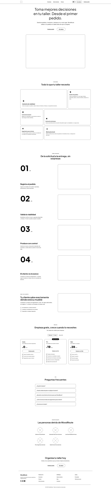

**Vista mobile**


### 4.3.2. Landing Page Mock-up

El mock-up de la landing page de WoodRoute aplica el design system definido en la sección anterior: tipografía Plus Jakarta Sans / Inter, paleta cálida con primario naranja-rojo `#FD4319` y espaciado de sección de 6rem en desktop y 4rem en mobile.

La página está estructurada en ocho secciones en el siguiente orden:

1. **Hero** — propuesta de valor principal con CTA "Empieza gratis" y vista previa del dashboard
2. **Features** — grilla de beneficios clave del producto
3. **How it works** — flujo numerado de 4 pasos: registrar pedido → validar viabilidad → producir → cliente sigue el avance
4. **Social proof** — demostración de la vista de seguimiento para el cliente final
5. **Pricing** — tres planes (Free $0 / Pro $19 / Business $39) con comparativa
6. **FAQ** — preguntas frecuentes expandibles
7. **Team** — equipo detrás de WoodRoute
8. **Footer** — links, redes y legal

**Vista desktop**


**Vista mobile**


La versión mobile mantiene la misma jerarquía de contenido que desktop. Las grillas de features colapsan a una columna, el navbar se convierte en menú hamburguesa y el CTA de conversión permanece visible y accesible en todo momento. El espaciado entre secciones se reduce de 6rem a 4rem mediante el token `--spacing-section-sm`.

## 4.4. Web Applications UX/UI Design

### 4.4.1. Web Applications Mock-up

Los mock-ups de la aplicación web de WoodRoute aplican el mismo design system de la landing page (tipografía Plus Jakarta Sans / Inter, paleta cálida con primario `#FD4319`) sobre un layout autenticado con sidebar lateral, breadcrumb superior y selector de idioma. La aplicación se organiza por módulos alineados a los bounded contexts del producto: Pedidos, Producción, Inventario, Cotizaciones y Contacto.

**Vista 1 — Gestión de Pedidos**

Listado de pedidos del carpintero con identificador, proyecto, cliente, tipo de madera, acabado y estado actual. Para pedidos pendientes se exponen acciones rápidas de aceptación, rechazo y cancelación.

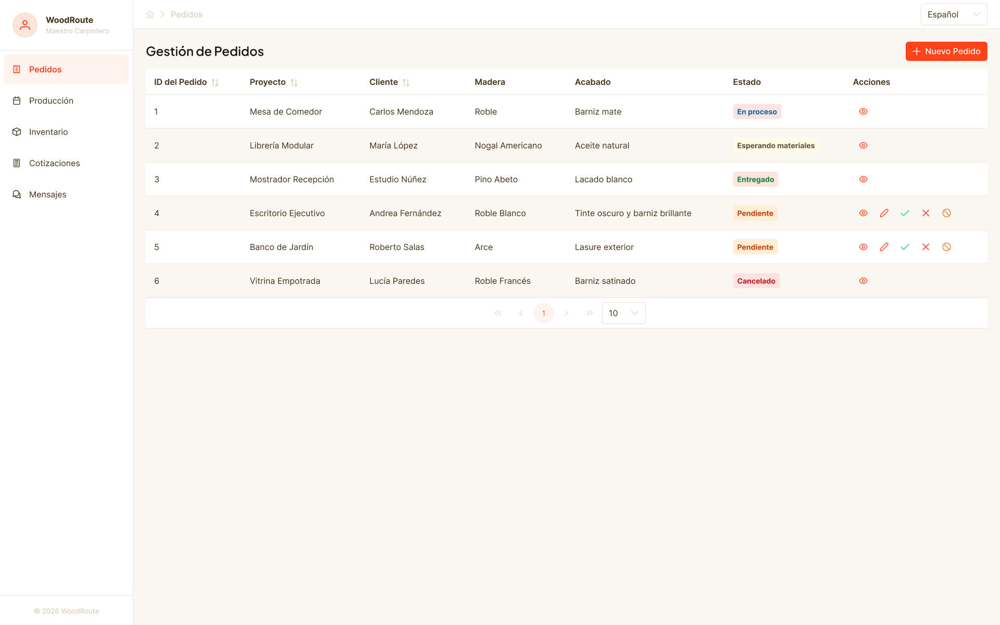

**Vista 2 — Planificación de Producción**

Configuración de las etapas de producción por pedido (Corte, Lijado, Ensamble, Acabado) con horas estimadas, horas reales, estado de cada etapa y acciones para avanzar el progreso.

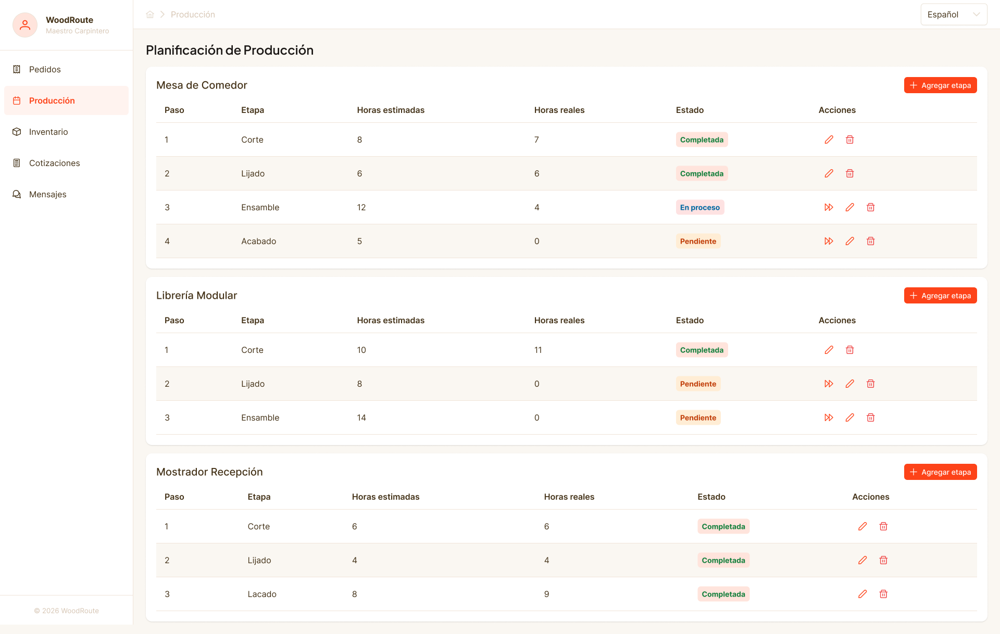

**Vista 3 — Inventario de Materiales**

Listado del inventario con tipo de material, unidad, costo unitario, stock actual y stock mínimo. Se exponen alertas visuales cuando un material está por debajo del nivel mínimo configurado.

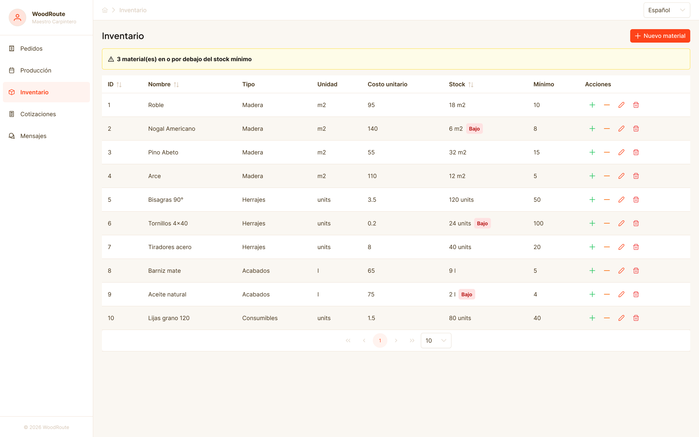

## 4.6. Domain-Driven Software Architecture

### 4.6.1. Design Level Event Storming

**Board completo en Miro:** [https://miro.com/app/board/uXjVHUVIGxY=/?share_link_id=166196211611](https://miro.com/app/board/uXjVHUVIGxY=/?share_link_id=166196211611)

#### Step 1 — Unstructured Exploration

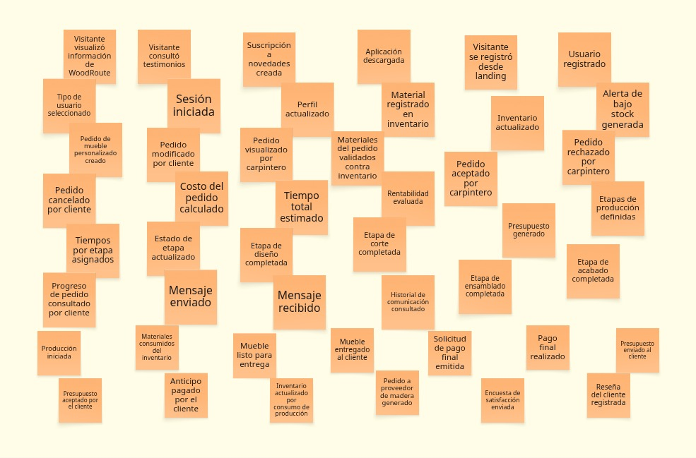

#### Step 2 — Timelines

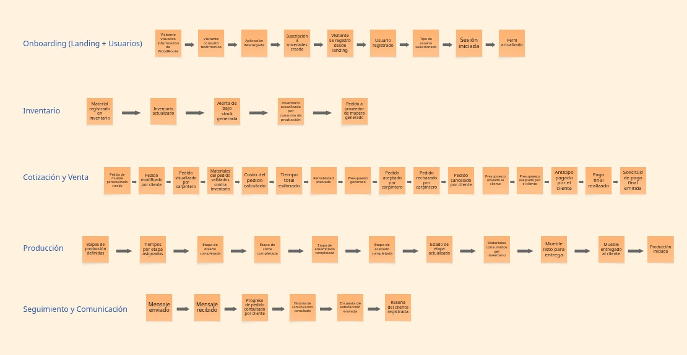

#### Step 3 — Hot Spots

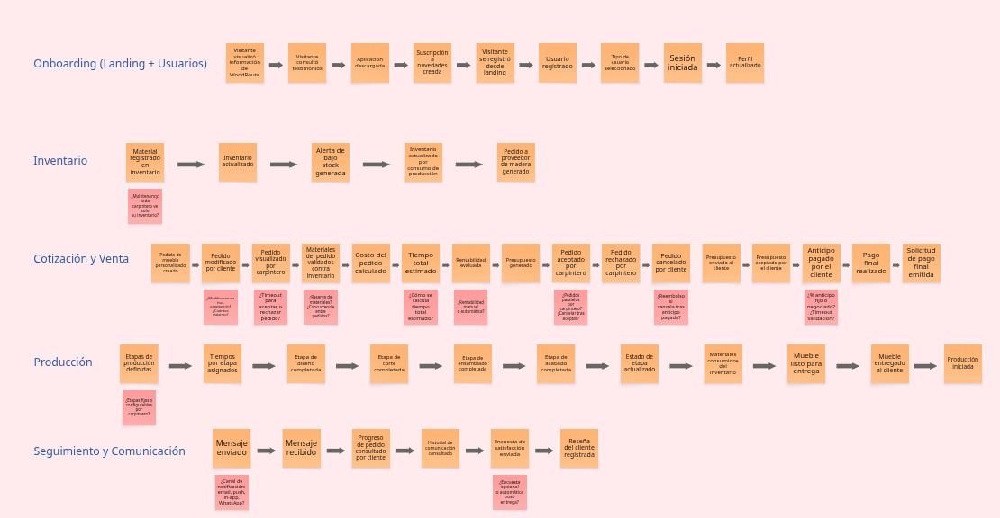

#### Step 4 — Pivotal Points

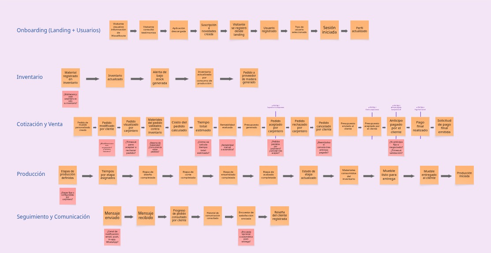

#### Step 5 — Commands

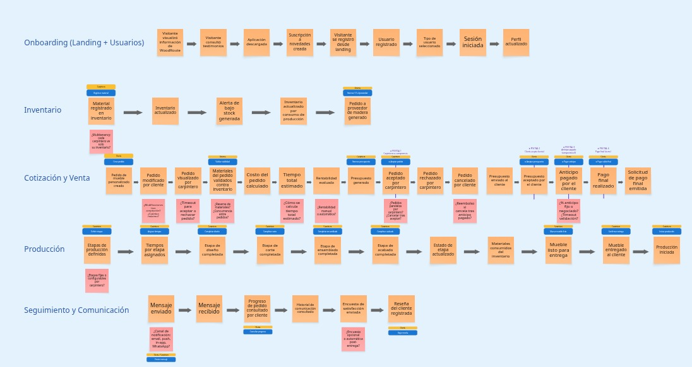

#### Step 6 — Policies

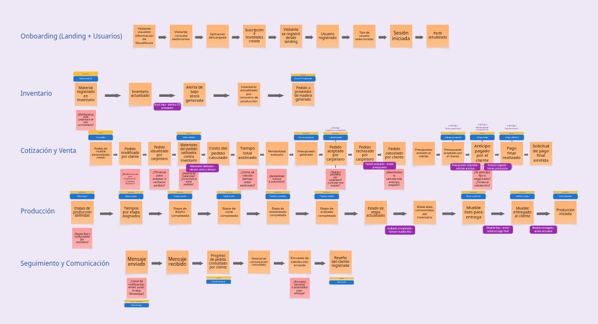

#### Step 7 — Read Models

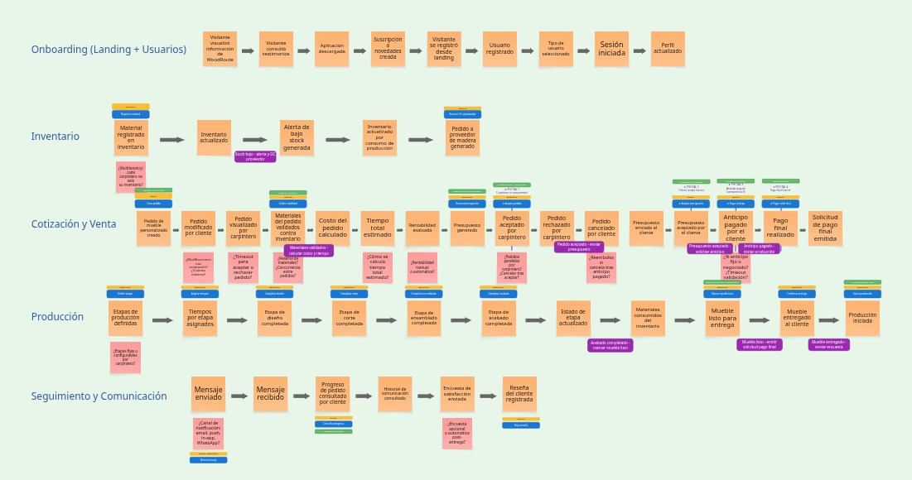

#### Step 8 — External Systems

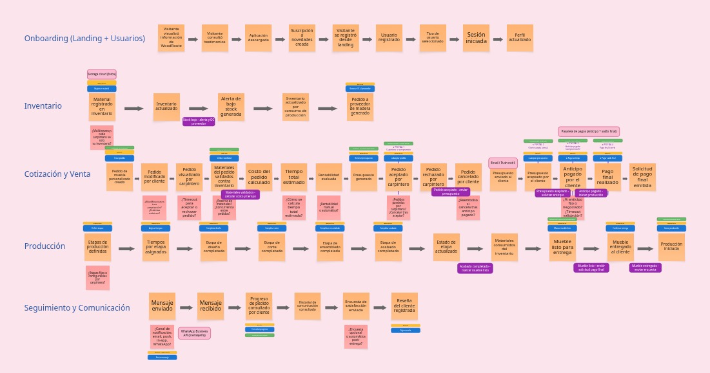

#### Step 9+10 — Aggregates & Bounded Contexts

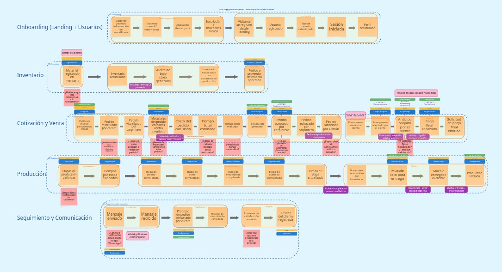

<div style="page-break-after: always;"></div>

### 4.6.2. Software Architecture Context Diagram

El System Context Diagram (nivel 1 del modelo C4) presenta el sistema WoodRoute en relación con su entorno inmediato. Se modelan dos actores principales —el Cliente y el Carpintero o Taller (el Visitante identificado en el Big Picture EventStorming de la sección 2.4 corresponde a su estado pre-autenticado y, por convención C4, no se modela por separado)— y cuatro sistemas externos: Pasarela de pagos, Servicio de notificaciones, Proveedor de madera (HU44) y Cloud Storage. Los cuatro se etiquetan como Simulated y se mockean en la iteración académica actual.

El diagrama resultante se presenta a continuación.

**System Context Diagram — WoodRoute**

<div align="center">
  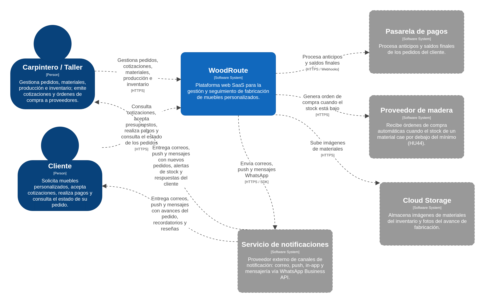
</div>

### 4.6.3. Software Architecture Container Diagrams

El Container Diagram (nivel 2 del modelo C4) amplía WoodRoute mostrando sus containers, tecnologías y protocolos de comunicación. La Web Application (Vue 3 + Vite) consume vía HTTPS/JSON la API REST de cinco bounded contexts agrupados bajo API Application, un monolito modular en .NET 10, todos persistiendo en una base de datos PostgreSQL compartida mediante Entity Framework Core. La integración entre bounded contexts se realiza exclusivamente a través de la base de datos (patrón Shared Database), sin invocaciones cruzadas en runtime. Las notificaciones se centralizan en el Seguimiento y Comunicación Context, que observa eventos en la DB y dispara los envíos contra el proveedor externo. Las decisiones de stack se formalizan en la sección 5.1 (Software Configuration Management).

El diagrama resultante se presenta a continuación.

**Container Diagram — WoodRoute**

<div align="center">
  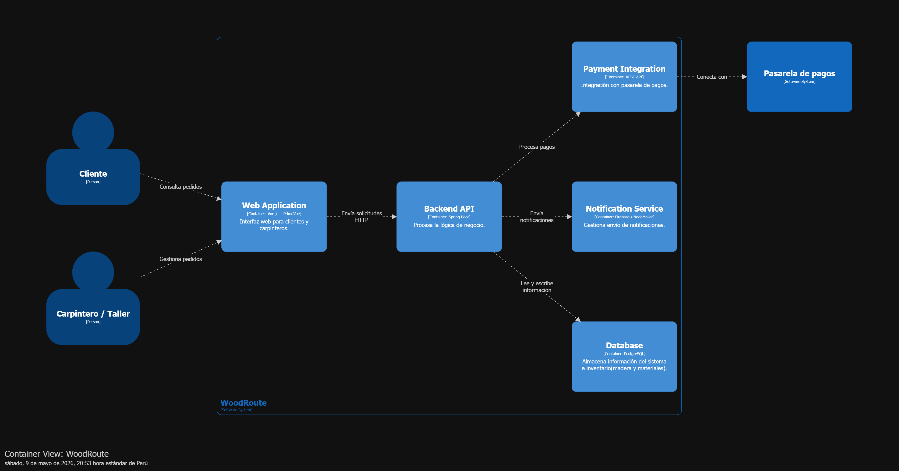
</div>

### 4.6.4. Software Architecture Components Diagrams

Esta sección presenta los Component Diagrams por cada bounded context del API Application. Cada diagrama muestra la descomposición interna del contexto en cuatro capas que reflejan el patrón Domain-Driven Design con arquitectura en capas: el Controller expone los endpoints REST, el Service implementa la lógica de negocio, el Repository abstrae el acceso a datos, y el Aggregate constituye la entidad raíz del dominio que se persiste. Las integraciones con sistemas externos se modelan como llamadas directas desde el Service correspondiente.

**Components of Onboarding Context**

<div align="center">
  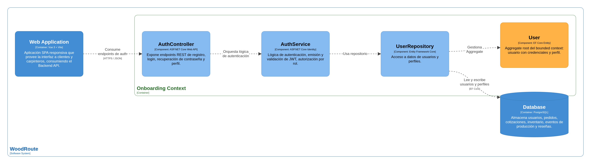
</div>

**Components of Inventario Context**

<div align="center">
  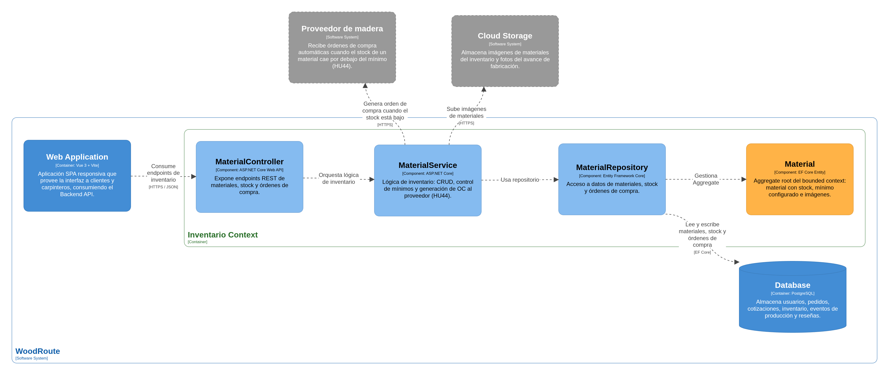
</div>

**Components of Cotización y Venta Context**

<div align="center">
  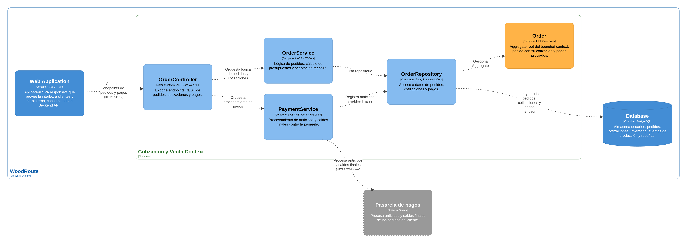
</div>

**Components of Producción Context**

<div align="center">
  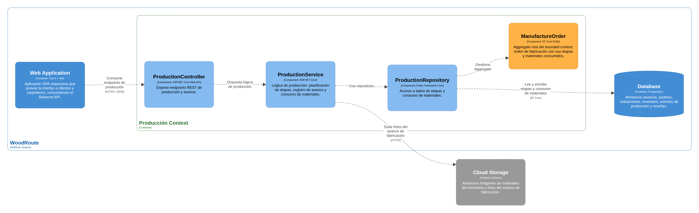
</div>

**Components of Seguimiento y Comunicación Context**

<div align="center">
  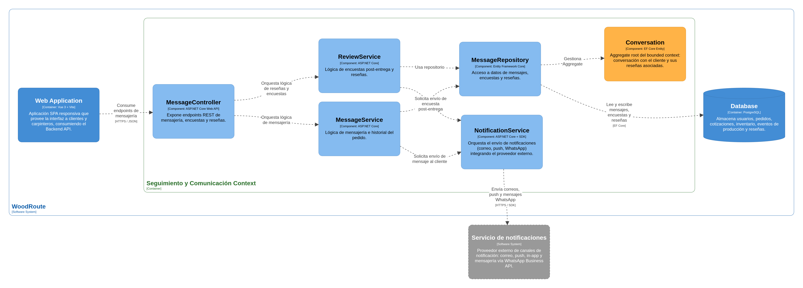
</div>

<div style="page-break-after: always;"></div>

## 4.7. Software Object-Oriented Design

Esta sección presenta el Class Diagram UML del producto Web Application de WoodRoute por cada bounded context. Cada diagrama se organiza en cuatro capas siguiendo Domain-Driven Design: Domain, Infrastructure, Application y Presentation. La herramienta utilizada es PlantUML.

### 4.7.1. Class Diagrams

**Class Diagram of Onboarding Context**

Modela el registro con código de invitación, el inicio de sesión y el registro de clientes del taller. La identidad y la cuenta (**Iam**) tienen como entidad raíz `User`, que incluye el nombre del usuario, y emite `AuthSession` durante el login; el registro de clientes (**Customers**, el CRM del taller) se modela con `Customer`, que puede o no tener una cuenta asociada. Un contexto independiente de `Profile` se evaluó y descartó: sus datos quedaron absorbidos por `User` (Iam) y `Customer` (Customers).

<div align="center">
  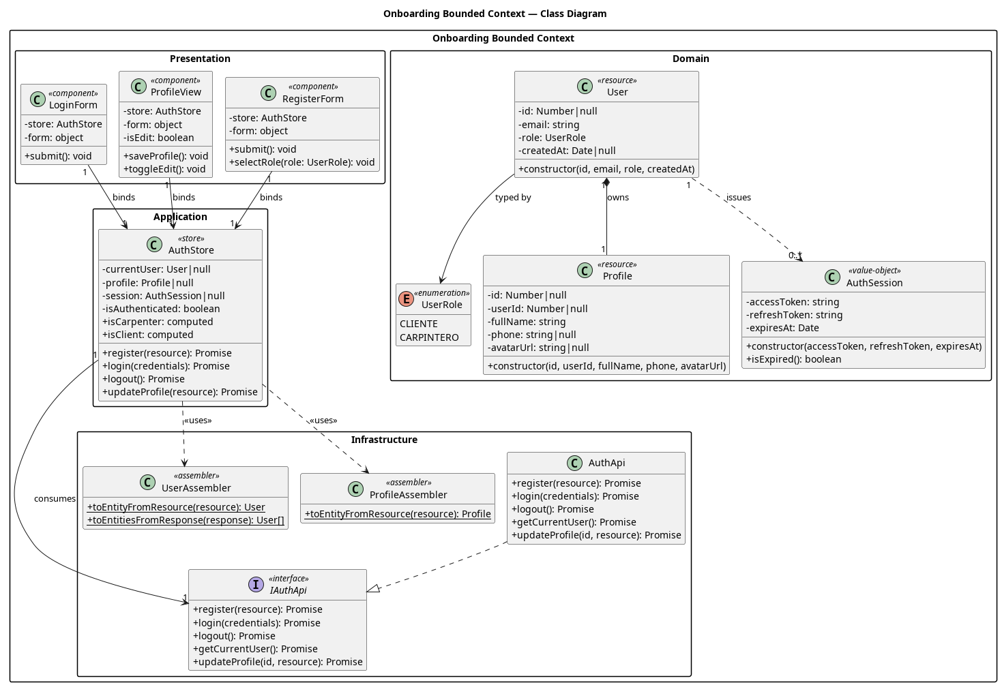
</div>

**Class Diagram of Inventario Context**

Modela la gestión de materiales, control de stock y órdenes de compra al proveedor. `Material` mantiene una relación uno-a-muchos con `PurchaseOrder` y emite `StockAlert` cuando baja del mínimo.

<div align="center">
  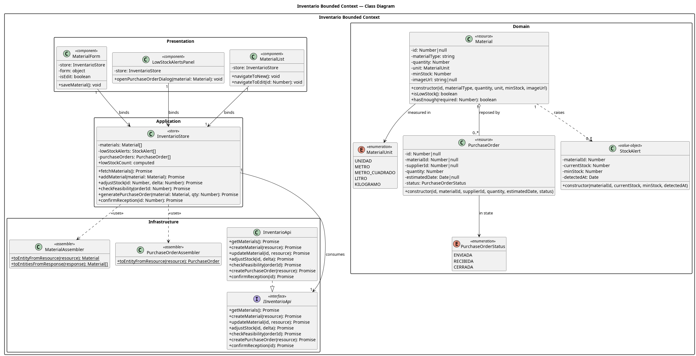
</div>

**Class Diagram of Cotización y Venta Context**

Modela el ciclo de pedidos, cotizaciones y pagos. `Order` agrupa `FurnitureDetails`, su `Quote` con desglose por `QuoteItem`, y los `Payment` de anticipo y saldo final.

<div align="center">
  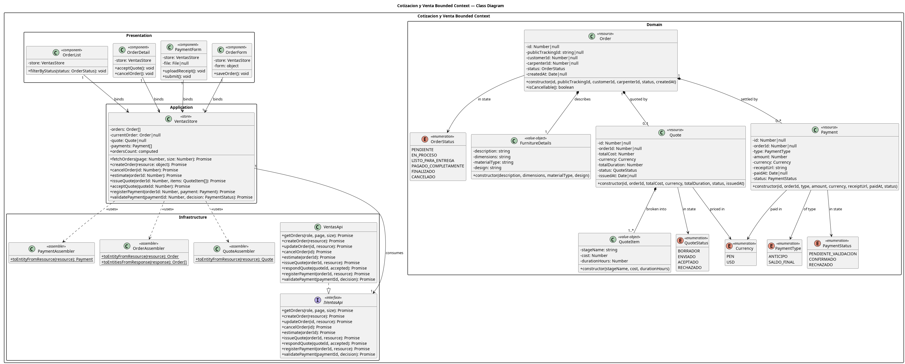
</div>

**Class Diagram of Producción Context**

Modela la planificación de etapas, el registro de avance y el consumo de materiales. `ManufactureOrder` se compone de `Stage` con sus `StagePhoto` y registra `MaterialConsumption`.

<div align="center">
  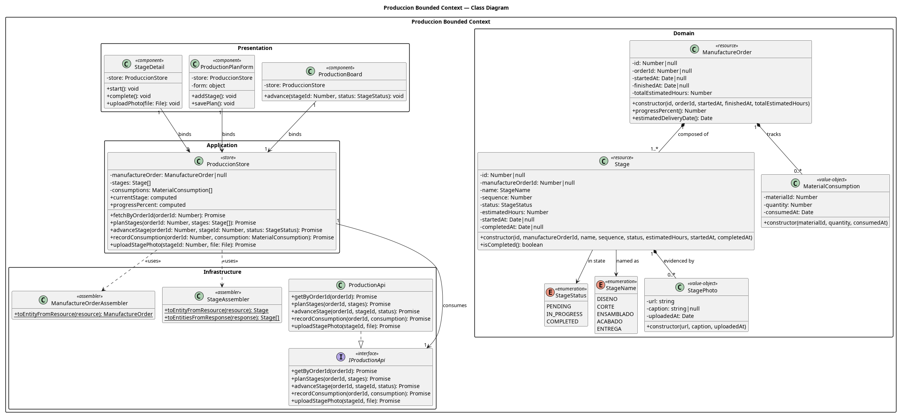
</div>

**Class Diagram of Seguimiento y Comunicación Context**

Modela el read-model público de seguimiento, las notificaciones de avance, las reseñas y las encuestas post-entrega. `Notification` registra los avisos automáticos enviados al cliente y, opcionalmente, se asocian `Review` y `Survey`. El contacto directo se realiza por WhatsApp (enlace externo), por lo que no se persiste un chat interno.

<div align="center">
  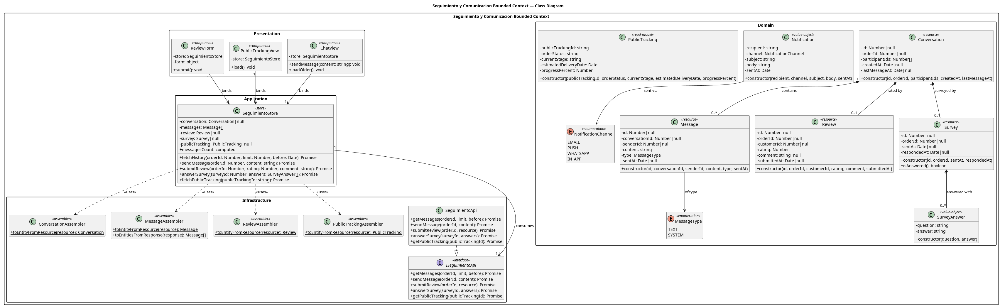
</div>

<div style="page-break-after: always;"></div>

## 4.8. Database Design

Esta sección presenta el Database Diagram de WoodRoute por cada bounded context, materializando la persistencia del Class Diagram sobre PostgreSQL. La herramienta utilizada es PlantUML con notación crow's foot.

### 4.8.1. Database Diagrams

Diagrama relacional consolidado de WoodRoute. Las tablas se agrupan visualmente por bounded context y se evidencian las relaciones intra-contexto junto con los Foreign Keys cruzados que materializan las dependencias entre agregados del modelo de dominio.

<div align="center">
  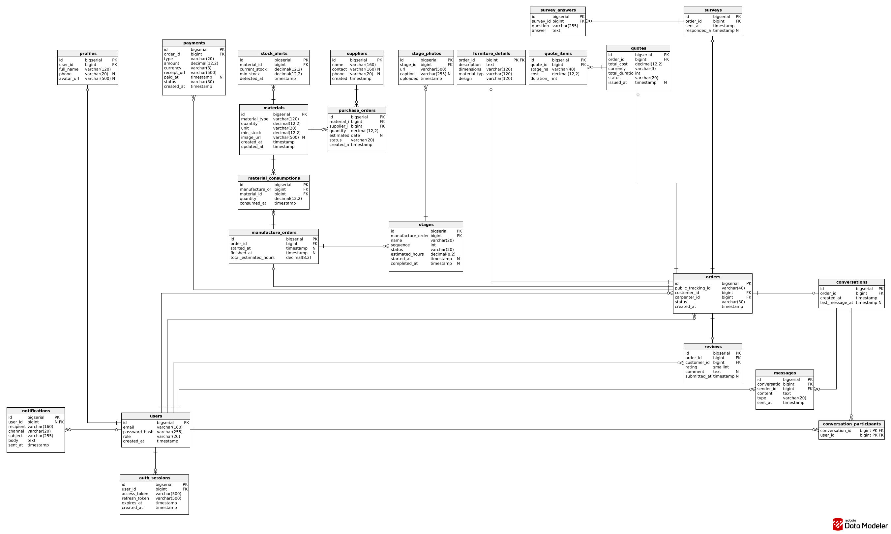
</div>

<div style="page-break-after: always;"></div>

# Capítulo V: Product Implementation, Validation & Deployment

## 5.1. Software Configuration Management

Esta sección documenta la gestión de configuración del software de WoodRoute, definiendo las herramientas, entornos y convenciones que sostienen el ciclo de desarrollo del equipo. Se describen el entorno de desarrollo, la estrategia de control de versiones y los lineamientos de despliegue que aseguran la trazabilidad y consistencia del producto.

### 5.1.1. Software Development Environment Configuration

A continuación se listan los productos de software utilizados por el equipo a lo largo del ciclo de vida de WoodRoute, agrupados por tipo de actividad. Para cada producto se indica el propósito de uso en el proyecto y la ruta de referencia (SaaS) o de descarga (instalación local), respetando las restricciones de herramientas establecidas para el curso.

#### Project Management

| Producto | Propósito de uso en el proyecto | Ruta de referencia / descarga |
| :--- | :--- | :--- |
| Trello | Gestión del Product Backlog, planificación de sprints y seguimiento de tareas mediante tableros Kanban compartidos por el equipo. | <https://trello.com/> |
| Discord | Canal principal de comunicación sincrónica del equipo: reuniones de daily, coordinación técnica y discusión de avances. | <https://discord.com/download> |
| WhatsApp | Canal secundario de comunicación rápida y notificaciones del equipo. | <https://www.whatsapp.com/download> |

#### Requirements Management

| Producto | Propósito de uso en el proyecto | Ruta de referencia / descarga |
| :--- | :--- | :--- |
| Miro | Elaboración del Lean UX Canvas, Big Picture EventStorming, sesiones de needfinding y mapeo colaborativo de hipótesis y dominios. | <https://miro.com/> |

#### Product UX/UI Design

| Producto | Propósito de uso en el proyecto | Ruta de referencia / descarga |
| :--- | :--- | :--- |
| Figma | Diseño de wireframes, mockups y prototipos de alta fidelidad de la landing page y aplicaciones web. | <https://www.figma.com/> |
| UXPressia | Construcción de User Personas, Empathy Maps, Journey Maps e Impact Mapping. | <https://uxpressia.com/> |
| Lucidchart | Modelado de diagramas de flujo, sitemaps y artefactos de arquitectura de información. | <https://www.lucidchart.com/> |

#### Software Development

| Producto | Propósito de uso en el proyecto | Ruta de referencia / descarga |
| :--- | :--- | :--- |
| WebStorm | IDE principal del equipo para el desarrollo de la landing page y la SPA en Vue 3. | <https://www.jetbrains.com/webstorm/download/> |
| Vue 3 | Framework JavaScript progresivo para la construcción de la landing page y de la Single Page Application. | <https://vuejs.org/> |
| Vite | Build tool y dev server para el frontend en Vue 3, con HMR y bundling optimizado. | <https://vitejs.dev/> |
| Node.js | Runtime de JavaScript necesario para ejecutar Vite, gestores de paquetes y herramientas de tooling del frontend. | <https://nodejs.org/en/download> |
| .NET 10 SDK | Plataforma de desarrollo para los servicios backend de WoodRoute siguiendo la arquitectura DDD definida en el capítulo IV. | <https://dotnet.microsoft.com/en-us/download/dotnet/10.0> |
| PostgreSQL | Motor de base de datos relacional ejecutado localmente para soportar la persistencia de los bounded contexts durante el desarrollo. | <https://www.postgresql.org/download/> |
| Swagger / OpenAPI | Documentación y prueba interactiva de los endpoints REST expuestos por los servicios backend. | <https://swagger.io/> |
| Git | Sistema de control de versiones distribuido utilizado para el versionado del código fuente y del informe. | <https://git-scm.com/downloads> |
| Git Flow (extensión) | Extensión de Git que implementa el modelo de ramas definido en CLAUDE.md (main, develop, feature, release, hotfix). | <https://github.com/nvie/gitflow> |
| GitHub | Hosting remoto de los repositorios del equipo, gestión de Pull Requests y revisión de código. | <https://github.com/> |

#### Software Deployment

| Producto | Propósito de uso en el proyecto | Ruta de referencia / descarga |
| :--- | :--- | :--- |
| Vercel | Plataforma de despliegue continuo de la landing page y de la aplicación frontend en Vue 3, con previews automáticos por rama. | <https://vercel.com/> |

#### Software Documentation

| Producto | Propósito de uso en el proyecto | Ruta de referencia / descarga |
| :--- | :--- | :--- |
| Visual Studio Code | Editor utilizado para la redacción del informe en Markdown y la edición de archivos de configuración. | <https://code.visualstudio.com/Download> |
| Markdown PDF (extensión) | Extensión de VS Code utilizada para exportar el informe Markdown al formato PDF requerido por la entrega UPC. | <https://marketplace.visualstudio.com/items?itemName=yzane.markdown-pdf> |
| PlantUML | Generación de diagramas de clases y de base de datos como código, versionados junto al repositorio. | <https://plantuml.com/> |
| Structurizr | Modelado de diagramas C4 (Contexto, Contenedores y Componentes) para documentar la arquitectura del producto. | <https://structurizr.com/> |
| Google Drive | Almacenamiento y compartición de grabaciones de entrevistas, evidencias de needfinding y materiales de apoyo. | <https://drive.google.com/> |
| Google Meet | Plataforma de videoconferencia para sprint planning, sprint review, retrospectivas y entrevistas a usuarios. | <https://meet.google.com/> |

### 5.1.2. Source Code Management

El proyecto WoodRoute utiliza GitHub como plataforma de control de versiones bajo el modelo GitFlow, lo que garantiza la trazabilidad del código, una colaboración organizada entre los miembros del equipo y la estabilidad en cada release del producto.

**Organización en GitHub:** <https://github.com/Developer-Core>

**Repositorio del informe:** <https://github.com/Developer-Core/project-report-repo>

#### Ramas principales

- **`main`:** Contiene la versión estable y desplegada en producción. Solo recibe merges desde ramas `release/*` y `hotfix/*`. Cada merge a `main` corresponde a una entrega oficial (AV1, AV2, TF) y queda etiquetado con su versión SemVer.
- **`develop`:** Rama de integración de nuevas funcionalidades. Contiene la historia completa del proyecto y sirve como base para las ramas `feature/*` y `release/*`.

#### Ramas secundarias

- **`feature/*`:** Ramas temporales para el desarrollo de funcionalidades o secciones específicas del informe. Nacen de `develop` y se reintegran a `develop` mediante Pull Request. La convención de nombrado es `feature/NN-descriptive-name` cuando la tarea corresponde a una sección numerada del reporte; en caso contrario se usa `feature/descriptive-name`.
- **`release/*`:** Ramas de preparación para entregas. Nacen de `develop` y solo aceptan correcciones de bugs y ajustes de documentación, nunca nuevas funcionalidades. Al finalizar se integran a `main` y a `develop`.
- **`hotfix/*`:** Ramas para parches críticos posteriores a una entrega. Nacen de `main` y se reintegran tanto a `main` como a `develop`.

#### Convenciones de commits

El equipo aplica el estándar **Conventional Commits** con el formato `type(scope): description`. Los tipos utilizados en este repositorio incluyen `docs` para cambios de contenido del informe, `fix` para correcciones, `build` para configuración de exportación a PDF, `chore` para mantenimiento, `style` para cambios de formato y `refactor` para reestructuración sin cambio de salida.

#### Versionado

Se emplea **Semantic Versioning (SemVer 2.0.0)** con el formato `MAJOR.MINOR.PATCH`. Los commits de tipo `docs` incrementan la versión MINOR, los de tipo `fix` incrementan PATCH y los cambios marcados con `!` o `BREAKING CHANGE` incrementan MAJOR. Los tags se publican con el prefijo `v` (por ejemplo, `v0.1.0`). Las versiones se mapean a las entregas del curso de la siguiente manera:

| Entregable | Versión | Rama de release |
| :--- | :--- | :--- |
| AV1 | `v0.1.0` | `release/0.1.0` |
| AV2 | `v0.2.0` | `release/0.2.0` |
| TF | `v1.0.0` | `release/1.0.0` |

#### Política de integración

Todas las integraciones hacia `develop` o `main` requieren la creación de un **Pull Request** revisado y aprobado por al menos un miembro del equipo. No se permiten commits directos a `develop` ni a `main`, y las ramas `feature/*` nunca interactúan directamente con `main`: siempre lo hacen a través de `develop`.

### 5.1.3. Source Code Style Guide & Coding Conventions

El equipo adopta convenciones estándares y reconocidas internacionalmente para los lenguajes utilizados en WoodRoute: **JavaScript** y **Vue 3** en el frontend, **C# / .NET 10** en el backend y **SQL** sobre PostgreSQL para la persistencia. Toda la nomenclatura del código identificadores, archivos, tablas y columnas se escribe en **inglés**, garantizando coherencia y legibilidad para cualquier desarrollador.

Como herramienta de soporte se utiliza **Prettier** para el formateo automático del código fuente del frontend, asegurando un estilo consistente entre los miembros del equipo. Actualmente no se ha configurado un linter dedicado; su incorporación queda como mejora planificada para sprints posteriores.

#### JavaScript y Vue 3

Para el código del frontend (landing page y SPA) se adoptan las guías oficiales de **Vue.js** y **Google JavaScript Style Guide**, complementadas con las **MDN JavaScript Guidelines** como referencia normativa.

| Elemento | Convención | Ejemplo |
| :--- | :--- | :--- |
| Variables y funciones | `camelCase` | `orderTotal`, `calculateMaterials()` |
| Constantes globales | `UPPER_SNAKE_CASE` | `MAX_RETRY_COUNT` |
| Componentes Vue (en código) | `PascalCase` | `OrderSummary`, `MaterialPicker` |
| Archivos de componentes SFC | `kebab-case` | `order-summary.vue`, `material-picker.vue` |
| Archivos de utilidades y composables | `kebab-case` | `use-order-state.js`, `format-currency.js` |
| Props y eventos personalizados | `camelCase` en JS, `kebab-case` en template | `:order-id`, `@order-submitted` |
| Indentación | 2 espacios | — |
| Comillas | Comillas simples (`'`) en JS, dobles (`"`) en templates | — |
| Punto y coma | Obligatorio al final de cada sentencia | — |

**Reglas clave de la Vue Style Guide (Priority A):**

- Nombres de componentes con varias palabras para evitar colisiones con elementos HTML nativos.
- Definiciones de `data` como función (`data() { return { ... } }`) en componentes reutilizables.
- Tipado explícito de `props` con validación (tipo, requerido, valor por defecto).
- Uso de `key` en bucles `v-for`.
- Evitar `v-if` y `v-for` sobre el mismo elemento.

#### C# y .NET 10

Para el código del backend se adoptan las **Microsoft C# Coding Conventions** y las **ASP.NET Core Coding Guidelines** oficiales.

| Elemento | Convención | Ejemplo |
| :--- | :--- | :--- |
| Clases, structs, records, enums | `PascalCase` | `OrderService`, `MaterialEstimate` |
| Métodos y propiedades públicas | `PascalCase` | `CalculateTotal()`, `OrderId` |
| Parámetros y variables locales | `camelCase` | `orderId`, `customerName` |
| Campos privados | `_camelCase` con guion bajo | `_orderRepository` |
| Interfaces | Prefijo `I` + `PascalCase` | `IOrderRepository`, `IUnitOfWork` |
| Constantes | `PascalCase` | `MaxRetryCount` |
| Archivos | `PascalCase` coincidente con el tipo principal | `OrderService.cs` |
| Indentación | 4 espacios | — |
| Llaves | En línea nueva (estilo Allman) | — |

**Reglas clave adoptadas:**

- Uso de `var` solo cuando el tipo es evidente desde el contexto.
- `async`/`await` para toda operación I/O, con sufijo `Async` en métodos asíncronos (`GetOrderAsync`).
- Una clase pública por archivo, con el archivo nombrado igual que la clase.
- Organización del proyecto según los bounded contexts y capas DDD definidas en el capítulo IV (Domain, Application, Infrastructure, Presentation).

#### SQL (PostgreSQL)

Para la base de datos relacional se adoptan las convenciones recomendadas por la comunidad **PostgreSQL**, alineadas con el Database Design del capítulo IV.

| Elemento | Convención | Ejemplo |
| :--- | :--- | :--- |
| Tablas | `snake_case` plural | `orders`, `material_estimates` |
| Columnas | `snake_case` | `customer_id`, `created_at` |
| Claves primarias | `id` (entero o UUID) | `id` |
| Claves foráneas | `<tabla_singular>_id` | `order_id`, `customer_id` |
| Índices | `idx_<tabla>_<columnas>` | `idx_orders_customer_id` |
| Restricciones | `<tipo>_<tabla>_<columna>` | `fk_orders_customer_id` |
| Palabras reservadas SQL | `UPPERCASE` | `SELECT`, `FROM`, `WHERE` |

**Reglas clave adoptadas:**

- Toda tabla incluye columnas de auditoría `created_at` y `updated_at` con tipo `timestamptz`.
- Las claves foráneas declaran explícitamente su política `ON DELETE` y `ON UPDATE`.
- Identificadores en inglés y sin abreviaturas ambiguas.

#### Referencias normativas

Las guías oficiales adoptadas como base de estas convenciones están detalladas en la sección de Referencias del informe e incluyen:

- Vue Style Guide (oficial).
- Google JavaScript Style Guide.
- MDN JavaScript Guidelines.
- Microsoft C# Coding Conventions.
- Microsoft ASP.NET Core Coding Guidelines.
- PostgreSQL Naming Conventions.

### 5.1.4. Software Deployment Configuration

En esta sección se documentan las herramientas y procesos adoptados por el equipo para el despliegue de los componentes de WoodRoute: la landing page, la aplicación frontend y los servicios backend. El objetivo es contar con un flujo de publicación automatizado, reproducible y trazable a lo largo de los sprints.

#### Landing Page y Frontend: Vercel

Para el despliegue de la landing page y de la aplicación frontend en Vue 3 se utiliza **Vercel**, una plataforma especializada en el hosting de aplicaciones web modernas. Vercel se integra de forma nativa con GitHub, lo que habilita despliegues automáticos cada vez que se realiza un push a la rama configurada del repositorio, además de generar previews por cada Pull Request. A continuación se describe el flujo seguido por el equipo:

**Paso 1: Conectar con Vercel.**

El equipo accede a la plataforma de Vercel e inicia el flujo de creación de un nuevo proyecto, autorizando previamente la integración con la cuenta de GitHub de la organización.

<div align="center">
  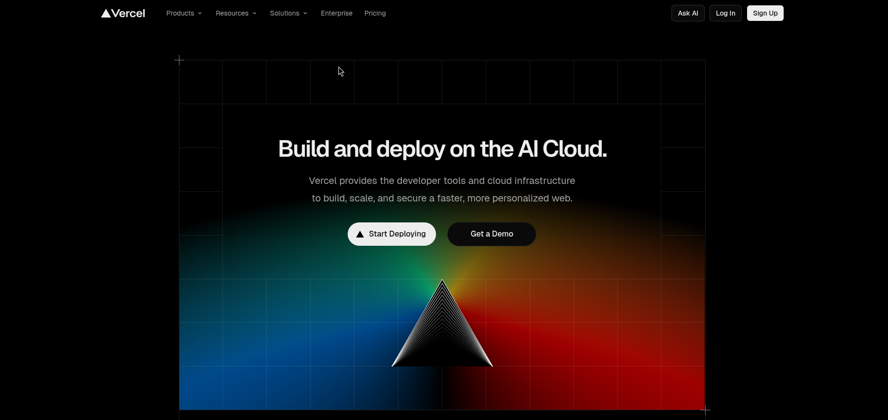
</div>

**Paso 2: Importar el repositorio desde GitHub.**

Desde la sección *Import Git Repository* se selecciona la organización **Developer-Core** y se importa el repositorio correspondiente a la landing page o a la aplicación frontend.

<div align="center">
  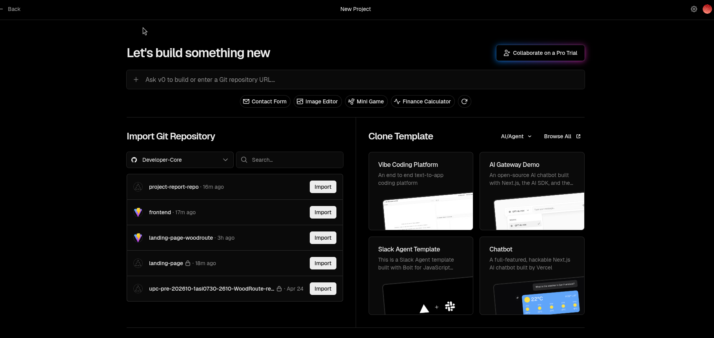
</div>

**Paso 3: Desplegar la aplicación.**

Se selecciona la rama a desplegar, el *Application Preset* (Vite para Vue 3), el *Root Directory*, los *Build and Output Settings* y las *Environment Variables* necesarias para producción. Al presionar el botón **Deploy**, Vercel ejecuta el build, publica el sitio y entrega la URL pública del entorno.

<div align="center">
  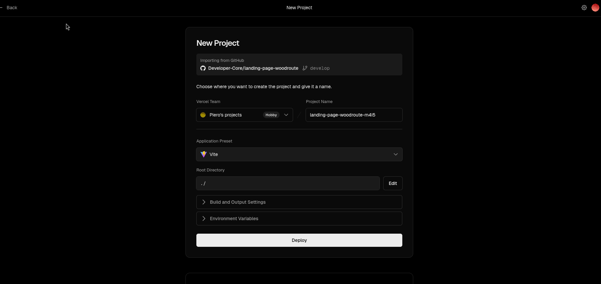
</div>

## 5.2. Landing Page, Services & Applications Implementation

### 5.2.1. Sprint 1

En este primer sprint se desarrolló la landing page y la documentación inicial del proyecto WoodRoute.

#### 5.2.1.1. Sprint Planning 1

| Sprint # | Sprint 1 |
| :--- | :--- |
| **Sprint Planning Background** | |
| Date | 10/04/2026 |
| Time | 3:30 PM |
| Location | Google Meet |
| Prepared By | Torres Sanchez, Dalila Victoria |
| Attendees (to planning meeting) | Gonza Morales, Anderson<br>Justo Yauricasa, Alexander Paolo<br>Saldaña De Souza, Juan David<br>Sulca Sanchez, Piero Angel<br>Torres Sanchez, Dalila Victoria |
| **Sprint 1 Review Summary** | Durante este sprint, el equipo se enfocó en sentar las bases estratégicas del proyecto WoodRoute. Se completaron entregables clave de UX como User Personas, Journey Maps y la arquitectura de información, que guiaron el diseño de la plataforma. Con esta base, se diseñó, maquetó y desplegó la primera versión funcional de la landing page. Esta página incluye la propuesta de valor del SaaS, los planes de suscripción y una sección que destaca los beneficios para carpinteros y clientes finales. |
| **Sprint 1 Retrospective Summary** | Los miembros del equipo coincidieron en que la colaboración fue fluida gracias a la correcta asignación de roles. Se destacó la sinergia entre el diseño en Figma y la configuración inicial de los repositorios. Para el siguiente sprint, se identificó la oportunidad de mejorar la estimación de tiempos de desarrollo al iniciar la integración del backend. |
| **Sprint Goal & User Stories** | |
| **Sprint 1 Goal** | Nos enfocamos en entregar una primera versión de la landing page desplegada y la documentación de los primeros capítulos del informe. Creemos que esto entrega una propuesta de valor validada para atraer a nuestro segmento objetivo. Esto se confirmará cuando la web esté pública y el informe sea aprobado. |
| **Sprint 1 Velocity** | 14 |
| **Sum of Story Points** | 14 |

#### 5.2.1.2. Aspect Leaders and Collaborators

| Team Member | GitHub Username | Landing Page | Diseño UI/UX | Documentación |
| :--- | :--- | :--- | :--- | :--- |
| Gonza Morales, Anderson | Ander-U | Colaborador | Colaborador | Colaborador |
| Justo Yauricasa, Alexander Paolo | AlexanderrJusto | Colaborador | Colaborador | Líder |
| Saldaña De Souza, Juan David | jndesouza | Colaborador | Colaborador | Colaborador |
| Sulca Sanchez, Piero Angel | psulca | Líder | Líder | Colaborador |
| Torres Sanchez, Dalila Victoria | DalilaTorres | Colaborador | Colaborador | Colaborador |

#### 5.2.1.3. Sprint Backlog 1

| User Story Id | User Story Title | Work Item/Task Id | Work Item/Task Title | Description | Estimation (SP) | Assigned To | Status |
| :--- | :--- | :--- | :--- | :--- | :--- | :--- | :--- |
| HU01 | Navegación clara dentro de la landing | T01 | Maquetado de header y footer | Construcción del header con navegación y del footer con enlaces principales. | 1 | Piero Sulca | Done |
| HU02 | Entender la propuesta de valor de WoodRoute | T02 | Hero section con propuesta de valor | Diseño y desarrollo del hero section con la propuesta de valor del SaaS. | 2 | Piero Sulca | Done |
| HU03 | Conocer las funcionalidades del producto | T03 | Sección de funcionalidades | Implementación de la sección que resalta las funcionalidades principales del producto. | 1 | Piero Sulca | Done |
| HU04 | Comprender cómo se usa el producto | T04 | Sección de flujo de uso | Sección visual que explica el flujo de uso de WoodRoute para visitantes. | 1 | Anderson Gonza | Done |
| HU05 | Conocer los planes y precios disponibles | T05 | Sección de pricing | Construcción de la sección de planes y precios con tarjetas comparativas. | 2 | Dalila Torres | Done |
| HU07 | Conocer al equipo detrás del producto | T06 | Sección del equipo | Sección con los integrantes del equipo y sus roles. | 1 | Alexander Justo | Done |
| HU12 | Seguir a WoodRoute en redes sociales | T07 | Íconos de redes sociales en el footer | Inclusión de íconos enlazados a las redes sociales oficiales en el footer. | 1 | Anderson Gonza | Done |
| HU11 | Conocer los términos y condiciones del servicio | T08 | Enlace a términos y condiciones | Inclusión del enlace a términos y condiciones en el footer de la landing. | 1 | Dalila Torres | Done |
| HU06 | Empezar a usar la plataforma desde la landing | T09 | CTAs de registro y acceso | Implementación de los botones de llamada a la acción para iniciar registro como carpintero o cliente. | 1 | Juan David Saldaña | Done |
| HU10 | Leer la landing en mi idioma preferido | T10 | Implementación de internacionalización (i18n) | Configuración de i18n con soporte de inglés por defecto y traducción al español de los textos de la landing. | 3 | Dalila Torres | Done |

A continuación se muestra el tablero de Sprint Backlog 1 gestionado por el equipo en Trello, con las tareas distribuidas en sus respectivos estados (To do, In progress, To review y Done) al cierre del sprint.

<div align="center">
  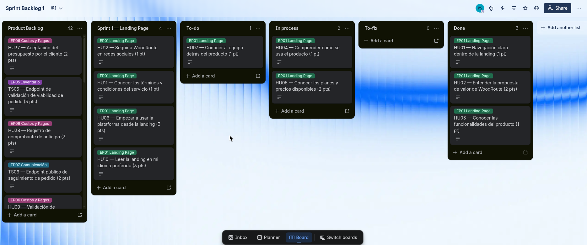
</div>

#### 5.2.1.4. Development Evidence for Sprint Review

En este primer Sprint el equipo implementó la landing page de WoodRoute aplicando el modelo de ramas GitFlow. Todo el trabajo se desarrolló sobre ramas `feature/*` que se integraron a `develop` mediante Pull Requests revisados. El repositorio público es <https://github.com/Developer-Core/landing-page-woodroute>. A continuación se listan los commits más representativos del sprint.

| Repository | Branch | Commit Id | Commit Message | Commit Message Body | Commited on (Date) |
| :--- | :--- | :--- | :--- | :--- | :--- |
| Developer-Core/landing-page-woodroute | develop | 73dd9cd | chore: initialize project with Vite vanilla and Tailwind v4 | Inicialización del proyecto con Vite y Tailwind CSS v4. | 24/04/2026 |
| Developer-Core/landing-page-woodroute | develop | 51574a7 | style: design system tokens and base styles | Definición de los tokens del design system y estilos base de la landing. | 24/04/2026 |
| Developer-Core/landing-page-woodroute | develop | 585d8cb | feat: base html structure and main entry point | Estructura HTML base y punto de entrada principal de la aplicación. | 24/04/2026 |
| Developer-Core/landing-page-woodroute | develop | ba30a0b | feat: i18n system with spanish and english translations | Sistema de internacionalización con traducciones en inglés y español (HU10). | 24/04/2026 |
| Developer-Core/landing-page-woodroute | develop | 58a97d7 | feat: nav-bar with mobile menu and language switcher | Barra de navegación con menú móvil y selector de idioma (HU01, HU10). | 24/04/2026 |
| Developer-Core/landing-page-woodroute | develop | 4306453 | feat: hero section with tagline, ctas and dashboard placeholder | Hero section con la propuesta de valor, CTAs principales y placeholder del dashboard (HU02, HU06). | 24/04/2026 |
| Developer-Core/landing-page-woodroute | develop | a9dbb74 | feat: features grid with 6 product capabilities | Grid de funcionalidades con las seis capacidades principales del producto (HU03). | 24/04/2026 |
| Developer-Core/landing-page-woodroute | develop | fb3e87e | feat: client tracking section with benefits list | Sección dedicada al seguimiento del cliente con lista de beneficios (HU03). | 24/04/2026 |
| Developer-Core/landing-page-woodroute | develop | 971b660 | feat: how it works section with numbered steps | Sección "cómo funciona" con pasos numerados que explica el flujo de uso (HU04). | 24/04/2026 |
| Developer-Core/landing-page-woodroute | develop | 1a6ccd8 | feat: pricing section with monthly/annual billing toggle | Sección de pricing con tarjetas comparativas y toggle de facturación mensual/anual (HU05). | 24/04/2026 |
| Developer-Core/landing-page-woodroute | develop | 84e0774 | feat: cta banner section with primary and secondary actions | Banner de llamada a la acción con acciones primaria y secundaria (HU06). | 24/04/2026 |
| Developer-Core/landing-page-woodroute | develop | 9601e99 | feat: footer with nav columns, social icons and copyright | Footer con columnas de navegación, íconos de redes sociales y copyright (HU11, HU12). | 24/04/2026 |
| Developer-Core/landing-page-woodroute | develop | 65bb4fc | feat: faq accordion section with 5 questions in es and en | Sección de preguntas frecuentes tipo acordeón con cinco preguntas en inglés y español. | 24/04/2026 |
| Developer-Core/landing-page-woodroute | develop | 0743916 | feat: add team section with member photos | Sección del equipo con fotos de los integrantes del proyecto (HU07). | 24/04/2026 |
| Developer-Core/landing-page-woodroute | develop | 4c25f30 | feat: add vercel.json with build config | Configuración de build para el despliegue automático en Vercel. | 24/04/2026 |
| Developer-Core/landing-page-woodroute | develop | ce0388e | feat: update logo woodroute | Actualización del logo oficial de WoodRoute en la landing page. | 13/05/2026 |

#### 5.2.1.5. Execution Evidence for Sprint Review

Durante el Sprint 1 el equipo completó la implementación de la landing page de WoodRoute. La landing presenta la propuesta de valor del SaaS, el flujo de uso del producto, los planes de suscripción, una sección de preguntas frecuentes y la presentación del equipo, todo con soporte de internacionalización en español e inglés. La aplicación se encuentra desplegada de forma pública en Vercel y accesible desde cualquier dispositivo.

**URL pública de la landing page:** <https://landing-page-woodroute.vercel.app/>

**Video demostrativo del Sprint 1:** <https://youtu.be/kCCwd5l2dD0>

A continuación se presentan las capturas de las principales vistas implementadas en este sprint.

**Vista 1 — Hero section con propuesta de valor**

<div align="center">
  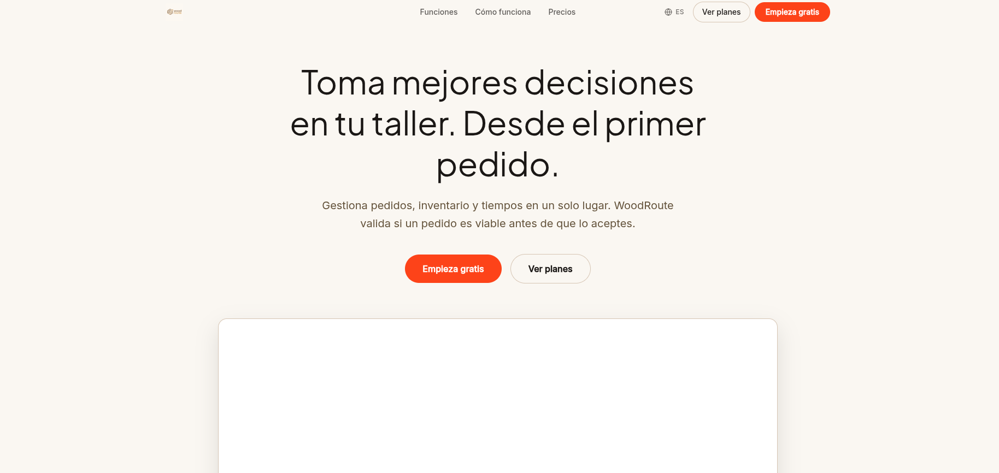
</div>

**Vista 2 — Sección "Cómo funciona" con el flujo de uso**

<div align="center">
  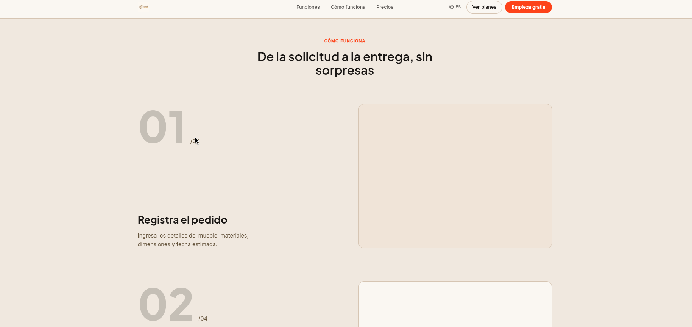
</div>

**Vista 3 — Sección de preguntas frecuentes**

<div align="center">
  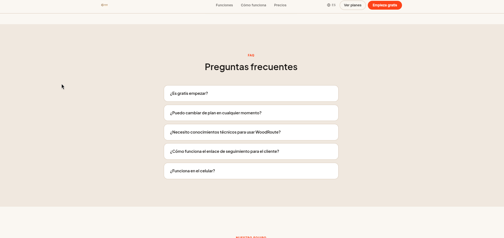
</div>

**Vista 4 — Sección del equipo detrás del producto**

<div align="center">
  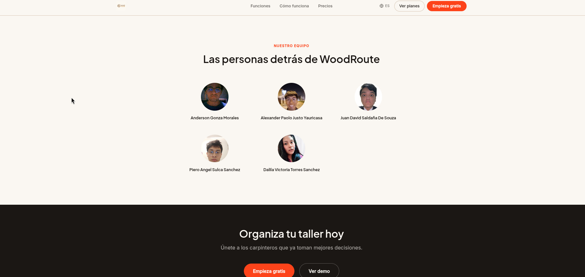
</div>

#### 5.2.1.6. Services Documentation Evidence for Sprint Review

No disponemos de documentación como evidencia, ya que en el primer sprint nuestro enfoque se centró en la elaboración de la landing page.

#### 5.2.1.7. Software Deployment Evidence for Sprint Review

Durante el Sprint 1 el equipo configuró y puso en marcha el despliegue continuo de la landing page de WoodRoute sobre la plataforma Vercel. Las actividades realizadas comprendieron la creación de la cuenta de equipo en Vercel, la autorización de la integración con la organización **Developer-Core** en GitHub, la importación del repositorio `landing-page-woodroute`, la configuración del proyecto (framework preset, rama de despliegue, build command y variables de entorno) y la activación del despliegue automático ante cada push a la rama `develop`. Como resultado, la landing quedó publicada en <https://landing-page-woodroute.vercel.app/>. A continuación se evidencian los pasos realizados.

**Paso 1: Acceso a Vercel.**

El equipo accede a la plataforma de Vercel para iniciar la creación del nuevo proyecto.

<div align="center">
  
</div>

**Paso 2: Importación del repositorio desde GitHub.**

Desde la sección *Import Git Repository* se selecciona la organización **Developer-Core** y se importa el repositorio de la landing page.

<div align="center">
  
</div>

**Paso 3: Configuración y despliegue.**

Se selecciona la rama de despliegue, el *Application Preset* (Vite), el *Root Directory*, los *Build and Output Settings* y las *Environment Variables* necesarias para producción. Al presionar el botón **Deploy**, Vercel ejecuta el build y publica el sitio.

<div align="center">
  
</div>

#### 5.2.1.8. Team Collaboration Insights for Sprint Review

Durante el Sprint 1 el equipo organizó la colaboración siguiendo el modelo de Aspect Leaders presentado en la sección 5.2.1.2: Piero Sulca lideró la implementación técnica de la landing page, mientras que el resto de los integrantes contribuyó como colaboradores en el diseño UI/UX, la elaboración de los artefactos de descubrimiento (User Personas, Journey Maps, Lean UX Canvas) y la redacción de los capítulos del informe. La integración del código se gestionó íntegramente bajo el modelo GitFlow, con ramas `feature/*` reintegradas a `develop` a través de Pull Requests revisados.

A continuación se presentan las capturas de los analíticos de GitHub Insights correspondientes al repositorio de la landing page durante el Sprint 1.

**Pulse del repositorio**

La vista *Pulse* resume la actividad del repositorio durante el período del sprint, evidenciando los Pull Requests integrados y los commits realizados sobre la rama `develop`.

<div align="center">
  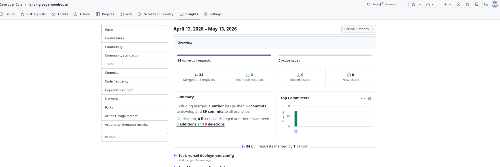
</div>

**Contribuciones por miembro del equipo**

La vista *Contributors* muestra la distribución de commits a lo largo del sprint y la participación de cada integrante del equipo en la implementación de la landing page.

<div align="center">
  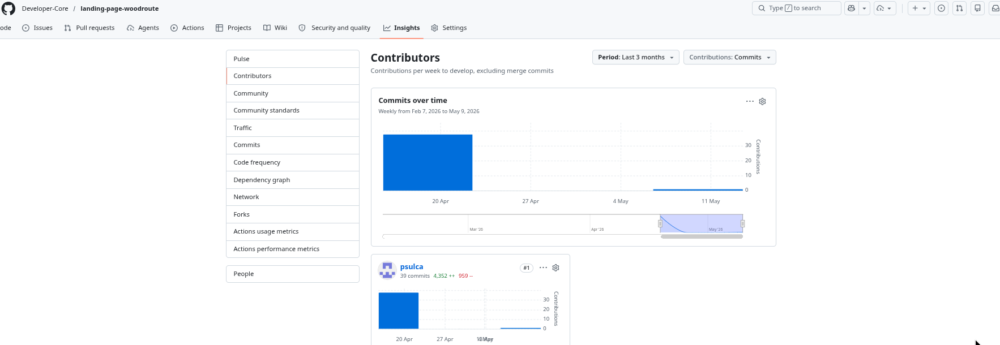
</div>

### 5.2.2. Sprint 2

En este segundo sprint el equipo desarrolló la primera versión funcional del frontend de la aplicación web de WoodRoute, cubriendo los módulos de gestión de pedidos, producción, inventario, contacto y notificaciones, y consulta pública del estado del pedido. La aplicación se integró con un backend simulado mediante JSON Server para habilitar el flujo completo de extremo a extremo sin depender de la implementación del API REST.

#### 5.2.2.1. Sprint Planning 2

| Sprint # | Sprint 2 |
| :--- | :--- |
| **Sprint Planning Background** | |
| Date | 24/04/2026 |
| Time | 3:30 PM |
| Location | Google Meet |
| Prepared By | Sulca Sanchez, Piero Angel |
| Attendees (to planning meeting) | Gonza Morales, Anderson<br>Justo Yauricasa, Alexander Paolo<br>Saldaña De Souza, Juan David<br>Sulca Sanchez, Piero Angel<br>Torres Sanchez, Dalila Victoria |
| **Sprint 1 Review Summary** | Durante el Sprint 1 se entregó la landing page de WoodRoute desplegada en Vercel cubriendo las primeras 10 User Stories del Product Backlog. El equipo cumplió con el Sprint Goal al desplegar el sitio público con la propuesta de valor, los planes de suscripción y la información del equipo. |
| **Sprint 1 Retrospective Summary** | El equipo identificó que la asignación temprana de Aspect Leaders fue clave para coordinar el avance del sprint. Como oportunidad de mejora se planteó iniciar la implementación del frontend de la aplicación web desde el inicio del Sprint 2 trabajando con un mock backend (JSON Server) para no depender de la entrega del API REST, además de mejorar la trazabilidad entre Product Backlog y Sprint Backlog utilizando los identificadores HU directamente. |
| **Sprint Goal & User Stories** | |
| **Sprint 2 Goal** | Nos enfocamos en entregar la primera versión funcional de la aplicación web de WoodRoute cubriendo los módulos de gestión de pedidos, producción, inventario, contacto y notificaciones, y consulta pública del estado del pedido. Creemos que esto entrega un MVP que valida los flujos principales del producto tanto para carpinteros como para clientes. Esto se confirmará cuando la aplicación esté desplegada en Vercel con datos de prueba mediante JSON Server y los flujos prioritarios sean navegables de extremo a extremo. |
| **Sprint 2 Velocity** | 44 |
| **Sum of Story Points** | 44 |

#### 5.2.2.2. Aspect Leaders and Collaborators

| Team Member | GitHub Username | Web Application Frontend | Diseño UI/UX | Documentación |
| :--- | :--- | :--- | :--- | :--- |
| Gonza Morales, Anderson | Ander-U | Colaborador | Colaborador | Colaborador |
| Justo Yauricasa, Alexander Paolo | AlexanderrJusto | Colaborador | Colaborador | Líder |
| Saldaña De Souza, Juan David | jndesouza | Colaborador | Colaborador | Colaborador |
| Sulca Sanchez, Piero Angel | psulca | Líder | Líder | Colaborador |
| Torres Sanchez, Dalila Victoria | DalilaTorres | Colaborador | Colaborador | Colaborador |

#### 5.2.2.3. Sprint Backlog 2

| User Story Id | User Story Title | Work Item/Task Id | Work Item/Task Title | Description | Estimation (SP) | Assigned To | Status |
| :--- | :--- | :--- | :--- | :--- | :--- | :--- | :--- |
| HU17 | Creación de pedido personalizado | T01 | Quote wizard de tres pasos | Implementación del wizard de creación de pedido con tres pasos: datos del mueble, materiales y revisión. | 5 | Piero Sulca | Done |
| HU19 | Aceptación o rechazo de pedidos | T02 | Acciones sobre pedidos pendientes | Implementación de las acciones de aceptación y rechazo desde la vista de detalle del pedido. | 3 | Piero Sulca | Done |
| HU18 | Visualización de pedidos | T03 | Listado de pedidos con filtros | Construcción de la vista de listado de pedidos con filtros por estado. | 3 | Piero Sulca | Done |
| HU24 | Visualización del progreso | T04 | Vista de avance por etapas | Implementación de la vista que muestra el progreso del pedido por etapas para el cliente. | 3 | Piero Sulca | Done |
| HU22 | Definición de etapas de producción | T05 | Configuración de etapas del pedido | Implementación del flujo para definir las etapas de producción de un pedido específico. | 5 | Piero Sulca | Done |
| HU23 | Actualización del estado de producción | T06 | Actualización inline del estado de etapa | Implementación de la actualización del estado de cada etapa desde la vista de producción. | 3 | Piero Sulca | Done |
| HU43 | Consulta pública del estado del pedido | T07 | Vista pública del pedido | Implementación de la vista pública accesible mediante enlace único con el publicTrackingId. | 3 | Piero Sulca | Done |
| HU34 | Contacto directo por WhatsApp | T08 | Botón de contacto por WhatsApp | Implementación del botón de contacto que abre WhatsApp con la otra parte desde el detalle del pedido. | 3 | Piero Sulca | Done |
| HU35 | Notificaciones de avance del pedido | T09 | Listado de notificaciones | Implementación del listado de notificaciones automáticas de avance por pedido. | 3 | Piero Sulca | Done |
| HU36 | Historial de estados y notificaciones del pedido | T10 | Vista de historial de notificaciones | Implementación de la vista que muestra el historial de estados y notificaciones de un pedido. | 2 | Piero Sulca | Done |
| HU25 | Estimación de tiempos por etapa | T11 | Asignación de tiempos a etapas | Implementación del flujo para asignar tiempos estimados a cada etapa de producción. | 5 | Piero Sulca | Done |
| HU26 | Registro de materiales | T12 | Formulario de registro de materiales | Implementación del formulario de registro de nuevos materiales en el inventario. | 3 | Piero Sulca | Done |
| HU27 | Actualización de inventario | T13 | Edición de stock de materiales | Implementación de la actualización inline del stock desde el listado de materiales. | 3 | Piero Sulca | Done |

A continuación se muestra el tablero de Sprint Backlog 2 gestionado por el equipo en Trello, con las tareas distribuidas en sus respectivos estados al cierre del sprint.

<div align="center">
  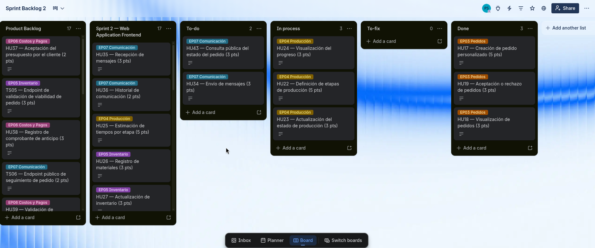
</div>

#### 5.2.2.4. Development Evidence for Sprint Review

En este Sprint el equipo implementó la primera versión funcional de la aplicación web de WoodRoute sobre Vue 3 + Vite, organizada en módulos por bounded context (Pedidos, Producción, Inventario, Cotizaciones, Contacto y notificaciones, y Consulta Pública). El código se integró bajo el modelo GitFlow en el repositorio público <https://github.com/Developer-Core/frontend>. A continuación se listan los commits más representativos del sprint.

| Repository | Branch | Commit Id | Commit Message | Commit Message Body | Commited on (Date) |
| :--- | :--- | :--- | :--- | :--- | :--- |
| Developer-Core/frontend | develop | dc703f2 | chore: initial project setup | Inicialización del proyecto con Vite y Vue 3 como base de la aplicación web. | 13/05/2026 |
| Developer-Core/frontend | develop | 04b84e5 | feat: setup i18n with en and es locales | Configuración de internacionalización con soporte de inglés y español. | 13/05/2026 |
| Developer-Core/frontend | develop | 626618a | feat: setup primevue with aura preset and woodroute design tokens | Integración de PrimeVue con el preset Aura y los design tokens de WoodRoute. | 13/05/2026 |
| Developer-Core/frontend | develop | d9d4f2e | refactor: align base-api and base-endpoint with reference style | Definición de la capa de acceso a APIs sobre Axios siguiendo el estilo CRUD compartido entre módulos. | 13/05/2026 |
| Developer-Core/frontend | develop | dbfb068 | feat: wire orders routes into router | Integración del módulo de pedidos: listado, formulario y vista de seguimiento (HU17, HU18, HU19). | 13/05/2026 |
| Developer-Core/frontend | develop | 6f9500d | chore: setup json-server with db and routes | Configuración del backend simulado con JSON Server, base de datos `db.json` y archivo de rutas. | 14/05/2026 |
| Developer-Core/frontend | develop | ab489f8 | feat: wire production routes, i18n and stages db | Integración del módulo de producción con timeline de etapas y formulario de configuración (HU22, HU23, HU24, HU25). | 14/05/2026 |
| Developer-Core/frontend | develop | 152181f | feat: wire inventory routes, i18n and materials db | Integración del módulo de inventario con listado de materiales, alerta de stock bajo y formulario de registro (HU26, HU27). | 14/05/2026 |
| Developer-Core/frontend | develop | 07727bf | feat: wire quotes routes, i18n and quotes db | Integración del módulo de cotizaciones con quote wizard de tres pasos y cálculo de rentabilidad. | 14/05/2026 |
| Developer-Core/frontend | develop | 68262b5 | feat: register public tracking route and i18n entries | Integración de la vista pública de seguimiento de pedido accesible mediante enlace único (HU43). | 14/05/2026 |
| Developer-Core/frontend | develop | 469aa8e | feat: wire communication routes, i18n and seed conversations | Integración del módulo de contacto y notificaciones del pedido: contacto por WhatsApp y notificaciones de avance (HU34, HU35, HU36). | 14/05/2026 |
| Developer-Core/frontend | develop | 3693cb2 | feat: add app-layout shell | Construcción del shell de la aplicación autenticada con sidebar, breadcrumb y header. | 14/05/2026 |
| Developer-Core/frontend | develop | 20a3f9b | feat: add language-switcher component | Componente selector de idioma incorporado al header del layout autenticado. | 14/05/2026 |
| Developer-Core/frontend | develop | cf7176c | chore: add json-server entrypoint for hosted deploy | Configuración del entrypoint del JSON Server para su despliegue público en Render. | 14/05/2026 |
| Developer-Core/frontend | develop | 4c25f30 | feat: add vercel.json with build config | Configuración del build de la aplicación para el despliegue automático en Vercel. | 14/05/2026 |
| Developer-Core/frontend | develop | 63dc338 | fix: add vercel spa fallback rewrite | Configuración del fallback de Vercel para rutas SPA, asegurando que el router de Vue funcione correctamente en producción. | 14/05/2026 |

#### 5.2.2.5. Execution Evidence for Sprint Review

Durante el Sprint 2 el equipo desplegó la primera versión funcional de la aplicación web de WoodRoute. La aplicación implementa los flujos principales para los carpinteros: gestión de pedidos, planificación de producción por etapas, control de inventario de materiales, cotizaciones, contacto por WhatsApp y notificaciones de avance, y vista pública para consulta del estado del pedido. La internacionalización (inglés y español) está disponible desde el header del layout.

**URL pública de la aplicación web:** <https://frontend-ashen-one-52.vercel.app/>

A continuación se presentan las capturas de las principales vistas implementadas en este sprint.

**Vista 1 — Gestión de Pedidos**

Listado de pedidos del carpintero con filtros por estado y acciones de aceptación, rechazo y cancelación para los pedidos en estado pendiente.

<div align="center">
  
</div>

**Vista 2 — Planificación de Producción**

Configuración por pedido de las etapas de producción (Corte, Lijado, Ensamble, Acabado), con horas estimadas y reales, estado actual de cada etapa y acciones para actualizar el progreso.

<div align="center">
  
</div>

**Vista 3 — Inventario de Materiales**

Listado del inventario con tipos de material, unidad, costo unitario, stock actual, stock mínimo y alertas visuales cuando el material está por debajo del nivel mínimo configurado.

<div align="center">
  
</div>

#### 5.2.2.6. Services Documentation Evidence for Sprint Review

Durante el Sprint 2 el equipo configuró un backend simulado mediante **JSON Server** publicado en **Render**, con el objetivo de habilitar el flujo completo de extremo a extremo de la aplicación web sin depender de la implementación del API REST en .NET. El JSON Server expone un conjunto de endpoints REST sobre un archivo `db.json` que actúa como base de datos en memoria.

**URL base del servicio:** <https://frontend-xkep.onrender.com/api/v1>

**Repositorio asociado:** <https://github.com/Developer-Core/frontend> (carpeta `mock-server/` y archivo `db.json`)

A continuación se listan los endpoints expuestos por el JSON Server. Todos ellos soportan las operaciones HTTP estándar `GET`, `POST`, `PUT`, `PATCH` y `DELETE` según las convenciones de JSON Server.

| Recurso | URL | Métodos soportados | Descripción |
| :--- | :--- | :--- | :--- |
| Orders | `/api/v1/orders` | GET, POST, PUT, PATCH, DELETE | Gestión de pedidos del taller |
| Materials | `/api/v1/materials` | GET, POST, PUT, PATCH, DELETE | Inventario de materiales |
| Stages | `/api/v1/stages` | GET, POST, PUT, PATCH, DELETE | Etapas de producción asociadas a cada pedido |
| Quotes | `/api/v1/quotes` | GET, POST, PUT, PATCH, DELETE | Cotizaciones generadas para cada pedido |
| Notifications | `/api/v1/notifications` | GET, POST, PUT, PATCH, DELETE | Notificaciones automáticas de avance asociadas a cada pedido (la comunicación directa se realiza por WhatsApp) |

A continuación se evidencia el proceso de configuración y despliegue del JSON Server en Render.

**Paso 1: Acceso a Render.**

El equipo accede a la plataforma de Render e inicia el flujo de creación de un nuevo Web Service.

<div align="center">
  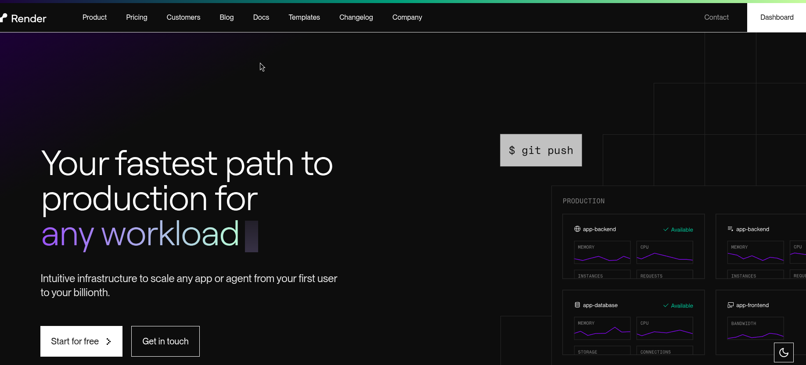
</div>

**Paso 2: Importación del repositorio desde GitHub.**

Desde la sección *New Web Service* se selecciona la organización **Developer-Core** y se importa el repositorio `frontend` que contiene la configuración del JSON Server.

<div align="center">
  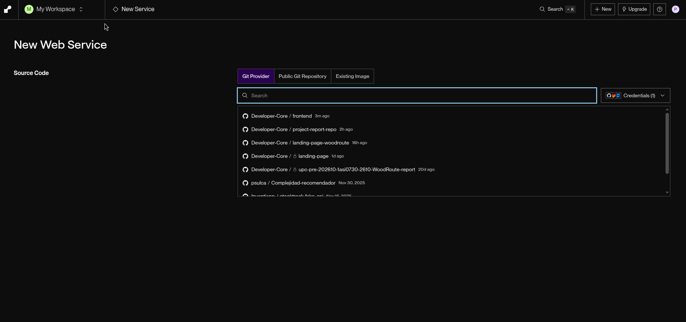
</div>

**Paso 3: Despliegue del servicio.**

Render ejecuta el build del JSON Server y publica el servicio en una URL pública accesible desde la aplicación frontend.

<div align="center">
  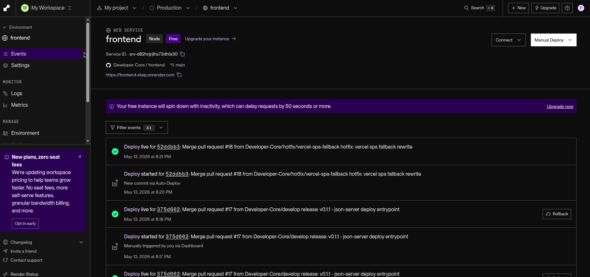
</div>

**Paso 4: Servicio publicado.**

Una vez completado el despliegue, el servicio queda visible en el dashboard de Render con estado *Deployed* y listo para recibir solicitudes desde la aplicación frontend.

<div align="center">
  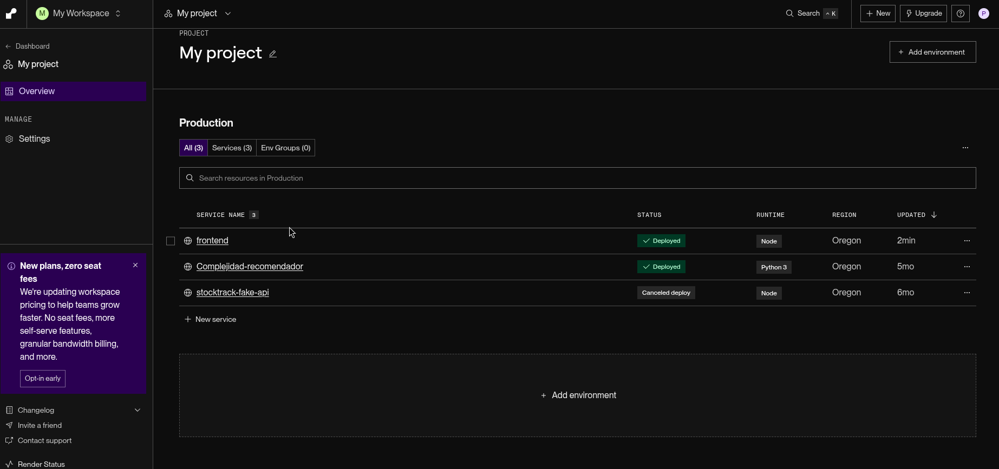
</div>

#### 5.2.2.7. Software Deployment Evidence for Sprint Review

Durante el Sprint 2 el equipo configuró el despliegue continuo de la aplicación web de WoodRoute sobre la plataforma Vercel. Las actividades realizadas comprendieron la importación del repositorio `frontend` desde la organización **Developer-Core**, la configuración del proyecto con el preset de Vite, la definición del fallback para rutas SPA y la activación del despliegue automático ante cada push a la rama `develop`. Como resultado, la aplicación quedó publicada en <https://frontend-ashen-one-52.vercel.app/>. A continuación se evidencian los pasos realizados.

**Paso 1: Importación del repositorio desde GitHub.**

Desde la sección *Import Git Repository* de Vercel se selecciona la organización **Developer-Core** y se importa el repositorio `frontend`.

<div align="center">
  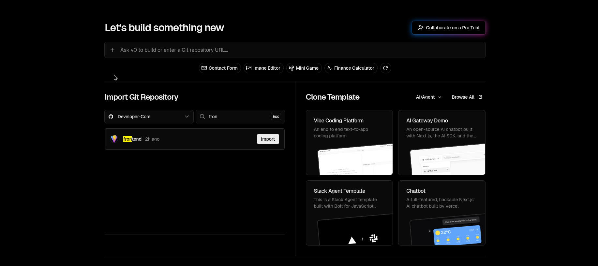
</div>

**Paso 2: Configuración del proyecto.**

Se selecciona el *Application Preset* Vite, se define la rama de despliegue y el *Root Directory*, y se configuran las *Build and Output Settings* junto con las variables de entorno necesarias.

<div align="center">
  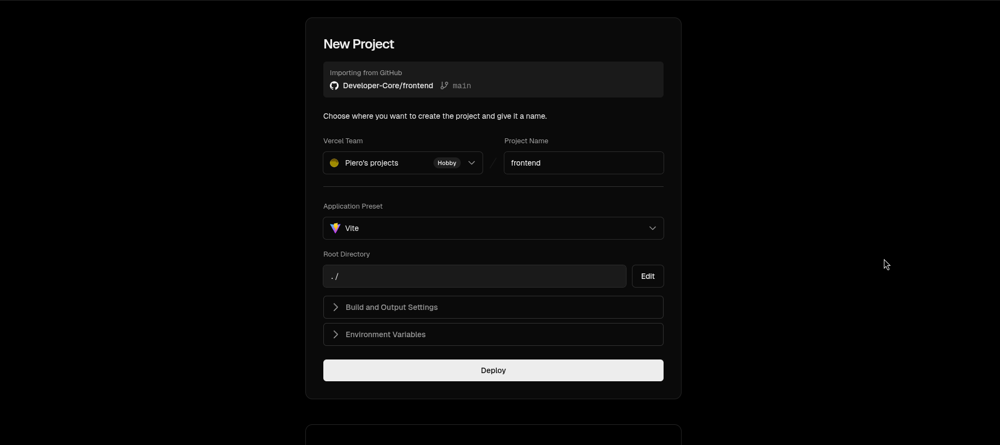
</div>

**Paso 3: Despliegue completado.**

Vercel ejecuta el build, publica la aplicación y entrega la URL pública del entorno, dejando la aplicación accesible para los siguientes pasos del proyecto.

<div align="center">
  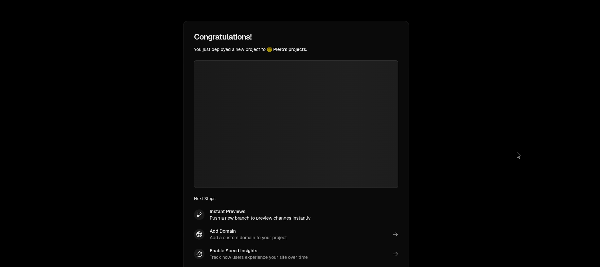
</div>

#### 5.2.2.8. Team Collaboration Insights for Sprint Review

Durante el Sprint 2 la implementación técnica de la aplicación web se concentró en el aspect leader del módulo, mientras que el resto del equipo participó en las ceremonias de Scrum y en la revisión de los entregables. La integración del código se gestionó bajo el modelo GitFlow, con ramas `feature/*` reintegradas a `develop` a través de Pull Requests revisados. A continuación se presenta la captura del analítico de GitHub Insights correspondiente al repositorio `frontend` durante el Sprint 2.

<div align="center">
  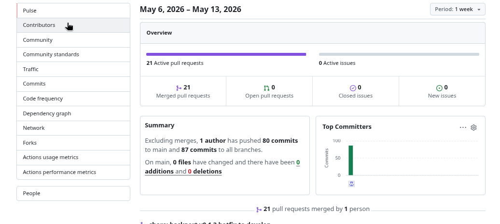
</div>

<div style="page-break-after: always;"></div>

### 5.2.3. Sprint 3

Durante el Sprint 3, el equipo enfocó sus esfuerzos iniciales en la configuración de la arquitectura backend de WoodRoute utilizando .NET 10 y en el diseño inicial de los Web Services. Debido a la complejidad técnica de la integración de la base de datos y cruce de horarios, el avance fue limitado, dejando la implementación completa de los endpoints para el Sprint 4.

#### 5.2.3.1. Sprint Planning 3

| Sprint # | Sprint 3 |
| :--- | :--- |
| **Sprint Planning Background** | |
| Date | 15/05/2026 |
| Time | 4:00 PM |
| Location | Google Meet |
| Prepared By | Sulca Sanchez, Piero Angel |
| Attendees (to planning meeting) | Gonza Morales, Anderson<br>Justo Yauricasa, Alexander Paolo<br>Saldaña De Souza, Juan David<br>Sulca Sanchez, Piero Angel<br>Torres Sanchez, Dalila Victoria |
| **Sprint 2 Review Summary** | Durante el Sprint 2 se entregó la primera versión del frontend con flujos principales utilizando un backend simulado en JSON Server. El equipo cumplió con el Sprint Goal al desplegar la web de prueba en Vercel. |
| **Sprint 2 Retrospective Summary** | El equipo identificó que JSON Server permitió avanzar el frontend sin bloqueos, pero ahora se requiere la integración con el backend real. Como oportunidad de mejora, se estableció la necesidad de coordinar mejor los horarios de disponibilidad del equipo para el Sprint 3. |
| **Sprint Goal & User Stories** | |
| **Sprint 3 Goal** | Nuestro objetivo es establecer la estructura base del backend con .NET 10, configurar el acceso a datos y preparar el entorno de despliegue de los Web Services. Creemos que esto nos dará la base técnica sólida. Esto se confirmará cuando el proyecto base del API se ejecute sin errores en los entornos de desarrollo locales. |
| **Sprint 3 Velocity** | 15 (Reducida temporalmente) |
| **Sum of Story Points** | 15 |

#### 5.2.3.2. Aspect Leaders and Collaborators

| Team Member | GitHub Username | Backend (.NET) | Base de Datos | Documentación |
| :--- | :--- | :--- | :--- | :--- |
| Gonza Morales, Anderson | Ander-U | Colaborador | Colaborador | Líder |
| Justo Yauricasa, Alexander Paolo | AlexanderrJusto | Colaborador | Colaborador | Colaborador |
| Saldaña De Souza, Juan David | jndesouza | Colaborador | Líder | Colaborador |
| Sulca Sanchez, Piero Angel | psulca | Líder | Colaborador | Colaborador |
| Torres Sanchez, Dalila Victoria | DalilaTorres | Colaborador | Colaborador | Colaborador |

#### 5.2.3.3. Sprint Backlog 3

| User Story Id | User Story Title | Work Item/Task Id | Work Item/Task Title | Description | Estimation (SP) | Assigned To | Status |
| :--- | :--- | :--- | :--- | :--- | :--- | :--- | :--- |
| TS01 | Tarea Técnica | T01 | Setup inicial proyecto .NET 10 | Creación de la solución y estructura de carpetas (Domain, Application, Infrastructure, API). | 5 | Juan David Saldaña | Done |
| TS02 | Tarea Técnica | T02 | Configuración Entity Framework | Instalación de dependencias y configuración del DbContext. | 5 | Anderson Gonza Morales | In Progress |
| TS03 | Tarea Técnica | T03 | Diseño inicial de controladores | Creación de los controladores vacíos para Orders y Materials. | 5 | Piero Sulca Sanchez | In Progress |

A continuación se muestra el tablero de Sprint Backlog 3 gestionado por el equipo en Trello, mostrando el progreso de este sprint corto.

<div align="center">
  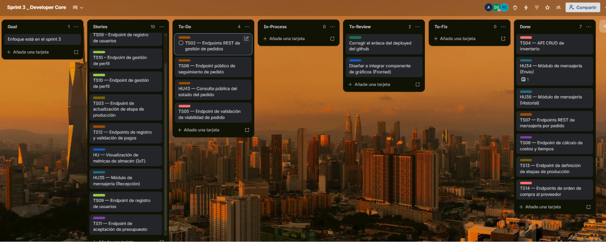
</div>

#### 5.2.3.4. Development Evidence for Sprint Review

Durante este sprint, el avance de desarrollo se limitó a la creación de la estructura base de la solución backend.

| Repository | Branch | Commit Id | Commit Message | Commit Message Body | Commited on (Date) |
| :--- | :--- | :--- | :--- | :--- | :--- |
| Developer-Core/backend | develop | a1b2c3d | chore: sprint 3 complete | Inicialización del proyecto backend en .NET 10 con la estructura de capas (Domain, App, Infra) y cierre del sprint. | 17/05/2026 |

#### 5.2.3.5. Execution Evidence for Sprint Review

La ejecución principal ha sido comprobar que el entorno de desarrollo .NET compile correctamente con el comando `dotnet build` sin errores, dejando la implementación de la lógica de negocio y endpoints operativos pendientes para el siguiente sprint.

#### 5.2.3.6. Services Documentation Evidence for Sprint Review

Debido a que los Web Services de .NET aún no han completado su desarrollo en este sprint, la documentación autogenerada de la API mediante Swagger (OpenAPI) se registrará durante el Sprint 4 una vez los endpoints se encuentren totalmente implementados.

#### 5.2.3.7. Software Deployment Evidence for Sprint Review

La configuración de CI/CD para el backend hacia la nube (como Azure, AWS o Render) se pospuso para el Sprint 4, a la espera de contar con un API estable.

#### 5.2.3.8. Team Collaboration Insights for Sprint Review

Durante el Sprint 3, la colaboración estuvo enfocada principalmente en reuniones técnicas y el modelado de la base de datos. El volumen de commits fue menor, lo cual se ajustará incrementando el ritmo y la carga de tareas en el Sprint 4.

### 5.2.4. Sprint 4

En este cuarto sprint el equipo completó la implementación del backend real de WoodRoute sobre .NET 10 con una arquitectura de monolito modular DDD/CQRS, integró la aplicación web con el API REST reemplazando el backend simulado (JSON Server) y desplegó el sistema completo en la nube: el backend sobre Render (contenedor Docker) y la aplicación web sobre Vercel. Durante la integración se refinó el modelo de dominio hacia una herramienta interna de taller, en la que el carpintero es el único rol con inicio de sesión, los clientes se administran como registros del taller (CRM) con cuenta opcional, y el seguimiento del cliente se realiza mediante un enlace público.

#### 5.2.4.1. Sprint Planning 4

| Sprint # | Sprint 4 |
| :--- | :--- |
| **Sprint Planning Background** | |
| Date | 30/06/2026 |
| Time | 4:00 PM |
| Location | Google Meet |
| Prepared By | Sulca Sanchez, Piero Angel |
| Attendees (to planning meeting) | Gonza Morales, Anderson<br>Saldaña De Souza, Juan David<br>Sulca Sanchez, Piero Angel |
| **Sprint 3 Review Summary** | Durante el Sprint 3 se estableció la estructura base del backend en .NET 10 con la separación por capas y el diseño inicial de los controladores y el acceso a datos. El avance fue limitado por la complejidad de la integración y el cruce de horarios, dejando la implementación completa de los endpoints para el Sprint 4. |
| **Sprint 3 Retrospective Summary** | El equipo identificó que el ritmo de desarrollo del backend debía incrementarse y concentrarse en un responsable técnico para desbloquear la integración con el frontend. Como oportunidad de mejora se estableció completar todos los bounded contexts, conectar la aplicación web con el API real y llevar ambos entregables a producción dentro del sprint. |
| **Sprint Goal & User Stories** | |
| **Sprint 4 Goal** | Nos enfocamos en completar el backend real de WoodRoute con .NET 10 cubriendo todos los bounded contexts (Identidad, Clientes, Ventas, Producción, Inventario y Seguimiento), integrar la aplicación web con el API REST y desplegar el sistema completo en la nube. Creemos que esto entrega el producto funcional de extremo a extremo con datos reales y persistentes. Esto se confirmará cuando el backend esté desplegado en Render, la aplicación web en Vercel consuma el API real y los flujos prioritarios del taller sean operativos en producción. |
| **Sprint 4 Velocity** | 50 |
| **Sum of Story Points** | 50 |

#### 5.2.4.2. Aspect Leaders and Collaborators

| Team Member | GitHub Username | Backend (.NET) | Web Application Frontend | DevOps / Despliegue | Documentación |
| :--- | :--- | :--- | :--- | :--- | :--- |
| Gonza Morales, Anderson | Ander-U | Colaborador | Colaborador | Colaborador | Líder |
| Saldaña De Souza, Juan David | jndesouza | Colaborador | Colaborador | Colaborador | Colaborador |
| Sulca Sanchez, Piero Angel | psulca | Líder | Líder | Líder | Colaborador |

#### 5.2.4.3. Sprint Backlog 4

| User Story Id | User Story Title | Work Item/Task Id | Work Item/Task Title | Description | Estimation (SP) | Assigned To | Status |
| :--- | :--- | :--- | :--- | :--- | :--- | :--- | :--- |
| TS01 | Tarea Técnica | T01 | Autenticación e identidad (IAM) | Implementación del registro con código de invitación para carpinteros, login con JWT y autorización por roles. | 5 | Piero Sulca Sanchez | Done |
| TS02 | Tarea Técnica | T02 | Bounded context de Clientes (CRM) | Implementación del agregado Customer con cuenta opcional y endpoints CRUD para la cartera de clientes del taller. | 3 | Piero Sulca Sanchez | Done |
| TS03 | Tarea Técnica | T03 | Endpoints de Ventas (pedidos, cotización y pagos) | Implementación del ciclo de vida del pedido, la generación y aceptación de cotización, y el registro y validación de pagos. | 8 | Piero Sulca Sanchez | Done |
| TS04 | Tarea Técnica | T04 | Endpoints de Producción por etapas | Implementación de la definición y edición de etapas, el avance de estado y el cálculo de progreso del pedido. | 5 | Piero Sulca Sanchez | Done |
| TS05 | Tarea Técnica | T05 | Endpoints de Inventario | Implementación del registro y actualización de materiales con control de stock mínimo. | 3 | Anderson Gonza Morales | Done |
| TS06 | Tarea Técnica | T06 | Seguimiento público con etapas reales | Implementación del endpoint público que expone las etapas reales de producción y la fecha estimada de entrega. | 3 | Piero Sulca Sanchez | Done |
| TS07 | Tarea Técnica | T07 | Bandeja de pedidos y modelo por rol | Implementación de pedidos sin asignar reclamables por el carpintero y de la creación de pedidos dirigida por rol. | 5 | Piero Sulca Sanchez | Done |
| TS08 | Tarea Técnica | T08 | Integración frontend ↔ backend real | Reemplazo del backend simulado (JSON Server) por el API REST en .NET en todos los módulos de la aplicación web. | 8 | Piero Sulca Sanchez | Done |
| TS09 | Tarea Técnica | T09 | Despliegue del backend en Render | Configuración del contenedor Docker, la política de CORS y el despliegue continuo del API sobre Render. | 3 | Piero Sulca Sanchez | Done |
| TS10 | Tarea Técnica | T10 | Despliegue de la aplicación web en Vercel | Publicación de la aplicación web integrada con el API real sobre Vercel con despliegue automático. | 2 | Piero Sulca Sanchez | Done |
| TS11 | Tarea Técnica | T11 | Documentación de servicios con Swagger | Habilitación de la documentación OpenAPI con esquema de seguridad JWT sobre el API desplegado. | 2 | Piero Sulca Sanchez | Done |
| TS12 | Tarea Técnica | T12 | Endurecimiento de reglas de negocio | Refuerzo de las reglas del dominio: derivación del actor desde el JWT y cierre del pedido solo tras el pago total. | 3 | Piero Sulca Sanchez | Done |

A continuación se muestra el tablero de Sprint Backlog 4 gestionado por el equipo en Trello, con las tareas distribuidas en sus respectivos estados al cierre del sprint.

<div align="center">
  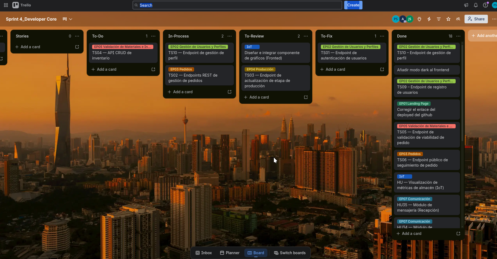
</div>

#### 5.2.4.4. Development Evidence for Sprint Review

Durante este sprint el equipo implementó el backend real de WoodRoute sobre .NET 10 con una arquitectura de monolito modular DDD/CQRS organizada por bounded contexts (Identidad, Clientes, Ventas, Producción, Inventario y Seguimiento y Comunicación), e integró la aplicación web con el API REST. El código se gestionó bajo el modelo GitFlow en los repositorios públicos <https://github.com/Developer-Core/wood-route-platform> (backend) y <https://github.com/Developer-Core/frontend> (frontend). A continuación se listan los commits más representativos del sprint.

| Repository | Branch | Commit Id | Commit Message | Commit Message Body | Commited on (Date) |
| :--- | :--- | :--- | :--- | :--- | :--- |
| Developer-Core/wood-route-platform | develop | d16bb1b | feat: add user aggregate to iam domain | Definición del agregado User del contexto de Identidad con email único, hash de contraseña y rol. | 03/07/2026 |
| Developer-Core/wood-route-platform | develop | e11b967 | feat: add jwt token service | Servicio de emisión de tokens JWT para la autenticación de los usuarios del taller. | 03/07/2026 |
| Developer-Core/wood-route-platform | develop | 401587f | feat: add authentication controller | Controlador de autenticación con los endpoints de registro e inicio de sesión. | 03/07/2026 |
| Developer-Core/wood-route-platform | develop | 304beaf | feat: protect endpoints and allow anonymous auth and tracking | Middleware de autorización que protege los endpoints y habilita el acceso anónimo a autenticación y seguimiento público. | 03/07/2026 |
| Developer-Core/wood-route-platform | develop | b3b86a1 | feat: add CORS policy and Render deployment configuration | Configuración de la política de CORS y del contenedor Docker para el despliegue del API en Render. | 06/07/2026 |
| Developer-Core/wood-route-platform | develop | af7452c | feat: expose real production stages and estimated delivery in public tracking | Seguimiento público que expone las etapas reales de producción y la fecha estimada de entrega. | 06/07/2026 |
| Developer-Core/wood-route-platform | develop | 862d27a | feat(iam): add invitation-gated carpenter registration | Registro de carpinteros protegido por un código de invitación del taller. | 06/07/2026 |
| Developer-Core/wood-route-platform | develop | c9e1c2b | feat(customers): add customers bounded-context for the workshop crm | Contexto de Clientes con el agregado Customer y cuenta opcional para la cartera del taller. | 06/07/2026 |
| Developer-Core/wood-route-platform | develop | a85038a | feat(sales): make orders customer-based and role-driven | Pedidos basados en el cliente del taller y creación dirigida por el rol del usuario. | 06/07/2026 |
| Developer-Core/wood-route-platform | develop | bdd5295 | feat(sales): support unassigned orders and a carpenter claim-pool | Bandeja de pedidos sin asignar que cualquier carpintero puede reclamar al aceptarlos. | 06/07/2026 |
| Developer-Core/wood-route-platform | develop | 0bdba27 | feat(manufacturing): allow editing stages before start and expose order progress | Edición de etapas antes de iniciar la producción y exposición del progreso del pedido. | 06/07/2026 |
| Developer-Core/wood-route-platform | develop | 6c75eb1 | fix(sales): require full payment before completing an order | El pedido solo se cierra una vez que el pago total ha sido confirmado. | 06/07/2026 |
| Developer-Core/frontend | develop | d3420fb | feat(customers): add customers-crm module, landing and name-resolution | Módulo de Clientes (CRM), landing pública con búsqueda de seguimiento y resolución de nombres. | 06/07/2026 |
| Developer-Core/frontend | develop | 66c6a53 | feat(orders): rework orders for the workshop-tool model | Rediseño de pedidos al modelo de taller: creación por rol, bandeja y contacto por WhatsApp. | 06/07/2026 |
| Developer-Core/frontend | develop | c00ebee | feat(inventory): rewire inventory to the real backend contract | Reconexión del módulo de inventario al contrato del backend real. | 06/07/2026 |
| Developer-Core/frontend | develop | ce31717 | feat(production): rewire production stages to the real backend contract | Reconexión del módulo de producción por etapas al backend real. | 06/07/2026 |
| Developer-Core/frontend | develop | b0cf85d | feat(shell): role-based sidebar navigation and layout | Navegación y shell de la aplicación con opciones según el rol del usuario. | 06/07/2026 |
| Developer-Core/frontend | develop | 0421f9b | feat(shared): add global toast feedback for user actions | Feedback global mediante toasts en las acciones del usuario. | 06/07/2026 |
| Developer-Core/frontend | develop | 3e364e8 | feat(production): edit stages before start and show order progress | Edición de etapas y columna de progreso del pedido en la aplicación web. | 06/07/2026 |
| Developer-Core/frontend | develop | f4be2b1 | feat(ui): implement global dark mode theme and fix component backgrounds | Tema oscuro global de la aplicación con conmutador desde el header. | 06/07/2026 |
| Developer-Core/frontend | develop | 352f0e3 | feat(shared): add reusable brand-logo component | Componente reutilizable del logotipo de marca aplicado en las vistas. | 06/07/2026 |

#### 5.2.4.5. Execution Evidence for Sprint Review

Durante el Sprint 4 el equipo integró la aplicación web con el backend real y desplegó el sistema completo. La aplicación implementa el flujo de extremo a extremo del taller sobre datos reales y persistentes: registro del carpintero con código de invitación, administración de clientes (CRM), creación y reclamo de pedidos, generación y aceptación de cotización, registro y validación de pagos, planificación y avance de la producción por etapas, y consulta pública del estado del pedido mediante enlace. La aplicación soporta internacionalización (inglés y español) y tema claro/oscuro.

**URL pública de la aplicación web:** <https://frontend-ashen-one-52.vercel.app/>

A continuación se presentan las capturas de las principales vistas del producto integrado.

**Vista 1 — Landing pública y consulta de seguimiento**

Página pública de WoodRoute con el ingreso del código de seguimiento para el cliente y el acceso al portal del taller.

<div align="center">
  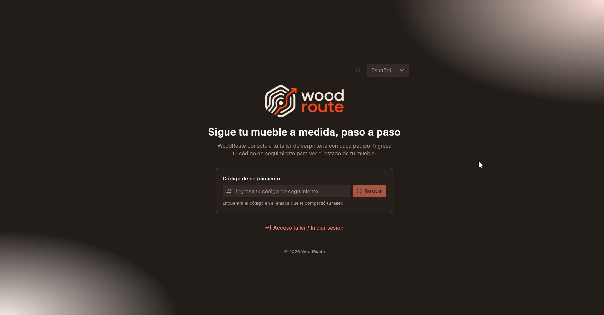
</div>

**Vista 2 — Registro del taller con código de invitación**

Registro del carpintero mediante el código de invitación del taller, que crea la cuenta autenticada con JWT contra el backend real.

<div align="center">
  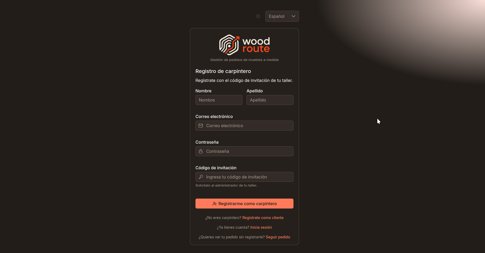
</div>

**Vista 3 — Gestión de pedidos**

Listado de pedidos del carpintero con el cliente, el estado, la cotización y el progreso de producción (X/Y etapas) de cada pedido.

<div align="center">
  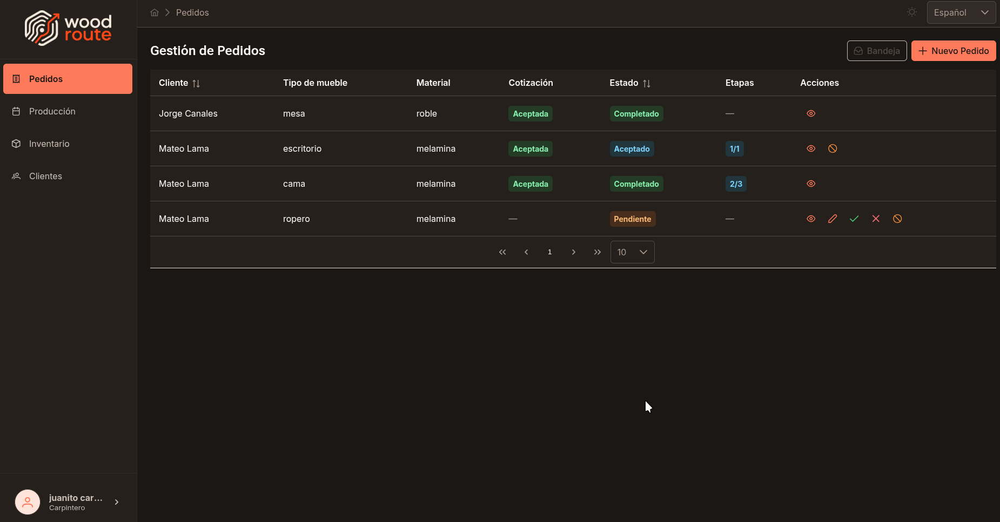
</div>

**Vista 4 — Creación de un pedido**

Formulario de registro de un pedido para un cliente del taller, con la selección del cliente, las dimensiones del mueble y las notas de diseño.

<div align="center">
  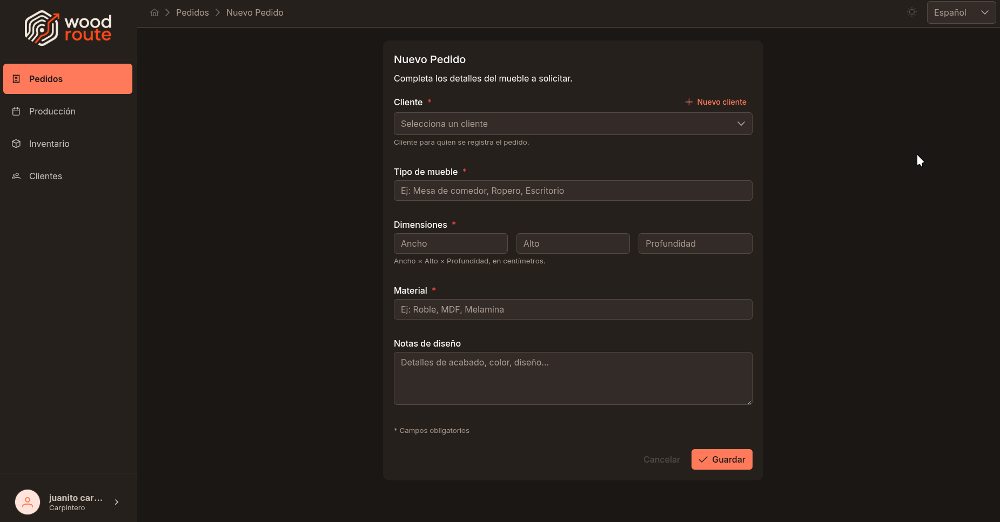
</div>

**Vista 5 — Planificación de producción**

Definición y edición de las etapas de producción de un pedido, el avance de su estado y las acciones de ciclo de vida (iniciar producción, marcar listo y completar).

<div align="center">
  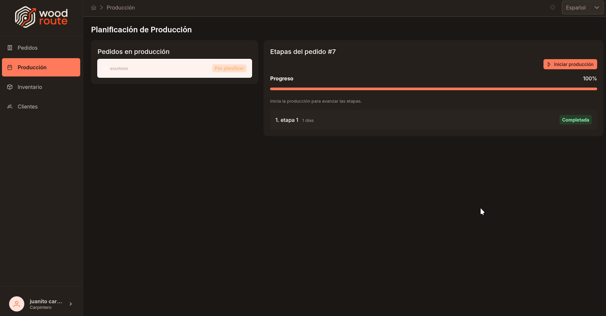
</div>

**Vista 6 — Inventario de materiales**

Listado del inventario del taller con el tipo de material, la unidad, el stock actual y el mínimo, con acciones de ajuste de stock y registro de nuevos materiales.

<div align="center">
  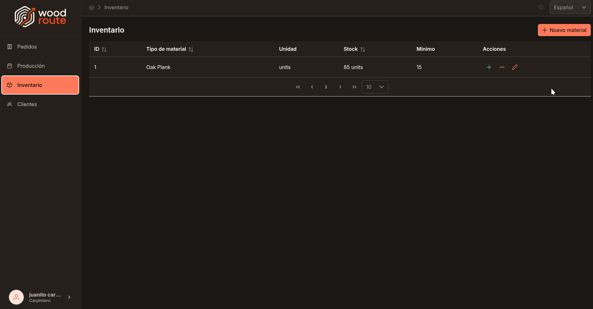
</div>

**Vista 7 — Administración de clientes (CRM)**

Cartera de clientes del taller, con el registro de clientes sin cuenta y el enlace opcional a una cuenta de la plataforma.

<div align="center">
  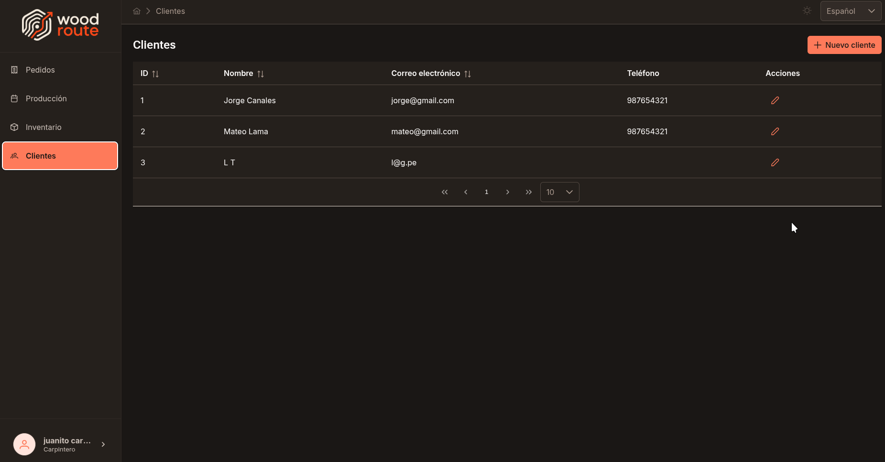
</div>

**Vista 8 — Seguimiento público del pedido**

Vista pública accesible mediante el código de seguimiento, con las etapas reales de producción y la fecha estimada de entrega.

<div align="center">
  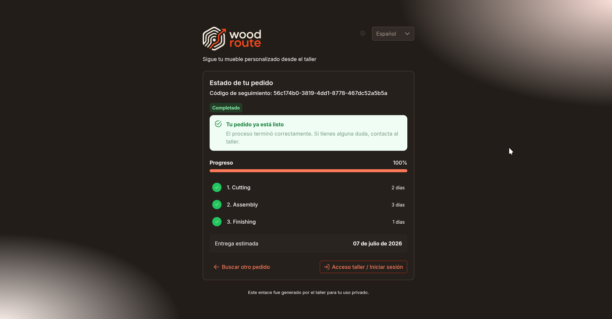
</div>

#### 5.2.4.6. Services Documentation Evidence for Sprint Review

Durante el Sprint 4 el equipo implementó el API REST real de WoodRoute sobre **.NET 10** con una arquitectura de monolito modular DDD/CQRS y persistencia sobre **PostgreSQL** mediante Entity Framework Core. El servicio expone su documentación autogenerada mediante **Swagger (OpenAPI)**, incluyendo el esquema de seguridad JWT Bearer para las operaciones autenticadas.

**URL base del servicio:** <https://wood-route-platform.onrender.com/api/v1>

**Documentación Swagger:** <https://wood-route-platform.onrender.com/swagger>

**Repositorio asociado:** <https://github.com/Developer-Core/wood-route-platform>

A continuación se listan los principales recursos expuestos por el API REST.

| Recurso | URL | Métodos principales | Descripción |
| :--- | :--- | :--- | :--- |
| Autenticación | `/api/v1/auth` | POST | Registro de cliente, registro de carpintero con código de invitación e inicio de sesión con JWT |
| Usuarios | `/api/v1/users` | GET | Directorio de usuarios del taller, filtrable por rol (autenticado) |
| Clientes | `/api/v1/customers` | GET, POST, PUT | Cartera de clientes del taller (CRM) con cuenta opcional |
| Pedidos | `/api/v1/orders` | GET, POST, PATCH | Ciclo de vida del pedido: creación, bandeja, aceptación, cotización y transiciones |
| Pagos | `/api/v1/orders/{id}/payments` | POST, PATCH | Registro y validación de los comprobantes de pago del pedido |
| Etapas de producción | `/api/v1/orders/{id}/stages` | GET, POST, PUT, PATCH | Definición, edición y avance de las etapas de producción |
| Inventario | `/api/v1/inventory` | GET, POST, PATCH | Registro y actualización de materiales con control de stock |
| Seguimiento público | `/api/v1/tracking/{publicTrackingId}` | GET | Consulta anónima del estado y las etapas del pedido |

A continuación se evidencia la documentación Swagger del API desplegado, que agrupa los endpoints por recurso con sus operaciones y esquemas, e incorpora el botón *Authorize* con el esquema de seguridad JWT Bearer para autenticar las solicitudes a los endpoints protegidos.

<div align="center">
  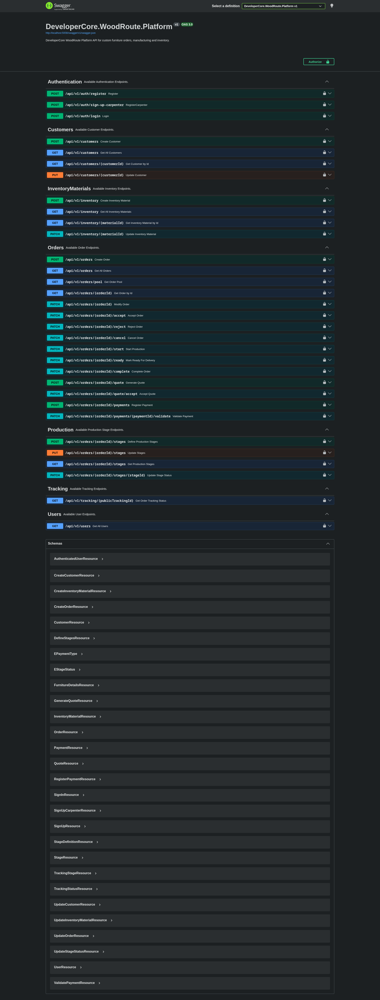
</div>

#### 5.2.4.7. Software Deployment Evidence for Sprint Review

Durante el Sprint 4 el equipo configuró el despliegue continuo de ambos entregables en la nube. El backend en .NET se empaqueta como un contenedor **Docker** y se publica sobre **Render**, mientras que la aplicación web se despliega sobre **Vercel**. Ambos despliegues se ejecutan automáticamente ante cada integración a la rama principal.

**URL del backend:** <https://wood-route-platform.onrender.com>

**URL de la aplicación web:** <https://frontend-ashen-one-52.vercel.app/>

**Paso 1: Importación del repositorio en Render.**

Desde Render se crea un *Blueprint* y se importa el repositorio `wood-route-platform` de la organización **Developer-Core**, sobre el que se define la infraestructura como código.

<div align="center">
  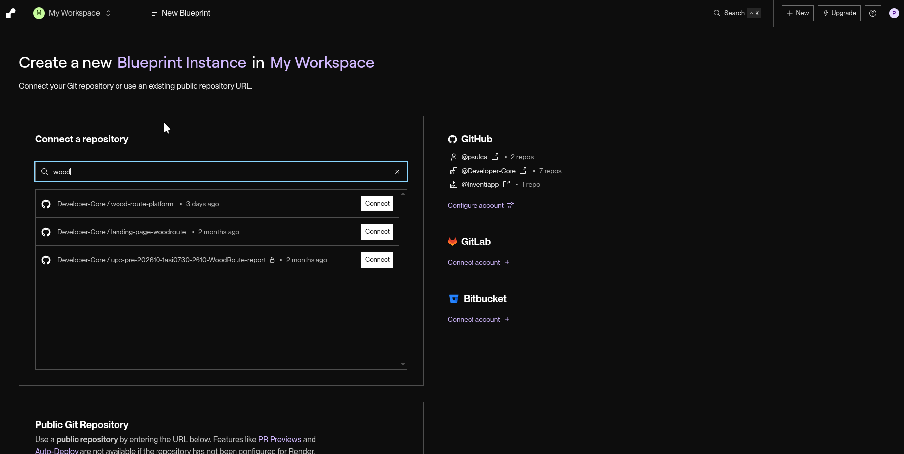
</div>

**Paso 2: Configuración del Blueprint.**

Se configura el *Blueprint* WoodRoute apuntando a la rama principal del repositorio, desde la que Render lee la definición de los servicios (`render.yaml`).

<div align="center">
  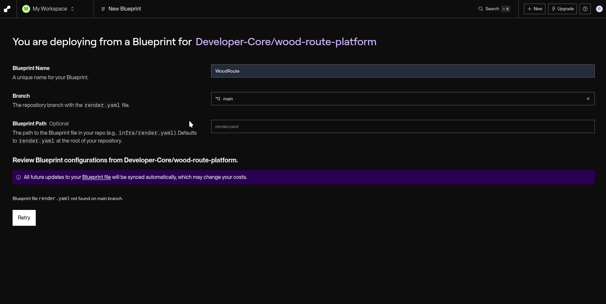
</div>

**Paso 3: Servicios desplegados en Render.**

Render sincroniza el *Blueprint* y crea los servicios: la base de datos PostgreSQL `wood-route-db` y el servicio web `wood-route-platform`, ejecutándose sobre un contenedor Docker con despliegue continuo ante cada integración a la rama principal.

<div align="center">
  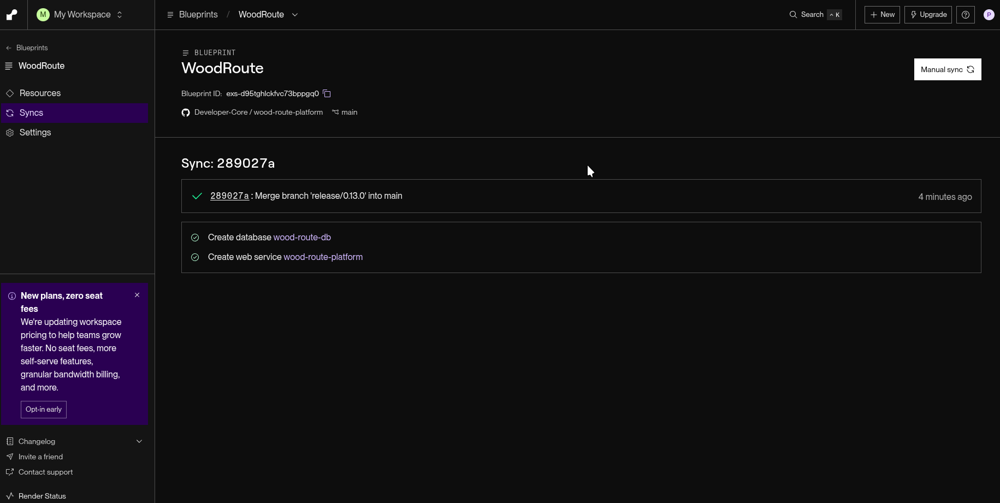
</div>

**Paso 4: Aplicación web desplegada en Vercel.**

La aplicación web integrada con el API real queda publicada sobre Vercel con despliegue automático y URL pública.

<div align="center">
  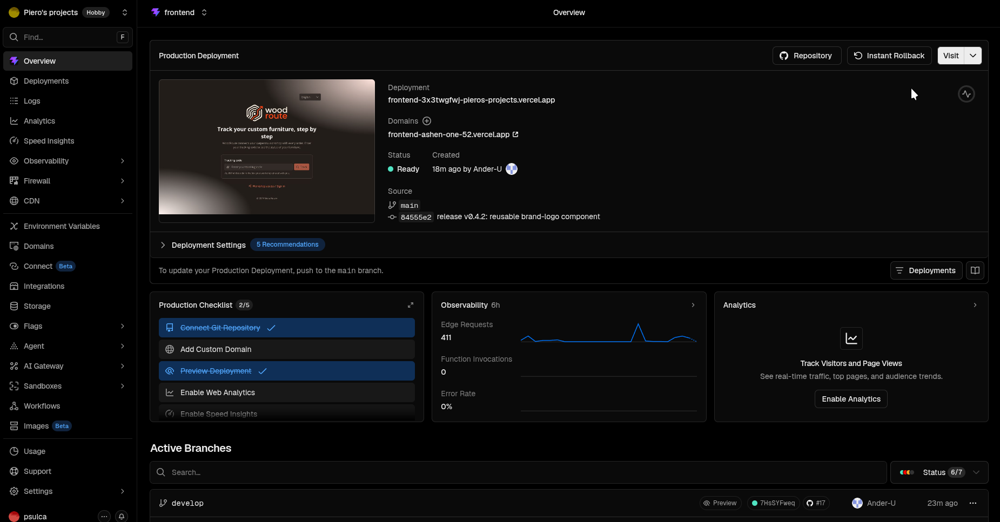
</div>

#### 5.2.4.8. Team Collaboration Insights for Sprint Review

Durante el Sprint 4 la colaboración se concentró en la implementación técnica del backend y su integración con la aplicación web, gestionada bajo el modelo GitFlow con ramas `feature/*` reintegradas a `develop` y promovidas a `main` mediante ramas `release/*` versionadas. A continuación se presentan las capturas del analítico de GitHub Insights correspondientes a los repositorios `wood-route-platform` y `frontend` durante el Sprint 4.

<div align="center">
  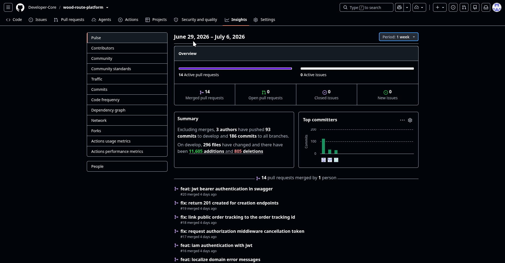
</div>

<div align="center">
  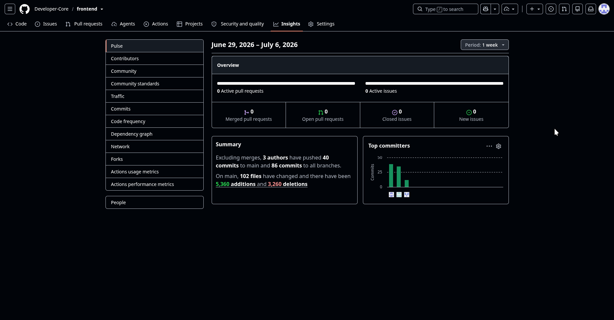
</div>


## 5.3. Validation Interviews. 

### 5.3.1. Diseño de Entrevistas. 

**Segmento 1: Carpintero/Taller**

- Al ver cómo "Wood Route" registra los pedidos en el sistema, ¿sientes que este flujo reemplazaría bien a tu método actual (cuadernos, Excel, WhatsApp)?

- ¿Qué te parece la forma en que la aplicación evalúa tu carga de trabajo actual para ayudarte a decidir si puedes o no aceptar un pedido nuevo?

- Revisando el módulo de materiales en la app, ¿consideras que te ayudaría efectivamente a evitar detener un trabajo por falta de insumos a mitad del proceso?

- Te mostré la función que le da al cliente un enlace para seguir el avance de su mueble en tiempo real. ¿Crees que esto reducirá las llamadas y mensajes preguntando por el estado de sus pedidos?

- De todas las pantallas y funciones que viste en la gestión del taller, ¿cuál sientes que te ahorraría más horas de trabajo administrativo?

- ¿Consideras que la transparencia que ofrece "Wood Route" con las fechas de entrega y el registro de cambios ayudará a evitar malos entendidos con tus clientes?

- Qué te pareció la sección de control de inventario de la aplicación? ¿La encontraste lo suficientemente fácil de usar como para evitar sorpresas de stock en el día a día?

- Si has intentado usar otras herramientas digitales antes, ¿qué ventaja principal o qué dificultad le ves a "Wood Route" en comparación con esas experiencias pasadas?

- Ahora que viste en acción cómo la aplicación cruza automáticamente tu capacidad con el stock y mantiene informado al cliente, ¿te ves usándola todos los días en tu taller? ¿Por qué sí o por qué no?


**Segmento 2: Cliente**

- Al acceder a la vista pública de seguimiento de tu pedido mediante el enlace, ¿qué tan fácil te resultó entender en qué etapa de fabricación se encuentra tu mueble?

- ¿Sientes que la información mostrada sobre las fechas estimadas y el progreso (Corte, Lijado, Ensamble, etc.) te da la tranquilidad necesaria mientras esperas tu pedido?

- En comparación con preguntar directamente por WhatsApp o llamar por teléfono al taller, ¿consideras que esta vista de seguimiento resuelve tus dudas de manera más rápida y cómoda?

- Si el carpintero actualiza un avance y lo ves reflejado inmediatamente en esta pantalla, ¿sientes mayor confianza y transparencia en el trabajo que está realizando?

- Al revisar la vista de seguimiento, ¿hubo algún dato o información adicional sobre tu mueble que buscaste y sentiste que faltaba?

- ¿Qué tan útil te pareció la funcionalidad de enviar un mensaje directamente desde esta vista en caso de tener alguna consulta rápida sobre el avance?

- Al probar la interfaz desde una tablet, ¿la sentiste rápida, intuitiva y fácil de leer sin tener que crear una cuenta o descargar una aplicación?

- ¿Crees que el hecho de que un taller te ofrezca este nivel de tecnología y transparencia influiría en tu decisión de volver a contratarlos o de recomendarlos a un amigo?

- En general, ¿qué mejora o detalle visual le cambiarías a esta página para que sientas que la experiencia de seguimiento es perfecta?

### 5.3.2. Registro de Entrevistas. 

#### Segmento 1: Carpintero/Taller

**Entrevista 1**

**Entrevistador:** Anderson Gonza Morales

**Entrevistado:** Leonardo Fabian

**Link de la entrevista:** <a href="https://upcedupe-my.sharepoint.com/:v:/g/personal/u202120836_upc_edu_pe/IQDjSttI2SJXTIs2CkJY19bYAWduWxNx2xtM1qVi9kUmDIc?nav=eyJyZWZlcnJhbEluZm8iOnsicmVmZXJyYWxBcHAiOiJPbmVEcml2ZUZvckJ1c2luZXNzIiwicmVmZXJyYWxBcHBQbGF0Zm9ybSI6IldlYiIsInJlZmVycmFsTW9kZSI6InZpZXciLCJyZWZlcnJhbFZpZXciOiJNeUZpbGVzTGlua0NvcHkifX0&e=c5TJER">https://upcedupe-my.sharepoint.com/:v:/g/personal/u202120836_upc_edu_pe/IQDjSttI2SJXTIs2CkJY19bYAWduWxNx2xtM1qVi9kUmDIc?nav=eyJyZWZlcnJhbEluZm8iOnsicmVmZXJyYWxBcHAiOiJPbmVEcml2ZUZvckJ1c2luZXNzIiwicmVmZXJyYWxBcHBQbGF0Zm9ybSI6IldlYiIsInJlZmVycmFsTW9kZSI6InZpZXciLCJyZWZlcnJhbFZpZXciOiJNeUZpbGVzTGlua0NvcHkifX0&e=c5TJER</a>

<div align="center">
  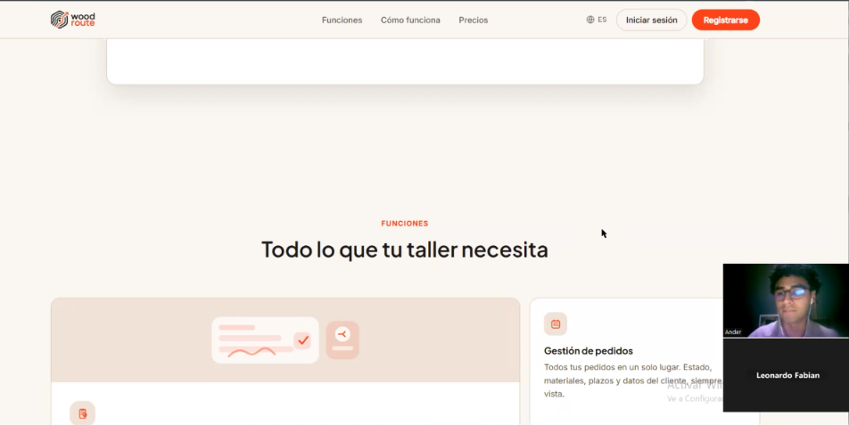
</div>

**Resumen de la entrevista:** 

Para esta entrevista de validación a Leonardo, se le mostró lo trabajado en la Landing Page y Web Application. Él nos comenta que le parece facil de usar y ubicar los elementos visuales e organización usada. Igualmente, le gustó la funcionalidad del inventario, menciona que es la que mas le llamo la atencion ya le ayudaria muchisimo a la hora de hacer un trabajo.


#### Segmento 2: Cliente

**Entrevista 1**

**Entrevistador:** Anderson Gonza Morales

**Entrevistado:** Oscar Armas

**Link de la entrevista:** <a href="https://upcedupe-my.sharepoint.com/:v:/g/personal/u202120836_upc_edu_pe/IQBubg81zfxSSpNuAaL50EjhATHdg5QGg5ERPTzYk24rfgc?nav=eyJyZWZlcnJhbEluZm8iOnsicmVmZXJyYWxBcHAiOiJPbmVEcml2ZUZvckJ1c2luZXNzIiwicmVmZXJyYWxBcHBQbGF0Zm9ybSI6IldlYiIsInJlZmVycmFsTW9kZSI6InZpZXciLCJyZWZlcnJhbFZpZXciOiJNeUZpbGVzTGlua0NvcHkifX0&e=FDydb1">https://upcedupe-my.sharepoint.com/:v:/g/personal/u202120836_upc_edu_pe/IQBubg81zfxSSpNuAaL50EjhATHdg5QGg5ERPTzYk24rfgc?nav=eyJyZWZlcnJhbEluZm8iOnsicmVmZXJyYWxBcHAiOiJPbmVEcml2ZUZvckJ1c2luZXNzIiwicmVmZXJyYWxBcHBQbGF0Zm9ybSI6IldlYiIsInJlZmVycmFsTW9kZSI6InZpZXciLCJyZWZlcnJhbFZpZXciOiJNeUZpbGVzTGlua0NvcHkifX0&e=FDydb1</a>

<div align="center">
  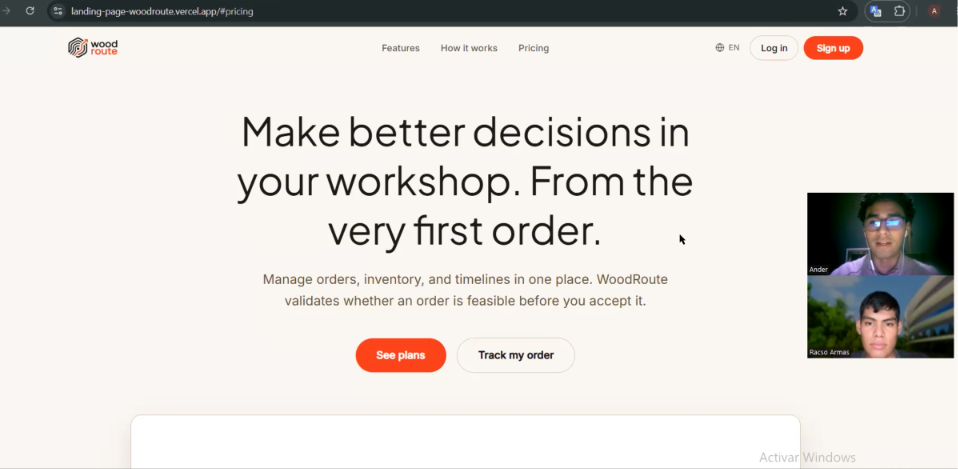
</div>

**Resumen de la entrevista:** 

Para esta entrevista de validación a Oscar, se le mostró lo trabajado en la Landing Page y Web Application. Él nos comenta que le parece intuitivo y confiable. Le gustó la funcionalidad notificaciones que se envían al cliente y el chat de mensajeria con el taller.

### 5.3.3. Evaluaciones según heurísticas. 

## 5.4. About the Team

<div align="center">
  
</div>

Enlace al vídeo de YouTube: <https://www.youtube.com/watch?v=qILCsLa7Omc>

## 5.5. Video About-the-Product.

<div align="center">
  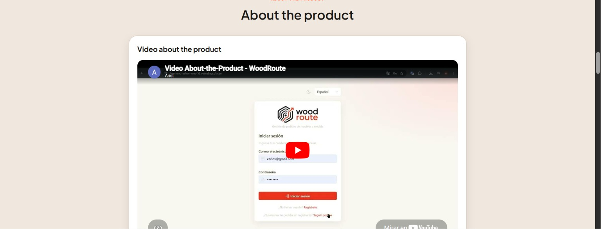
</div>

Enlace al vídeo de YouTube: <https://www.youtube.com/watch?v=FD2Fc3zTknY>

# Conclusiones

## Conclusiones y recomendaciones

Hasta el cierre del Sprint 4, el equipo completó el producto de extremo a extremo: la landing page y la aplicación web desplegadas en Vercel, y el backend real en .NET 10 desplegado en Render e integrado con la aplicación. A partir del trabajo realizado, se destacan las siguientes conclusiones.

La separación entre la landing page y la aplicación web demostró ser una decisión acertada. La landing pudo desplegarse de forma pública en Vercel desde el Sprint 1, entregando valor visible para el segmento objetivo sin estar bloqueada por la implementación del backend. Esta separación de productos permitió que cada uno evolucione a su propio ritmo y que el equipo pueda recibir feedback temprano sobre la propuesta de valor antes de invertir esfuerzo en los servicios de la aplicación.

El diseño anticipado de la arquitectura por bounded contexts resultó ser una inversión valiosa antes de iniciar la implementación de los servicios. Tener el modelo de dominio, los Class Diagrams y el Database Design definidos en el capítulo 4 redujo la ambigüedad sobre qué pertenece a qué contexto y dejó al equipo una base clara para asignar responsabilidades por agregado durante el desarrollo del API REST en .NET 10.

El uso de un backend simulado con JSON Server durante el Sprint 2 permitió desbloquear el desarrollo del frontend sin depender de la implementación del API. Sin embargo, la integración del Sprint 4 con el backend real confirmó que un contrato de datos consistente entre ambos equipos es determinante: alinear la aplicación web al API en .NET 10 (autenticación con JWT, autorización por roles y recursos por bounded context) fue la actividad de mayor esfuerzo del sprint y validó la importancia de haber definido el modelo de dominio con anticipación.

El despliegue del sistema completo en la nube consolidó la propuesta de valor de forma tangible. El backend en .NET se empaquetó como contenedor Docker sobre Render con base de datos PostgreSQL y migraciones automáticas, mientras que la aplicación web se publicó sobre Vercel; ambos con despliegue continuo ante cada integración a la rama principal. Esto dejó un producto navegable de extremo a extremo con datos reales y persistentes.

Finalmente, la implementación evidenció que el modelo de dominio debe ajustarse a la operación real del usuario objetivo. Al integrar el producto se refinó hacia una herramienta interna de taller (single-tenant), en la que el carpintero es el único rol con inicio de sesión, los clientes se administran como registros del taller con cuenta opcional y la comunicación se realiza por WhatsApp en lugar de un chat interno. Este ajuste, reflejado tanto en los capítulos de diseño como en el Sprint 4, redujo la fricción para un segmento de baja digitalización y reforzó que la validación temprana con usuarios debe guiar las decisiones de modelado.

<div style="page-break-after: always;"></div>

# Bibliografía

<a id="ref-apeim-nse-2024"></a>Asociación Peruana de Empresas de Inteligencia de Mercados [APEIM]. (2024). *Niveles socioeconómicos 2023-2024*. APEIM. https://apeim.com.pe/wp-content/uploads/2024/01/APEIM-Informe-de-Niveles-Socioeconomicos-2023-2024-Version-WEB.pdf

<a id="ref-comexperu-mype-2025"></a>ComexPerú. (2025). *Informe anual MYPE 2024: Las micro y pequeñas empresas en el Perú. Resultados en 2024*. Sociedad de Comercio Exterior del Perú. https://www.comexperu.org.pe/articulo/informe-anual-mype-2024

<a id="ref-ebiz-mypes-2022"></a>eBIZ. (2022, 29 de julio). *78% de las mypes usó herramientas digitales en el último año*. https://ebiz.pe/noticias/78-de-las-mypes-uso-herramientas-digitales-en-el-ultimo-ano/

<a id="ref-eventstorming-journal-2022"></a>EventStorming Journal. (2022, marzo 29). *Step by step guide to run your big picture event storming*. https://www.eventstormingjournal.com/big%20picture/step-by-step-guide-to-run-your-big-picture-event-storming/

<a id="ref-inei-internet-trim1-2024"></a>Instituto Nacional de Estadística e Informática [INEI]. (2024a). *Aumentó la población usuaria de internet en todos los grupos de edad en el primer trimestre de 2024*. https://www.gob.pe/institucion/inei/noticias/980106-aumento-la-poblacion-usuaria-de-internet-en-todos-los-grupos-de-edad-en-el-primer-trimestre-de-2024

<a id="ref-inei-internet-trim3-2024"></a>Instituto Nacional de Estadística e Informática [INEI]. (2024b). *Uso de internet alcanzó al 80.2% de la población de 6 y más años de edad en el tercer trimestre de 2024*. https://www.gob.pe/institucion/inei/noticias/1081936-uso-de-internet-alcanzo-al-80-2-de-la-poblacion-de-6-y-mas-anos-de-edad-en-el-tercer-trimestre-de-2024

<a id="ref-produce-empresas-2025"></a>Ministerio de la Producción [PRODUCE]. (2025). *PRODUCE: Perú cerró el 2024 con 2.34 millones de empresas formales*. https://www.gob.pe/institucion/produce/noticias/1168972-produce-peru-cerro-el-2024-con-2-34-millones-de-empresas-formales

<a id="ref-osiptel-erestel-2024"></a>Organismo Supervisor de Inversión Privada en Telecomunicaciones [OSIPTEL]. (2024). *ERESTEL: el 92.8% de las familias peruanas contó con un smartphone en 2023*. https://www.osiptel.gob.pe/portal-del-usuario/noticias/erestel-el-92-8-de-las-familias-peruanas-conto-con-un-smartphone-en-2023/

</article>

