<article class="markdown-body">

<div align="center">


**Universidad Peruana de Ciencias Aplicadas**

**Ingeniería de Software**

**Ciclo 2026-10**

**1ASI0730 – Aplicaciones Web**

**NRC: 10215**

**Docente: Velasquez Nuñez, Angel Augusto**

**Informe de Trabajo Final**


**WoodRoute**


<table>
<thead>
<tr><th>Integrante</th><th>Código</th></tr>
</thead>
<tbody>
<tr><td>Gonza Morales, Anderson</td><td>U202120836</td></tr>
<tr><td>Justo Yauricasa, Alexander Paolo</td><td>U20191C054</td></tr>
<tr><td>Saldaña De Souza, Juan David</td><td>U20221F192</td></tr>
<tr><td>Sulca Sanchez, Piero Angel</td><td>U202423711</td></tr>
<tr><td>Torres Sanchez, Dalila Victoria</td><td>U20221F734</td></tr>
</tbody>
</table>

Mayo 2026

</div>

<div style="page-break-after: always;"></div>

# Registro de Versiones del Informe

<table>
<thead>
<tr><th>Versión</th><th>Fecha</th><th>Autor</th><th>Descripción</th></tr>
</thead>
<tbody>
<tr><td>0.1.0</td><td>2026-04-07</td><td>Sulca Sanchez, Piero Angel</td><td>Creación del repositorio e incorporación de la estructura base del informe</td></tr>
<tr><td>0.2.0</td><td>2026-04-07</td><td>Sulca Sanchez, Piero Angel</td><td>Agregado de carátula, registro de versiones y configuración general del documento</td></tr>
<tr><td>0.3.0</td><td>2026-04-24</td><td>Gonza Morales, Anderson</td><td>Agregado del capitulo 1, capitulo 2</td></tr>
</tbody>
</table>

<div style="page-break-after: always;"></div>


# Project Report Collaboration Insights

**URL del Repositorio:** [https://github.com/Developer-Core/project-report-repo](https://github.com/Developer-Core/project-report-repo)

<div style="page-break-after: always;"></div>

# Contenido

## Tabla de Contenidos

- [Registro de Versiones del Informe](#registro-de-versiones-del-informe)
- [Project Report Collaboration Insights](#project-report-collaboration-insights)
- [Student Outcome](#student-outcome)
- [Capítulo I: Introducción](#capítulo-i-introducción)
    - [1.1. Startup Profile](#11-startup-profile)
        - [1.1.1. Descripción de la Startup](#111-descripción-de-la-startup)
        - [1.1.2. Perfiles de integrantes del equipo](#112-perfiles-de-integrantes-del-equipo)
    - [1.2. Solution Profile](#12-solution-profile)
        - [1.2.1. Antecedentes y problemática](#121-antecedentes-y-problemática)
        - [1.2.2. Lean UX Process](#122-lean-ux-process)
            - [1.2.2.1. Lean UX Problem Statements](#1221-lean-ux-problem-statements)
            - [1.2.2.2. Lean UX Assumptions](#1222-lean-ux-assumptions)
            - [1.2.2.3. Lean UX Hypothesis Statements](#1223-lean-ux-hypothesis-statements)
            - [1.2.2.4. Lean UX Canvas](#1224-lean-ux-canvas)
    - [1.3. Segmentos objetivo](#13-segmentos-objetivo)
- [Capítulo II: Requirements Elicitation & Analysis](#capítulo-ii-requirements-elicitation--analysis)
    - [2.1. Competidores](#21-competidores)
        - [2.1.1. Análisis competitivo](#211-análisis-competitivo)
        - [2.1.2. Estrategias y tácticas frente a competidores](#212-estrategias-y-tácticas-frente-a-competidores)
    - [2.2. Entrevistas](#22-entrevistas)
        - [2.2.1. Diseño de entrevistas](#221-diseño-de-entrevistas)
        - [2.2.2. Registro de entrevistas](#222-registro-de-entrevistas)
        - [2.2.3. Análisis de entrevistas](#223-análisis-de-entrevistas)
    - [2.3. Needfinding](#23-needfinding)
        - [2.3.1. User Personas](#231-user-personas)
        - [2.3.2. User Task Matrix](#232-user-task-matrix)
        - [2.3.3. User Journey Mapping](#233-user-journey-mapping)
        - [2.3.4. Empathy Mapping](#234-empathy-mapping)
    - [2.4. Big Picture EventStorming](#24-big-picture-eventstorming)
    - [2.5. Ubiquitous Language](#25-ubiquitous-language)
- [Capítulo III: Requirements Specification](#capítulo-iii-requirements-specification)
    - [3.1. User Stories](#31-user-stories)
    - [3.2. Impact Mapping](#32-impact-mapping)
    - [3.3. Product Backlog](#33-product-backlog)
- [Capítulo IV: Product Design](#capítulo-iv-product-design)
    - [4.1. Style Guidelines](#41-style-guidelines)
        - [4.1.1. General Style Guidelines](#411-general-style-guidelines)
        - [4.1.2. Web Style Guidelines](#412-web-style-guidelines)
    - [4.2. Information Architecture](#42-information-architecture)
        - [4.2.1. Organization Systems](#421-organization-systems)
        - [4.2.2. Labeling Systems](#422-labeling-systems)
        - [4.2.3. SEO Tags and Meta Tags](#423-seo-tags-and-meta-tags)
        - [4.2.4. Searching Systems](#424-searching-systems)
        - [4.2.5. Navigation Systems](#425-navigation-systems)
    - [4.3. Landing Page UI Design](#43-landing-page-ui-design)
        - [4.3.1. Landing Page Wireframe](#431-landing-page-wireframe)
        - [4.3.2. Landing Page Mock-up](#432-landing-page-mock-up)
- [Capítulo V: Product Implementation, Validation & Deployment](#capítulo-v-product-implementation-validation--deployment)
    - [5.1. Software Configuration Management](#51-software-configuration-management)
    - [5.2. Landing Page, Services & Applications Implementation](#52-landing-page-services--applications-implementation)
        - [5.2.1. Sprint 1](#521-sprint-1)
            - [5.2.1.1. Sprint Planning 1](#5211-sprint-planning-1)
            - [5.2.1.2. Aspect Leaders and Collaborators](#5212-aspect-leaders-and-collaborators)
            - [5.2.1.3. Sprint Backlog 1](#5213-sprint-backlog-1)
            - [5.2.1.4. Development Evidence for Sprint Review](#5214-development-evidence-for-sprint-review)
- [Bibliografía](#bibliografía)

<div style="page-break-after: always;"></div>

# Student Outcome

En el siguiente cuadro se describe las acciones realizadas y enunciados de conclusiones por parte del grupo, que permiten sustentar el haber alcanzado el logro del ABET -- EAC - Student Outcome 5.

<table>
  <colgroup>
    <col style="width: 25%">
    <col style="width: 43%">
    <col style="width: 32%">
  </colgroup>
  <thead>
    <tr>
      <th>Criterio específico</th>
      <th>Acciones realizadas</th>
      <th>Conclusiones</th>
    </tr>
  </thead>
  <tbody>
    <tr>
      <td rowspan="5"><strong>Trabaja en equipo para proporcionar liderazgo en forma conjunta</strong></td>
      <td><strong>Gonza Morales, Anderson</strong><br><b>AV1:</b> <em>Por definir.</em></td>
      <td rowspan="5"><b>AV1:</b> <em>Por definir.</em></td>
    </tr>
    <tr>
      <td><strong>Justo Yauricasa, Alexander Paolo</strong><br><b>AV1:</b> <em>Por definir.</em></td>
    </tr>
    <tr>
      <td><strong>Saldaña De Souza, Juan David</strong><br><b>AV1:</b> <em>Por definir.</em></td>
    </tr>
    <tr>
      <td><strong>Sulca Sanchez, Piero Angel</strong><br><b>AV1:</b> <em>Por definir.</em></td>
    </tr>
    <tr>
      <td><strong>Torres Sanchez, Dalila Victoria</strong><br><b>AV1:</b> <em>Por definir.</em></td>
    </tr>
    <tr>
      <td rowspan="5"><strong>Crea un entorno colaborativo e inclusivo, establece metas, planifica tareas y cumple objetivos</strong></td>
      <td><strong>Gonza Morales, Anderson</strong><br><b>AV1:</b> <em>Por definir.</em></td>
      <td rowspan="5"><b>AV1:</b> <em>Por definir.</em></td>
    </tr>
    <tr>
      <td><strong>Justo Yauricasa, Alexander Paolo</strong><br><b>AV1:</b> <em>Por definir.</em></td>
    </tr>
    <tr>
      <td><strong>Saldaña De Souza, Juan David</strong><br><b>AV1:</b> <em>Por definir.</em></td>
    </tr>
    <tr>
      <td><strong>Sulca Sanchez, Piero Angel</strong><br><b>AV1:</b> <em>Por definir.</em></td>
    </tr>
    <tr>
      <td><strong>Torres Sanchez, Dalila Victoria</strong><br><b>AV1:</b> <em>Por definir.</em></td>
    </tr>
  </tbody>
</table>

<div style="page-break-after: always;"></div>

# Capítulo I: Introducción

## 1.1. Startup Profile

### 1.1.1. Descripción de la Startup

WoodRoute es una plataforma web tipo SaaS dirigida a carpinteros independientes y pequeños talleres, que permite gestionar pedidos de muebles personalizados, realizar el seguimiento del proceso de fabricación y optimizar la planificación de la producción. La solución asiste al carpintero en la toma de decisiones, evaluando la viabilidad de construir un mueble en función del inventario disponible, la estimación de tiempos de trabajo y la capacidad del taller. Asimismo, la plataforma mejora la comunicación con los clientes al ofrecer un sistema de seguimiento en tiempo real del estado de los pedidos, brindando mayor transparencia y confianza durante todo el proceso.

### 1.1.2. Perfiles de integrantes del equipo

<table>
  <tbody>
    <tr>
      <td class="member-photo"></td>
      <td><strong>Gonza Morales, Anderson -- U202120836</strong><br><br>Estudiante de sexto ciclo de la carrera de Ingenieria de Software. Destaca por su capacidad de liderazgo y organizacion en equipos de trabajo. Tiene habilidades en coordinacion de tareas, comunicacion efectiva, analisis de requerimientos y seguimiento de actividades orientadas a cumplir objetivos del proyecto.</td>
    </tr>
    <tr>
      <td class="member-photo"></td>
      <td><strong>Justo Yauricasa, Alexander Paolo -- U20191C054</strong><br><br>Estudio Ingeniería de Software y cuento con experiencia en desarrollo web dentro de equipos pequeños. Me interesa especialmente en Base de datos, en particular en diseño y arqueitectura de base de datos. Dentro del equipo, puedo contribuir en el levantamiento de requerimientos, el diseño de interfaces, así como en el diseño de bases de datos. Además, destaco por mi capacidad de organización y trabajo colaborativo.</td>
    </tr>
    <tr>
      <td class="member-photo"></td>
      <td><strong>Saldaña De Souza, Juan David -- U20221F192</strong><br><br>Mi nombre es Juan David, tengo 20 años y estoy cursando la carrera de Ingeniería de Software en la UPC. Me considero una persona dedicada y analítica en los proyectos que requieren un enfoque técnico sólido. Tengo habilidades enfocadas en la resolución de problemas y el desarrollo eficiente, apoyando siempre a mi equipo para lograr un software de calidad. Mis conocimientos se centran en Java, C++ y Python, acompañados de frameworks y herramientas para desarrollo web como Astro.js y Svelte. De la misma forma, manejo SQL Server, MongoDB, redes y algoritmos de complejidad. Algunos de mis hobbies son los videojuegos y la tecnología.</td>
    </tr>
    <tr>
      <td class="member-photo"></td>
      <td><strong>Sulca Sanchez, Piero Angel -- U202423711</strong><br><br>Curso la carrera de Ingeniería de Software y tengo experiencia en desarrollo web trabajando con equipos pequeños. Me apasiona el Front End, sobre todo cuando hay espacio para el diseño creativo: interfaces 3D, animaciones, productos que se ven y se sienten distintos. En el equipo puedo aportar en levantamiento de requerimientos, diseño de interfaces, desarrollo web con React y TypeScript, diseño de bases de datos. En el equipo aporto organización y colaboración.</td>
    </tr>
    <tr>
      <td class="member-photo"></td>
      <td><strong>Torres Sanchez, Dalila Victoria -- U20221F734</strong><br><br>Soy estudiante de Ingeniería de Software, he programado en C#, C++, PHP, Java y Python, además manejo de bases de datos relacionales. También he trabajado con Git y metodologías ágiles como Scrum, lo cual me ha ayudado a organizarme mejor y a trabajar en equipo con más fluidez. Me interesa mucho el desarrollo backend, porque me gusta entender la lógica detrás de las cosas, cómo se procesan los datos y cómo se asegura que todo funcione correctamente. También me gusta colaborar en el frontend, porque entiendo que un buen producto requiere que ambas partes trabajen en armonía. Disfruto ver cómo una idea se vuelve algo real, desde los primeros bocetos hasta la parte funcional donde las personas terminan usando. Actualmente, mi objetivo es seguir consolidando mis habilidades técnicas y blandas para desempeñarme con confianza en el entorno laboral. Me interesa participar en proyectos donde pueda aplicar lo que sé y aportar soluciones prácticas a problemas reales.</td>
    </tr>
  </tbody>
</table>

<div style="page-break-after: always;"></div>

## 1.2. Solution Profile

### 1.2.1. Antecedentes y problemática

**What? (¿Qué?)**

**¿Cuál es el problema?**

El problema central es la falta de organización y planificación en carpinterías independientes y pequeños talleres al momento de gestionar pedidos de muebles personalizados. Actualmente, muchos carpinteros trabajan de manera empírica, basándose en su experiencia para calcular materiales, estimar tiempos y coordinar con los clientes. Esto genera errores frecuentes como falta de materiales durante la producción, retrasos en las entregas y una comunicación poco eficiente con el cliente, afectando tanto la productividad del taller como la satisfacción del usuario final.

**When? (¿Cuándo?)**

**¿Cuándo ocurre el problema?**

El problema ocurre de manera constante durante todo el proceso de fabricación del mueble, desde la etapa de diseño y planificación hasta la producción y entrega. Se intensifica especialmente cuando el carpintero maneja múltiples pedidos simultáneamente, ya que la falta de herramientas de organización dificulta la correcta estimación de tiempos y el control de materiales.

**Where? (¿Dónde?)**

**¿Dónde surge el problema?**

Surge principalmente en pequeños talleres de carpintería y negocios independientes, donde no se utilizan sistemas digitales especializados y la gestión se realiza mediante herramientas informales como cuadernos o aplicaciones de mensajería.

**¿A dónde se dirige?**

La solución se dirige a digitalizar y optimizar la gestión interna del taller, integrando en una sola plataforma la planificación, el control de inventario y el seguimiento de pedidos, permitiendo una mejor organización del proceso productivo.

**Who? (¿Quién?)**

**¿Quiénes están involucrados?**

- Carpinteros independientes y pequeños talleres.
- Clientes que solicitan muebles personalizados.

**¿Quién lo utilizará?**

Los carpinteros utilizarán la plataforma para registrar pedidos, calcular materiales, estimar tiempos y gestionar su inventario. Por otro lado, los clientes accederán a la plataforma para consultar el estado de sus pedidos y recibir actualizaciones del proceso de fabricación.

**Why? (¿Por qué?)**

**¿Cuál es la causa del problema?**

La causa principal es la ausencia de herramientas digitales adaptadas al rubro de la carpintería que integren planificación, inventario y gestión de pedidos. La mayoría de soluciones existentes son genéricas o complejas, lo que lleva a los carpinteros a depender de métodos manuales y de su experiencia, generando ineficiencias y errores en el proceso productivo.

**How? (¿Cómo?)**

**¿En qué condiciones los usuarios usarán nuestro producto?**

Los carpinteros utilizarán la plataforma en su día a día dentro del taller, especialmente en momentos clave como la planificación de un nuevo pedido, la verificación de materiales disponibles y la organización de tareas. Requerirán una interfaz simple y rápida que les permita tomar decisiones en pocos pasos. Los clientes utilizarán la plataforma de manera ocasional para consultar el estado de su mueble mediante un enlace accesible desde cualquier dispositivo.

**¿Cómo nos conocieron nuestros compradores?**

Los carpinteros conocerán la plataforma a través de recomendaciones, redes sociales, demostraciones del producto y marketing digital enfocado en mejorar la productividad de pequeños negocios.

**¿Cómo prefieren nuestros consumidores acceder a nuestro producto?**

Los carpinteros preferirán una aplicación web sencilla y accesible desde computadora o celular, mientras que los clientes preferirán acceder mediante un enlace directo sin necesidad de registro, para visualizar el progreso de su pedido de forma rápida..

**How much? (¿Cuánto?)**

Estadísticas que sustentan la problemática:

- Las MYPE representan el 99.7% de las empresas peruanas y emplean al 45.2% de la PEA, lo que demuestra que el problema afecta a un sector empresarial de gran alcance en el país ([ComexPerú, 2025](#ref-comexperu-mype-2025)).
- En 2024, las MYPE registraron ventas por S/ 154,380 millones, equivalentes al 14.2% del PBI, por lo que sus limitaciones de gestión tienen impacto económico relevante ([ComexPerú, 2025](#ref-comexperu-mype-2025)).
- El 86.8% de las MYPE opera en la informalidad, medida por la ausencia de RUC, lo que limita su acceso a registros formales, financiamiento y herramientas de gestión empresarial ([ComexPerú, 2025](#ref-comexperu-mype-2025)).
- El 76.5% de las MYPE no lleva ningún registro de cuentas, mientras que solo el 3.7% cuenta con libros contables o un sistema completo de contabilidad, evidenciando una baja capacidad de control financiero y operativo ([ComexPerú, 2025](#ref-comexperu-mype-2025)).
- Aunque el 78% de las micro y pequeñas empresas usó herramientas digitales, esto no implica necesariamente el uso de software especializado para pedidos, inventarios o producción ([eBIZ, 2022](#ref-ebiz-mypes-2022)).
- Entre las MYPE en línea, el 55% usó WhatsApp para comunicarse con clientes y el 48% con proveedores, lo que muestra una dependencia de canales de comunicación no estructurados para actividades empresariales ([eBIZ, 2022](#ref-ebiz-mypes-2022)).

Estas condiciones evidencian la necesidad de una solución tecnológica que permita optimizar la gestión del taller, mejorar la planificación y brindar mayor transparencia en el proceso de fabricación de muebles.

### 1.2.2. Lean UX Process

El Lean UX Process es una metodología ágil centrada en la colaboración, la experimentación rápida y el aprendizaje validado. En este proyecto se utiliza este enfoque para comprender las necesidades de carpinteros y clientes, identificando sus principales problemas en la gestión, planificación y seguimiento de muebles. A través de hipótesis, prototipos y retroalimentación constante, se busca validar soluciones que optimicen la toma de decisiones dentro del taller y mejoren la experiencia del cliente.

#### 1.2.2.1. Lean UX Problem Statements

**Problem Statement 1: El Carpintero / Taller**

- **Domain:** Gestión operativa de talleres de carpintería dedicados a la fabricación de muebles personalizados bajo pedido.
- **Customer Segments:** Carpinteros independientes y pequeños talleres con baja digitalización, ubicados principalmente en zonas urbanas de Lima Metropolitana.
- **Pain Points:** Cálculo manual y propenso a errores de materiales, estimaciones imprecisas de tiempos de entrega, desorganización en la recepción de pedidos, control de inventario empírico y comunicación reactiva con los clientes a través de WhatsApp.
- **Gap:** Las herramientas existentes son genéricas (ERPs grandes u hojas de cálculo) y no se adaptan al flujo de trabajo ni al lenguaje del rubro de la carpintería; las MYPE rechazan adoptarlas por su complejidad y costo.
- **Vision / Strategy:** Ofrecer una plataforma web especializada que integre gestión de pedidos, asistente de viabilidad, estimación de tiempos y control simple de inventario, priorizando una experiencia minimalista alineada con el flujo real del taller.
- **Initial Segment:** Talleres independientes urbanos en Lima Metropolitana, de 1 a 5 trabajadores, con uso activo de smartphone y disposición a probar herramientas digitales.

**¿Cómo podemos ayudar a los carpinteros independientes y pequeños talleres a planificar sus pedidos de forma más precisa y organizada, reduciendo errores en el cálculo de materiales y mejorando el cumplimiento de tiempos, sin agregar complejidad a su jornada de trabajo?**

**Problem Statement 2: El Cliente**

- **Domain:** Experiencia del cliente final que solicita la fabricación de muebles a medida a un taller independiente.
- **Customer Segments:** Personas adultas (25 a 55 años) de NSE B y C que solicitan muebles personalizados para el hogar, oficinas o negocios.
- **Pain Points:** Ausencia de visibilidad sobre el avance del pedido, dependencia de mensajes informales por WhatsApp o llamadas, incertidumbre sobre fechas reales de entrega y poca confianza en el proceso.
- **Gap:** No existe un canal estandarizado que permita al cliente consultar el estado de su mueble sin tener que interrumpir al carpintero, ni evidencia clara de las etapas de producción.
- **Vision / Strategy:** Brindar al cliente acceso vía enlace —sin requerir registro— para consultar en tiempo real el estado de su pedido, fechas estimadas y notificaciones automáticas de cambios de etapa.
- **Initial Segment:** Clientes urbanos de Lima Metropolitana que ya solicitan muebles a talleres independientes y utilizan WhatsApp como canal habitual de seguimiento.

**¿Cómo podemos brindar a los clientes acceso claro y en tiempo real al estado de sus pedidos para mejorar la transparencia, reducir las consultas repetitivas al carpintero y aumentar la confianza en el servicio?**

#### 1.2.2.2. Lean UX Assumptions

**Business Assumptions**

1. Creo que mis clientes necesitan una herramienta que les ayude a organizar pedidos, materiales y tiempos de trabajo de manera simple.
2. Estas necesidades se pueden resolver con una aplicación web que integre gestión de pedidos, inventario y estimación de tiempos.
3. Mis clientes iniciales serán carpinteros independientes y pequeños talleres con baja digitalización.
4. El valor más importante que el cliente quiere es reducir errores, ahorrar tiempo y mejorar la organización del trabajo.
5. El cliente también puede obtener beneficios adicionales como mejorar la comunicación con sus clientes y proyectar una imagen más profesional.
6. Voy a adquirir usuarios a través de redes sociales, recomendaciones y demostraciones del producto.
7. Haré dinero mediante un modelo de suscripción (freemium con funciones avanzadas).
8. Mi competencia principal serán softwares de gestión genéricos y herramientas no especializadas en carpintería.
9. Los venceremos mediante especialización en el rubro y facilidad de uso.
10. Mi mayor riesgo es que los carpinteros no adopten la tecnología por costumbre o complejidad.
11. Resolveremos esto mediante una interfaz simple, intuitiva y enfocada en su flujo real de trabajo.

**User Assumptions**

**¿Quién es el usuario?**
Carpinteros independientes y pequeños talleres que gestionan pedidos personalizados, así como clientes que desean hacer seguimiento a sus muebles.

**¿Qué problemas tiene nuestro producto que resolver?**
Falta de organización, errores en cálculo de materiales, estimaciones inexactas de tiempo y mala comunicación con clientes.

**¿Qué características son importantes?**
Gestión de pedidos, cálculo de materiales, estimación de tiempos, control de inventario y seguimiento del estado del mueble.

**¿Dónde encaja nuestro producto en su trabajo o vida?**
Se integra en el proceso diario del taller, especialmente en la planificación, producción y entrega de pedidos.

**¿Cuándo y cómo nuestro producto es usado?**
Durante la recepción de pedidos, planificación de trabajos y seguimiento del proceso, mediante una plataforma web accesible desde cualquier dispositivo.

**¿Cómo debe verse nuestro producto y cómo comportarse?**
Debe ser simple, clara y fácil de usar, con una interfaz intuitiva que permita tomar decisiones rápidas sin complicaciones.


#### 1.2.2.3. Lean UX Hypothesis Statements

- **Hypothesis 01:**
  Creemos que los carpinteros podrán planificar mejor sus trabajos si cuentan con una herramienta que calcule automáticamente materiales y valide la viabilidad del mueble.
  Sabremos que hemos tenido éxito cuando el 70% de los usuarios utilicen esta función al crear un pedido.

- **Hypothesis 02:**
  Creemos que los carpinteros reducirán retrasos si utilizan estimaciones de tiempo basadas en la capacidad del taller.
 Sabremos que hemos tenido éxito cuando los tiempos de entrega se cumplan en al menos un 80% de los pedidos.

- **Hypothesis 03:**
  Creemos que los clientes estarán más satisfechos si pueden ver el estado de su pedido en tiempo real.
  Sabremos que hemos tenido éxito cuando disminuyan las consultas repetitivas de clientes en al menos un 50%.

- **Hypothesis 04:**
  Creemos que los talleres mejorarán su organización si cuentan con un sistema de gestión de pedidos e inventario integrado.
  Sabremos que hemos tenido éxito cuando los usuarios gestionen todos sus pedidos dentro de la plataforma.

- **Hypothesis 05:**
  Creemos que los carpinteros adoptarán la plataforma si esta es simple y rápida de usar.
  Sabremos que hemos tenido éxito cuando al menos el 60% de los usuarios continúen usando la plataforma después del primer mes.

#### 1.2.2.4. Lean UX Canvas

El Lean UX Canvas es una herramienta visual que permite alinear al equipo en torno a problemas, usuarios e hipótesis de manera ágil. En este proyecto se utilizó para comprender mejor a los carpinteros independientes, pequeños talleres y a los clientes que solicitan muebles personalizados, identificar sus principales pain points y definir cómo **WoodRoute** puede generar valor real en la gestión diaria del taller y en la experiencia del cliente.

Aquí se presenta el Lean UX Canvas desarrollado para **WoodRoute**:

**Figura 1. Lean UX Canvas de WoodRoute**

<div align="center">
  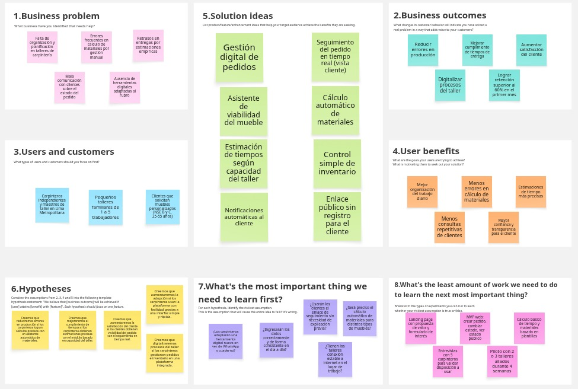
</div>

**Enlace al Lean UX Canvas:** https://miro.com/app/board/uXjVHUJnMJM=/?share_link_id=898353122563


## 1.3. Segmentos objetivo

En el análisis del segmento objetivo para WoodRoute, se identifican dos grupos principales de usuarios: **los carpinteros o talleres**, encargados de fabricar y gestionar los pedidos de muebles, y **los clientes**, quienes solicitan muebles personalizados y necesitan conocer el avance del proceso.

**Carpinteros: talleres y trabajadores independientes**

Este segmento está compuesto por carpinteros independientes, maestros de taller, ayudantes y pequeños negocios familiares dedicados a la fabricación de muebles personalizados bajo pedido. Forman parte del ecosistema de micro y pequeñas empresas del país, el cual representa una parte significativa de la actividad empresarial peruana.

- **Perfil:** Carpinteros independientes, maestros de taller y pequeños negocios dedicados a la fabricación de muebles a medida. En 2024, las MYPE representaron el 99.7% de las empresas peruanas y emplearon al 45.2% de la PEA, lo que evidencia la importancia de este tipo de negocios dentro del mercado nacional ([ComexPerú, 2025](#ref-comexperu-mype-2025)).
- **Tamaño del mercado:** En 2024, el Perú cerró con 2,346,592 empresas formales, de las cuales 2,326,126 fueron MYPE, equivalentes al 99.1% del total formal. Dentro de estas, el sector manufactura representó el 8.5%, donde se ubican actividades productivas como la fabricación de muebles ([PRODUCE, 2025](#ref-produce-empresas-2025)).
- **Ubicación geográfica:** El mercado objetivo se concentra principalmente en zonas urbanas con presencia de talleres y actividad comercial. A nivel formal, el 43.8% de las MYPE se concentra en Lima, equivalente a 1,018,308 empresas, lo que justifica enfocar inicialmente la solución en Lima Metropolitana ([PRODUCE, 2025](#ref-produce-empresas-2025)).
- **Uso de tecnología:** El acceso a smartphones es alto en el país: en 2023, el 92.8% de los hogares peruanos contaba con al menos un smartphone. Esto permite plantear una solución digital accesible para talleres pequeños que ya usan el celular como herramienta de trabajo ([OSIPTEL, 2024](#ref-osiptel-erestel-2024)).
- **Necesidad clave:** Organizar pedidos, calcular materiales, controlar avances de producción, estimar tiempos de entrega y mejorar la comunicación con los clientes.

**Clientes: usuarios que solicitan muebles personalizados**

Este segmento está compuesto por personas que requieren muebles a medida para hogares, oficinas o negocios, y que necesitan mayor claridad sobre tiempos, costos y avance del pedido.

- **Perfil:** Adultos que solicitan muebles personalizados y buscan una alternativa distinta a los muebles estándar. Este perfil se relaciona con usuarios urbanos familiarizados con el uso de internet, redes sociales y comunicación digital.
- **Edad y uso digital:** El público adulto joven y adulto presenta alta familiaridad con internet. En el primer trimestre de 2024, el 91.4% de la población de 25 a 40 años accedió a internet, lo que respalda el uso de una plataforma digital para consultar pedidos, avances y entregas ([INEI, 2024a](#ref-inei-internet-trim1-2024)).
- **Nivel socioeconómico:** Puede orientarse principalmente a usuarios de NSE B y C, ya que son segmentos con capacidad de compra para productos personalizados de mediana inversión. Esta clasificación debe tomarse como criterio de segmentación comercial, usando como referencia los reportes de niveles socioeconómicos de APEIM, elaborados a partir de la ENAHO ([APEIM, 2024](#ref-apeim-nse-2024)).
- **Uso de tecnología:** En 2024, el 80.2% de la población peruana de 6 años a más usó internet en el tercer trimestre, y en el primer trimestre del mismo año el 91.3% de quienes usaban internet accedía mediante celular. Esto respalda que los clientes puedan consultar información del pedido desde una plataforma web ([INEI, 2024b](#ref-inei-internet-trim3-2024)).
- **Necesidad clave:** Conocer el estado del pedido, recibir información clara sobre fechas de entrega, reducir la incertidumbre y tener mayor confianza durante el proceso de fabricación.

<div style="page-break-after: always;"></div>

# Capítulo II: Requirements Elicitation & Analysis

## 2.1. Competidores

### 2.1.1. Análisis competitivo

En esta sección evaluamos los competidores de nuestro nicho.

<table>
  <thead>
    <tr>
      <th colspan="7"><b>Competitive Analysis Landscape</b></th>
    </tr>
  </thead>
  <tbody>
    <tr>
      <td colspan="2" align="center">¿Por qué llevar a cabo este análisis?</td>
      <td colspan="5" align="center">El objetivo de este análisis es identificar las brechas en la gestión y planificación de trabajos en carpinterías, evaluar cómo operan las soluciones actuales y posicionar a WoodRoute como una plataforma que optimiza la toma de decisiones, el uso de materiales y la comunicación con clientes.</td>
    </tr>
    <tr>
      <td colspan="2" rowspan="2" valign="top">Startup y Competidores</td>
      <td align="center"><b>Nuestra Startup: WoodRoute</b></td>
      <td align="center">Cleri</td>
      <td align="center">Craftybase</td>
      <td align="center">Buildertrend</td>
    </tr>
    <tr>
      <td valign="top" align="center"></td>
      <td valign="top" align="center"></td>
      <td valign="top" align="center"></td>
      <td valign="top" align="center"></td>
    </tr>
    <tr>
      <td rowspan="2">Perfil</td>
      <td>Overview</td>
      <td>Plataforma web SaaS para carpinterías que permite gestionar pedidos, hacer seguimiento del proceso de fabricación y asistir en la planificación del mueble, validando materiales, tiempos y viabilidad según el inventario y capacidad del taller.</td>
      <td>Software especializado en carpintería que ayuda a gestionar proyectos, clientes, materiales y presupuestos dentro del taller.</td>
      <td>Plataforma enfocada en control de inventario y costos de producción para negocios que fabrican productos físicos.</td>
      <td>Software de gestión de proyectos para construcción que permite planificar trabajos, coordinar equipos y comunicarse con clientes.</td>
    </tr>
    <tr>
      <td>Ventaja competitiva ¿Qué valor ofrece a los clientes?</td>
      <td>Asistencia en la toma de decisiones: calcula viabilidad de muebles, estima tiempos según capacidad del taller e integra inventario con producción y seguimiento al cliente.</td>
      <td>Enfoque específico en carpintería con herramientas de gestión de proyectos y clientes.</td>
      <td>Control detallado de inventario y costos de materiales.</td>
      <td>Gestión avanzada de proyectos y comunicación profesional con clientes.</td>
    </tr>
    <tr>
      <td rowspan="2">Perfil de Marketing</td>
      <td>Mercado objetivo</td>
      <td>Carpinteros independientes y pequeños talleres que necesitan organizar su trabajo y mejorar la comunicación con clientes.</td>
      <td>Carpinterías que buscan digitalizar la gestión de sus proyectos.</td>
      <td>Pequeños fabricantes y negocios de productos físicos.</td>
      <td>Empresas de construcción, contratistas y remodeladores.</td>
    </tr>
    <tr>
      <td>Estrategias de marketing</td>
      <td>Modelo freemium, enfoque en simplicidad y solución a problemas reales del carpintero (tiempo, materiales y organización).</td>
      <td>Marketing enfocado en productividad y gestión profesional del taller.</td>
      <td>Enfoque en control financiero y eficiencia de producción.</td>
      <td>Marketing empresarial orientado a gestión de proyectos grandes.</td>
    </tr>
    <tr>
      <td rowspan="3">Perfil de Producto</td>
      <td>Productos & Servicios</td>
      <td>Gestión de pedidos, seguimiento en tiempo real, asistente de viabilidad de muebles, estimación de tiempos, control de inventario y monitoreo IoT.</td>
      <td>Gestión de proyectos, presupuestos, clientes e inventario.</td>
      <td>Gestión de inventario, costos, producción y reportes.</td>
      <td>Gestión de proyectos, cronogramas, comunicación con clientes y seguimiento de obras.</td>
    </tr>
    <tr>
      <td>Precios & Costos</td>
      <td>Modelo freemium con suscripción mensual para funciones avanzadas como estimación inteligente, reportes e integración IoT.</td>
      <td>Suscripción mensual basada en funcionalidades de gestión.</td>
      <td>Suscripción mensual según uso y funcionalidades.</td>
      <td>Suscripción premium orientada a empresas.</td>
    </tr>
    <tr>
      <td>Canales de distribución (Web y/o Móvil)</td>
      <td>Aplicación web con posible extensión móvil para clientes (seguimiento).</td>
      <td>Plataforma web.</td>
      <td>Plataforma web.</td>
      <td>Web y aplicación móvil.</td>
    </tr>
    <tr>
      <td rowspan="4">Análisis SWOT</td>
      <td>Fortalezas</td>
      <td>Enfoque específico en carpintería, integración de planificación + inventario + seguimiento, facilidad de uso.</td>
      <td>Especialización en el rubro de carpintería.</td>
      <td>Fuerte control de inventario y costos.</td>
      <td>Gestión profesional de proyectos complejos.</td>
    </tr>
    <tr>
      <td>Debilidades</td>
      <td>Startup nueva, sin posicionamiento en el mercado.</td>
      <td>No integra estimación inteligente ni validación de viabilidad.</td>
      <td>No está especializado en carpintería.</td>
      <td>Demasiado complejo para pequeños talleres.</td>
    </tr>
    <tr>
      <td>Oportunidades</td>
      <td>Digitalización de talleres pequeños y necesidad de optimización en producción.</td>
      <td>Expansión a más mercados de carpintería.</td>
      <td>Integración con más industrias productivas.</td>
      <td>Expansión en el sector construcción.</td>
    </tr>
    <tr>
      <td>Amenazas</td>
      <td>Competidores más grandes que integren funciones similares.</td>
      <td>Nuevas plataformas más completas.</td>
      <td>Herramientas más especializadas por industria.</td>
      <td>Soluciones más simples para pequeños negocios.</td>
    </tr>

  </tbody>
</table>

### 2.1.2. Estrategias y tácticas frente a competidores

**Estrategias:**

- Diferenciación mediante especialización en carpinterías y talleres pequeños.
- Enfoque en apoyo a la toma de decisiones (viabilidad, tiempos y materiales), no solo gestión.
- Ofrecer una solución integral: pedidos + inventario + planificación + seguimiento al cliente.
- Priorizar simplicidad y facilidad de uso para usuarios no técnicos.
- Implementar modelo SaaS freemium para facilitar adopción inicial.

**Tácticas:**

- Desarrollar un asistente que calcule automáticamente materiales y valide la viabilidad del mueble.
- Incorporar estimación de tiempos basada en capacidad del taller (número de trabajadores y carga).
- Crear un sistema de seguimiento con estados visibles para el cliente mediante enlace.
- Integrar control de inventario con alertas de stock bajo.
- Implementar notificaciones automáticas para reducir consultas repetitivas de clientes.
- Ofrecer funcionalidades avanzadas (reportes, IoT, multiusuario) en planes de pago.


## 2.2. Entrevistas

### 2.2.1. Diseño de entrevistas

**Segmento 1: Carpintero/Taller**

- ¿Cómo gestionas actualmente tus pedidos de muebles?
- ¿Qué pasos sigues desde que recibes un pedido hasta la entrega?
- ¿Usas alguna herramienta (cuaderno, Excel, WhatsApp)? ¿Cuál?
- ¿Cómo decides si puedes hacer un mueble con los materiales que tienes?
- ¿Cómo calculas la cantidad de material que vas a necesitar?
- ¿Te ha pasado que te falta material durante un trabajo? ¿Qué ocurrió?
- ¿Cómo estimas cuánto tiempo te tomará hacer un mueble?
- ¿Sueles retrasarte en las entregas? ¿Por qué razones?
- ¿Trabajas solo o con un equipo? ¿Cómo organizan el trabajo?
- ¿Cómo controlas tu inventario de madera o materiales?
- ¿Cómo informas a tus clientes sobre el avance de sus pedidos?
- ¿Te sería útil una app que calcule materiales, estime tiempos y te diga si un mueble es viable? ¿Por qué?

**Segmento 2: Cliente**

- ¿Has mandado a hacer un mueble alguna vez? ¿Cómo fue tu experiencia?
- ¿Qué fue lo más difícil o incómodo durante el proceso?
- ¿El carpintero cumplió con el tiempo de entrega?
- ¿Tuviste que preguntar varias veces por el estado del mueble?
- ¿Cómo te informaban el avance del trabajo?
- ¿Te hubiera gustado ver el progreso sin tener que preguntar?
- ¿Qué te haría confiar más en un carpintero?
- ¿Te gustaría ver fotos o estados del proceso de fabricación?
- ¿Te serviría tener un link donde puedas ver el estado de tu pedido?
- ¿Pagarías un poco más por un servicio con mejor seguimiento y comunicación?

### 2.2.2. Registro de entrevistas

#### Segmento 1: Carpintero/Taller

**Entrevista 1**

**Entrevistador:** Anderson Gonza Morales

**Entrevistado:** Victor Garcia

**Link de la entrevista:** <https://upcedupe-my.sharepoint.com/:v:/g/personal/u202120836_upc_edu_pe/IQBIxTsDiMoMQ7UmxqokSxBtAbzjckIXgF8fW8kP5-aSU14?nav=eyJyZWZlcnJhbEluZm8iOnsicmVmZXJyYWxBcHAiOiJPbmVEcml2ZUZvckJ1c2luZXNzIiwicmVmZXJyYWxBcHBQbGF0Zm9ybSI6IldlYiIsInJlZmVycmFsTW9kZSI6InZpZXciLCJyZWZlcnJhbFZpZXciOiJNeUZpbGVzTGlua0NvcHkifX0&e=LRldwg>

<div align="center">
  
</div>

**Resumen de la entrevista:** 
La entrevista realizada a un maestro de carpintería independiente evidencia que la gestión de pedidos se realiza principalmente mediante WhatsApp y anotaciones manuales en un cuaderno. Él calcula la cantidad de material y el tiempo que tomará hacer el mueble basándose en su experiencia de años en el rubro. También menciona que a veces se le escapa y compra una pieza de más o de menos de material. Además, la comunicación con el cliente se hace mediante fotos por WhatsApp. El entrevistado considera que sí le sería útil una herramienta que le ayude a hacer todo lo mencionado anteriormente.

**Entrevista 2**

**Entrevistador:** Anderson Gonza Morales

**Entrevistado:** Marco

**Link de la entrevista:** <https://upcedupe-my.sharepoint.com/:v:/g/personal/u202120836_upc_edu_pe/IQA-72r7kw1ETKLhkTOknwcFAfMyGR4WulQY5KCh3gmHGxo?nav=eyJyZWZlcnJhbEluZm8iOnsicmVmZXJyYWxBcHAiOiJPbmVEcml2ZUZvckJ1c2luZXNzIiwicmVmZXJyYWxBcHBQbGF0Zm9ybSI6IldlYiIsInJlZmVycmFsTW9kZSI6InZpZXciLCJyZWZlcnJhbFZpZXciOiJNeUZpbGVzTGlua0NvcHkifX0&e=lJhikH>

<div align="center">
  
</div>

**Resumen de la entrevista:** 
La entrevista realizada a un ayudante de carpintería evidenció que la gestión de pedidos se realiza principalmente mediante WhatsApp y anotaciones manuales, sin el uso de herramientas digitales especializadas. Las decisiones sobre materiales y tiempos se basan en la experiencia del maestro. Menciona que algunas veces hay retrasos por falta de material al hacer un mal cálculo y problemas como falta de stock durante la producción. Además, la comunicación con los clientes que solicitan actualizaciones se hace mediante fotos por WhatsApp. En este contexto, el entrevistado considero que una aplicación que apoye en la planificación, cálculo de materiales y estimación de tiempos sería de gran utilidad para mejorar la organización y eficiencia del trabajo.

**Entrevista 3**

**Entrevistador:** Anderson Gonza Morales

**Entrevistado:** Ronaldo

**Link de la entrevista:** <https://upcedupe-my.sharepoint.com/:v:/g/personal/u202120836_upc_edu_pe/IQChpwCTvVG-TJqmM0qE2yvnAWHSrGpBMxOBJK0kUSS8z88?nav=eyJyZWZlcnJhbEluZm8iOnsicmVmZXJyYWxBcHAiOiJPbmVEcml2ZUZvckJ1c2luZXNzIiwicmVmZXJyYWxBcHBQbGF0Zm9ybSI6IldlYiIsInJlZmVycmFsTW9kZSI6InZpZXciLCJyZWZlcnJhbFZpZXciOiJNeUZpbGVzTGlua0NvcHkifX0&e=g0kCLa>

<div align="center">
  
</div>

**Resumen de la entrevista:**
La entrevista a un joven carpintero que trabaja junto a su padre evidenció que la gestión de pedidos se realiza principalmente mediante WhatsApp y registros manuales, sin herramientas digitales especializadas. Las decisiones sobre materiales y tiempos se basan en la experiencia del maestro, lo que en ocasiones genera errores como falta de material y retrasos en la entrega. Además, el control de inventario es visual y poco preciso, y la comunicación con los clientes es mayormente reactiva. El entrevistado considera que una aplicación que permita calcular materiales, estimar tiempos y validar la viabilidad de los muebles sería de gran utilidad para mejorar la organización y eficiencia del taller.

#### Segmento 2: Cliente

**Entrevista 1**

**Entrevistador:** Juan David Saldaña De Souza

**Entrevistado:** Eduardo Rojas

**Edad:** 20 años

**Link de la entrevista:** <https://drive.google.com/file/d/14ETbpC-OaXpmp6Nne9q4cWdRk1JviVvI/view?usp=sharing>

<div align="center">
  
</div>

**Resumen de la entrevista:** 

Eduardo Alonso, estudiante residente del distrito de Magdalena, indicó haber tenido una experiencia "regular" al mandar a fabricar un escritorio. Mencionó que enfrentó problemas de comunicación, percibió un trato poco amable por parte del carpintero y experimentó retrasos en la entrega final. Además, señaló que la selección adecuada de materiales y asegurar que el resultado reflejara su idea inicial fueron los aspectos más complicados del proceso. Para generar confianza, el entrevistado requiere respuestas rápidas y evidencia visual del avance, por lo que consideró sumamente útil la implementación de un enlace de seguimiento automático y afirmó estar dispuesto a pagar un monto adicional por un servicio premium que mejore la comunicación y el monitoreo de su pedido.


**Entrevista 2**

**Entrevistador:** Juan David Saldaña De Souza

**Entrevistado:** Joseph Rodriguez

**Edad:** 21 años

**Link de la entrevista:** <https://drive.google.com/file/d/1yprqlqczeSu0gGd91PL32-cKOIW98TKg/view?usp=sharing>

<div align="center">
  
</div>

**Resumen de la entrevista:** 

Joseph Rodriguez, estudiante de Ingeniería de Software de 21 años, relató ser un consumidor recurrente de muebles a medida debido a la distribución inusual de su hogar, describiendo el proceso general como grato pero lento. Identificó como sus principales dificultades el lograr transmitir la idea exacta del diseño con las medidas precisas al fabricante y tener que lidiar con pequeños retrasos recurrentes en las entregas. Asimismo, el entrevistado expresó que solicitar actualizaciones constantemente por WhatsApp le resulta tedioso y monótono, por lo que valoraría contar con un enlace que detalle la fase exacta de fabricación de su pedido. Finalmente, indicó que pagaría un costo extra por este seguimiento detallado, pero condicionó este pago a que la empresa ya cuente con una sólida reputación, reseñas comprobables y un portafolio de trabajos previos.

**Entrevista 3** 

**Entrevistador:**  Alexander Paolo Justo Yauricasa

**Entrevistado:** Renzo Carlos Baldeon Galindo

**Link de la entrevista:** <https://drive.google.com/file/d/19W5K1V3g7HjvXkpX5zqU805OR1HmuKla/view?usp=sharing>

<div align="center">
  
</div>

**Resumen de la entrevista:**

En la tercera entrevista, el cliente Renzo Baldeón comenta que, durante la elaboración de su ropero, tuvo varios inconvenientes que afectaron su experiencia. Señala que los tiempos de respuesta fueron lentos, lo que generó demoras en la entrega, además de una comunicación deficiente con el proveedor a lo largo del proceso. Esta falta de información le causó incertidumbre sobre el estado de su pedido. Asimismo, menciona que le gustaría contar con una forma de visualizar el avance de sus encargos y tener un contacto más directo con el carpintero para resolver dudas o coordinar detalles. Finalmente, indica que estaría dispuesto a pagar un poco más por una aplicación que le permita solucionar estos problemas y mejorar la experiencia del servicio.


### 2.2.3. Análisis de entrevistas

A partir de las entrevistas realizadas a clientes y carpinteros, se identificaron diversos problemas recurrentes en el proceso de fabricación de muebles personalizados. En primer lugar, se evidenció una deficiente comunicación entre ambas partes, ya que los clientes deben recurrir constantemente a mensajes por WhatsApp para solicitar actualizaciones sobre el estado de sus pedidos. Esta comunicación suele ser reactiva y poco estructurada, lo que genera incertidumbre, percepción de desorganización e incluso desconfianza en algunos casos.

Asimismo, se observó una clara falta de visibilidad del proceso de producción. Los clientes no cuentan con una forma directa de conocer el avance de sus muebles, dependiendo únicamente de fotos o mensajes enviados por el carpintero. Esto no solo afecta la experiencia del usuario, sino que también incrementa la carga de comunicación para el taller. En paralelo, los carpinteros gestionan sus pedidos mediante herramientas informales como cuadernos o aplicaciones de mensajería, lo que limita la organización y el control de la información.

Por otro lado, se identificaron problemas en la planificación del trabajo, especialmente en el cálculo de materiales y la estimación de tiempos. Los carpinteros suelen basarse en su experiencia para tomar estas decisiones, lo que en varios casos deriva en errores como falta de material durante la producción o compras innecesarias. Estas imprecisiones generan retrasos en las entregas y afectan la eficiencia del proceso productivo.

En conjunto, estos hallazgos evidencian una oportunidad clara para la implementación de una solución tecnológica que permita mejorar la organización del taller, optimizar la planificación de los muebles y brindar mayor transparencia al cliente. En este contexto, WoodRoute se posiciona como una alternativa que responde directamente a estas necesidades, integrando gestión de pedidos, control de inventario y seguimiento del proceso en una sola plataforma.


## 2.3. Needfinding

### 2.3.1. User Personas

En esta sección se presentan las fichas de User Persona elaboradas para los dos segmentos objetivo identificados en el proyecto: carpinteros independientes o pequeños talleres, y clientes que solicitan muebles a medida.

La construcción de estos arquetipos se sustenta en el análisis cualitativo de entrevistas realizadas a potenciales usuarios del rubro de carpintería y diseño de interiores, así como en el estudio comparativo de la competencia directa e indirecta. De dicho análisis se extrajeron las principales características demográficas, comportamientos, objetivos, frustraciones y necesidades no satisfechas que hoy presentan ambos segmentos.

<div align="center">
  
</div>

<div align="center">
  
</div>


### 2.3.2. User Task Matrix
Para la elaboración de la User Task Matrix se consideran los dos segmentos objetivo identificados en el proyecto:


1. Carpinteros independientes o pequeños talleres (representado por el User Persona Carlos Gutiérrez)

2. Clientes que mandan a hacer el mueble (representado por el User Persona Valeria Fernández)

Las tareas listadas corresponden a actividades reales que estos usuarios realizan actualmente en su día a día, con independencia de que exista o no la plataforma web propuesta. Cada tarea ha sido identificada a partir del análisis de entrevistas, observación contextual y benchmarking con la competencia.

Para cada tarea se evalúa:

Frecuencia: Escala de 1 a 5 (1 = Muy baja / Rara vez, 5 = Muy alta / Varias veces al día)

Importancia: Escala de 1 a 5 (1 = Poco importante / Prescindible, 5 = Crítica / Indispensable)


| Tarea (Task) | Carlos Gutiérrez (Carpintero) Frec. | Carlos Gutiérrez (Carpintero) Import. | Valeria Fernández (Cliente) Frec. | Valeria Fernández (Cliente) Import. |
|:---|:---:|:---:|:---:|:---:|
| **1. Registrar un nuevo pedido de mueble** | 5 | 5 | 5 | 5 |
| **2. Consultar disponibilidad de materiales** (madera, herrajes, etc.) | 5 | 5 | 4 | 5 |
| **3. Calcular tiempo estimado de fabricación** | 5 | 5 | 3 | 5 |
| **4. Consultar el estado/avance de un pedido** | 5 | 4 | 5 | 5 |
| **5. Comunicarse con el carpintero/cliente para resolver dudas** | 5 | 5 | 4 | 4 |
| **6. Registrar salida de materiales del inventario** | 5 | 5 | 1 | 2 |
| **7. Tomar fotos del proceso de fabricación** | 4 | 3 | 1 | 1 |
| **8. Comparar pedidos similares para no confundirlos** | 4 | 4 | 2 | 3 |
| **9. Calcular costo final del mueble** (materiales + mano de obra) | 5 | 5 | 3 | 4 |
| **10. Anotar especificaciones técnicas** (medidas, acabados, diseño) | 5 | 5 | 4 | 5 |
| **11. Asignar prioridad a pedidos urgentes** | 4 | 4 | 3 | 3 |
| **12. Verificar si un pedido está atrasado** | 4 | 5 | 4 | 5 |
| **13. Buscar un carpintero/taller confiable** | 1 | 2 | 4 | 5 |
| **14. Comparar presupuestos entre diferentes talleres** | 1 | 2 | 4 | 5 |
| **15. Recordar fechas de entrega prometidas** | 5 | 5 | 4 | 5 |


#### Escala utilizada

| Valor | Frecuencia | Importancia |
|:---:|:---|:---|
| **5** | Varias veces al día | Crítica / Indispensable |
| **4** | A diario | Muy importante |
| **3** | 2-3 veces por semana | Moderadamente importante |
| **2** | Semanalmente | Poco importante |
| **1** | Rara vez (mensual o menos) | Prescindible |


#### Principales coincidencias entre ambos segmentos

| Coincidencia | Implicancia para la plataforma |
|:---|:---|
| **Registro de pedidos** es crítico para ambos (5/5 y 5/5) | La interfaz de creación de pedidos debe ser colaborativa o permitir visualización compartida |
| **Especificaciones técnicas** son muy importantes para ambos (5/5 y 4/5) | Debe existir un registro estructurado de medidas, materiales, acabados y diseño, accesible para ambos |
| **Fechas de entrega** son igualmente valoradas (5/5 y 4/5) | El sistema debe mostrar claramente la fecha prometida y enviar alertas de proximidad |
| **Comunicación fluida** es necesaria para resolver dudas (5/5 y 4/4) | La plataforma debe integrar un canal de mensajería o comentarios asociado a cada pedido |
| **Estado/avance del pedido** es importante para ambos (4/5 y 5/5) | El seguimiento debe ser visual y en tiempo real, con hitos claros |


#### Análisis de hallazgos clave

| Hallazgo | Implicancia para la plataforma |
|:---|:---|
| Las tareas de **registro de pedidos, consulta de stock y cálculo de tiempos** tienen frecuencia e importancia 5 para el carpintero | El módulo de **planificación y viabilidad** debe ser el núcleo de la plataforma |
| **Consultar estado del pedido** es frecuencia 5 e importancia 5 para el cliente | El **seguimiento en tiempo real** es una feature crítica, no opcional |
| **Tomar fotos del proceso** tiene baja importancia para el carpintero (3) pero alta necesidad para el cliente (no lo hace él, pero lo consume) | La plataforma debe **automatizar la captura y asociación de fotos** a cada etapa del pedido, sin esfuerzo extra para el carpintero |
| **Buscar carpintero confiable y comparar presupuestos** son tareas de alta importancia solo para el cliente | La plataforma podría incluir un **directorio o sistema de reputación** a futuro |
| **Recordar fechas de entrega** es muy importante para ambos (5 y 5) | El sistema debe tener **alertas automáticas de vencimiento** tanto para carpintero como para cliente |

### 2.3.3. User Journey Mapping

En esta sección se presentan los User Journey Maps para los dos segmentos objetivo identificados:

1. Carpintero independiente / pequeño taller (Carlos Gutiérrez)

2. Cliente que manda a hacer el mueble (Valeria Fernández)

El journey representado cubre el end-to-end de la experiencia actual desde que el cliente detecta una necesidad de un mueble personalizado hasta que recibe el producto final y realiza el pago. Se ilustran las etapas, acciones, emociones, puntos de dolor y oportunidades de mejora que posteriormente abordará la plataforma propuesta.


### 2.3.4. Empathy Mapping

En esta sección se presentan los Empathy Maps elaborados para los dos User Personas del proyecto: Carlos Gutiérrez (carpintero) y Valeria Fernández (cliente).

El proceso de elaboración consistió en colocar cada User Persona en el centro del canvas y registrar observaciones del equipo para responder: ¿Con quién empatizamos? ¿Qué necesita hacer? ¿Qué dice? ¿Qué ve? ¿Qué hace? ¿Qué escucha? ¿Qué piensa y siente? Finalmente, se identificaron Pains (¿Qué le preocupa?) y Gains (¿Qué ayuda? ¿Qué lo convence? ¿Qué dice?).

Los diagramas fueron elaborados en UXPressia y se adjuntan las capturas a continuación.


## 2.4. Big Picture EventStorming

Como resultado de aplicar Big Picture EventStorming al dominio de WoodRoute identificamos cinco bounded contexts (**Onboarding**, **Inventario**, **Cotización y Venta**, **Producción** y **Seguimiento y Comunicación**), tres actores principales (Visitante, Cliente y Carpintero) y cuatro sistemas externos (Tienda de aplicaciones, Email/Sender, Pasarela de pagos y Proveedor de madera). Adicionalmente surgieron hot spots que documentamos como decisiones pendientes para futuras iteraciones.

Para llegar a estos resultados seguimos los pasos propuestos por ([EventStorming Journal, 2022](#ref-eventstorming-journal-2022)), cuyo desarrollo se presenta a continuación.

**Tablero en Miro:** <https://miro.com/app/board/uXjVHUq0794=/?share_link_id=247883985666>

**Paso 1 — Recolectando eventos.** Lluvia de ideas para capturar todos los domain events del dominio en pasado, sin orden ni jerarquía.

<div align="center">
  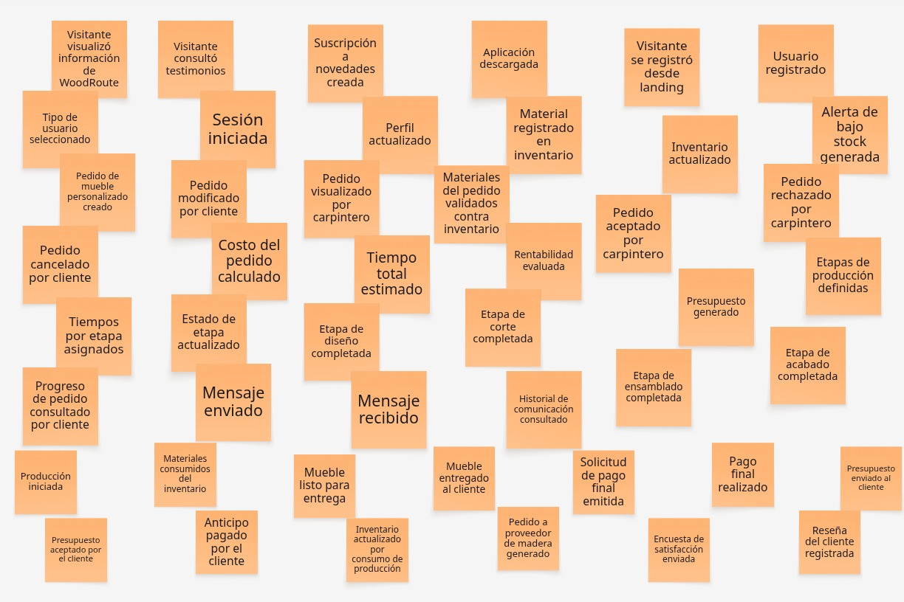
</div>

**Paso 2 — Ordenando cronológicamente.** Los eventos se agruparon en cinco swimlanes (uno por bounded context) y se ordenaron cronológicamente de izquierda a derecha dentro de cada uno.

**Onboarding (Landing + Usuarios)**

<div align="center">
  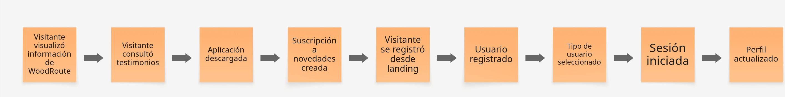
</div>

**Inventario**

<div align="center">
  
</div>

**Cotización y Venta**

<div align="center">
  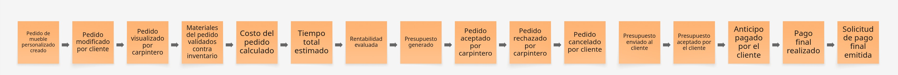
</div>

**Producción**

<div align="center">
  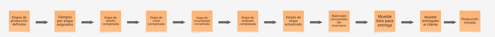
</div>

**Seguimiento y Comunicación**

<div align="center">
  
</div>

**Paso 3 — Añadiendo actores y sistemas externos.** Sobre los swimlanes ordenados se incorporaron los actores (post-its amarillos) que disparan los eventos y los sistemas externos (post-its azules) con los que la plataforma interactúa. Se añadieron también hot spots (post-its rosas) para marcar las preguntas o decisiones pendientes identificadas durante el storytelling.

**Onboarding (Landing + Usuarios)**

<div align="center">
  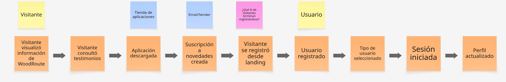
</div>

**Inventario**

<div align="center">
  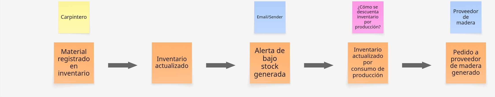
</div>

**Cotización y Venta**

<div align="center">
  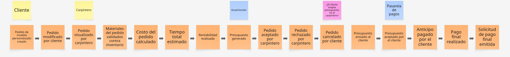
</div>

**Producción**

<div align="center">
  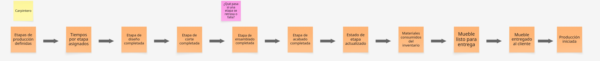
</div>

**Seguimiento y Comunicación**

<div align="center">
  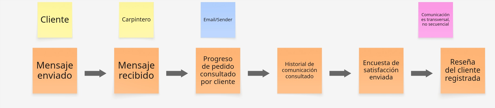
</div>

## 2.5. Ubiquitous Language

- **Custom Furniture (Mueble Personalizado):** pieza única de mobiliario diseñada, dimensionada y fabricada de acuerdo con los requisitos estéticos, funcionales y de espacio específicos de un cliente particular, en lugar de ser producida en masa.
- **WoodRoute:** plataforma web en la nube (SaaS) que centraliza y optimiza la gestión de pedidos, los procesos de fabricación, el inventario y la comunicación con los clientes para carpinteros independientes y pequeños talleres.
- **Carpentry Workshop (Taller de Carpintería):** espacio físico de trabajo donde se almacenan, procesan y ensamblan las materias primas para fabricar los muebles.
- **Feasibility Evaluation (Evaluación de Viabilidad):** proceso de análisis para determinar si es posible construir un mueble solicitado en función del stock actual de madera y herrajes, la estimación de horas de trabajo necesarias y la capacidad operativa disponible en el taller.
- **Production Schedule (Planificación de la Producción):** calendario estructurado que organiza el uso del tiempo, los operarios y la maquinaria del taller para cumplir con los plazos de entrega de todos los pedidos activos sin generar cuellos de botella.
- **Manufacturing Stage (Fase de Fabricación):** cada uno de los pasos físicos y secuenciales necesarios para construir un mueble en el taller (por ejemplo: corte, lijado, ensamble, pintado o acabado).
- **Real-Time Tracking (Seguimiento en Tiempo Real):** funcionalidad orientada al cliente final que le permite visualizar de manera transparente y automática el estado actual o la fase de fabricación en la que se encuentra su mueble.
- **Inventory (Inventario):** registro y control de las materias primas (madera, tableros) y consumibles (tornillos, bisagras, rieles, pintura) físicamente disponibles en el taller.
- **Down Payment (Anticipo de Pago):** depósito monetario inicial que realiza el cliente para formalizar el pedido, financiar la compra de los materiales necesarios y autorizar el inicio de la fabricación en el taller.

<div style="page-break-after: always;"></div>

# Capítulo III: Requirements Specification

## 3.1. User Stories

### Epics

| Epic ID | Epic                                                              |
|---------|-------------------------------------------------------------------|
| EP01    | Gestión del Landing Page                                          |
| EP02    | Gestión de Usuarios y Perfiles                                    |
| EP03    | Gestión de Pedidos de Muebles Personalizados                      |
| EP04    | Planificación y Seguimiento de Producción                         |
| EP05    | Validación de Materiales y Control de Inventario                  |
| EP06    | Estimación de Costos y Tiempos de Fabricación                     |
| EP07    | Comunicación y Transparencia con el Cliente                       |

### User Stories

<table style="table-layout: fixed; width: 100%; display: table;">
  <thead>
    <tr>
      <th style="width: 7%;">Story ID</th>
      <th style="width: 12%;">Título</th>
      <th style="width: 20%;">Descripción</th>
      <th style="width: 45%;">Criterios de Aceptación</th>
      <th style="width: 10%;">Relacionado con (Epic ID)</th>
    </tr>
  </thead>
  <tbody>
    <tr>
      <td>HU01</td>
      <td>Navegación clara dentro de la landing</td>
      <td>Como visitante, quiero navegar de forma rápida y clara por las distintas partes de la landing para encontrar la información que busco sin perder tiempo.</td>
      <td><strong>Escenario 1: Acceso directo a una sección de interés</strong><br><em>Dado</em> que el visitante se encuentra en la landing<br><em>Cuando</em> selecciona una opción de navegación que apunta a una sección específica<br><em>Entonces</em> la página lo lleva directamente a esa sección<br><em>Y</em> conserva el contexto visual para no perder orientación</td>
      <td>EP01</td>
    </tr>
    <tr>
      <td>HU02</td>
      <td>Entender la propuesta de valor de WoodRoute</td>
      <td>Como visitante, quiero entender rápidamente qué problema resuelve WoodRoute y cómo lo resuelve para decidir si me interesa probar la plataforma.</td>
      <td><strong>Escenario 1: Visualización de la propuesta de valor al entrar a la landing</strong><br><em>Dado</em> que el visitante accede a la landing por primera vez<br><em>Cuando</em> la página termina de cargar<br><em>Entonces</em> se le presenta de forma destacada qué problema resuelve WoodRoute y los principales beneficios que ofrece<br><em>Y</em> la información es comprensible sin necesidad de leer detalles técnicos</td>
      <td>EP01</td>
    </tr>
    <tr>
      <td>HU03</td>
      <td>Conocer las funcionalidades del producto</td>
      <td>Como visitante, quiero conocer las principales funcionalidades de WoodRoute para evaluar si cubren las necesidades de mi taller o de mi pedido.</td>
      <td><strong>Escenario 1: Exploración de funcionalidades</strong><br><em>Dado</em> que el visitante está en la landing<br><em>Cuando</em> accede a la información de funcionalidades<br><em>Entonces</em> se muestran las capacidades clave del producto<br><em>Y</em> cada funcionalidad incluye una descripción comprensible para el segmento al que va dirigida</td>
      <td>EP01</td>
    </tr>
    <tr>
      <td>HU04</td>
      <td>Comprender cómo se usa el producto</td>
      <td>Como visitante, quiero comprender el flujo de uso del producto para saber qué esperar antes de registrarme.</td>
      <td><strong>Escenario 1: Visualización del flujo de uso</strong><br><em>Dado</em> que el visitante está en la landing<br><em>Cuando</em> consulta la información sobre cómo funciona WoodRoute<br><em>Entonces</em> se presentan los pasos del flujo de uso de forma ordenada y clara<br><em>Y</em> cada paso incluye una breve descripción de qué ocurre</td>
      <td>EP01</td>
    </tr>
    <tr>
      <td>HU05</td>
      <td>Conocer los planes y precios disponibles</td>
      <td>Como visitante, quiero conocer los planes y precios disponibles para evaluar cuál se ajusta a mi presupuesto y necesidades.</td>
      <td><strong>Escenario 1: Visualización de planes</strong><br><em>Dado</em> que el visitante está en la landing<br><em>Cuando</em> accede a la información de precios<br><em>Entonces</em> se muestran los planes disponibles con sus precios, características y diferencias<br><em>Y</em> cada plan incluye un llamado a la acción para empezar a usarlo</td>
      <td>EP01</td>
    </tr>
    <tr>
      <td>HU06</td>
      <td>Empezar a usar la plataforma desde la landing</td>
      <td>Como visitante (carpintero o cliente), quiero empezar a usar la plataforma desde la landing según mi rol para arrancar el flujo sin fricción.</td>
      <td><strong>Escenario 1: Empezar como carpintero</strong><br><em>Dado</em> que el visitante se identifica como carpintero<br><em>Cuando</em> elige iniciar como carpintero desde la landing<br><em>Entonces</em> la plataforma lo lleva al flujo correspondiente para carpinteros en la aplicación<br><br><strong>Escenario 2: Empezar como cliente</strong><br><em>Dado</em> que el visitante se identifica como cliente<br><em>Cuando</em> elige iniciar como cliente desde la landing<br><em>Entonces</em> la plataforma lo lleva al flujo correspondiente para clientes en la aplicación</td>
      <td>EP01</td>
    </tr>
    <tr>
      <td>HU07</td>
      <td>Conocer al equipo detrás del producto</td>
      <td>Como visitante, quiero conocer al equipo detrás de WoodRoute para generar confianza en la plataforma.</td>
      <td><strong>Escenario 1: Visualización del equipo</strong><br><em>Dado</em> que el visitante está en la landing<br><em>Cuando</em> accede a la presentación del equipo<br><em>Entonces</em> se muestran los integrantes con su información identificativa<br><em>Y</em> la presentación refuerza la transparencia y profesionalismo del proyecto</td>
      <td>EP01</td>
    </tr>
    <tr>
      <td>HU08</td>
      <td>Conocer el producto a través de un video</td>
      <td>Como visitante, quiero ver un video que presente el producto y sus características para entenderlo de forma más visual y rápida.</td>
      <td><strong>Escenario 1: Reproducción del video del producto</strong><br><em>Dado</em> que el visitante está en la landing<br><em>Cuando</em> inicia la reproducción del video About-the-Product<br><em>Entonces</em> el contenido del video se reproduce sin interrupciones<br><em>Y</em> muestra las características principales del producto explicadas con apoyo visual</td>
      <td>EP01</td>
    </tr>
    <tr>
      <td>HU09</td>
      <td>Conocer el proceso del equipo a través de un video</td>
      <td>Como visitante, quiero ver un video que muestre al equipo y su proceso de trabajo para confiar en quienes desarrollan WoodRoute.</td>
      <td><strong>Escenario 1: Reproducción del video del equipo</strong><br><em>Dado</em> que el visitante está en la landing<br><em>Cuando</em> inicia la reproducción del video About-the-Team<br><em>Entonces</em> el contenido del video se reproduce sin interrupciones<br><em>Y</em> muestra al equipo presentando su proceso de trabajo y testimonios</td>
      <td>EP01</td>
    </tr>
    <tr>
      <td>HU10</td>
      <td>Leer la landing en mi idioma preferido</td>
      <td>Como visitante, quiero leer el contenido de la landing en mi idioma preferido (inglés por defecto, o español) para comprenderlo sin barreras.</td>
      <td><strong>Escenario 1: Idioma por defecto</strong><br><em>Dado</em> que un visitante accede a la landing por primera vez sin preferencia previa<br><em>Cuando</em> se carga el contenido<br><em>Entonces</em> el idioma mostrado por defecto es inglés<br><br><strong>Escenario 2: Cambio de idioma a español</strong><br><em>Dado</em> que el visitante está leyendo la landing en inglés<br><em>Cuando</em> elige cambiar el idioma a español<br><em>Entonces</em> todo el contenido de la página se traduce al español<br><em>Y</em> la preferencia de idioma se mantiene mientras el visitante recorre las distintas partes de la landing</td>
      <td>EP01</td>
    </tr>
    <tr>
      <td>HU11</td>
      <td>Conocer los términos y condiciones del servicio</td>
      <td>Como visitante, quiero conocer los términos y condiciones del servicio antes de registrarme para entender mis compromisos como usuario.</td>
      <td><strong>Escenario 1: Acceso a los términos</strong><br><em>Dado</em> que el visitante está en la landing<br><em>Cuando</em> elige consultar los términos y condiciones<br><em>Entonces</em> se le presenta el documento completo con las condiciones de uso<br><em>Y</em> se incluye información sobre responsabilidad ética y profesional según los estándares aplicables (ACM/IEEE/CIP)</td>
      <td>EP01</td>
    </tr>
    <tr>
      <td>HU12</td>
      <td>Seguir a WoodRoute en redes sociales</td>
      <td>Como visitante, quiero seguir a WoodRoute en redes sociales para mantenerme al tanto de novedades, promociones y contenido del rubro.</td>
      <td><strong>Escenario 1: Acceso a una red social</strong><br><em>Dado</em> que el visitante está en la landing<br><em>Cuando</em> elige seguir a WoodRoute en una red social<br><em>Entonces</em> el sistema lo redirige al perfil oficial de WoodRoute en esa red<br><em>Y</em> se abre en una pestaña separada para no perder el contexto de la landing</td>
      <td>EP01</td>
    </tr>
    <tr>
      <td>HU13</td>
      <td>Registro de usuario</td>
      <td>Como visitante, quiero registrarme en la plataforma para poder acceder a sus funcionalidades.</td>
      <td><strong>Escenario 1: Registro exitoso</strong><br><em>Dado</em> que el usuario se encuentra en la página de registro<br><em>Cuando</em> completa correctamente sus datos y envía el formulario<br><em>Entonces</em> el sistema crea su cuenta<br><em>Y</em> le permite acceder a la plataforma</td>
      <td>EP02</td>
    </tr>
    <tr>
      <td>HU14</td>
      <td>Inicio de sesión</td>
      <td>Como usuario registrado, quiero iniciar sesión en la plataforma para acceder a mi cuenta.</td>
      <td><strong>Escenario 1: Inicio de sesión exitoso</strong><br><em>Dado</em> que el usuario ya tiene una cuenta registrada<br><em>Cuando</em> ingresa sus credenciales correctas<br><em>Entonces</em> el sistema valida la información<br><em>Y</em> le permite acceder a su panel principal</td>
      <td>EP02</td>
    </tr>
    <tr>
      <td>HU15</td>
      <td>Gestión de perfil</td>
      <td>Como usuario, quiero editar mi información personal para mantener mis datos actualizados.</td>
      <td><strong>Escenario 1: Actualización de perfil</strong><br><em>Dado</em> que el usuario está en su perfil<br><em>Cuando</em> modifica sus datos y guarda los cambios<br><em>Entonces</em> el sistema actualiza la información<br><em>Y</em> muestra los datos actualizados correctamente</td>
      <td>EP02</td>
    </tr>
    <tr>
      <td>HU16</td>
      <td>Selección de tipo de usuario</td>
      <td>Como usuario, quiero definir si soy carpintero o cliente para acceder a funcionalidades específicas.</td>
      <td><strong>Escenario 1: Selección de rol</strong><br><em>Dado</em> que el usuario se encuentra en el registro<br><em>Cuando</em> selecciona su tipo de usuario (carpintero o cliente)<br><em>Entonces</em> el sistema guarda esta información<br><em>Y</em> adapta la experiencia según el rol seleccionado</td>
      <td>EP02</td>
    </tr>
    <tr>
      <td>HU17</td>
      <td>Creación de pedido personalizado</td>
      <td>Como cliente, quiero crear un pedido de mueble personalizado para solicitar un diseño específico.</td>
      <td><strong>Escenario 1: Creación exitosa de pedido</strong><br><em>Dado</em> que el cliente se encuentra en la sección de pedidos<br><em>Cuando</em> completa los detalles del mueble (medidas, material, diseño) y envía la solicitud<br><em>Entonces</em> el sistema registra el pedido<br><em>Y</em> lo envía al carpintero para su revisión</td>
      <td>EP03</td>
    </tr>
    <tr>
      <td>HU18</td>
      <td>Visualización de pedidos</td>
      <td>Como usuario, quiero visualizar la lista de pedidos para hacer seguimiento a su estado.</td>
      <td><strong>Escenario 1: Visualización de pedidos</strong><br><em>Dado</em> que el usuario accede a la sección de pedidos<br><em>Cuando</em> el sistema carga la información<br><em>Entonces</em> se muestran los pedidos registrados<br><em>Y</em> su estado actual (pendiente, en proceso, finalizado)</td>
      <td>EP03</td>
    </tr>
    <tr>
      <td>HU19</td>
      <td>Aceptación o rechazo de pedidos</td>
      <td>Como carpintero, quiero aceptar o rechazar pedidos para gestionar mi carga de trabajo.</td>
      <td><strong>Escenario 1: Aceptación de pedido</strong><br><em>Dado</em> que el carpintero recibe un pedido<br><em>Cuando</em> revisa los detalles y decide aceptarlo<br><em>Entonces</em> el sistema actualiza el estado del pedido<br><em>Y</em> lo marca como "en proceso"</td>
      <td>EP03</td>
    </tr>
    <tr>
      <td>HU20</td>
      <td>Modificación de pedido</td>
      <td>Como cliente, quiero modificar un pedido antes de que sea aceptado para ajustar los detalles.</td>
      <td><strong>Escenario 1: Modificación exitosa</strong><br><em>Dado</em> que el pedido aún no ha sido aceptado<br><em>Cuando</em> el cliente edita la información del pedido<br><em>Entonces</em> el sistema actualiza los cambios<br><em>Y</em> notifica al carpintero</td>
      <td>EP03</td>
    </tr>
    <tr>
      <td>HU21</td>
      <td>Cancelación de pedido</td>
      <td>Como cliente, quiero cancelar un pedido para detener el proceso si ya no lo necesito.</td>
      <td><strong>Escenario 1: Cancelación de pedido</strong><br><em>Dado</em> que el cliente tiene un pedido activo<br><em>Cuando</em> selecciona la opción de cancelar<br><em>Entonces</em> el sistema cambia el estado del pedido a "cancelado"<br><em>Y</em> notifica al carpintero</td>
      <td>EP03</td>
    </tr>
    <tr>
      <td>HU22</td>
      <td>Definición de etapas de producción</td>
      <td>Como carpintero, quiero definir las etapas de producción de un pedido para organizar mejor el trabajo.</td>
      <td><strong>Escenario 1: Creación de etapas</strong><br><em>Dado</em> que el carpintero ha aceptado un pedido<br><em>Cuando</em> define las etapas (diseño, corte, ensamblado, acabado, entrega)<br><em>Entonces</em> el sistema registra las etapas<br><em>Y</em> las asocia al pedido</td>
      <td>EP04</td>
    </tr>
    <tr>
      <td>HU23</td>
      <td>Actualización del estado de producción</td>
      <td>Como carpintero, quiero actualizar el estado de cada etapa para reflejar el progreso del pedido.</td>
      <td><strong>Escenario 1: Actualización de estado</strong><br><em>Dado</em> que el pedido está en proceso<br><em>Cuando</em> el carpintero cambia el estado de una etapa<br><em>Entonces</em> el sistema actualiza el progreso<br><em>Y</em> refleja el cambio en el seguimiento del pedido</td>
      <td>EP04</td>
    </tr>
    <tr>
      <td>HU24</td>
      <td>Visualización del progreso</td>
      <td>Como cliente, quiero ver el progreso de mi pedido para conocer en qué etapa se encuentra.</td>
      <td><strong>Escenario 1: Visualización de progreso</strong><br><em>Dado</em> que el cliente tiene un pedido activo<br><em>Cuando</em> accede al detalle del pedido<br><em>Entonces</em> el sistema muestra las etapas completadas y pendientes<br><em>Y</em> el estado actual del pedido</td>
      <td>EP04</td>
    </tr>
    <tr>
      <td>HU25</td>
      <td>Estimación de tiempos por etapa</td>
      <td>Como carpintero, quiero asignar tiempos estimados a cada etapa para planificar mejor la entrega.</td>
      <td><strong>Escenario 1: Asignación de tiempos</strong><br><em>Dado</em> que el carpintero está planificando un pedido<br><em>Cuando</em> define el tiempo estimado por etapa<br><em>Entonces</em> el sistema guarda la información<br><em>Y</em> calcula el tiempo total estimado</td>
      <td>EP04</td>
    </tr>
    <tr>
      <td>HU26</td>
      <td>Registro de materiales</td>
      <td>Como carpintero, quiero registrar los materiales disponibles para llevar un control del inventario.</td>
      <td><strong>Escenario 1: Registro exitoso</strong><br><em>Dado</em> que el carpintero accede al módulo de inventario<br><em>Cuando</em> ingresa los datos del material (tipo, cantidad, unidad)<br><em>Entonces</em> el sistema guarda la información<br><em>Y</em> actualiza el inventario disponible</td>
      <td>EP05</td>
    </tr>
    <tr>
      <td>HU27</td>
      <td>Actualización de inventario</td>
      <td>Como carpintero, quiero actualizar las cantidades de materiales para reflejar el consumo o reposición.</td>
      <td><strong>Escenario 1: Actualización de stock</strong><br><em>Dado</em> que el carpintero utiliza o repone materiales<br><em>Cuando</em> modifica la cantidad en el sistema<br><em>Entonces</em> el inventario se actualiza correctamente<br><em>Y</em> refleja el stock actual</td>
      <td>EP05</td>
    </tr>
    <tr>
      <td>HU28</td>
      <td>Validación de materiales para pedidos</td>
      <td>Como carpintero, quiero validar si tengo materiales suficientes para aceptar un pedido.</td>
      <td><strong>Escenario 1: Validación automática</strong><br><em>Dado</em> que el carpintero revisa un pedido<br><em>Cuando</em> el sistema compara los materiales requeridos con el inventario<br><em>Entonces</em> indica si el pedido es viable<br><em>Y</em> muestra los materiales faltantes si aplica</td>
      <td>EP05</td>
    </tr>
    <tr>
      <td>HU29</td>
      <td>Alerta de bajo inventario</td>
      <td>Como carpintero, quiero recibir alertas cuando el stock sea bajo para evitar retrasos en producción.</td>
      <td><strong>Escenario 1: Generación de alerta</strong><br><em>Dado</em> que un material alcanza el nivel mínimo definido<br><em>Cuando</em> el sistema detecta esta condición<br><em>Entonces</em> genera una alerta<br><em>Y</em> notifica al carpintero</td>
      <td>EP05</td>
    </tr>
    <tr>
      <td>HU30</td>
      <td>Cálculo de costo estimado</td>
      <td>Como carpintero, quiero calcular el costo estimado de un pedido para definir un precio adecuado.</td>
      <td><strong>Escenario 1: Cálculo de costo</strong><br><em>Dado</em> que el carpintero tiene los detalles del pedido<br><em>Cuando</em> ingresa los costos de materiales y mano de obra<br><em>Entonces</em> el sistema calcula el costo total<br><em>Y</em> muestra el resultado estimado</td>
      <td>EP06</td>
    </tr>
    <tr>
      <td>HU31</td>
      <td>Estimación de tiempo total</td>
      <td>Como carpintero, quiero estimar el tiempo total de fabricación para planificar la entrega del pedido.</td>
      <td><strong>Escenario 1: Estimación de tiempo</strong><br><em>Dado</em> que el carpintero define los tiempos por etapa<br><em>Cuando</em> el sistema procesa la información<br><em>Entonces</em> calcula el tiempo total estimado<br><em>Y</em> lo muestra al usuario</td>
      <td>EP06</td>
    </tr>
    <tr>
      <td>HU32</td>
      <td>Evaluación de rentabilidad</td>
      <td>Como carpintero, quiero evaluar la rentabilidad de un pedido para tomar decisiones informadas.</td>
      <td><strong>Escenario 1: Evaluación de rentabilidad</strong><br><em>Dado</em> que el carpintero tiene el costo estimado<br><em>Cuando</em> compara con el precio de venta<br><em>Entonces</em> el sistema calcula la ganancia<br><em>Y</em> muestra si el pedido es rentable</td>
      <td>EP06</td>
    </tr>
    <tr>
      <td>HU33</td>
      <td>Generación de presupuesto</td>
      <td>Como carpintero, quiero generar un presupuesto para presentar al cliente antes de iniciar el trabajo.</td>
      <td><strong>Escenario 1: Generación de presupuesto</strong><br><em>Dado</em> que el carpintero ha calculado costos y tiempos<br><em>Cuando</em> solicita generar el presupuesto<br><em>Entonces</em> el sistema crea un documento<br><em>Y</em> lo deja listo para compartir con el cliente</td>
      <td>EP06</td>
    </tr>
    <tr>
      <td>HU34</td>
      <td>Envío de mensajes</td>
      <td>Como usuario, quiero enviar mensajes dentro de la plataforma para comunicarme sobre el pedido.</td>
      <td><strong>Escenario 1: Envío de mensaje exitoso</strong><br><em>Dado</em> que el usuario accede al chat del pedido<br><em>Cuando</em> escribe un mensaje y lo envía<br><em>Entonces</em> el sistema entrega el mensaje<br><em>Y</em> lo muestra en la conversación</td>
      <td>EP07</td>
    </tr>
    <tr>
      <td>HU35</td>
      <td>Recepción de mensajes</td>
      <td>Como usuario, quiero recibir mensajes para mantenerme informado sobre el pedido.</td>
      <td><strong>Escenario 1: Recepción de mensaje</strong><br><em>Dado</em> que otro usuario envía un mensaje<br><em>Cuando</em> el sistema procesa el envío<br><em>Entonces</em> el mensaje se recibe correctamente<br><em>Y</em> se muestra en la conversación</td>
      <td>EP07</td>
    </tr>
    <tr>
      <td>HU36</td>
      <td>Historial de comunicación</td>
      <td>Como usuario, quiero ver el historial de mensajes para revisar conversaciones anteriores.</td>
      <td><strong>Escenario 1: Visualización de historial</strong><br><em>Dado</em> que el usuario accede al chat<br><em>Cuando</em> el sistema carga los mensajes<br><em>Entonces</em> muestra el historial completo<br><em>Y</em> ordenado cronológicamente</td>
      <td>EP07</td>
    </tr>
    <tr>
      <td>HU37</td>
      <td>Aceptación del presupuesto por el cliente</td>
      <td>Como cliente, quiero aceptar el presupuesto generado por el carpintero para confirmar que estoy de acuerdo con el costo y los tiempos antes de iniciar la fabricación.</td>
      <td><strong>Escenario 1: Aceptación exitosa</strong><br><em>Dado</em> que el cliente recibe un presupuesto<br><em>Cuando</em> revisa los detalles y selecciona "Aceptar"<br><em>Entonces</em> el sistema actualiza el estado del presupuesto a "Aceptado"<br><em>Y</em> notifica al carpintero para coordinar el anticipo</td>
      <td>EP06</td>
    </tr>
    <tr>
      <td>HU38</td>
      <td>Registro de comprobante de anticipo</td>
      <td>Como cliente, quiero registrar el comprobante de mi anticipo de pago (Yape, transferencia bancaria) para que el carpintero pueda iniciar la producción.</td>
      <td><strong>Escenario 1: Registro de comprobante</strong><br><em>Dado</em> que el cliente aceptó el presupuesto<br><em>Cuando</em> sube un comprobante (imagen o PDF) e ingresa el monto y la fecha del pago<br><em>Entonces</em> el sistema registra el anticipo como "Pendiente de validación"<br><em>Y</em> notifica al carpintero para que lo verifique</td>
      <td>EP06</td>
    </tr>
    <tr>
      <td>HU39</td>
      <td>Validación de anticipo por el carpintero</td>
      <td>Como carpintero, quiero validar el comprobante del anticipo enviado por el cliente para confirmar que el pago llegó y autorizar el inicio de la producción.</td>
      <td><strong>Escenario 1: Anticipo validado</strong><br><em>Dado</em> que el carpintero revisa el comprobante en la plataforma<br><em>Cuando</em> confirma que el monto y la cuenta destino son correctos y marca "Validado"<br><em>Entonces</em> el sistema cambia el estado del anticipo a "Confirmado"<br><em>Y</em> habilita el pedido para iniciar la producción<br><br><strong>Escenario 2: Anticipo rechazado</strong><br><em>Dado</em> que el carpintero detecta un comprobante inválido o monto incorrecto<br><em>Cuando</em> marca "Rechazado" y deja una nota<br><em>Entonces</em> el sistema mantiene el pedido en estado "Pendiente"<br><em>Y</em> notifica al cliente para que envíe un nuevo comprobante</td>
      <td>EP06</td>
    </tr>
    <tr>
      <td>HU40</td>
      <td>Solicitud de pago final</td>
      <td>Como carpintero, quiero emitir una solicitud de pago final al cliente cuando el mueble esté listo para entrega, para coordinar el cobro del saldo restante.</td>
      <td><strong>Escenario 1: Solicitud emitida</strong><br><em>Dado</em> que el pedido se encuentra en estado "Listo para entrega"<br><em>Cuando</em> el carpintero genera la solicitud de pago final<br><em>Entonces</em> el sistema envía la solicitud al cliente con el monto pendiente y las cuentas destino<br><em>Y</em> registra la solicitud en el historial del pedido</td>
      <td>EP06</td>
    </tr>
    <tr>
      <td>HU41</td>
      <td>Registro de comprobante de pago final</td>
      <td>Como cliente, quiero registrar el comprobante del pago final (Yape, transferencia bancaria) para coordinar la entrega de mi mueble.</td>
      <td><strong>Escenario 1: Registro de comprobante final</strong><br><em>Dado</em> que el cliente recibió la solicitud de pago final<br><em>Cuando</em> sube el comprobante e ingresa el monto y la fecha<br><em>Entonces</em> el sistema registra el pago final como "Pendiente de validación"<br><em>Y</em> notifica al carpintero para que lo verifique</td>
      <td>EP06</td>
    </tr>
    <tr>
      <td>HU42</td>
      <td>Validación de pago final</td>
      <td>Como carpintero, quiero validar el comprobante del pago final para confirmar el cobro completo y autorizar la entrega del mueble.</td>
      <td><strong>Escenario 1: Pago final validado</strong><br><em>Dado</em> que el carpintero revisa el comprobante del pago final<br><em>Cuando</em> confirma que el monto y la cuenta destino son correctos y marca "Validado"<br><em>Entonces</em> el sistema cambia el estado del pedido a "Pagado completamente"<br><em>Y</em> habilita la coordinación de entrega con el cliente</td>
      <td>EP06</td>
    </tr>
    <tr>
      <td>HU43</td>
      <td>Consulta pública del estado del pedido</td>
      <td>Como cliente, quiero consultar el estado y el progreso de mi pedido mediante un enlace público, sin necesidad de iniciar sesión, para acceder de forma rápida y sin fricción desde cualquier dispositivo.</td>
      <td><strong>Escenario 1: Acceso público al estado</strong><br><em>Dado</em> que el cliente recibe un enlace público con su <code>publicTrackingId</code><br><em>Cuando</em> accede al enlace<br><em>Entonces</em> el sistema muestra el estado actual, la etapa de producción, la fecha estimada de entrega y el porcentaje de avance<br><em>Y</em> no solicita credenciales para acceder<br><br><strong>Escenario 2: Pedido cancelado o inexistente</strong><br><em>Dado</em> que el <code>publicTrackingId</code> no existe o el pedido fue cancelado<br><em>Cuando</em> el cliente accede al enlace<br><em>Entonces</em> el sistema muestra un mensaje claro indicando que el pedido no está disponible</td>
      <td>EP07</td>
    </tr>
    <tr>
      <td>HU44</td>
      <td>Generación de orden de compra al proveedor</td>
      <td>Como carpintero, quiero generar una orden de compra hacia un proveedor de madera cuando un material esté por agotarse, para reponer el inventario sin retrasar la producción.</td>
      <td><strong>Escenario 1: Orden generada manualmente</strong><br><em>Dado</em> que el carpintero detecta un material con stock bajo o agotado<br><em>Cuando</em> selecciona el material y genera una orden de compra al proveedor (cantidad, tipo, fecha estimada)<br><em>Entonces</em> el sistema registra la orden con estado "Enviada al proveedor"<br><em>Y</em> la asocia al material para su reposición<br><br><strong>Escenario 2: Recepción de material</strong><br><em>Dado</em> que la orden fue enviada al proveedor<br><em>Cuando</em> el carpintero confirma la recepción del material<br><em>Entonces</em> el sistema cierra la orden<br><em>Y</em> actualiza automáticamente el inventario</td>
      <td>EP05</td>
    </tr>
    <tr>
      <td>TS01</td>
      <td>Endpoint de autenticación de usuarios</td>
      <td>Como Developer, quiero exponer un endpoint <code>POST /auth/login</code> que valide credenciales y devuelva un token JWT para permitir el acceso autenticado a la plataforma.</td>
      <td><strong>Escenario 1: Login exitoso</strong><br><em>Dado</em> que el body contiene <code>email</code> y <code>password</code> válidos<br><em>Cuando</em> el cliente envía <code>POST /auth/login</code><br><em>Entonces</em> el servicio responde <code>200 OK</code><br><em>Y</em> el body incluye <code>accessToken</code> y <code>refreshToken</code><br><br><strong>Escenario 2: Credenciales inválidas</strong><br><em>Dado</em> que el body contiene credenciales incorrectas<br><em>Cuando</em> el cliente envía <code>POST /auth/login</code><br><em>Entonces</em> el servicio responde <code>401 Unauthorized</code><br><em>Y</em> el body incluye un mensaje de error genérico sin exponer si el correo existe</td>
      <td>EP02</td>
    </tr>
    <tr>
      <td>TS02</td>
      <td>Endpoints REST de gestión de pedidos</td>
      <td>Como Developer, quiero exponer endpoints REST <code>/orders</code> para crear, listar y consultar pedidos, persistiendo la información desde la Web Application.</td>
      <td><strong>Escenario 1: Creación de pedido</strong><br><em>Dado</em> que el cliente está autenticado<br><em>Y</em> el body contiene los detalles válidos del pedido<br><em>Cuando</em> envía <code>POST /orders</code><br><em>Entonces</em> el servicio responde <code>201 Created</code><br><em>Y</em> devuelve <code>orderId</code> y <code>publicTrackingId</code><br><br><strong>Escenario 2: Listado paginado</strong><br><em>Dado</em> un usuario autenticado<br><em>Cuando</em> envía <code>GET /orders?role={carpenter|client}&page=1&size=20</code><br><em>Entonces</em> el servicio responde <code>200 OK</code><br><em>Y</em> devuelve la lista paginada de pedidos asociados al usuario</td>
      <td>EP03</td>
    </tr>
    <tr>
      <td>TS03</td>
      <td>Endpoint de actualización de etapa de producción</td>
      <td>Como Developer, quiero exponer un endpoint <code>PATCH /orders/{orderId}/stages/{stageId}</code> para que el carpintero actualice el estado de cada etapa de fabricación.</td>
      <td><strong>Escenario 1: Actualización exitosa</strong><br><em>Dado</em> que el carpintero es propietario del pedido<br><em>Y</em> el body contiene <code>status</code> válido (<code>pending</code>, <code>in_progress</code>, <code>completed</code>)<br><em>Cuando</em> envía <code>PATCH /orders/{orderId}/stages/{stageId}</code><br><em>Entonces</em> el servicio responde <code>200 OK</code><br><em>Y</em> publica el evento <code>StageUpdated</code> para notificar al cliente<br><br><strong>Escenario 2: Sin permisos</strong><br><em>Dado</em> que el usuario no es el carpintero del pedido<br><em>Cuando</em> envía la petición<br><em>Entonces</em> el servicio responde <code>403 Forbidden</code></td>
      <td>EP04</td>
    </tr>
    <tr>
      <td>TS04</td>
      <td>API CRUD de inventario</td>
      <td>Como Developer, quiero exponer endpoints REST <code>/inventory</code> para que el carpintero gestione registro, actualización y consulta de materiales del taller.</td>
      <td><strong>Escenario 1: Registrar material</strong><br><em>Dado</em> que el carpintero está autenticado<br><em>Y</em> el body contiene <code>materialType</code>, <code>quantity</code>, <code>unit</code> y <code>minStock</code><br><em>Cuando</em> envía <code>POST /inventory</code><br><em>Entonces</em> el servicio responde <code>201 Created</code><br><em>Y</em> devuelve el <code>materialId</code> generado<br><br><strong>Escenario 2: Stock bajo tras actualización</strong><br><em>Dado</em> que la cantidad resultante es menor a <code>minStock</code><br><em>Cuando</em> se ejecuta <code>PATCH /inventory/{materialId}</code><br><em>Entonces</em> el servicio responde <code>200 OK</code><br><em>Y</em> publica el evento <code>LowStockDetected</code> para disparar la alerta</td>
      <td>EP05</td>
    </tr>
    <tr>
      <td>TS05</td>
      <td>Endpoint de validación de viabilidad de pedido</td>
      <td>Como Developer, quiero exponer un endpoint <code>POST /orders/{orderId}/feasibility</code> que valide si el inventario y la capacidad del taller permiten construir el mueble solicitado.</td>
      <td><strong>Escenario 1: Pedido viable</strong><br><em>Dado</em> que el inventario cubre los materiales requeridos<br><em>Cuando</em> se envía <code>POST /orders/{orderId}/feasibility</code><br><em>Entonces</em> el servicio responde <code>200 OK</code><br><em>Y</em> el body incluye <code>feasible: true</code> y <code>estimatedTime</code><br><br><strong>Escenario 2: Materiales insuficientes</strong><br><em>Dado</em> que el inventario no cubre todos los materiales<br><em>Cuando</em> se envía la petición<br><em>Entonces</em> el servicio responde <code>200 OK</code><br><em>Y</em> el body incluye <code>feasible: false</code> con la lista de <code>missingMaterials</code></td>
      <td>EP05</td>
    </tr>
    <tr>
      <td>TS06</td>
      <td>Endpoint público de seguimiento de pedido</td>
      <td>Como Developer, quiero exponer un endpoint público <code>GET /tracking/{publicTrackingId}</code> que permita al cliente consultar el estado de su pedido sin autenticación.</td>
      <td><strong>Escenario 1: Pedido encontrado</strong><br><em>Dado</em> un <code>publicTrackingId</code> válido<br><em>Cuando</em> se envía <code>GET /tracking/{publicTrackingId}</code><br><em>Entonces</em> el servicio responde <code>200 OK</code><br><em>Y</em> devuelve <code>status</code>, <code>currentStage</code>, <code>estimatedDeliveryDate</code> y <code>progressPercent</code><br><br><strong>Escenario 2: ID inválido o pedido cancelado</strong><br><em>Dado</em> un <code>publicTrackingId</code> inexistente o asociado a un pedido cancelado<br><em>Cuando</em> se envía la petición<br><em>Entonces</em> el servicio responde <code>404 Not Found</code></td>
      <td>EP07</td>
    </tr>
    <tr>
      <td>TS07</td>
      <td>Endpoints REST de mensajería por pedido</td>
      <td>Como Developer, quiero exponer endpoints REST <code>/orders/{orderId}/messages</code> para que cliente y carpintero intercambien y consulten mensajes asociados a un pedido específico.</td>
      <td><strong>Escenario 1: Envío de mensaje</strong><br><em>Dado</em> que el usuario es participante del pedido<br><em>Y</em> el body contiene <code>content</code> no vacío<br><em>Cuando</em> envía <code>POST /orders/{orderId}/messages</code><br><em>Entonces</em> el servicio responde <code>201 Created</code><br><em>Y</em> publica el evento <code>MessageSent</code><br><br><strong>Escenario 2: Consulta paginada de historial</strong><br><em>Dado</em> el <code>orderId</code><br><em>Cuando</em> se envía <code>GET /orders/{orderId}/messages?limit=20&before={cursor}</code><br><em>Entonces</em> el servicio responde <code>200 OK</code><br><em>Y</em> devuelve los mensajes en orden cronológico descendente</td>
      <td>EP07</td>
    </tr>
    <tr>
      <td>TS08</td>
      <td>Endpoint de cálculo de costos y tiempos</td>
      <td>Como Developer, quiero exponer un endpoint <code>POST /orders/{orderId}/estimate</code> que calcule costos y tiempos totales del pedido a partir de materiales, mano de obra y etapas.</td>
      <td><strong>Escenario 1: Estimación exitosa</strong><br><em>Dado</em> que el pedido tiene etapas y materiales definidos<br><em>Cuando</em> se envía <code>POST /orders/{orderId}/estimate</code><br><em>Entonces</em> el servicio responde <code>200 OK</code><br><em>Y</em> devuelve <code>totalCost</code>, <code>totalDuration</code> y el desglose por etapa<br><br><strong>Escenario 2: Pedido sin etapas</strong><br><em>Dado</em> un pedido sin etapas definidas<br><em>Cuando</em> se envía la petición<br><em>Entonces</em> el servicio responde <code>422 Unprocessable Entity</code> con el detalle del error</td>
      <td>EP06</td>
    </tr>
  </tbody>
</table>


## 3.2. Impact Mapping

A continuación se visualiza el Impact Map del proyecto WoodRoute, donde se muestra la relación entre el Business Goal definido, los User Personas identificados, los Impactos esperados en su comportamiento, los Deliverables que como negocio digital podemos ofrecer y las User Stories asociadas que permitirán implementar las funcionalidades necesarias en la aplicación web y la landing page. Este mapa busca asegurar la alineación entre los objetivos estratégicos y el desarrollo de la solución digital.

<div align="center">
  
</div>


## 3.3. Product Backlog

El Product Backlog se elabora a continuación, listando cada User Story con su orden de prioridad, identificador, título, descripción y Story Points. Posteriormente se presenta el enlace público y la captura del board en Trello, herramienta utilizada por el equipo para la gestión colaborativa del backlog.

<table>
  <thead>
    <tr>
      <th>Orden</th>
      <th>User Story ID</th>
      <th>Título</th>
      <th>Descripción</th>
      <th>Story Points</th>
    </tr>
  </thead>
  <tbody>
    <tr>
      <td>1</td>
      <td>HU01</td>
      <td>Navegación clara dentro de la landing</td>
      <td>Como visitante, quiero navegar de forma rápida y clara por las distintas partes de la landing para encontrar lo que busco.</td>
      <td>1</td>
    </tr>
    <tr>
      <td>2</td>
      <td>HU02</td>
      <td>Entender la propuesta de valor de WoodRoute</td>
      <td>Como visitante, quiero entender rápidamente qué problema resuelve WoodRoute y cómo lo resuelve.</td>
      <td>2</td>
    </tr>
    <tr>
      <td>3</td>
      <td>HU03</td>
      <td>Conocer las funcionalidades del producto</td>
      <td>Como visitante, quiero conocer las principales funcionalidades de WoodRoute para evaluar si cubren mis necesidades.</td>
      <td>1</td>
    </tr>
    <tr>
      <td>4</td>
      <td>HU04</td>
      <td>Comprender cómo se usa el producto</td>
      <td>Como visitante, quiero comprender el flujo de uso del producto para saber qué esperar antes de registrarme.</td>
      <td>1</td>
    </tr>
    <tr>
      <td>5</td>
      <td>HU05</td>
      <td>Conocer los planes y precios disponibles</td>
      <td>Como visitante, quiero conocer los planes y precios disponibles para evaluar cuál se ajusta a mis necesidades.</td>
      <td>2</td>
    </tr>
    <tr>
      <td>6</td>
      <td>HU07</td>
      <td>Conocer al equipo detrás del producto</td>
      <td>Como visitante, quiero conocer al equipo detrás de WoodRoute para generar confianza en la plataforma.</td>
      <td>1</td>
    </tr>
    <tr>
      <td>7</td>
      <td>HU12</td>
      <td>Seguir a WoodRoute en redes sociales</td>
      <td>Como visitante, quiero seguir a WoodRoute en redes sociales para mantenerme al tanto de novedades.</td>
      <td>1</td>
    </tr>
    <tr>
      <td>8</td>
      <td>HU11</td>
      <td>Conocer los términos y condiciones del servicio</td>
      <td>Como visitante, quiero conocer los términos y condiciones del servicio antes de registrarme.</td>
      <td>1</td>
    </tr>
    <tr>
      <td>9</td>
      <td>HU06</td>
      <td>Empezar a usar la plataforma desde la landing</td>
      <td>Como visitante (carpintero o cliente), quiero empezar a usar la plataforma desde la landing según mi rol.</td>
      <td>3</td>
    </tr>
    <tr>
      <td>10</td>
      <td>HU10</td>
      <td>Leer la landing en mi idioma preferido</td>
      <td>Como visitante, quiero leer el contenido de la landing en mi idioma preferido (inglés por defecto, o español).</td>
      <td>3</td>
    </tr>
    <tr>
      <td>11</td>
      <td>HU17</td>
      <td>Creación de pedido personalizado</td>
      <td>Como cliente, quiero crear un pedido de mueble personalizado para solicitar un diseño específico.</td>
      <td>5</td>
    </tr>
    <tr>
      <td>12</td>
      <td>HU19</td>
      <td>Aceptación o rechazo de pedidos</td>
      <td>Como carpintero, quiero aceptar o rechazar pedidos para gestionar mi carga de trabajo.</td>
      <td>3</td>
    </tr>
    <tr>
      <td>13</td>
      <td>HU18</td>
      <td>Visualización de pedidos</td>
      <td>Como usuario, quiero visualizar la lista de pedidos para hacer seguimiento a su estado.</td>
      <td>3</td>
    </tr>
    <tr>
      <td>14</td>
      <td>HU24</td>
      <td>Visualización del progreso</td>
      <td>Como cliente, quiero ver el progreso de mi pedido para conocer en qué etapa se encuentra.</td>
      <td>3</td>
    </tr>
    <tr>
      <td>15</td>
      <td>HU22</td>
      <td>Definición de etapas de producción</td>
      <td>Como carpintero, quiero definir las etapas de producción de un pedido para organizar mejor el trabajo.</td>
      <td>5</td>
    </tr>
    <tr>
      <td>16</td>
      <td>HU23</td>
      <td>Actualización del estado de producción</td>
      <td>Como carpintero, quiero actualizar el estado de cada etapa para reflejar el progreso del pedido.</td>
      <td>3</td>
    </tr>
    <tr>
      <td>17</td>
      <td>HU43</td>
      <td>Consulta pública del estado del pedido</td>
      <td>Como cliente, quiero consultar el estado de mi pedido mediante un enlace público sin necesidad de iniciar sesión.</td>
      <td>3</td>
    </tr>
    <tr>
      <td>18</td>
      <td>HU34</td>
      <td>Envío de mensajes</td>
      <td>Como usuario, quiero enviar mensajes dentro de la plataforma para comunicarme sobre el pedido.</td>
      <td>3</td>
    </tr>
    <tr>
      <td>19</td>
      <td>HU35</td>
      <td>Recepción de mensajes</td>
      <td>Como usuario, quiero recibir mensajes para mantenerme informado sobre el pedido.</td>
      <td>3</td>
    </tr>
    <tr>
      <td>20</td>
      <td>HU36</td>
      <td>Historial de comunicación</td>
      <td>Como usuario, quiero ver el historial de mensajes para revisar conversaciones anteriores.</td>
      <td>2</td>
    </tr>
    <tr>
      <td>21</td>
      <td>HU25</td>
      <td>Estimación de tiempos por etapa</td>
      <td>Como carpintero, quiero asignar tiempos estimados a cada etapa para planificar mejor la entrega.</td>
      <td>5</td>
    </tr>
    <tr>
      <td>22</td>
      <td>HU26</td>
      <td>Registro de materiales</td>
      <td>Como carpintero, quiero registrar los materiales disponibles para llevar un control del inventario.</td>
      <td>3</td>
    </tr>
    <tr>
      <td>23</td>
      <td>HU27</td>
      <td>Actualización de inventario</td>
      <td>Como carpintero, quiero actualizar las cantidades de materiales para reflejar el consumo o reposición.</td>
      <td>3</td>
    </tr>
    <tr>
      <td>24</td>
      <td>HU28</td>
      <td>Validación de materiales para pedidos</td>
      <td>Como carpintero, quiero validar si tengo materiales suficientes para aceptar un pedido.</td>
      <td>5</td>
    </tr>
    <tr>
      <td>25</td>
      <td>HU29</td>
      <td>Alerta de bajo inventario</td>
      <td>Como carpintero, quiero recibir alertas cuando el stock sea bajo para evitar retrasos en producción.</td>
      <td>5</td>
    </tr>
    <tr>
      <td>26</td>
      <td>HU30</td>
      <td>Cálculo de costo estimado</td>
      <td>Como carpintero, quiero calcular el costo estimado de un pedido para definir un precio adecuado.</td>
      <td>5</td>
    </tr>
    <tr>
      <td>27</td>
      <td>HU31</td>
      <td>Estimación de tiempo total</td>
      <td>Como carpintero, quiero estimar el tiempo total de fabricación para planificar la entrega del pedido.</td>
      <td>5</td>
    </tr>
    <tr>
      <td>28</td>
      <td>HU33</td>
      <td>Generación de presupuesto</td>
      <td>Como carpintero, quiero generar un presupuesto para presentar al cliente antes de iniciar el trabajo.</td>
      <td>5</td>
    </tr>
    <tr>
      <td>29</td>
      <td>HU32</td>
      <td>Evaluación de rentabilidad</td>
      <td>Como carpintero, quiero evaluar la rentabilidad de un pedido para tomar decisiones informadas.</td>
      <td>5</td>
    </tr>
    <tr>
      <td>30</td>
      <td>HU20</td>
      <td>Modificación de pedido</td>
      <td>Como cliente, quiero modificar un pedido antes de que sea aceptado para ajustar los detalles.</td>
      <td>3</td>
    </tr>
    <tr>
      <td>31</td>
      <td>HU21</td>
      <td>Cancelación de pedido</td>
      <td>Como cliente, quiero cancelar un pedido para detener el proceso si ya no lo necesito.</td>
      <td>2</td>
    </tr>
    <tr>
      <td>32</td>
      <td>HU16</td>
      <td>Selección de tipo de usuario</td>
      <td>Como usuario, quiero definir si soy carpintero o cliente para acceder a funcionalidades específicas.</td>
      <td>2</td>
    </tr>
    <tr>
      <td>33</td>
      <td>HU13</td>
      <td>Registro de usuario</td>
      <td>Como visitante, quiero registrarme en la plataforma para poder acceder a sus funcionalidades.</td>
      <td>3</td>
    </tr>
    <tr>
      <td>34</td>
      <td>HU14</td>
      <td>Inicio de sesión</td>
      <td>Como usuario registrado, quiero iniciar sesión en la plataforma para acceder a mi cuenta.</td>
      <td>2</td>
    </tr>
    <tr>
      <td>35</td>
      <td>HU15</td>
      <td>Gestión de perfil</td>
      <td>Como usuario, quiero editar mi información personal para mantener mis datos actualizados.</td>
      <td>3</td>
    </tr>
    <tr>
      <td>36</td>
      <td>HU37</td>
      <td>Aceptación del presupuesto por el cliente</td>
      <td>Como cliente, quiero aceptar el presupuesto generado por el carpintero para confirmar el costo y los tiempos.</td>
      <td>2</td>
    </tr>
    <tr>
      <td>37</td>
      <td>HU38</td>
      <td>Registro de comprobante de anticipo</td>
      <td>Como cliente, quiero registrar el comprobante de mi anticipo de pago para que el carpintero inicie la producción.</td>
      <td>3</td>
    </tr>
    <tr>
      <td>38</td>
      <td>HU39</td>
      <td>Validación de anticipo por el carpintero</td>
      <td>Como carpintero, quiero validar el comprobante del anticipo para autorizar el inicio de la producción.</td>
      <td>3</td>
    </tr>
    <tr>
      <td>39</td>
      <td>HU40</td>
      <td>Solicitud de pago final</td>
      <td>Como carpintero, quiero emitir una solicitud de pago final al cliente cuando el mueble esté listo para entrega.</td>
      <td>2</td>
    </tr>
    <tr>
      <td>40</td>
      <td>HU41</td>
      <td>Registro de comprobante de pago final</td>
      <td>Como cliente, quiero registrar el comprobante del pago final para coordinar la entrega de mi mueble.</td>
      <td>3</td>
    </tr>
    <tr>
      <td>41</td>
      <td>HU42</td>
      <td>Validación de pago final</td>
      <td>Como carpintero, quiero validar el comprobante del pago final para autorizar la entrega del mueble.</td>
      <td>3</td>
    </tr>
    <tr>
      <td>42</td>
      <td>HU44</td>
      <td>Generación de orden de compra al proveedor</td>
      <td>Como carpintero, quiero generar una orden de compra a un proveedor de madera para reponer el inventario.</td>
      <td>5</td>
    </tr>
    <tr>
      <td>43</td>
      <td>TS01</td>
      <td>Endpoint de autenticación de usuarios</td>
      <td>Como Developer, quiero exponer un endpoint <code>POST /auth/login</code> que valide credenciales y devuelva un token JWT.</td>
      <td>2</td>
    </tr>
    <tr>
      <td>44</td>
      <td>TS02</td>
      <td>Endpoints REST de gestión de pedidos</td>
      <td>Como Developer, quiero exponer endpoints REST <code>/orders</code> para crear, listar y consultar pedidos desde la Web Application.</td>
      <td>5</td>
    </tr>
    <tr>
      <td>45</td>
      <td>TS03</td>
      <td>Endpoint de actualización de etapa de producción</td>
      <td>Como Developer, quiero exponer <code>PATCH /orders/{orderId}/stages/{stageId}</code> para actualizar el estado de cada etapa.</td>
      <td>3</td>
    </tr>
    <tr>
      <td>46</td>
      <td>TS04</td>
      <td>API CRUD de inventario</td>
      <td>Como Developer, quiero exponer endpoints REST <code>/inventory</code> para gestionar registro y actualización de materiales.</td>
      <td>5</td>
    </tr>
    <tr>
      <td>47</td>
      <td>TS05</td>
      <td>Endpoint de validación de viabilidad de pedido</td>
      <td>Como Developer, quiero exponer <code>POST /orders/{orderId}/feasibility</code> que valide inventario y capacidad del taller.</td>
      <td>3</td>
    </tr>
    <tr>
      <td>48</td>
      <td>TS06</td>
      <td>Endpoint público de seguimiento de pedido</td>
      <td>Como Developer, quiero exponer un endpoint público <code>GET /tracking/{publicTrackingId}</code> sin autenticación.</td>
      <td>2</td>
    </tr>
    <tr>
      <td>49</td>
      <td>TS07</td>
      <td>Endpoints REST de mensajería por pedido</td>
      <td>Como Developer, quiero exponer endpoints REST <code>/orders/{orderId}/messages</code> para intercambio de mensajes.</td>
      <td>3</td>
    </tr>
    <tr>
      <td>50</td>
      <td>TS08</td>
      <td>Endpoint de cálculo de costos y tiempos</td>
      <td>Como Developer, quiero exponer <code>POST /orders/{orderId}/estimate</code> que calcule costos y tiempos totales del pedido.</td>
      <td>3</td>
    </tr>
    <tr>
      <td>51</td>
      <td>HU08</td>
      <td>Conocer el producto a través de un video</td>
      <td>Como visitante, quiero ver un video que presente el producto y sus características.</td>
      <td>2</td>
    </tr>
    <tr>
      <td>52</td>
      <td>HU09</td>
      <td>Conocer el proceso del equipo a través de un video</td>
      <td>Como visitante, quiero ver un video que muestre al equipo y su proceso de trabajo.</td>
      <td>2</td>
    </tr>
  </tbody>
</table>

**Enlace público al Product Backlog:** <https://trello.com/b/8CdOWxGE/woodroute>

<div align="center">
  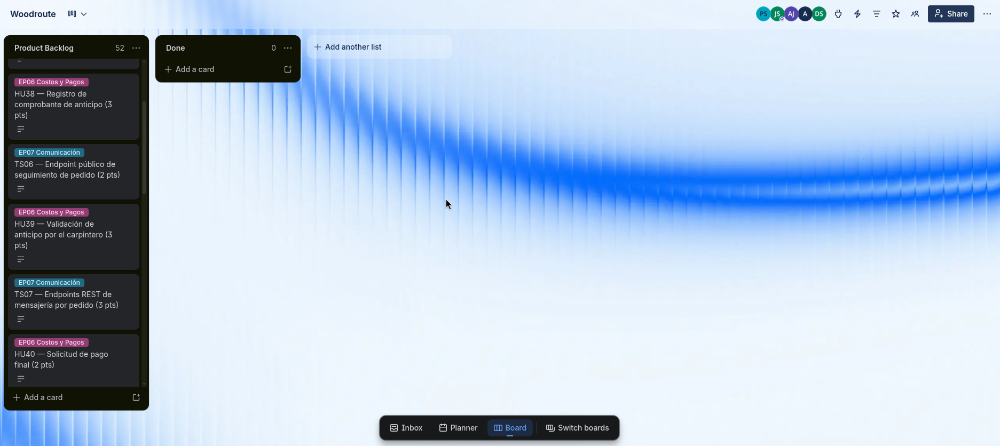
</div>

<div style="page-break-after: always;"></div>

# Capítulo IV: Product Design

## 4.1. Style Guidelines

### 4.1.1. General Style Guidelines

#### Branding

La identidad visual de WoodRoute refleja los valores del producto: calidez, precisión y confianza.
Cada decisión de diseño está enraizada en el mundo del carpintero: la textura de la madera, la
calidez del material natural y la claridad de un proceso bien organizado.

El branding abarca la identidad completa de la marca: el logo, el sistema de colores, la tipografía,
el tono de comunicación y los principios que guían cómo el producto se ve, se siente y habla.
No es solo el logo, es la suma de todas las decisiones que hacen que WoodRoute sea reconocible
y coherente en cualquier punto de contacto con el usuario.

El logo combina un símbolo que evoca la veta de la madera con la idea de rutas o caminos,
representando el flujo de trabajo del taller. El wordmark utiliza la fuente de display del sistema
tipográfico en peso ExtraBold para transmitir solidez y presencia.


Los tres principios que guían todas las decisiones de diseño son:

**Calidez con contraste** — Los fondos y superficies usan tonos cálidos que evocan la madera
natural (beige, crema, marrón claro). El color primario de acción (`#FD4319`, naranja-rojo) rompe
intencionalmente esa calidez para señalizar con claridad qué debe hacer el usuario a continuación.
La tensión entre el fondo cálido y el CTA energético crea jerarquía visual sin necesidad de texto
adicional.

**Claridad funcional** — Los artesanos trabajan con las manos, no con pantallas. La interfaz elimina
el ruido visual y prioriza la información que importa: el estado del pedido, el inventario disponible,
la viabilidad del mueble.

**Confianza ganada** — WoodRoute no impone: acompaña. El diseño respeta el saber del carpintero.
No reemplaza su criterio, lo amplifica con datos.

#### Tono de comunicación

WoodRoute habla de carpintero a carpintero. No usa lenguaje corporativo ni tecnicismos innecesarios.
El tono está posicionado en cuatro dimensiones que definen la personalidad de la marca:

| Dimensión | Posición | Descripción |
|---|---|---|
| Divertido / Serio | 65% Serio | El producto resuelve problemas reales de negocio. El tono es directo y profesional, sin exceso de formalidad. |
| Formal / Casual | 60% Casual | Habla al carpintero como a un igual, sin jerarquía corporativa. Directo y accesible. |
| Respetuoso / Irreverente | 80% Respetuoso | Respeto profundo por el oficio. El carpintero es el experto; WoodRoute es su asistente. |
| Entusiasta / Sereno | 55% Sereno | Confianza tranquila. Los resultados hablan por sí solos, sin signos de exclamación vacíos. |

Las reglas de lenguaje derivadas de este posicionamiento son:

- Español neutro sin regionalismos ni voseo
- Imperativo universal: "Registra", "Selecciona", "Confirma"
- Mensajes de error directos y accionables: "Selecciona un material para continuar"
- Placeholders descriptivos: "¿Cuántos tablones necesitas?"
- Botones en infinitivo o imperativo neutro: "Crear pedido", "Ver inventario"
- Evitar exclamaciones vacías: "¡Genial!", "¡Listo!", "¡Perfecto!"

#### Sistema de colores

La paleta de WoodRoute combina dos decisiones visuales complementarias: fondos cálidos que
evocan la madera natural, y un color primario de acción fuerte y directo. Esta tensión entre
la calidez del fondo y la energía del primario crea jerarquía visual inmediata: el usuario sabe
exactamente dónde hacer clic.

Los tokens semánticos son el nivel de abstracción que conecta la paleta con los componentes.
La interfaz nunca referencia valores de color crudos: siempre usa tokens.


**Colores de marca:**

| Token | Hex | Uso |
|---|---|---|
| `--color-background` | `#FAF7F2` | Fondo de la página |
| `--color-foreground` | `#1A1715` | Texto principal |
| `--color-primary` | `#FD4319` | Acciones principales, CTAs |
| `--color-primary-hover` | `#E23415` | Estado hover del primario |
| `--color-primary-foreground` | `#FFFFFF` | Texto sobre color primario |
| `--color-brand-light` | `#F0E4D8` | Fondos de marca con énfasis |
| `--color-brand-subtle` | `#F8F2EC` | Fondos de marca sutiles |

**Colores de UI:**

| Token | Hex | Uso |
|---|---|---|
| `--color-card` | `#FFFFFF` | Fondo de cards y paneles |
| `--color-card-foreground` | `#1A1715` | Texto sobre cards |
| `--color-secondary` | `#F0E8DF` | Acciones secundarias |
| `--color-secondary-foreground` | `#443218` | Texto sobre secundario |
| `--color-muted` | `#EAE2D6` | Fondos neutrales |
| `--color-muted-foreground` | `#63523A` | Texto de soporte, placeholders |
| `--color-accent` | `#E6DDD1` | Destacados sutiles |
| `--color-accent-foreground` | `#443218` | Texto sobre accent |
| `--color-border` | `#D6C5B3` | Bordes y separadores |
| `--color-ring` | `#FD4319` | Outline de focus |

**Colores de estado:**

| Token | Hex | Uso |
|---|---|---|
| `--color-destructive` | `#C0392B` | Errores, acciones irreversibles |
| `--color-destructive-foreground` | `#FFFFFF` | Texto sobre destructive |

#### Tipografía

El sistema tipográfico usa dos fuentes complementarias:

**Plus Jakarta Sans** es la fuente de display para títulos y encabezados. Geométrica y moderna, con
personalidad definida sin perder legibilidad. Transmite innovación y solidez. Se aplica en todos los
elementos de heading (h1–h6) con `font-weight` semibold o superior.

**Inter** es la fuente de cuerpo para texto corrido, UI y datos. Optimizada para lectura en pantalla
a cualquier tamaño. Neutral y funcional, no compite con los títulos.


La escala tipográfica define tamaños, pesos e interlineado para cada nivel jerárquico:

| Token | Tamaño | Px | Uso típico |
|---|---|---|---|
| `--font-size-6xl` | 3.75rem | 60px | Hero principal de landing |
| `--font-size-5xl` | 3rem | 48px | H1 de sección |
| `--font-size-4xl` | 2.25rem | 36px | H2 de sección |
| `--font-size-3xl` | 1.875rem | 30px | H3 |
| `--font-size-2xl` | 1.5rem | 24px | H4, subtítulos destacados |
| `--font-size-xl` | 1.25rem | 20px | Lead text, taglines |
| `--font-size-lg` | 1.125rem | 18px | Body grande, texto de intro |
| `--font-size-base` | 1rem | 16px | Body estándar |
| `--font-size-sm` | 0.875rem | 14px | UI labels, captions |
| `--font-size-xs` | 0.75rem | 12px | Badges, metadatos |

Los pesos tipográficos disponibles y su uso son:

| Peso | Valor | Uso |
|---|---|---|
| ExtraBold | 800 | Logo wordmark, hero headlines |
| Bold | 700 | H1, H2, énfasis crítico |
| SemiBold | 600 | H3, H4, botones |
| Medium | 500 | Labels, navegación |
| Regular | 400 | Body, texto corrido |

El interlineado varía según el contexto de lectura:

| Token | Valor | Uso |
|---|---|---|
| `tight` (1.2) | 1.2 | Títulos grandes, donde el espacio vertical es limitado |
| `snug` (1.35) | 1.35 | Subtítulos, texto de UI compacto |
| `normal` (1.5) | 1.5 | Body estándar, párrafos de contenido |
| `relaxed` (1.7) | 1.7 | Texto de lectura larga, artículos |

#### Espaciado

El espaciado base sigue la escala de Tailwind (múltiplos de 4px). Adicionalmente, se definen
dos tokens de sección para controlar la separación vertical entre bloques de contenido en la interfaz:


| Token | Valor | Px | Uso |
|---|---|---|---|
| `--spacing-section` | 6rem | 96px | Separación entre secciones en desktop |
| `--spacing-section-sm` | 4rem | 64px | Separación entre secciones en mobile |

### 4.1.2. Web Style Guidelines

#### Border radius


El sistema de radios define la personalidad de los componentes. WoodRoute usa radios moderados:
ni completamente cuadrado (frío, técnico) ni completamente redondo (demasiado informal). La
esquina redondeada evoca la madera trabajada y lijada.

| Token | Valor | Uso |
|---|---|---|
| `--radius-sm` | 0.375rem | Badges, chips, tooltips |
| `--radius-md` | 0.5rem | Inputs, botones pequeños |
| `--radius-lg` | 0.75rem | Cards, modales |
| `--radius-xl` | 1rem | Cards destacadas, paneles |
| `--radius-full` | 9999px | Avatares, toggles pill |

#### Sombras

Las sombras usan el color del foreground con opacidad controlada, manteniendo la temperatura
cálida del sistema. Definen la jerarquía de elevación de los elementos en el plano Z:


| Token | Elevación | Uso |
|---|---|---|
| `--shadow-sm` | 1px, 6% opacidad | Inputs en foco, separadores sutiles |
| `--shadow-md` | 4px, 8% opacidad | Cards, dropdowns |
| `--shadow-lg` | 8px, 10% opacidad | Modales, sidebars, popovers |
| `--shadow-xl` | 16px, 12% opacidad | Overlays, drawers, banners flotantes |

#### Diseño responsive

La interfaz sigue la estrategia mobile-first: los estilos base se definen para mobile y se
sobreescriben hacia arriba con media queries. Los breakpoints siguen la escala estándar de
Tailwind CSS:


| Breakpoint | Ancho mínimo | Contexto |
|---|---|---|
| `sm` | 640px | Smartphones grandes |
| `md` | 768px | Tablets en portrait |
| `lg` | 1024px | Tablets en landscape, laptops |
| `xl` | 1280px | Desktops |
| `2xl` | 1536px | Pantallas grandes |

Los patrones responsive principales que aplican a la landing y la web app son:

- **Grids**: colapsan de multi-columna a una sola columna por debajo de `md`
- **Navegación**: menú hamburguesa por debajo de `md`, barra horizontal desde `md`
- **Secciones**: `--spacing-section-sm` (4rem) en mobile, `--spacing-section` (6rem) en desktop
- **Tipografía**: escala reducida en mobile (H1 baja de `5xl` a `4xl`, hero de `6xl` a `5xl`)
- **Imágenes**: `max-width: 100%` en todos los elementos `img` y `svg` por defecto


## 4.2. Information Architecture

Las decisiones de arquitectura de información de WoodRoute están orientadas a dos
experiencias distintas con objetivos complementarios: la landing page, enfocada en
convertir visitantes en usuarios, y la aplicación web, enfocada en que carpinteros
gestionen su taller con la menor fricción posible. En ambos casos, el principio rector
es que el usuario encuentre lo que necesita sin esfuerzo y sin necesidad de instrucción.

### 4.2.1. Organization Systems

El contenido de WoodRoute se organiza según el contexto de uso de cada superficie.

**Landing Page — organización secuencial y jerárquica**

La landing page sigue una organización **secuencial** (step-by-step): el visitante
recorre una narrativa de problema → solución → beneficios → prueba social → acción.
Cada sección responde a una pregunta implícita del visitante antes de que la formule.
El orden no es arbitrario: primero se valida el dolor (el caos del taller), luego se
presenta la solución, luego se justifica la confianza. Esta progresión reduce la
resistencia a la conversión.

Dentro de cada sección, la organización es **jerárquica**: el mensaje principal ocupa
el nivel tipográfico más alto, los detalles de soporte están en niveles inferiores y las
acciones secundarias nunca compiten visualmente con el CTA primario.

**Aplicación web — organización por tópicos y por audiencia**

La aplicación organiza el contenido **por tópicos funcionales** que mapean directamente
al flujo de trabajo del carpintero:

| Módulo | Tópico | Audiencia |
|---|---|---|
| Pedidos | Gestión del ciclo de vida de un pedido | Carpintero |
| Inventario | Control de materiales y stock | Carpintero |
| Planificación | Viabilidad, tiempos y capacidad | Carpintero |
| Seguimiento | Estado de producción en tiempo real | Cliente final |

La organización **por audiencia** se aplica en el acceso: el carpintero entra con
credenciales propias y tiene acceso completo al sistema; el cliente accede mediante
un enlace compartido y ve únicamente la vista de seguimiento de su pedido, sin
necesidad de registro.

Dentro de los listados (pedidos, materiales), el contenido se organiza de forma
**cronológica inversa** por defecto: los elementos más recientes aparecen primero,
reflejando el flujo natural de trabajo donde el carpintero atiende los pedidos activos
antes que los históricos.

### 4.2.2. Labeling Systems

Las etiquetas de WoodRoute siguen el principio de mínima carga cognitiva: una palabra
cuando es suficiente, dos cuando es necesario para evitar ambigüedad. Se usa el
vocabulario del carpintero, no el vocabulario técnico del software.

**Navegación principal de la aplicación:**

| Etiqueta | Concepto que representa |
|---|---|
| Pedidos | Listado y gestión de órdenes de fabricación |
| Inventario | Stock de materiales disponibles |
| Planificación | Asistente de viabilidad y estimación de tiempos |
| Clientes | Directorio de clientes y sus pedidos asociados |
| Configuración | Datos del taller, usuarios y preferencias |

**Estados de un pedido:**

| Etiqueta | Significado |
|---|---|
| Pendiente | Pedido recibido, aún no iniciado |
| En producción | Fabricación en curso |
| En revisión | Control de calidad antes de entrega |
| Listo | Pedido terminado, pendiente de entrega o retiro |
| Entregado | Proceso completado |

**Inventario:**

| Etiqueta | Significado |
|---|---|
| Disponible | Material con stock suficiente |
| Stock bajo | Material cerca del mínimo definido |
| Sin stock | Material agotado, bloquea nuevos pedidos |

**Landing page (secciones visibles en navegación):**

| Etiqueta | Contenido |
|---|---|
| Inicio | Hero y propuesta de valor |
| Funciones | Features del producto |
| Cómo funciona | Flujo paso a paso |
| Precios | Planes y comparativa |
| Preguntas frecuentes | FAQ |

### 4.2.3. SEO Tags and Meta Tags

**Landing Page**

```html
<title>WoodRoute — Gestión de pedidos y taller para carpinteros</title>
<meta name="description"
  content="WoodRoute organiza tu taller de carpintería: gestiona pedidos,
  controla materiales y ofrece seguimiento en tiempo real a tus clientes.
  Empieza gratis." />
<meta name="keywords"
  content="gestión de taller, software para carpinteros, control de pedidos
  carpintería, inventario madera, seguimiento de pedidos, SaaS carpintería" />
<meta name="author" content="WoodRoute" />
<meta property="og:title" content="WoodRoute — Gestión de taller para carpinteros" />
<meta property="og:description"
  content="Organiza tus pedidos, controla tu inventario y mantén a tus clientes
  informados en tiempo real. Sin complicaciones." />
<meta property="og:type" content="website" />
```

**Aplicación web (página de login / acceso)**

```html
<title>Ingresar — WoodRoute</title>
<meta name="description"
  content="Accede a tu cuenta de WoodRoute para gestionar tu taller de carpintería." />
<meta name="robots" content="noindex, nofollow" />
<meta name="author" content="WoodRoute" />
```

**Vista de seguimiento pública (compartida con clientes)**

```html
<title>Seguimiento de pedido — WoodRoute</title>
<meta name="description"
  content="Consulta el estado de fabricación de tu mueble en tiempo real." />
<meta name="robots" content="noindex, nofollow" />
```

Las páginas internas de la aplicación (pedidos, inventario, planificación) usan
`noindex, nofollow` ya que son contenido privado detrás de autenticación. Solo la
landing page está indexada para motores de búsqueda.

### 4.2.4. Searching Systems

WoodRoute ofrece búsqueda y filtrado en los módulos donde el volumen de información
puede desorientar al usuario. El sistema no expone un buscador global: cada módulo
tiene su propio mecanismo de búsqueda contextual.

**Módulo de Pedidos**

El usuario puede buscar por nombre de cliente, número de pedido o descripción del
mueble. Los resultados se muestran en tiempo real (búsqueda reactiva sin necesidad
de enviar el formulario). Los filtros disponibles son:

| Filtro | Opciones |
|---|---|
| Estado | Pendiente / En producción / En revisión / Listo / Entregado |
| Fecha de creación | Rango de fechas |
| Cliente | Selección desde directorio |

Los resultados muestran: nombre del cliente, descripción del mueble, estado actual
(con etiqueta de color) y fecha estimada de entrega.

**Módulo de Inventario**

El usuario puede buscar materiales por nombre o tipo. Los filtros disponibles son:

| Filtro | Opciones |
|---|---|
| Estado de stock | Disponible / Stock bajo / Sin stock |
| Tipo de material | Madera / Herrajes / Acabados / Otros |

Los resultados muestran: nombre del material, unidad de medida, cantidad disponible
y estado de stock (con etiqueta de color). Los materiales con stock bajo aparecen
destacados al inicio del listado sin necesidad de filtrar, como alerta proactiva.

**Módulo de Clientes**

Búsqueda por nombre o contacto. Sin filtros adicionales dado el volumen acotado
esperado en talleres pequeños. Los resultados muestran nombre, contacto y cantidad
de pedidos activos.

**Vista de seguimiento pública**

No requiere búsqueda: el cliente accede mediante un enlace único que lleva directamente
al estado de su pedido. No hay navegación ni descubrimiento de contenido en esta vista.

### 4.2.5. Navigation Systems

**Landing Page**

La navegación de la landing sigue un modelo de **scroll lineal con anclas**: el menú
superior fija las secciones principales y permite saltar directamente a cualquier punto.
En mobile, el menú colapsa en un panel lateral (hamburguesa). El CTA principal
("Empieza gratis") está fijo en el navbar para que esté siempre accesible sin importar
la posición del scroll.

El flujo de navegación esperado es:

```
Navbar → Hero → Funciones → Cómo funciona → Precios → FAQ → CTA final
```

Los usuarios que llegan con intención directa (ej. desde un anuncio) aterrizan en el
hero y pueden ir directo al CTA. Los usuarios exploratorios recorren las secciones de
forma descendente. Ambos flujos convergen en el mismo punto de conversión.

**Aplicación web**

La aplicación usa una **navegación lateral persistente** (sidebar) en desktop y una
**barra inferior** en mobile, siguiendo convenciones establecidas de aplicaciones de
gestión que el usuario ya conoce.

El sidebar muestra los cinco módulos principales con íconos y etiquetas. El módulo
activo se indica con el color primario. Las acciones de creación (nuevo pedido, nuevo
material) están disponibles desde un botón prominente dentro de cada módulo, no
desde la navegación global.

La jerarquía de navegación es de dos niveles máximo:

```
Nivel 1 (sidebar): Pedidos / Inventario / Planificación / Clientes / Configuración
Nivel 2 (dentro del módulo): Listado → Detalle / Formulario de creación o edición
```

No existe un nivel 3. Si una acción requeriría un tercer nivel, se implementa como
modal o panel lateral (drawer) sobre el nivel 2 actual, manteniendo el contexto del
usuario visible.

**Vista de seguimiento pública**

Es una experiencia de una sola página sin navegación. El cliente ve el estado actual
del pedido, el historial de estados anteriores y los datos del mueble. No hay menú,
no hay links a otras secciones, no hay posibilidad de confundirse. El único punto de
salida opcional es un link al sitio de WoodRoute para que el cliente conozca el producto.


## 4.3. Landing Page UI Design

### 4.3.1. Landing Page Wireframe

### 4.3.2. Landing Page Mock-up

El mock-up de la landing page de WoodRoute aplica el design system definido en la
sección anterior: tipografía Plus Jakarta Sans / Inter, paleta cálida con primario
naranja-rojo `#FD4319` y espaciado de sección de 6rem en desktop y 4rem en mobile.

La página está estructurada en ocho secciones en el siguiente orden:

1. **Hero** — propuesta de valor principal con CTA "Empieza gratis" y vista previa del dashboard
2. **Features** — grilla de beneficios clave del producto
3. **How it works** — flujo numerado de 4 pasos: registrar pedido → validar viabilidad → producir → cliente sigue el avance
4. **Social proof** — demostración de la vista de seguimiento para el cliente final
5. **Pricing** — tres planes (Free $0 / Pro $19 / Business $39) con comparativa
6. **FAQ** — preguntas frecuentes expandibles
7. **Team** — equipo detrás de WoodRoute
8. **Footer** — links, redes y legal

**Vista desktop**


**Vista mobile**


La versión mobile mantiene la misma jerarquía de contenido que desktop. Las grillas
de features colapsan a una columna, el navbar se convierte en menú hamburguesa y
el CTA de conversión permanece visible y accesible en todo momento. El espaciado
entre secciones se reduce de 6rem a 4rem mediante el token `--spacing-section-sm`.

<div style="page-break-after: always;"></div>

# Capítulo V: Product Implementation, Validation & Deployment

## 5.1. Software Configuration Management

## 5.2. Landing Page, Services & Applications Implementation

### 5.2.1. Sprint 1

En este primer sprint se desarrolló la landing page y la documentación inicial del proyecto WoodRoute.

#### 5.2.1.1. Sprint Planning 1

| Sprint # | Sprint 1 |
| :--- | :--- |
| **Sprint Planning Background** | |
| Date | 10/04/2026 |
| Time | 3:30 PM |
| Location | Google Meet |
| Prepared By | Torres Sanchez, Dalila Victoria |
| Attendees (to planning meeting) | Gonza Morales, Anderson<br>Justo Yauricasa, Alexander Paolo<br>Saldaña De Souza, Juan David<br>Sulca Sanchez, Piero Angel<br>Torres Sanchez, Dalila Victoria |
| **Sprint 1 Review Summary** | Durante este sprint, el equipo se enfocó en sentar las bases estratégicas del proyecto WoodRoute. Se completaron entregables clave de UX como User Personas, Journey Maps y la arquitectura de información, que guiaron el diseño de la plataforma. Con esta base, se diseñó, maquetó y desplegó la primera versión funcional de la landing page. Esta página incluye la propuesta de valor del SaaS, los planes de suscripción y una sección que destaca los beneficios para carpinteros y clientes finales. |
| **Sprint 1 Retrospective Summary** | Los miembros del equipo coincidieron en que la colaboración fue fluida gracias a la correcta asignación de roles. Se destacó la sinergia entre el diseño en Figma y la configuración inicial de los repositorios. Para el siguiente sprint, se identificó la oportunidad de mejorar la estimación de tiempos de desarrollo al iniciar la integración del backend. |
| **Sprint Goal & User Stories** | |
| **Sprint 1 Goal** | Nos enfocamos en entregar una primera versión de la landing page desplegada y la documentación de los primeros capítulos del informe. Creemos que esto entrega una propuesta de valor validada para atraer a nuestro segmento objetivo. Esto se confirmará cuando la web esté pública y el informe sea aprobado. |
| **Sprint 1 Velocity** | 20 |
| **Sum of Story Points** | 20 |

#### 5.2.1.2. Aspect Leaders and Collaborators

| Team Member | GitHub Username | Landing Page | Diseño UI/UX | Documentación |
| :--- | :--- | :--- | :--- | :--- |
| Gonza Morales, Anderson | anderson-gonza | Colaborador | Colaborador | Colaborador |
| Justo Yauricasa, Alexander Paolo | alexander-justo | Colaborador | Colaborador | Líder |
| Saldaña De Souza, Juan David | jndesouza | Colaborador | Colaborador | Colaborador |
| Sulca Sanchez, Piero Angel | piero-sulca | Líder | Líder | Colaborador |
| Torres Sanchez, Dalila Victoria | dalila-torres | Colaborador | Colaborador | Colaborador |

#### 5.2.1.3. Sprint Backlog 1

| User Story Id | User Story Title | Work Item/Task Id | Work Item/Task Title | Description | Estimation | Assigned To | Status |
| :--- | :--- | :--- | :--- | :--- | :--- | :--- | :--- |
| US-LP01 | Landing Page – Estructura inicial | T01 | Maquetado HTML base | Construcción de la estructura inicial: header, hero section y footer. | 8h | Piero Sulca | Done |
| US-LP02 | Landing Page – Diseño visual | T02 | Aplicación de estilos CSS | Implementación de estilos visuales según el manual de marca. | 10h | Piero Sulca | Done |
| US-LP03 | Arquitectura y Entorno | T03 | Configuración del proyecto | Creación de repositorios y definición de la arquitectura base. | 4h | Juan David Saldaña | Done |
| US-LP04 | Contenido estratégico UX | T04 | User Personas & Journey Maps | Creación de perfiles de usuarios y Lean UX Canvas. | 6h | Alexander Justo | Done |
| US-LP05 | Diagramas de Arquitectura | T05 | Definición de C4 Model | Diseño de arquitectura Context y Container Diagrams. | 5h | Juan David Saldaña | Done |
| US-LP06 | Despliegue de la web | T06 | Configuración de Hosting | Publicación del sitio estático en GitHub Pages. | 4h | Dalila Torres | Done |
| US-INF01 | Documentación del informe | T07 | Redacción Capítulos Iniciales | Startup Profile, UX Research y estructura del informe. | 10h | Equipo Completo | Done |

#### 5.2.1.4. Development Evidence for Sprint Review

En este primer Sprint hemos realizado la implementación de nuestra Landing Page y la configuración inicial de los repositorios, donde todo el equipo ha aportado mediante la gestión de ramas. En la siguiente tabla se muestran los commits realizados.

| Repository | Branch | Commit Id | Commit Message | Commit Message Body | Commited on (Date) |
| :--- | :--- | :--- | :--- | :--- | :--- |
| Developer-Core/WoodRoute-Landing | main | 15ad028 | Initial commit | Initial commit | 10/04/2026 |
| Developer-Core/WoodRoute-Landing | main | 33ad2a9 | Actualización de index.html | Agregado de estilos principales y la vista de la propuesta de valor. | 12/04/2026 |
| Developer-Core/WoodRoute-Landing | main | 3694000 | Configuración de assets y diagramas | Se incluyeron los diagramas y el esquema inicial en los assets. | 14/04/2026 |

<div style="page-break-after: always;"></div>

# Bibliografía

<a id="ref-apeim-nse-2024"></a>Asociación Peruana de Empresas de Inteligencia de Mercados [APEIM]. (2024). *Niveles socioeconómicos 2023-2024*. APEIM. https://apeim.com.pe/wp-content/uploads/2024/01/APEIM-Informe-de-Niveles-Socioeconomicos-2023-2024-Version-WEB.pdf

<a id="ref-comexperu-mype-2025"></a>ComexPerú. (2025). *Informe anual MYPE 2024: Las micro y pequeñas empresas en el Perú. Resultados en 2024*. Sociedad de Comercio Exterior del Perú. https://www.comexperu.org.pe/articulo/informe-anual-mype-2024

<a id="ref-ebiz-mypes-2022"></a>eBIZ. (2022, 29 de julio). *78% de las mypes usó herramientas digitales en el último año*. https://ebiz.pe/noticias/78-de-las-mypes-uso-herramientas-digitales-en-el-ultimo-ano/

<a id="ref-eventstorming-journal-2022"></a>EventStorming Journal. (2022, marzo 29). *Step by step guide to run your big picture event storming*. https://www.eventstormingjournal.com/big%20picture/step-by-step-guide-to-run-your-big-picture-event-storming/

<a id="ref-inei-internet-trim1-2024"></a>Instituto Nacional de Estadística e Informática [INEI]. (2024a). *Aumentó la población usuaria de internet en todos los grupos de edad en el primer trimestre de 2024*. https://www.gob.pe/institucion/inei/noticias/980106-aumento-la-poblacion-usuaria-de-internet-en-todos-los-grupos-de-edad-en-el-primer-trimestre-de-2024

<a id="ref-inei-internet-trim3-2024"></a>Instituto Nacional de Estadística e Informática [INEI]. (2024b). *Uso de internet alcanzó al 80.2% de la población de 6 y más años de edad en el tercer trimestre de 2024*. https://www.gob.pe/institucion/inei/noticias/1081936-uso-de-internet-alcanzo-al-80-2-de-la-poblacion-de-6-y-mas-anos-de-edad-en-el-tercer-trimestre-de-2024

<a id="ref-produce-empresas-2025"></a>Ministerio de la Producción [PRODUCE]. (2025). *PRODUCE: Perú cerró el 2024 con 2.34 millones de empresas formales*. https://www.gob.pe/institucion/produce/noticias/1168972-produce-peru-cerro-el-2024-con-2-34-millones-de-empresas-formales

<a id="ref-osiptel-erestel-2024"></a>Organismo Supervisor de Inversión Privada en Telecomunicaciones [OSIPTEL]. (2024). *ERESTEL: el 92.8% de las familias peruanas contó con un smartphone en 2023*. https://www.osiptel.gob.pe/portal-del-usuario/noticias/erestel-el-92-8-de-las-familias-peruanas-conto-con-un-smartphone-en-2023/

</article>

