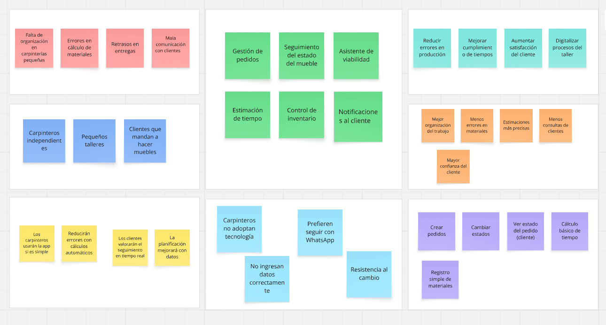

## Solution Profile

### Antecedentes y problemática

**What? (¿Qué?)**

**¿Cuál es el problema?**

El problema central es la falta de organización y planificación en carpinterías independientes y pequeños talleres al momento de gestionar pedidos de muebles personalizados. Actualmente, muchos carpinteros trabajan de manera empírica, basándose en su experiencia para calcular materiales, estimar tiempos y coordinar con los clientes. Esto genera errores frecuentes como falta de materiales durante la producción, retrasos en las entregas y una comunicación poco eficiente con el cliente, afectando tanto la productividad del taller como la satisfacción del usuario final.

**When? (¿Cuándo?)**

**¿Cuándo ocurre el problema?**

El problema ocurre de manera constante durante todo el proceso de fabricación del mueble, desde la etapa de diseño y planificación hasta la producción y entrega. Se intensifica especialmente cuando el carpintero maneja múltiples pedidos simultáneamente, ya que la falta de herramientas de organización dificulta la correcta estimación de tiempos y el control de materiales.

**Where? (¿Dónde?)**

**¿Dónde surge el problema?**

Surge principalmente en pequeños talleres de carpintería y negocios independientes, donde no se utilizan sistemas digitales especializados y la gestión se realiza mediante herramientas informales como cuadernos o aplicaciones de mensajería.

**¿A dónde se dirige?**

La solución se dirige a digitalizar y optimizar la gestión interna del taller, integrando en una sola plataforma la planificación, el control de inventario y el seguimiento de pedidos, permitiendo una mejor organización del proceso productivo.

**Who? (¿Quién?)**

**¿Quiénes están involucrados?**

- Carpinteros independientes y pequeños talleres.
- Clientes que solicitan muebles personalizados.

**¿Quién lo utilizará?**

Los carpinteros utilizarán la plataforma para registrar pedidos, calcular materiales, estimar tiempos y gestionar su inventario. Por otro lado, los clientes accederán a la plataforma para consultar el estado de sus pedidos y recibir actualizaciones del proceso de fabricación.

**Why? (¿Por qué?)**

**¿Cuál es la causa del problema?**

La causa principal es la ausencia de herramientas digitales adaptadas al rubro de la carpintería que integren planificación, inventario y gestión de pedidos. La mayoría de soluciones existentes son genéricas o complejas, lo que lleva a los carpinteros a depender de métodos manuales y de su experiencia, generando ineficiencias y errores en el proceso productivo.

**How? (¿Cómo?)**

**¿En qué condiciones los usuarios usarán nuestro producto?**

Los carpinteros utilizarán la plataforma en su día a día dentro del taller, especialmente en momentos clave como la planificación de un nuevo pedido, la verificación de materiales disponibles y la organización de tareas. Requerirán una interfaz simple y rápida que les permita tomar decisiones en pocos pasos. Los clientes utilizarán la plataforma de manera ocasional para consultar el estado de su mueble mediante un enlace accesible desde cualquier dispositivo.

**¿Cómo nos conocieron nuestros compradores?**

Los carpinteros conocerán la plataforma a través de recomendaciones, redes sociales, demostraciones del producto y marketing digital enfocado en mejorar la productividad de pequeños negocios.

**¿Cómo prefieren nuestros consumidores acceder a nuestro producto?**

Los carpinteros preferirán una aplicación web sencilla y accesible desde computadora o celular, mientras que los clientes preferirán acceder mediante un enlace directo sin necesidad de registro, para visualizar el progreso de su pedido de forma rápida..

**How much? (¿Cuánto?)**

Estadísticas que sustentan la problemática:

- Alta informalidad: En muchos países de Latinoamérica, una gran parte de los talleres de carpintería operan sin sistemas digitales de gestión.
- Baja digitalización: La mayoría de pequeños negocios aún utiliza métodos manuales para organizar pedidos e inventarios.
- Ineficiencia operativa: La falta de planificación genera retrasos, reprocesos y desperdicio de materiales.
- Impacto en clientes: Los retrasos y la falta de comunicación afectan la confianza y satisfacción del cliente.

Estas condiciones evidencian la necesidad de una solución tecnológica que permita optimizar la gestión del taller, mejorar la planificación y brindar mayor transparencia en el proceso de fabricación de muebles.

### Lean UX Process

El Lean UX Process es una metodología ágil centrada en la colaboración, la experimentación rápida y el aprendizaje validado. En este proyecto se utiliza este enfoque para comprender las necesidades de carpinteros y clientes, identificando sus principales problemas en la gestión, planificación y seguimiento de muebles. A través de hipótesis, prototipos y retroalimentación constante, se busca validar soluciones que optimicen la toma de decisiones dentro del taller y mejoren la experiencia del cliente.

#### Lean UX Problem Statements

**Problem Statement 1: El Carpintero / Taller**

Nuestro sistema busca facilitar a los carpinteros la planificación y gestión de pedidos de muebles personalizados. Hemos observado que muchos talleres trabajan de forma manual y basada en experiencia, lo que genera errores en el cálculo de materiales, estimaciones imprecisas de tiempo y desorganización en los pedidos.
**¿Cómo podemos ayudar a los carpinteros a planificar sus trabajos de forma más precisa y organizada, reduciendo errores y mejorando su productividad?**

**Problem Statement 2: El Cliente**

El producto tiene como objetivo mejorar la experiencia de los clientes que mandan a fabricar muebles. Actualmente, los clientes no tienen visibilidad del avance de sus pedidos y deben comunicarse constantemente con el carpintero para obtener información.
**¿Cómo podemos brindar a los clientes acceso claro y en tiempo real al estado de sus pedidos para mejorar la transparencia y confianza en el servicio?**

#### Lean UX Assumptions

**Business Assumptions**

1. Creo que mis clientes necesitan una herramienta que les ayude a organizar pedidos, materiales y tiempos de trabajo de manera simple.
2. Estas necesidades se pueden resolver con una aplicación web que integre gestión de pedidos, inventario y estimación de tiempos.
3. Mis clientes iniciales serán carpinteros independientes y pequeños talleres con baja digitalización.
4. El valor más importante que el cliente quiere es reducir errores, ahorrar tiempo y mejorar la organización del trabajo.
5. El cliente también puede obtener beneficios adicionales como mejorar la comunicación con sus clientes y proyectar una imagen más profesional.
6. Voy a adquirir usuarios a través de redes sociales, recomendaciones y demostraciones del producto.
7. Haré dinero mediante un modelo de suscripción (freemium con funciones avanzadas).
8. Mi competencia principal serán softwares de gestión genéricos y herramientas no especializadas en carpintería.
9. Los venceremos mediante especialización en el rubro y facilidad de uso.
10. Mi mayor riesgo es que los carpinteros no adopten la tecnología por costumbre o complejidad.
11. Resolveremos esto mediante una interfaz simple, intuitiva y enfocada en su flujo real de trabajo.

**User Assumptions**

**¿Quién es el usuario?**
Carpinteros independientes y pequeños talleres que gestionan pedidos personalizados, así como clientes que desean hacer seguimiento a sus muebles.

**¿Qué problemas tiene nuestro producto que resolver?**
Falta de organización, errores en cálculo de materiales, estimaciones inexactas de tiempo y mala comunicación con clientes.

**¿Qué características son importantes?**
Gestión de pedidos, cálculo de materiales, estimación de tiempos, control de inventario y seguimiento del estado del mueble.

**¿Dónde encaja nuestro producto en su trabajo o vida?**
Se integra en el proceso diario del taller, especialmente en la planificación, producción y entrega de pedidos.

**¿Cuándo y cómo nuestro producto es usado?**
Durante la recepción de pedidos, planificación de trabajos y seguimiento del proceso, mediante una plataforma web accesible desde cualquier dispositivo.

**¿Cómo debe verse nuestro producto y cómo comportarse?**
Debe ser simple, clara y fácil de usar, con una interfaz intuitiva que permita tomar decisiones rápidas sin complicaciones.

#### Lean UX Hypothesis Statements

- **Hypothesis 01:**
  Creemos que los carpinteros podrán planificar mejor sus trabajos si cuentan con una herramienta que calcule automáticamente materiales y valide la viabilidad del mueble.
  Sabremos que hemos tenido éxito cuando el 70% de los usuarios utilicen esta función al crear un pedido.

- **Hypothesis 02:**
  Creemos que los carpinteros reducirán retrasos si utilizan estimaciones de tiempo basadas en la capacidad del taller.
 Sabremos que hemos tenido éxito cuando los tiempos de entrega se cumplan en al menos un 80% de los pedidos.

- **Hypothesis 03:**
  Creemos que los clientes estarán más satisfechos si pueden ver el estado de su pedido en tiempo real.
  Sabremos que hemos tenido éxito cuando disminuyan las consultas repetitivas de clientes en al menos un 50%.

- **Hypothesis 04:**
  Creemos que los talleres mejorarán su organización si cuentan con un sistema de gestión de pedidos e inventario integrado.
  Sabremos que hemos tenido éxito cuando los usuarios gestionen todos sus pedidos dentro de la plataforma.

- **Hypothesis 05:**
  Creemos que los carpinteros adoptarán la plataforma si esta es simple y rápida de usar.
  Sabremos que hemos tenido éxito cuando al menos el 60% de los usuarios continúen usando la plataforma después del primer mes.

#### Lean UX Canvas

El Lean UX Canvas es una herramienta visual que permite alinear al equipo en torno a problemas, usuarios e hipótesis de manera ágil. En este proyecto se utilizó para comprender mejor a los restaurantes y albergues, identificar sus necesidades y definir cómo **Alimenta** puede generar valor real en su gestión diaria.

Aquí se presenta el Lean UX Canvas desarrollado para **Alimenta**:

**Figura 1. Lean UX Canvas de WoodRoute**

  

**Enlace al Lean UX Canvas:** https://miro.com/welcomeonboard/ZVFaMVdKblhINnB5d1dnbWcxT2RLZ3ZjVFlQNWpsS2VKLzVQQ3dQMWUxS1pkY3hJbStyWENZNnc1cjIvd01lNkltV283MkVGRUM3MS94a1Q0dXp4U3QzclBsK0ZrZ24zQXZhRG14blV5YXdtMUlaMlV5alRXNTFMT21PL0tXbzJzVXVvMm53MW9OWFg5bkJoVXZxdFhRPT0hdjE=?share_link_id=533296594528
