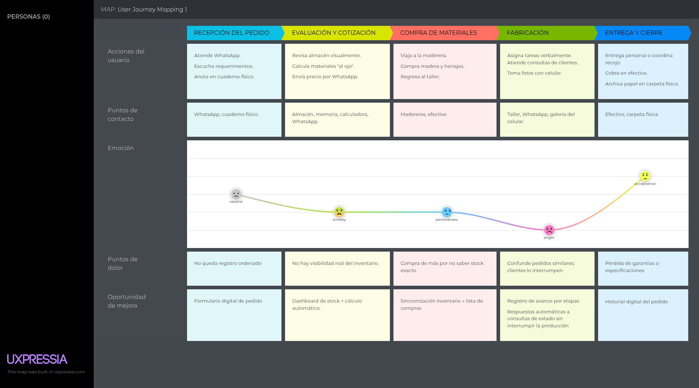
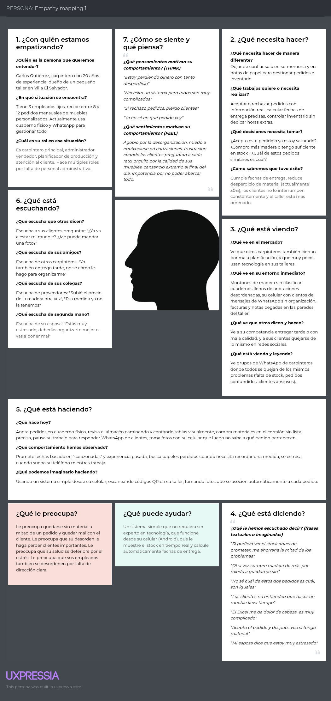

## Needfinding

### User Personas

En esta sección se presentan las fichas de User Persona elaboradas para los dos segmentos objetivo identificados en el proyecto: carpinteros independientes o pequeños talleres, y clientes que solicitan muebles a medida.

La construcción de estos arquetipos se sustenta en el análisis cualitativo de entrevistas realizadas a potenciales usuarios del rubro de carpintería y diseño de interiores, así como en el estudio comparativo de la competencia directa e indirecta. De dicho análisis se extrajeron las principales características demográficas, comportamientos, objetivos, frustraciones y necesidades no satisfechas que hoy presentan ambos segmentos.

### User Task Matrix
Para la elaboración de la User Task Matrix se consideran los dos segmentos objetivo identificados en el proyecto:

1. Carpinteros independientes o pequeños talleres (representado por el User Persona Carlos Gutiérrez)

2. Clientes que mandan a hacer el mueble (representado por el User Persona Valeria Fernández)

Las tareas listadas corresponden a actividades reales que estos usuarios realizan actualmente en su día a día, con independencia de que exista o no la plataforma web propuesta. Cada tarea ha sido identificada a partir del análisis de entrevistas, observación contextual y benchmarking con la competencia.

Para cada tarea se evalúa:

Frecuencia: Escala de 1 a 5 (1 = Muy baja / Rara vez, 5 = Muy alta / Varias veces al día)

Importancia: Escala de 1 a 5 (1 = Poco importante / Prescindible, 5 = Crítica / Indispensable)

| Tarea (Task) | Carlos Gutiérrez (Carpintero) Frec. | Carlos Gutiérrez (Carpintero) Import. | Valeria Méndez (Cliente) Frec. | Valeria Méndez (Cliente) Import. |
|:---|:---:|:---:|:---:|:---:|
| **1. Registrar un nuevo pedido de mueble** | 5 | 5 | 5 | 5 |
| **2. Consultar disponibilidad de materiales** (madera, herrajes, etc.) | 5 | 5 | 4 | 5 |
| **3. Calcular tiempo estimado de fabricación** | 5 | 5 | 3 | 5 |
| **4. Consultar el estado/avance de un pedido** | 5 | 4 | 5 | 5 |
| **5. Comunicarse con el carpintero/cliente para resolver dudas** | 5 | 5 | 4 | 4 |
| **6. Registrar salida de materiales del inventario** | 5 | 5 | 1 | 2 |
| **7. Tomar fotos del proceso de fabricación** | 4 | 3 | 1 | 1 |
| **8. Comparar pedidos similares para no confundirlos** | 4 | 4 | 2 | 3 |
| **9. Calcular costo final del mueble** (materiales + mano de obra) | 5 | 5 | 3 | 4 |
| **10. Anotar especificaciones técnicas** (medidas, acabados, diseño) | 5 | 5 | 4 | 5 |
| **11. Asignar prioridad a pedidos urgentes** | 4 | 4 | 3 | 3 |
| **12. Verificar si un pedido está atrasado** | 4 | 5 | 4 | 5 |
| **13. Buscar un carpintero/taller confiable** | 1 | 2 | 4 | 5 |
| **14. Comparar presupuestos entre diferentes talleres** | 1 | 2 | 4 | 5 |
| **15. Recordar fechas de entrega prometidas** | 5 | 5 | 4 | 5 |

#### Escala utilizada

| Valor | Frecuencia | Importancia |
|:---:|:---|:---|
| **5** | Varias veces al día | Crítica / Indispensable |
| **4** | A diario | Muy importante |
| **3** | 2-3 veces por semana | Moderadamente importante |
| **2** | Semanalmente | Poco importante |
| **1** | Rara vez (mensual o menos) | Prescindible |

## Principales coincidencias entre ambos segmentos

| Coincidencia | Implicancia para la plataforma |
|:---|:---|
| **Registro de pedidos** es crítico para ambos (5/5 y 5/5) | La interfaz de creación de pedidos debe ser colaborativa o permitir visualización compartida |
| **Especificaciones técnicas** son muy importantes para ambos (5/5 y 4/5) | Debe existir un registro estructurado de medidas, materiales, acabados y diseño, accesible para ambos |
| **Fechas de entrega** son igualmente valoradas (5/5 y 4/5) | El sistema debe mostrar claramente la fecha prometida y enviar alertas de proximidad |
| **Comunicación fluida** es necesaria para resolver dudas (5/5 y 4/4) | La plataforma debe integrar un canal de mensajería o comentarios asociado a cada pedido |
| **Estado/avance del pedido** es importante para ambos (4/5 y 5/5) | El seguimiento debe ser visual y en tiempo real, con hitos claros |

#### Análisis de hallazgos clave

| Hallazgo | Implicancia para la plataforma |
|:---|:---|
| Las tareas de **registro de pedidos, consulta de stock y cálculo de tiempos** tienen frecuencia e importancia 5 para el carpintero | El módulo de **planificación y viabilidad** debe ser el núcleo de la plataforma |
| **Consultar estado del pedido** es frecuencia 5 e importancia 5 para el cliente | El **seguimiento en tiempo real** es una feature crítica, no opcional |
| **Tomar fotos del proceso** tiene baja importancia para el carpintero (3) pero alta necesidad para el cliente (no lo hace él, pero lo consume) | La plataforma debe **automatizar la captura y asociación de fotos** a cada etapa del pedido, sin esfuerzo extra para el carpintero |
| **Buscar carpintero confiable y comparar presupuestos** son tareas de alta importancia solo para el cliente | La plataforma podría incluir un **directorio o sistema de reputación** a futuro |
| **Recordar fechas de entrega** es muy importante para ambos (5 y 5) | El sistema debe tener **alertas automáticas de vencimiento** tanto para carpintero como para cliente |

### User Journey Mapping

En esta sección se presentan los User Journey Maps para los dos segmentos objetivo identificados:

1. Carpintero independiente / pequeño taller (Carlos Gutiérrez)

2. Cliente que manda a hacer el mueble (Valeria Méndez)

El journey representado cubre el end-to-end de la experiencia actual desde que el cliente detecta una necesidad de un mueble personalizado hasta que recibe el producto final y realiza el pago. Se ilustran las etapas, acciones, emociones, puntos de dolor y oportunidades de mejora que posteriormente abordará la plataforma propuesta.

### Empathy Mapping

En esta sección se presentan los Empathy Maps elaborados para los dos User Personas del proyecto: Carlos Gutiérrez (carpintero) y Valeria Fernández (cliente).

El proceso de elaboración consistió en colocar cada User Persona en el centro del canvas y registrar observaciones del equipo para responder: ¿Con quién empatizamos? ¿Qué necesita hacer? ¿Qué dice? ¿Qué ve? ¿Qué hace? ¿Qué escucha? ¿Qué piensa y siente? Finalmente, se identificaron Pains (¿Qué le preocupa?) y Gains (¿Qué ayuda? ¿Qué lo convence? ¿Qué dice?).

Los diagramas fueron elaborados en UXPressia y se adjuntan las capturas a continuación.

